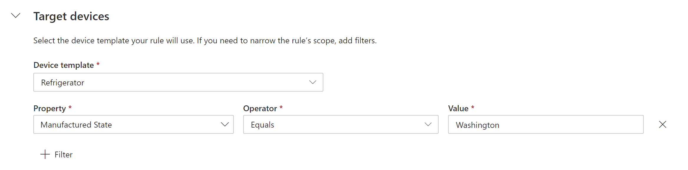
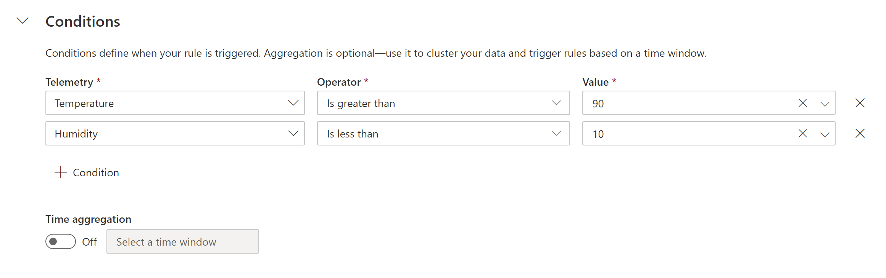

# Configure rules (preview features)

[!INCLUDE [iot-central-pnp-original](../../../includes/iot-central-pnp-original-note.md)]

*This article applies to operators, builders, and administrators.*

Rules in IoT Central serve as customizable response tools that trigger on actively monitored events from connected devices. Use rules in IoT Central to remotely monitor your connected devices. The following sections describe how rules are evaluated.

## Select target devices

Use the target devices section to filter down the set devices on which the rule acts. In the following screenshot, the filter only includes devices where the **Manufactured State** property equals **Washington**. A filter is a prerequisite for a rule to start evaluating, filters in themselves don't trigger an action.

## Use multiple conditions

Conditions are what rules trigger on. Currently, when you add multiple conditions to a rule, they are logically AND'd together. All conditions must be met for the rule to evaluate as true.  

In the following screenshot, the conditions check when the temperature is greater than 90 and the humidity is less than 10. When both of these statements are true, the rule evaluates to true and triggers an action.

## Use aggregate windowing

Rules evaluate aggregating time windows as tumbling windows. In the following example, the time window is five minutes. Every five minutes, the rule evaluates on the last five minutes of data. The data is only evaluated once in the window to which it corresponds.

## Use rules with IoT Edge modules

A restriction applies to rules that are applied to IoT Edge modules. Rules on telemetry from different modules are not evaluated as valid rules. For example, if the first condition of the rule is on a temperature telemetry from Module A and the second condition of the rule is on a humidity telemetry on Module B, you have an invalid set of conditions. The rule isn't valid and throws an error on trying to save the rule.

## Next steps

Now that you've learned how to configure a rule in your Azure IoT Central application, you can:

> [!div class="nextstepaction"]
> [Analyze your data on the fly](howto-create-analytics.md)
