# Tutorial: Add an Azure IoT Edge device to your Azure IoT Central application

[!INCLUDE [iot-central-pnp-original](../../../includes/iot-central-pnp-original-note.md)]

This tutorial shows you how to add and configure an Azure IoT Edge device to your Azure IoT Central application. In this tutorial, we chose an IoT Edge-enabled Linux VM from Azure Marketplace.

This tutorial is made up of two parts:

* First, as an operator, you learn how to do cloud first provisioning of an IoT Edge device.
* Then, you learn how to do "device first" provisioning of an IoT Edge device.

In this tutorial, you learn how to:

> [!div class="checklist"]
> * Add a new IoT Edge device
> * Configure the IoT Edge device to help provision by using a shared access signature (SAS) key
> * View dashboards and module health in IoT Central
> * Send commands to a module running on the IoT Edge device
> * Set properties on a module running on the IoT Edge device

## Prerequisites

To complete this tutorial, you need an Azure IoT Central application. Follow [this quickstart to create an Azure IoT Central application](./quick-deploy-iot-central.md).

## Enable Azure IoT Edge enrollment group
From the **Administration** page, enable SAS keys for Azure IoT Edge enrollment group.

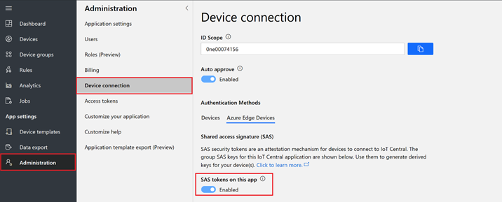

## Provision a "cloud first" Azure IoT Edge device	
In this section, you create a new IoT Edge device by using the environment sensor template, and you provision a device. 
Select **Devices** > **Environment Sensor Template**. 

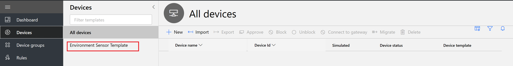

Select **+ New**, and enter a device ID and name of your choosing. Select **Create**.

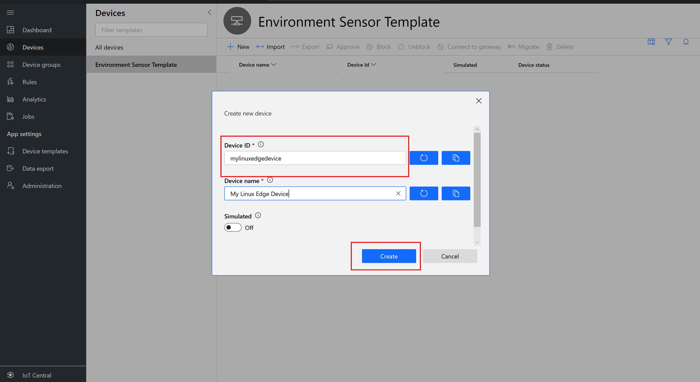

The device goes into **Registered** mode.

## Deploy an IoT Edge enabled Linux VM

> [!NOTE]
> You can choose to use any machine or device. The operating system can be Linux or Windows.

For this tutorial, we're using an Azure IoT enabled Linux VM, created on Azure. In [Azure Marketplace](https://azuremarketplace.microsoft.com/en-us/marketplace/apps/microsoft_iot_edge.iot_edge_vm_ubuntu?tab=Overview), select **GET IT NOW**. 

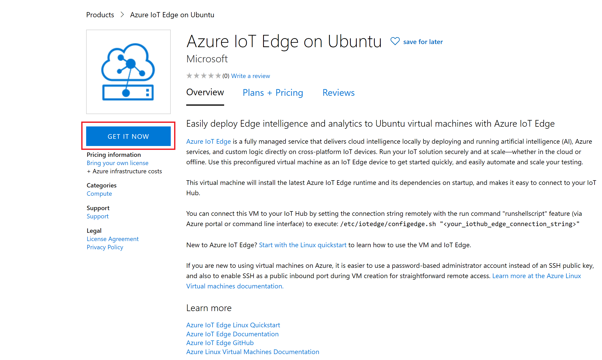

Select **Continue**.

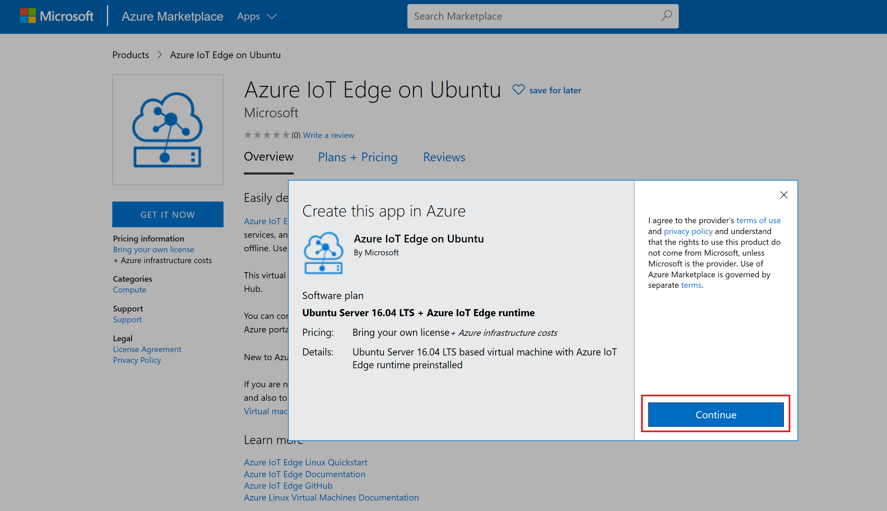

You're taken to the Azure portal. Select **Create**.

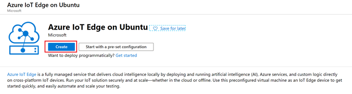

Select **Subscription**, create a new resource group, and select **(US) West US 2** for VM availability. Then, enter user and password information. These will be required for future steps, so remember them. Select **Review + create**.

After validation, select **Create**.

It takes a few minutes to create the resources. Select **Go to resource**.

### Provision VM as an IoT Edge device 

Under **Support + troubleshooting**, select **Serial console**.

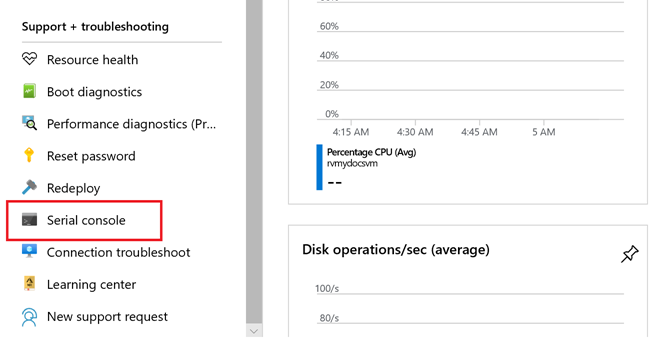

You'll see a screen similar to the following:

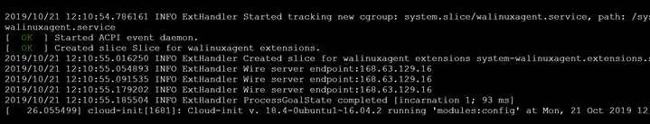

Press Enter, provide the user name and password as prompted, and then press Enter again. 

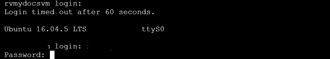

To run a command as administrator (user "root"), enter: **sudo su –**

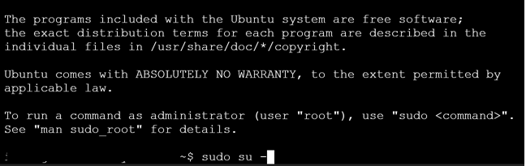

Check the IoT Edge runtime version. At the time of this writing, the current GA version is 1.0.8.

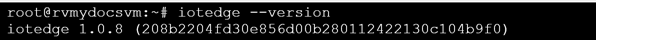

Install the vim editor, or use nano if you prefer. 

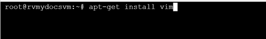

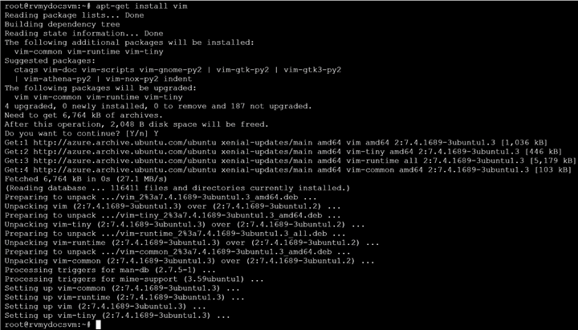

Edit the IoT Edge config.yaml file.

Scroll down, and comment out the connection string portion of the yaml file. 

**Before**

**After** (Press Esc, and press lowercase a, to start editing.)

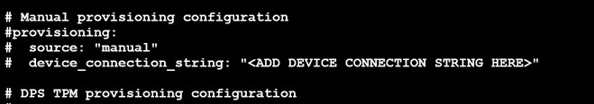

Uncomment the symmetric key portion of the yaml file. 

**Before**

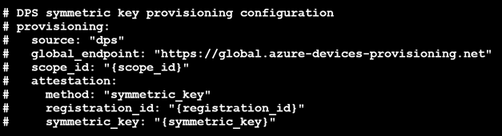

**After**

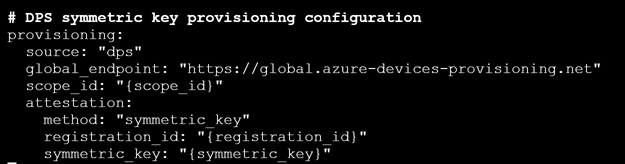

Go to IoT Central. Get the scope ID, device ID, and symmetric key of the IoT Edge device.
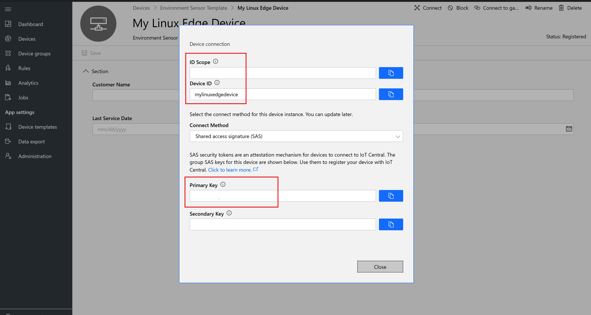

Go to the Linux computer, and replace the scope ID and registration ID with the device ID and symmetric key.

Press Esc, and type **:wq!**. Press Enter to save your changes.

Restart IoT Edge to process your changes, and press Enter.

Type **iotedge list**. After a few minutes, you'll see three modules deployed.

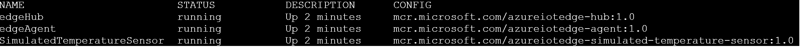

## IoT Central device explorer 

In IoT Central, your device moves into provisioned state.

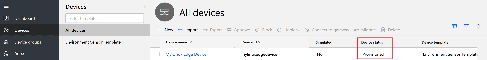

The **Modules** tab shows the status of the device and module on IoT Central. 

You'll see cloud properties in a form, from the device template you created in the previous steps. Enter values, and select **Save**. 

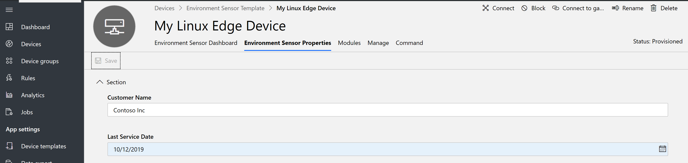

Here's a view presented in the form of a dashboard tile.

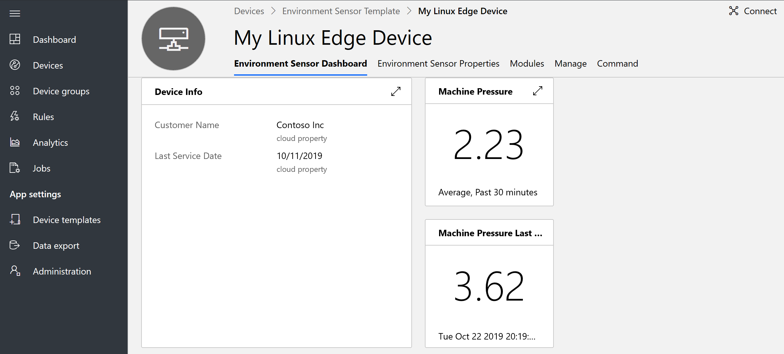

## Next steps

Now that you've learned how to work with and manage IoT Edge devices in IoT Central, here's the suggested next step:

<!-- Next how-tos in the sequence -->

> [!div class="nextstepaction"]
> [Configure transparent gateway](../../iot-edge/how-to-create-transparent-gateway.md)
