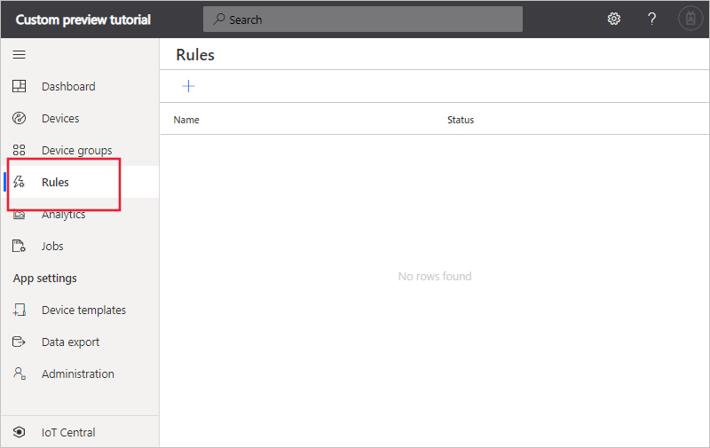
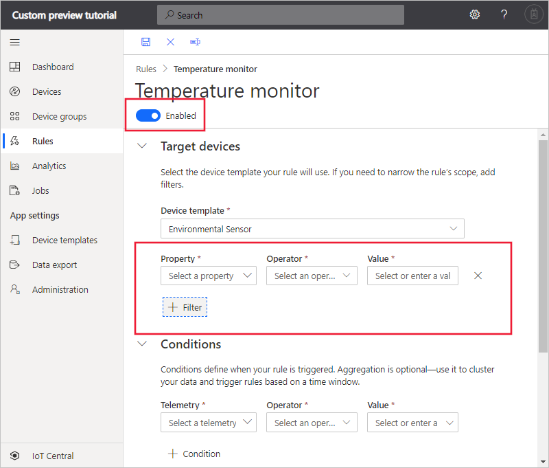
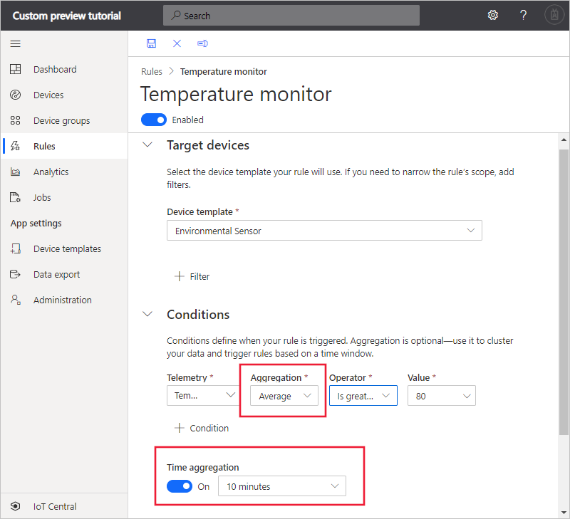
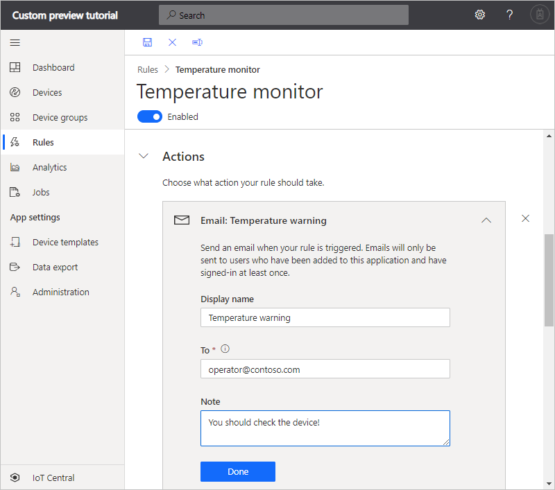
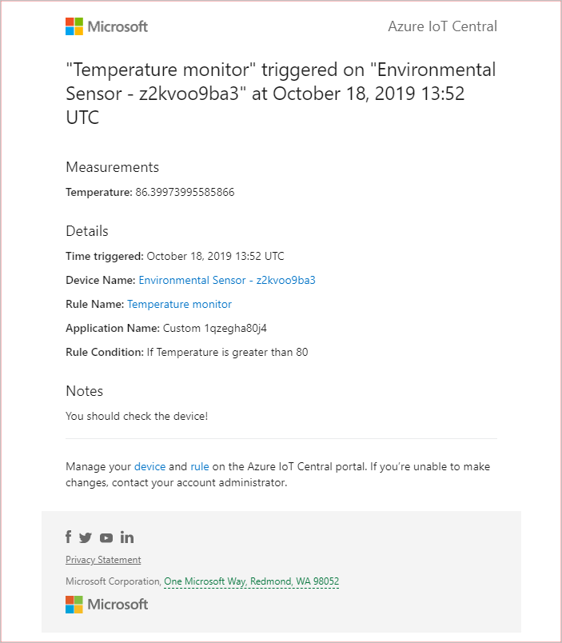

# Tutorial: Create a rule and set up notifications in your Azure IoT Central application (preview features)

*This article applies to operators, builders, and administrators.*

[!INCLUDE [iot-central-pnp-original](../../../includes/iot-central-pnp-original-note.md)]

You can use Azure IoT Central to remotely monitor your connected devices. Azure IoT Central rules enable you to monitor your devices in near real time and automatically invoke actions, such as send an email. In just a few clicks, you can define a condition to monitor telemetry from your devices and configure a corresponding action. This article explains how to create rules to monitor telemetry sent by the device.

Devices use telemetry to send numerical data from the device. A  rule triggers when the selected device telemetry crosses a specified threshold.

In this tutorial, you create a rule to send an email when the temperature in an environmental sensor device exceeds 70&deg; F.

In this tutorial, you learn how to:

> [!div class="checklist"]
>
> * Create a rule
> * Add an email action

## Prerequisites

Before you begin, you should complete the [Create an Azure IoT Central application](./quick-deploy-iot-central.md) and [Add a simulated device to your IoT Central application](./quick-create-pnp-device.md) quickstarts to create the **Environment Sensor** device template to work with.

## Create a rule

To create a telemetry rule, the device template must have at least one telemetry measurement defined. This tutorial uses an environmental sensor device that sends temperature and humidity telemetry. You added this device template and created a simulated device in the [Add a simulated device to your IoT Central application](./quick-create-pnp-device.md) quickstart. The rule monitors the temperature reported by the device and sends an email when it goes above 70 degrees.

1. In the left pane, select **Rules**.

1. If you haven't created any rules yet, you see the following screen:

    

1. Select **+** to add a new rule.

1. Enter the name _Temperature monitor_ to identify the rule and press Enter.

1. Select the **Environmental Sensor** device template. By default, the rule automatically applies to all the devices associated with the device template. To filter for a subset of the devices, select **+ Filter** and use device properties to identify the devices. To disable the rule, toggle the **Enabled/Disabled** button in the rule header:

    

### Configure the rule conditions

Conditions define the criteria that the rule monitors. In this tutorial, you configure the rule to fire when the temperature exceeds  70&deg; F.

1. Select **Temperature** in the **Telemetry** dropdown.

1. Next, choose **Is greater than** as the **Operator** and enter _70_ as the **Value**.

    

1. Optionally, you can set a **Time aggregation**. When you select a time aggregation, you must also select an aggregation type, such as average or sum from the aggregation drop-down.

    * Without aggregation, the rule triggers for each telemetry data point that meets the condition. For example, if the rule is configured to trigger when temperature is above 70 then the rule triggers almost instantly when the device reports temperature > 70.
    * With aggregation, the rule triggers if the aggregate value of the telemetry data points in the time window meets the condition. For example, if the rule is configured to trigger when temperature is above 70, time aggregation is set to 10 minutes, and the aggregation type is average, then the rule triggers when the device reports an average temperature > 70, calculated over a 10-minute interval.

     

You can add multiple conditions to a rule by selecting **+ Condition**. When multiple conditions are specified, all the conditions must be met for the rule to trigger. Each condition is joined by an implicit `AND` clause. If you're using time aggregation with multiple conditions, all the telemetry values must be aggregated.

### Configure actions

After you define the condition, you set up the actions to take when the rule fires. Actions are invoked when all the conditions specified in the rule evaluate to true. Currently, email is the only available action.

1. Select **+ Email** in the **Actions** section.

1. Enter _Temperature warning_ as the display name for the action, your email address in the **To** field, and _You should check the device!_ as a note to appear in the body of the email.

    > [!NOTE]
    > Emails are only sent to the users that have been added to the application and have logged in at least once. Learn more about [user management](howto-administer.md) in Azure IoT Central.

   

1. To save the action, choose **Done**. You can add multiple actions to a rule.

1. To save the rule, choose **Save**. The rule goes live within a few minutes and starts monitoring telemetry being sent to your application. When the condition specified in the rule is met, the rule triggers the configured email action.

After a while, you receive an email message when the rule fires:

## Delete a rule

If you no longer need a rule, delete it by opening the rule and choosing **Delete**.

## Enable or disable a rule

Choose the rule you want to enable or disable. Toggle the **Enable** or **Disable** button in the rule to enable or disable the rule for all devices that are scoped in the rule.

## Enable or disable a rule for a device

Choose the rule you want to enable or disable. Add a filter in the **Scopes** section to include or exclude a certain device in the device template.

## Next steps

In this tutorial, you learned how to:

* Create a telemetry-based rule
* Add an action

Now that you've defined a threshold-based rule the suggested next step is to learn how to:

> [!div class="nextstepaction"]
> [Configure continuous data export](./howto-export-data.md).
