# Tutorial: Define a new Azure IoT Edge device type in your Azure IoT Central application (preview features)

[!INCLUDE [iot-central-pnp-original](../../../includes/iot-central-pnp-original-note.md)]

This tutorial shows you, as a builder, how to use a device template to define a new type of Azure IoT Edge device in your Azure IoT Central application. 

For an overview, see [What is Azure IoT Central (preview features)?](overview-iot-central.md). 

IoT Edge is made up of three components:
* **IoT Edge modules** are containers that run Azure services, partner services, or your own code. Modules are deployed to IoT Edge devices, and run locally on those devices.
* The **IoT Edge runtime** runs on each IoT Edge device, and manages the modules deployed to each device.
* A **cloud-based interface** enables you to remotely monitor and manage IoT Edge devices. IoT Central is the cloud interface.

An **Azure IoT Edge** device can be a gateway device, with downstream devices connecting into the IoT Edge device. This tutorial shares more information about downstream device connectivity patterns.

A **device template** defines the capabilities of your device and IoT Edge modules. Capabilities include telemetry the module sends, module properties, and the commands a module responds to.

In this tutorial, you create an Environment Sensor device template. An environmental sensor device:

* Sends telemetry, such as temperature.
* Responds to writeable properties when updated in the cloud, such as telemetry send interval.
* Responds to commands, such as resetting temperature.

Also in this tutorial, you create an Environment Gateway device template. An environmental gateway device:

* Sends telemetry, such as temperature.
* Responds to writeable properties when updated in the cloud, such as telemetry send interval.
* Responds to commands, such as resetting temperature.
* Allows relationships to other device capability models.


In this tutorial, you learn how to:

> [!div class="checklist"]
> * Create a new Azure IoT Edge device device template.
> * Upload a deployment manifest.
> * Create capabilities including telemetry, properties, and commands for each module.
> * Define a visualization for the module telemetry.
> * Add relationships to downstream device templates.
> * Publish your device template.

## Prerequisites

To complete this tutorial, you need to [create an Azure IoT Central application](quick-deploy-iot-central.md).


## Downstream device relationships with a gateway and modules

Downstream devices can connect to an IoT Edge gateway device through the `$edgeHub` module. This IoT Edge device becomes a transparent gateway in this scenario.


Downstream devices can also connect to an IoT Edge gateway device through a custom module. In the following scenario, downstream devices connect through a Modbus custom module.


The following diagram shows connection to an IoT Edge gateway device through both types of modules (custom and `$edgeHub`).  


Finally, downstream devices can connect to an IoT Edge gateway device through multiple custom modules. The following diagram shows downstream devices connecting through a Modbus custom module, a BLE custom module, and the `$edgeHub` module. 


## Create a template

As a builder, you can create and edit IoT Edge device templates in your application. After you publish a device template, you can connect real devices that implement the device template.

### Select device template type 

To add a new device template to your application, select **Device Templates** on the left pane.


Select **+ New** to start creating a new device template.

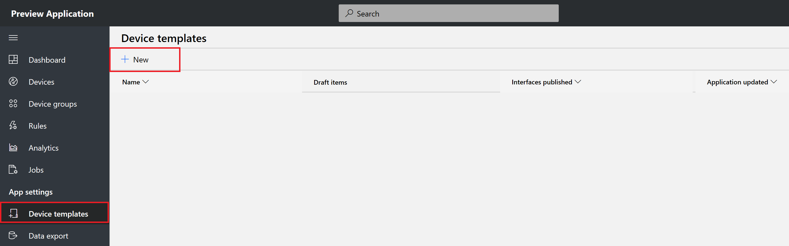

On the **Select template type** page, select **Azure IoT Edge**, and select **Next: Customize**.


### Customize device template

In IoT Edge, you can deploy and manage business logic in the form of modules. IoT Edge modules are the smallest unit of computation managed by IoT Edge, and can contain Azure services (such as Azure Stream Analytics), or your own solution-specific code. To understand how modules are developed, deployed, and maintained, see [IoT Edge modules](../../iot-edge/iot-edge-modules.md).

At a high level, a deployment manifest is a list of module twins that are configured with their desired properties. A deployment manifest tells an IoT Edge device (or a group of devices) which modules to install, and how to configure them. Deployment manifests include the desired properties for each module twin. IoT Edge devices report back the reported properties for each module.

Use Visual Studio Code to create a deployment manifest. To learn more, see [Azure IoT Edge for Visual Studio Code](https://marketplace.visualstudio.com/items?itemName=vsciot-vscode.azure-iot-edge).

Here's a basic deployment manifest, with one module as an example to be used for this tutorial. Copy the following JSON, and save it as a .json file. 

   ```JSON
   {
     "modulesContent": {
       "$edgeAgent": {
         "properties.desired": {
           "schemaVersion": "1.0",
           "runtime": {
             "type": "docker",
             "settings": {
               "minDockerVersion": "v1.25",
               "loggingOptions": "",
               "registryCredentials": {}
             }
           },
           "systemModules": {
             "edgeAgent": {
               "type": "docker",
               "settings": {
                 "image": "mcr.microsoft.com/azureiotedge-agent:1.0",
                 "createOptions": "{}"
               }
             },
             "edgeHub": {
               "type": "docker",
               "status": "running",
               "restartPolicy": "always",
               "settings": {
                 "image": "mcr.microsoft.com/azureiotedge-hub:1.0",
                 "createOptions": "{}"
               }
             }
           },
           "modules": {
             "SimulatedTemperatureSensor": {
               "version": "1.0",
               "type": "docker",
               "status": "running",
               "restartPolicy": "always",
               "settings": {
                 "image": "mcr.microsoft.com/azureiotedge-simulated-temperature-sensor:1.0",
                 "createOptions": "{}"
               }
             }
           }
         }
       },
       "$edgeHub": {
         "properties.desired": {
           "schemaVersion": "1.0",
           "routes": {
               "route": "FROM /* INTO $upstream"
           },
           "storeAndForwardConfiguration": {
             "timeToLiveSecs": 7200
           }
         }
       },
       "SimulatedTemperatureSensor": {
         "properties.desired": {
              "SendData": true,
              "SendInterval": 10
         }
       }
     }
   }
   ```

#### Upload an IoT Edge deployment manifest

On the **Customize device** page, under **Upload an Azure IoT Edge deployment manifest**, select **Browse**. 

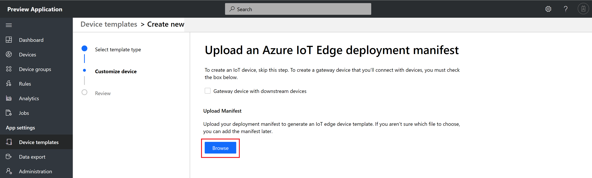

If you plan to create an IoT Edge Gateway device template, make sure to select **Gateway device with downstream devices**.

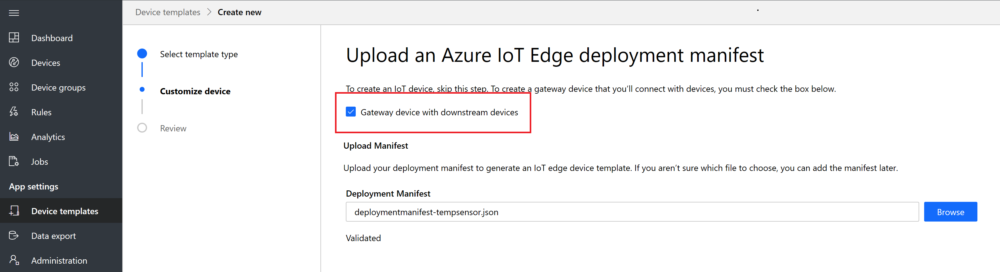

In the file selection dialog box, select the deployment manifest file, and select **Open**.

IoT Edge validates the deployment manifest file against a schema. If the validation is successful, select **Review**.


The following flowchart shows a deployment manifest life cycle in IoT Central.


Next, you'll see a review page, with details of the deployment manifest. This page shows a list of modules from the deployment manifest. In this tutorial, note that the `SimulatedTemperatureSensor` module is listed. Select **Create**.

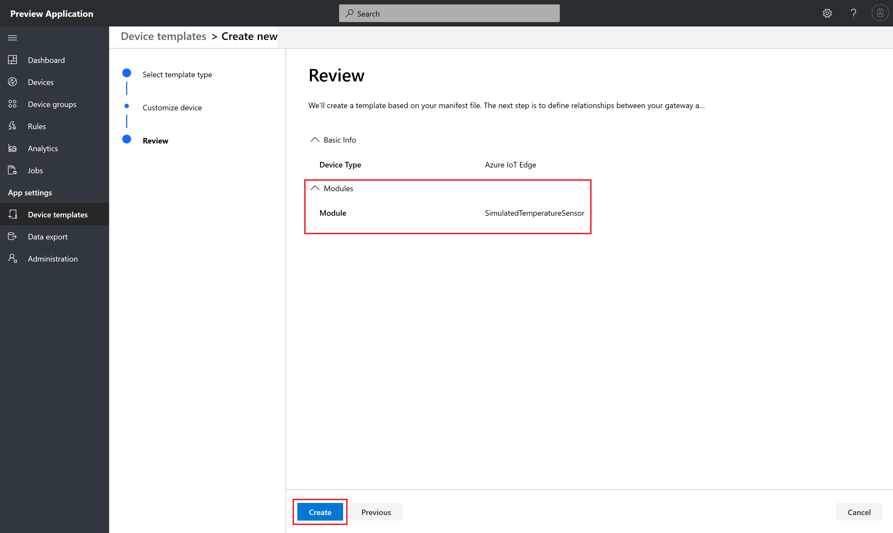

If you had selected a gateway device, you see the following review page.


You create a device template with module capability models. In this tutorial, you create a device template with the `SimulatedTemperatureSensor` module capability model. 

Change title of the device template to **Environment Sensor Device Template**.


In IoT Edge device, model IoT Plug and Play as follows:
* Every IoT Edge device template has a device capability model.
* For every custom module listed in the deployment manifest, a module capability model is generated.
* A relationship is established between each module capability model and a device capability model.
* A module capability model implements module interfaces.
* Each module interface contains telemetry, properties, and commands.


#### Add capabilities to a module capability model

Here is a sample output from the `SimulatedTemperatureSensor` module:
```json
{

	"machine": {

		"temperature": 75.0,
		"pressure": 40.2
	},
	"ambient": {
		"temperature": 23.0,
		"humidity": 30.0
	},
	"timeCreated": ""
}
```

You can add capabilities to the `SimulatedTemperatureSensor` module, which will reflect the preceding output. 

1. To manage an interface of the `SimulatedTemperatureSensor` module capability model, select **Manage** > **Add Capability**. 

    
  
1. Add a machine as an object type.
  
    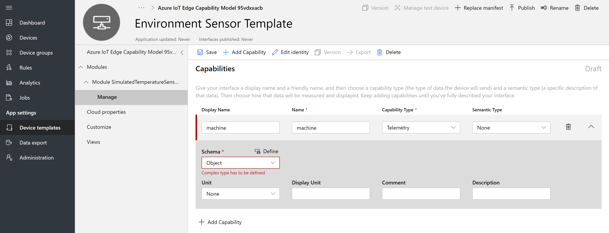

1. Select **Define**. In the dialog box that appears, change the object name to **machine**. Create temperature and pressure properties, and select **Apply**.
  
    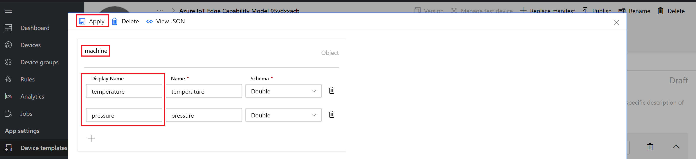
  
1. Add **ambient** as an object type.

1. Select **Define**. In the dialog box that appears, change the object name to **ambient**. Create temperature and humidity properties, and select **Apply**.
  
    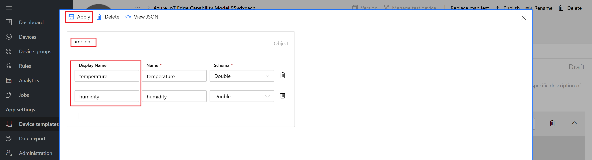

  
1. Add `timeCreated` as a `DateTime` type, and select **Save**.
  
    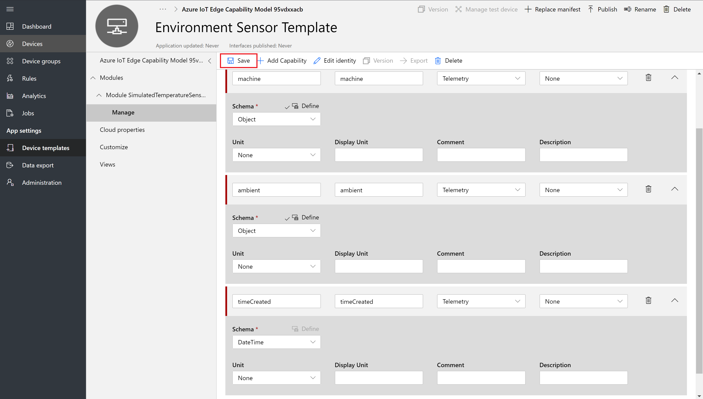


### Add relationships

If you selected an IoT Edge device to be a gateway device, you can add downstream relationships to device capability models for devices you want to connect to the gateway device.
  
  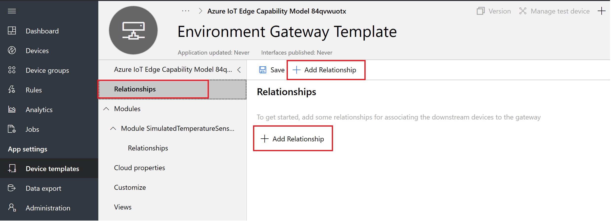

You can add a relationship at a device or at a module.
  
  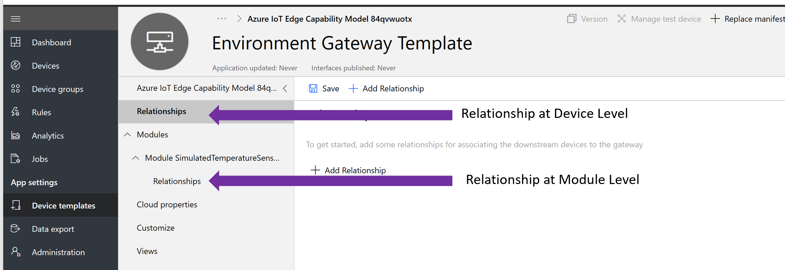


You can select a downstream device capability model, or you can select the asterisk symbol. 
  
  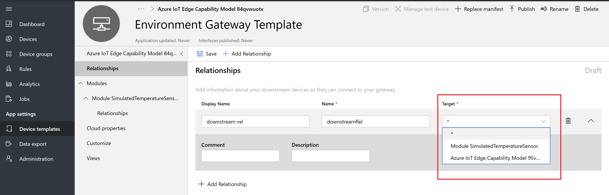

  For this tutorial, select the asterisk. This option allows any downstream relationship. Then select **Save**.

  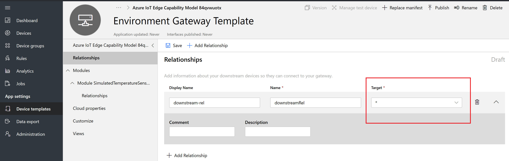


### Add cloud properties

A device template can include cloud properties. Cloud properties only exist in the IoT Central application, and are never sent to, or received from, a device.

1. Select **Cloud Properties** > **+ Add Cloud Property**. Use the information in the following table to add a cloud property to your device template.

    | Display name      | Semantic type | Schema |
    | ----------------- | ------------- | ------ |
    | Last Service Date | None          | Date   |
    | Customer name     | None          | String |

2. Select **Save**.

  
    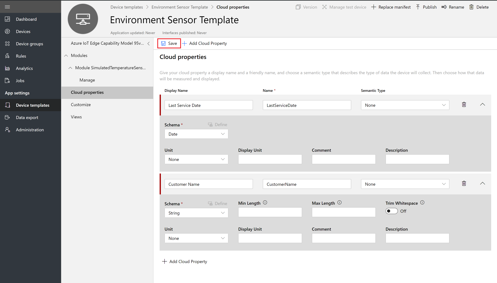

### Add customizations

Use customizations to modify an interface, or to add IoT Central-specific features to a capability that doesn't require you to version your device capability model. You can customize fields when the capability model is in a draft or published state. You can only customize fields that don't break interface compatibility. For example, you can:

- Customize the display name and units of a capability.
- Add a default color to use when the value appears on a chart.
- Specify initial, minimum, and maximum values for a property.

You can't customize the capability name or capability type.

When you're finished customizing, select **Save**.
  


### Create views

As a builder, you can customize the application to display relevant information about the environmental sensor device to an operator. Your customizations enable the operator to manage the environmental sensor devices connected to the application. You can create two types of views for an operator to use to interact with devices:

* Forms to view and edit device and cloud properties.
* Dashboards to visualize devices.

### Configure a view to visualize devices

A device dashboard lets an operator visualize a device by using charts and metrics. As a builder, you can define what information appears on a device dashboard. You can define multiple dashboards for devices. To create a dashboard to visualize the environmental sensor telemetry, select **Views** > **Visualizing the Device**:

  


Ambient Telemetry and Machine Telemetry are complex objects. To create charts:

1. Drag **Ambient Telemetry**, and select **Line chart**. 
  
   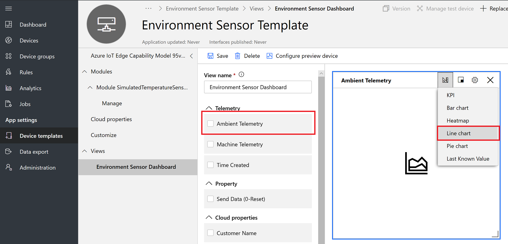

1. Select the configure icon. Select **Temperature** and **Humidity** to visualize the data, and select **Update configuration**. 
  
   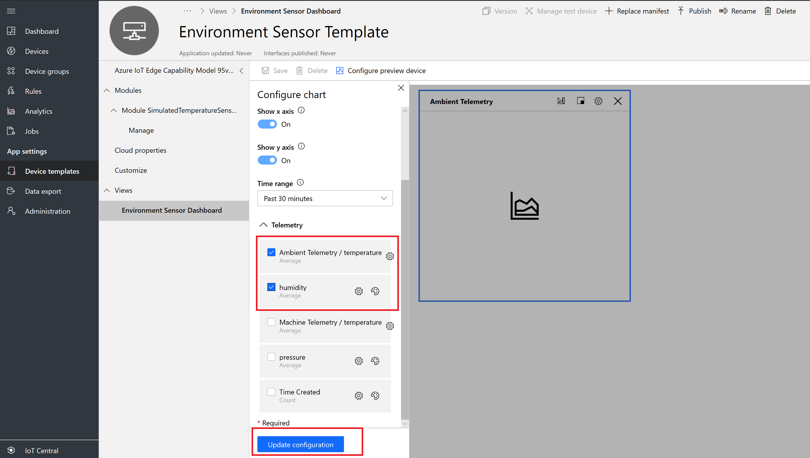

1. Select **Save**.

You can add more tiles that show other properties or telemetry values. You can also add static text, links, and images. To move or resize a tile on the dashboard, move the mouse pointer over the tile, and drag the tile to a new location or resize it.
  


### Add a device form

A device form lets an operator edit writeable device properties and cloud properties. As a builder, you can define multiple forms and choose which device and cloud properties to show on each form. You can also display read-only device properties on a form.

To create a form to view and edit environmental sensor properties:

1. In the **Environmental Sensor Template**, go to **Views**. Select the **Editing Device and Cloud data** tile to add a new view.
  
   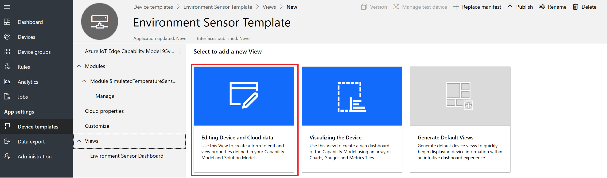

1. Enter the form name **Environmental Sensor properties**.

1. Drag the **Customer name** and **Last service date** cloud properties onto the existing section on the form.
  
   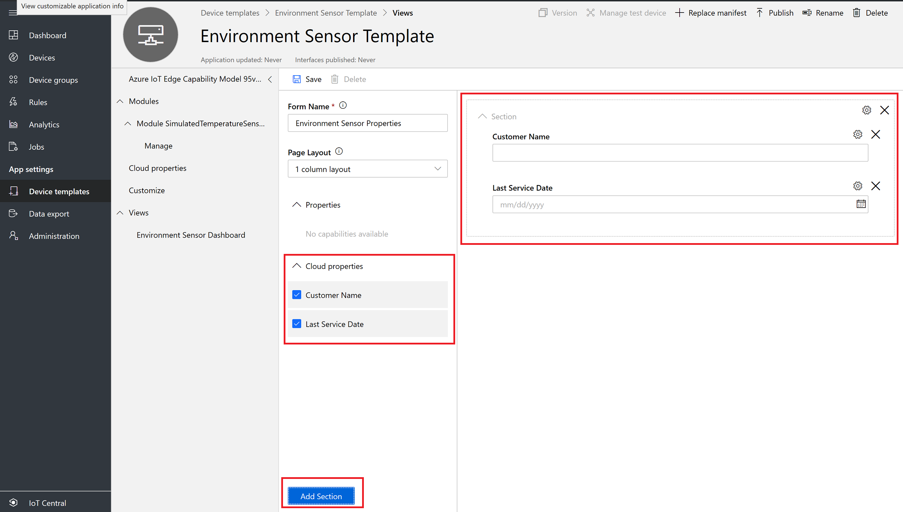

1. Select **Save**.

## Publish a device template

Before you can create a simulated environmental sensor, or connect a real environmental sensor, you need to publish your device template.

To publish a device template:

1. Go to your device template from the **Device Templates** page.

2. Select **Publish**.
  
    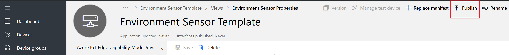

1. In the **Publish a Device Template** dialog box, choose **Publish**.
  
    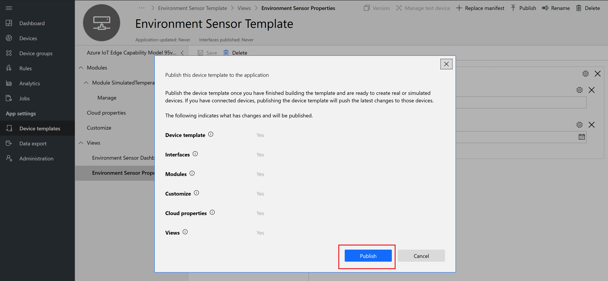

After a device template is published, it's visible on the **Devices** page and to the operator. In a published device template, you can't edit a device capability model without creating a new version. However, you can make updates to cloud properties, customizations, and views, in a published device template. These updates don't cause a new version to be created. After you make any changes, select **Publish** to push those changes out to your operator.
  
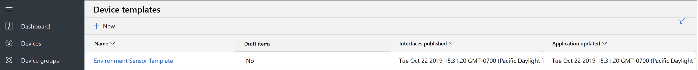

## Next steps

In this tutorial, you learned how to:

* Create a new edge as a leaf device template.
* Generate modules from an uploaded deployment manifest.
* Add complex type telemetry and properties.
* Create cloud properties.
* Create customizations.
* Define a visualization for the device telemetry.
* Publish your edge device template.

Now that you've created a device template in your Azure IoT Central application, you can do this next:

> [!div class="nextstepaction"]
> [Connect edge device](./tutorial-add-edge-as-leaf-device.md)
