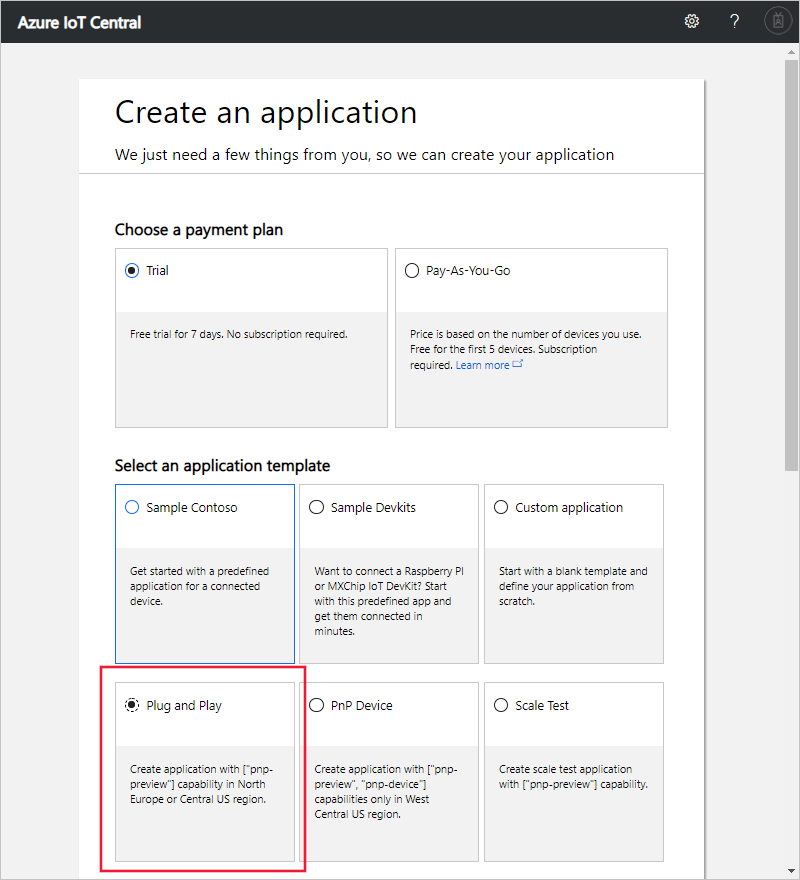

# Create an Azure IoT Central application (preview features)

[!INCLUDE [iot-central-pnp-original](../../includes/iot-central-pnp-original-note.md)]

This quickstart shows you how to create an Azure IoT Central application that uses preview features such as IoT Plug and Play.

> [!WARNING]
> The IoT Plug and Play capabilities in Azure IoT Central are currently in public preview. Don't use an IoT Plug and Play enabled IoT Central application for production workloads. For production environments use an IoT central application created from a current, generally available, application template.

## Create an application

Navigate to the [Azure IoT Central application manager](https://aka.ms/iotcentral) website. Then sign in with a Microsoft personal or work or school account.

To start creating a new Azure IoT Central application, select **New Application**. This link takes you to the **Create an application** page.

To create a new Azure IoT Central application that includes preview features such as IoT Plug and Play:

1. Choose a payment plan:
   - **Trial** applications are free for seven days before they expire. They can be converted to Pay-As-You-Go at any time before they expire. If you create a **Trial** application, you need to enter your contact information and choose whether to receive information and tips from Microsoft.
   - **Pay-As-You-Go** applications are charged per device, with the first five devices free. If you create a **Pay-As-You-Go** application, you need to select your *Directory*, *Azure Subscription*, and *Region*:
      - *Directory* is the Azure Active Directory (AD) to create your application. It contains user identities, credentials, and other organizational information. If you don’t have an Azure AD, one is created for you when you create an Azure subscription.
      - An *Azure Subscription* enables you to create instances of Azure services. IoT Central will provision resources in your subscription. If you don’t have an Azure subscription, you can create one on the [Azure sign-up page](https://aka.ms/createazuresubscription). After you create the Azure subscription, navigate back to the **Create Application** page. Your new subscription appears in the **Azure Subscription** drop-down.
      - *Region* is the physical location where you’d like to create your application. During public preview, the only available regions for a **Preview application** are **North Europe** and **Central US**.

      Learn more about pricing on the [Azure IoT Central pricing page](https://azure.microsoft.com/pricing/details/iot-central/).

1. Choose a friendly application name, such as **Contoso IoT**. Azure IoT Central generates a unique URL prefix for you. You can change this URL prefix to something more memorable.

1. Choose the **Preview application** template. An application template can contain predefined items such as device templates and dashboards to help you get started.

1. Select **Create** at the bottom of the page.

## Next steps

In this quickstart, you created an IoT Central application that uses the preview features. The suggested next step is to:

> [!div class="nextstepaction"]
> [Define a new device type in your Azure IoT Central application](./tutorial-define-device-type-pnp.md?toc=/azure/iot-central-pnp/toc.json&bc=/azure/iot-central-pnp/breadcrumb/toc.json)
