# Create an Azure IoT Central application

As a _builder_, you use the Azure IoT Central UI to define your Microsoft Azure IoT Central application. This quickstart shows you how to:

- Create an Azure IoT Central application that contains a sample _device template_ and simulated _devices_.
- View the features of the **Refrigerated Vending Machine** device template in your application.
- View the telemetry and analytics from your simulated **Refrigerator** devices.

In this quickstart, you view a simulated **Refrigerator** device from a device template. The simulated device:

* Sends telemetry, such as temperature and pressure, to your application.
* Reports device property values, such as a motion alert, to your application.
* Has device settings, such as fan speed, that you can set in the application.

When you create a simulated device from a device template in an Azure IoT Central application, the simulated device enables you to test your application before you connect a real device.

## Create the application

To complete this quickstart, you need to create an Azure IoT Central application from the **Sample Contoso** application template.

Navigate to the Azure IoT Central [Application Manager](https://aka.ms/iotcentral) page. Then enter the email address and password you use to access your Azure subscription:

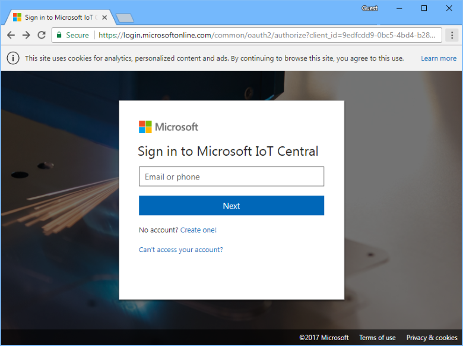

To start creating a new Azure IoT Central application, choose **New Application**:

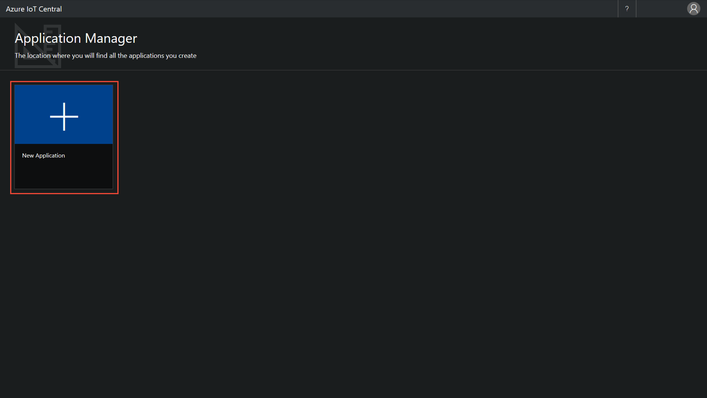

To create a new Azure IoT Central application:

1. Choose the **Free Trial Application** payment plan.
1. Choose a friendly application name, such as **Contoso IoT**. Azure IoT Central generates a unique URL prefix for you. You can change this URL prefix to something more memorable.
1. Choose the **Sample Contoso** application template.
1. Then choose **Create**.

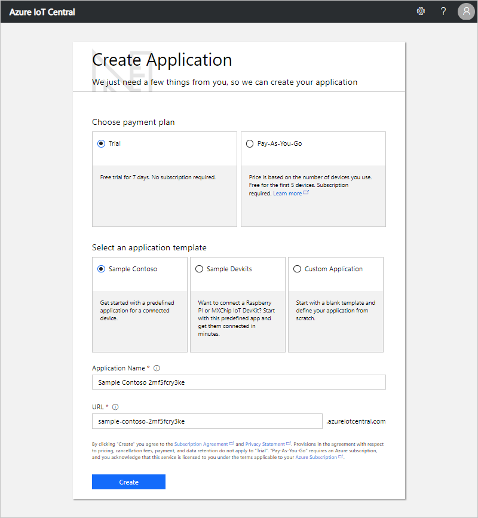

## Navigate to the application

When your application is ready, the **Homepage** of your application displays. The _Design Mode_ on the top right can be toggled to edit the Homepage. The application URL is the URL you specified in the previous step:

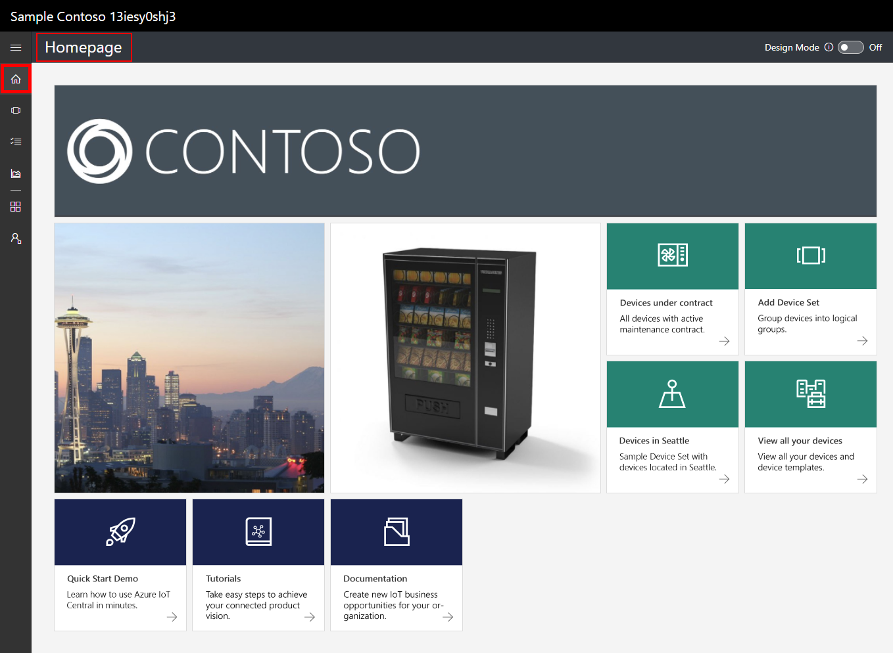

Use the _left navigation menu_ to access the different areas of your new Azure IoT Central application:

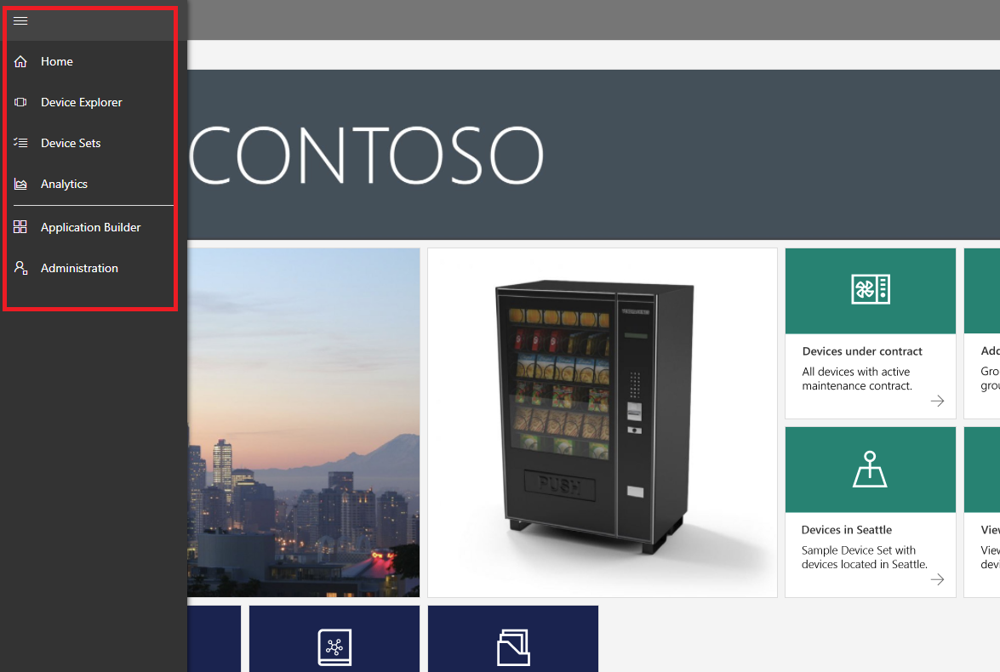

To view the device templates and devices in your application, choose **Device Explorer** on the left navigation menu. The sample application includes the **Refrigerated Vending Machine** device template. There are three simulated devices already created from this device template:

## View the device template and devices

Use the following steps to view a refrigerator device that was created from the **Refrigerated Vending Machine** device template. A device template defines:

* _Measurements_, such as temperature telemetry, sent from a device.
* _Settings_, such as fan speed, that enable you to control the device.
* _Properties_, such as serial number, that store information about the device.
* [Rules](howto-create-telemetry-rules.md) that enable you to automate actions based on the behavior of the device.
* A customizable _dashboard_ that displays information about the device.

You can create both simulated and real devices from a device template.

### Measurements

The **Measurements** page for the **Refrigerator 1** device displays. You can see the list of measurements sent from the simulated device. The page also displays a customizable chart of the visible measurements:

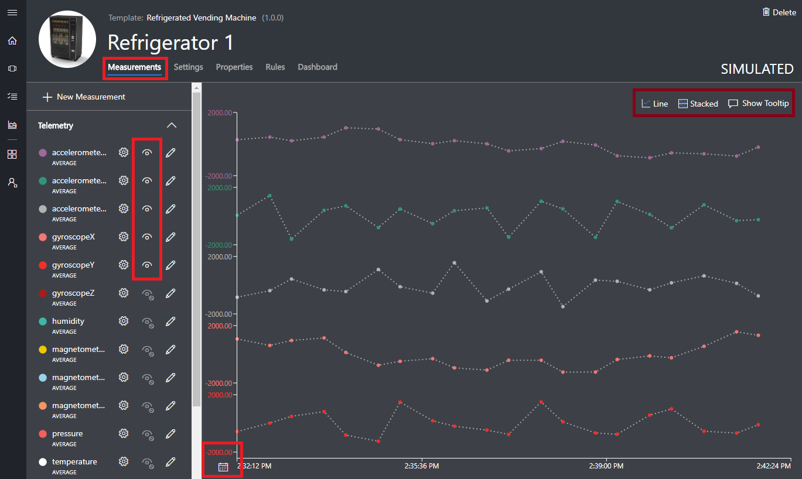

You can toggle the visibility of individual elements and customize the chart. The current chart shows telemetry from a simulated device. You can add new measurements to the device template if you have appropriate permissions.

> [!NOTE]
> You may need to wait for a short while before the simulated data appears on the chart.

### Settings

Choose **Settings**. On the **Settings** page, you can control the device. For example, you can update the fan speed on the refrigerator:

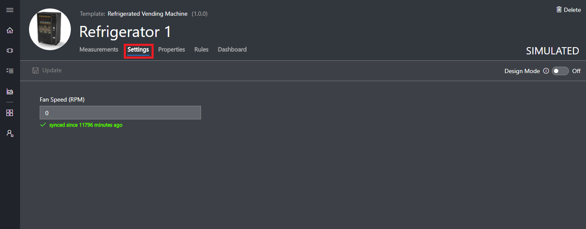

A setting shows as **synced** when a device acknowledges the change.

### Properties

Choose **Properties**. On the **Properties** page, you can:

* Maintain information about your device, such as the customer name.
* View property values reported by the device, such as a motion alert.

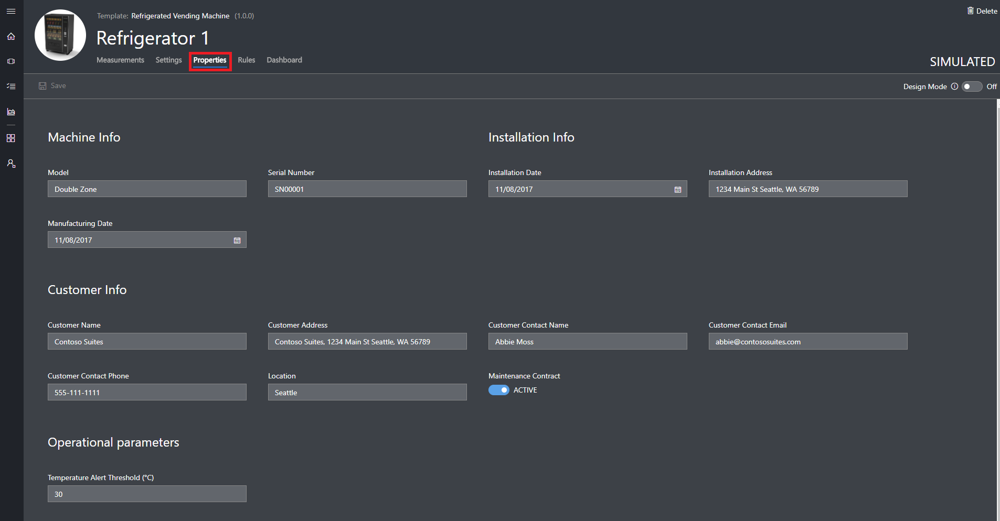

### Dashboard

Choose **Dashboard**. The dashboard is a customizable view of information about your device such as measurements, properties, and KPIs:

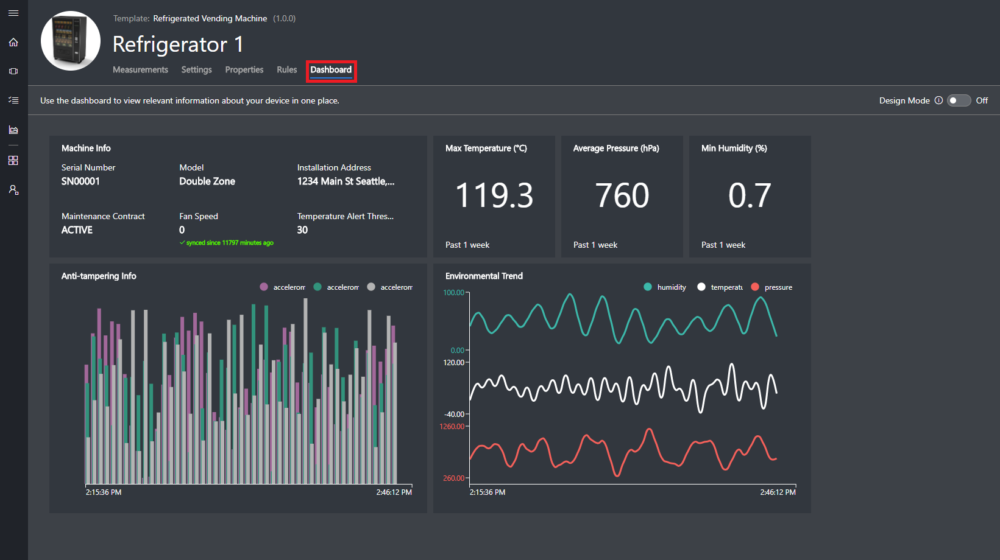

## View analytics

The previous section showed you how to view information about an individual device. You can use [device sets](howto-use-device-sets.md) and [analytics](howto-create-analytics.md) to view consolidated information from multiple devices.

A device set uses a query to dynamically select a set of devices that match a criteria. For example, the **Machines in Seattle** device set selects refrigerator devices whose location is Seattle. To view the **Machines in Seattle** device set, choose **Device Sets** in the left navigation menu, and then choose **Machines in Seattle**:

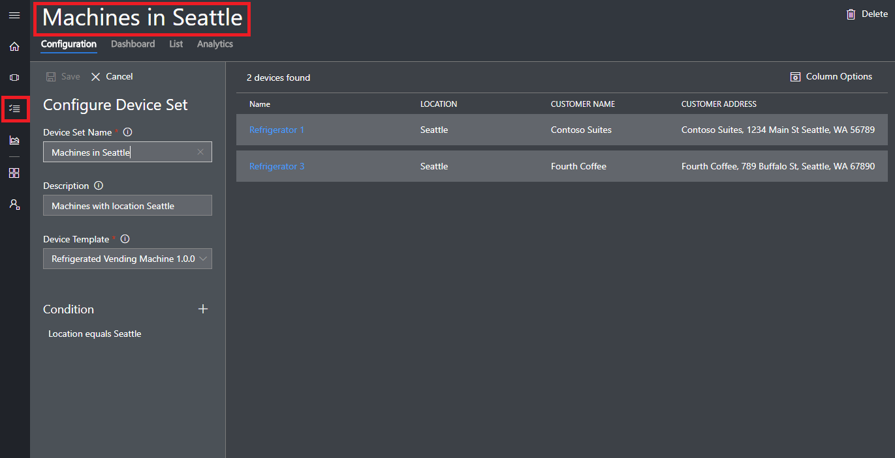

You can view analytics data for the devices in a device set on the **Analytics** page:

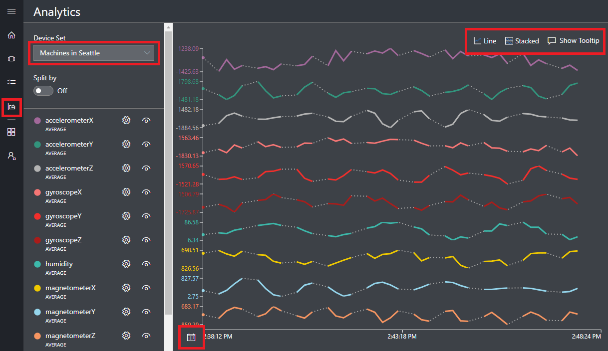

## Next steps

In this quickstart, you created a pre-populated Azure IoT Central application that contains a **Refrigerated Vending Machine** device template and simulated devices. See [Define a new device template in your application](tutorial-define-device-type.md) to learn more, as a builder, about how to define your own device templates.
