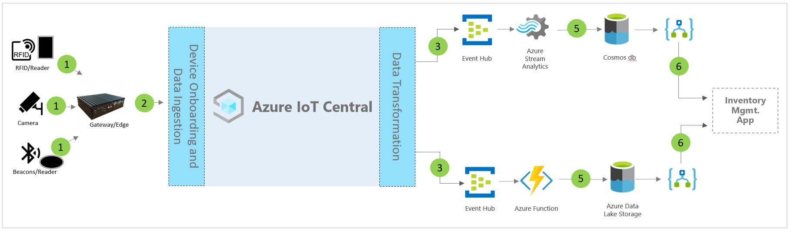

# Architecture of IoT Central smart inventory management application template

Partners and customers can use the app template and following guidance to develop end to end **smart inventory management** solutions.

> [!div class="mx-imgBorder"]
> 

1. Set of IoT sensors sending telemetry data to a gateway device
2. Gateway devices sending telemetry and aggregated insights to IoT Central
3. Data is routed to the desired Azure service for manipulation
4. Azure services like ASA or Azure Functions can be used to reformat data streams and send to the desired storage accounts 
5. Processed data is stored in hot storage for near real-time actions or cold storage for additional insight enhancements that is based on ML or batch analysis. 
6. Logic Apps can be used to power various business workflows in end-user business applications

## Details
Following section outlines each part of the conceptual architecture
Telemetry ingestion from Radio-frequency identification (RFID), Bluetooth low energy (BLE) tags

## RFID tags
RFID tags transmit data about an item through radio waves. RFID tags typically don't have a battery unless specified. Tags receive energy from the radio waves generated by the reader and transmit a signal back toward the RFID reader.

## BLE tags
Energy beacon broadcasts packets of data at regular intervals. Beacon data is detected by BLE readers or installed services on smartphones and then transmitting that to the cloud.

## RFID & BLE readers
RFID reader converts the radio waves to a more usable form of data. Information collected from the tags is then stored in local edge server or sent to cloud using JSON-RPC 2.0 over MQTT.
BLE reader also known as Access Points (AP) are similar to RFID reader. It is used to detect nearby Bluetooth signals and relay its message to local Azure IoT Edge or cloud using JSON-RPC 2.0 over MQTT.
Many readers are capable of reading RFID and beacon signals, and providing additional sensor capability related to temperature, humidity, accelerometer, and gyroscope.

## Azure IoT Edge gateway
Azure IoT Edge server provides a place to preprocess that data locally before sending it on to the cloud. We can also deploy cloud workloads artificial intelligence, Azure and third-party services, business logic using standard containers.

## Device management with IoT Central 
Azure IoT Central is a solution development platform that simplifies IoT device connectivity, configuration, and management. The platform significantly reduces the burden and costs of IoT device management, operations, and related developments. Customers & partners can build an end to end enterprise solutions to achieve a digital feedback loop in inventory management.

## Business insights & actions using data egress 
IoT Central platform provides rich extensibility options through Continuous Data Export (CDE) and APIs. Business insights based on telemetry data processing or raw telemetry are typically exported to a preferred line-of-business application. It can be achieved using webhook, service bus, event hub, or blob storage to build, train, and deploy machine learning models & further enrich insights.

## Next steps
* Learn how to deploy [smart inventory management template](./tutorial-iot-central-smart-inventory-management.md)
* Learn more about [IoT Central retail templates](./overview-iot-central-retail.md)
* Learn more about IoT Central refer to [IoT Central overview](../core/overview-iot-central.md)
