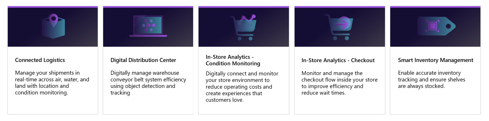
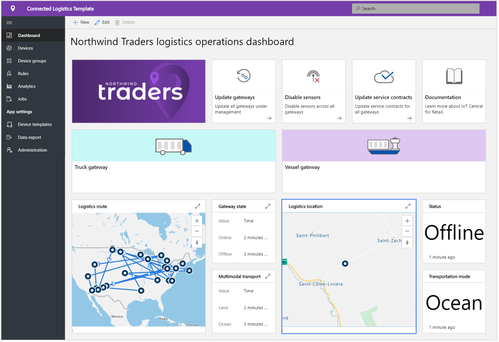
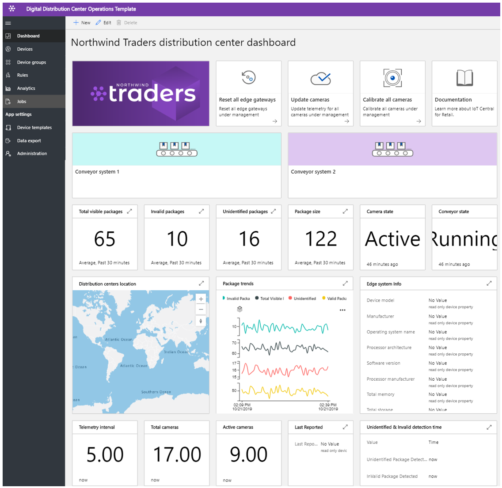
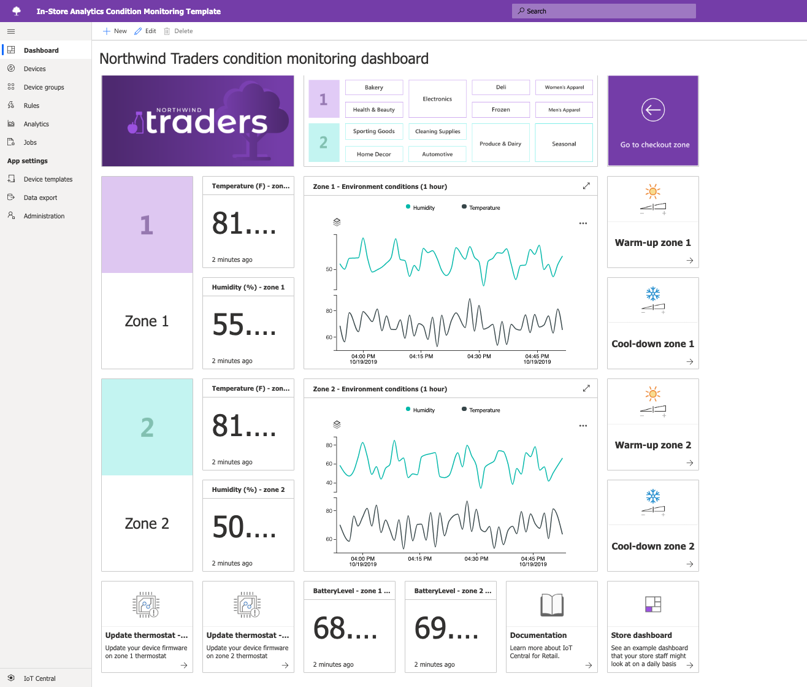

# Building retail solutions with Azure IoT Central

Azure IoT Central is an IoT app platform that reduces the burden and cost associated with developing, managing, and maintaining enterprise-grade IoT solutions. Choosing to build with Azure IoT Central gives you the opportunity to focus your time, money, and energy on transforming your business with IoT data, rather than just maintaining and updating a complex and continually evolving IoT infrastructure.

This article, describes several retail-specific IoT Central application templates. As a solution builder, you can use these templates to build IoT solutions that optimize supply chains, improve in-store experiences for customers, and track inventory more efficiently.

> [!div class="mx-imgBorder"]
> 

The following sections describe the capabilities of these application templates:

## Connected logistics

Global logistics spending is expected to reach $10.6 trillion in 2020. Transportation of goods accounts for the majority of this spending and shipping providers are under intense competitive pressure and constraints.

You can use IoT sensors to collect and monitor ambient conditions such as temperature, humidity, tilt, shock, light, and the location of a shipment. You can combine telemetry gathered from IoT sensors and devices with other data sources such as weather and traffic information in cloud-based business intelligence systems.

The benefits of a connected logistics solution include:

* Shipment monitoring with real-time tracing and tracking. 
* Shipment integrity with real-time ambient condition monitoring.
* Security from theft, loss, or damage of shipments.
* Geo-fencing, route optimization, fleet management, and vehicle analytics.
* Forecasting for predictable departure and arrival of shipments.

The following screenshots show the out-of-the-box dashboard in the application template. The dashboard is fully customizable to meet your specific solution requirements:

> [!div class="mx-imgBorder"]
> 

> [!div class="mx-imgBorder"]
> 

To learn more, see the [Deploy and walk through a connected logistics application template](./tutorial-iot-central-connected-logistics.md) tutorial.

## Digital distribution center

As manufacturers and retailers establish worldwide presences, their supply chains branch out and become more complex. Consumers now expect large selections of products to be available, and for those goods to arrive within one or two days of purchase. Distribution centers must adapt to these trends while overcoming existing inefficiencies. 

Today, a reliance on manual labor means that picking and packing accounts for 55-65% of distribution center costs. Manual picking and packing are also typically slower than automated systems, and rapidly fluctuating staffing needs make it even harder to meet shipping volumes. This seasonal fluctuation results in high staff turnover and increase the likelihood of costly errors.

Solutions based on IoT enabled cameras can deliver transformational benefits by enabling a digital feedback loop. Data from across the distribution center leads to actionable insights that, in turn, results in better data.

The benefits of a digital distribution center include:

* Cameras monitor goods as they arrive and move through the conveyor system.
* Automatic identification of faulty goods.
* Efficient order tracking.
* Reduced costs, improved productivity, and optimized usage.

The following screenshot shows the out-of-the-box dashboard in the application template. The dashboard is fully customizable to meet your specific solution requirements: 

> [!div class="mx-imgBorder"]
> 

To learn more, see the [Deploy and walk through a digital distribution center application template](./tutorial-iot-central-digital-distribution-center.md) tutorial.

## In-store analytics - condition monitoring

For many retailers, environmental conditions within their stores are a key differentiator from their competitors. Retailers want to maintain pleasant conditions within their stores for the benefit of their customers.  

As a solution builder, you can use the IoT Central in-store analytics condition monitoring application template to build an end-to-end solution. The application template lets you digitally connect to and monitor a retail store environment using of  different kinds of sensor devices. These sensor devices generate telemetry that you can convert into business insights helping the retailer to reduce operating costs and create a great experience for their customers.

Use the application template to:

* Connect a variety of IoT sensors to an IoT Central application instance.
* Monitor and manage the health of the sensor network as well as any gateway devices in the environment.
* Create custom rules around the environmental conditions within a store to trigger  alerts for store managers.
* Transform the environmental conditions within your store into insights that the retail store team can use to improve the customer experience.
* Export the aggregated insights into existing or new business applications to provide useful and timely information to retail staff.

The application template comes with a set of device templates and uses a set of simulated devices to populate the dashboard. 

The following screenshot shows the out-of-the-box dashboard in the application template. The dashboard is fully customizable to meet your specific solution requirements: 

> [!div class="mx-imgBorder"]
> 

To learn more, see the [Create an in-store analytics application in Azure IoT Central](./tutorial-in-store-analytics-create-app.md) tutorial.

## In-store analytics - checkout

For some retailers, the checkout experience within their stores is a key differentiator from their competitors. Retailers want to deliver a smooth checkout experience within their stores to encourage customers to return.  

As a solution builder, you can use the IoT Central in-store analytics checkout application template to build a solution that delivers insights from around the checkout zone of a store to retail staff. For example, sensors can provide information about queue lengths and average wait times for each checkout lane.

Use the application template to:

* Connect a variety of IoT sensors to an IoT Central application instance.
* Monitor and manage the health of the sensor network as well as any gateway devices in the environment.
* Create custom rules around the checkout condition within a store to trigger alerts for retail staff.
* Transform the checkout conditions within the store into insights that the retail store team can use to improve the customer experience.
* Export the aggregated insights into existing or new business applications to provide useful and timely information to retail staff.

The application template comes with a set of device templates and uses a set of simulated devices to populate the dashboard with lane occupancy data. 

The following screenshot shows the out-of-the-box dashboard in the application template. The dashboard is fully customizable to meet your specific solution requirements: 

> [!div class="mx-imgBorder"]
> 

To learn more, see the [Create an in-store analytics application in Azure IoT Central](./tutorial-in-store-analytics-create-app.md) tutorial.

## Smart inventory management

Inventory is the stock of goods a retailer holds. Inventory management is critical to ensure the right product is in the right place at the right time. A retailer must balance the costs of storing too much inventory against the costs of not having sufficient items in stock to meet demand.

IoT data generated from radio-frequency identification (RFID) tags, beacons, and cameras provide opportunities to improve inventory management processes. You can combine telemetry gathered from IoT sensors and devices with other data sources such as weather and traffic information in cloud-based business intelligence systems.

The benefits of smart inventory management include:

* Reducing the risk of items being out of stock and ensuring the desired customer service level. 
* In-depth analysis and insights into inventory accuracy in near real time.
* Tools to help decide on the right amount of inventory to hold to meet customer orders.

This application template focuses on device connectivity, and the configuration and management of RFID and Bluetooth low energy (BLE) reader devices.

The following screenshot shows the out-of-the-box dashboard in the application template. The dashboard is fully customizable to meet your specific solution requirements:

> [!div class="mx-imgBorder"]
> 

To learn more, see the [Deploy and walk through a smart inventory management application template](./tutorial-iot-central-smart-inventory-management.md) tutorial.

## Micro-fulfillment center

In the increasingly competitive retail landscape, retailers constantly face pressure to close the gap between demand and fulfillment. A new trend that has emerged to address the growing consumer demand is to house inventory near the end customers and the stores they visit.

The IoT Central micro-fulfillment center application template enables solution builders to monitor and manage all aspects of their fully automated fulfillment centers. The template includes a set of simulated condition monitoring sensors and robotic carriers to accelerate the solution development process. These sensor devices capture meaningful signals that can be converted into business insights allowing retailers to reduce their operating costs and create experiences for their customers.

The application template enables you to: 

- Seamlessly connect different kinds of IoT sensors such as robots or condition monitoring sensors to an IoT Central application instance.
- Monitor and manage the health of the sensor network, and any gateway devices in the environment.
- Create custom rules around the environmental conditions within a fulfillment center to trigger appropriate alerts.
- Transform the environmental conditions within your fulfillment center into insights that can be leveraged by the retail warehouse team.
- Export the aggregated insights into existing or new business applications for the benefit of the retail staff members.

The following screenshot shows the out-of-the-box dashboard in the application template. The dashboard is fully customizable to meet your specific solution requirements:

> [!div class="mx-imgBorder"]
> 

To learn more, see the [Deploy and walk through the micro-fulfillment center application template](./tutorial-micro-fulfillment-center.md) tutorial.

## Next steps

To get started building a retail solution:

* Get started with the [Create an in-store analytics application in Azure IoT Central](./tutorial-in-store-analytics-create-app.md) tutorial that walks you through how to build a solution with one of the in-store analytics application templates.
* [Deploy and walk through a connected logistics application template](./tutorial-iot-central-connected-logistics.md).
* [Deploy and walk through a digital distribution center application template](./tutorial-iot-central-digital-distribution-center.md).
* [Deploy and walk through a smart inventory management application template](./tutorial-iot-central-smart-inventory-management.md).
* [Deploy and walk through the micro-fulfillment center application template](./tutorial-micro-fulfillment-center.md).
* Learn more about IoT Central in the [IoT Central overview](../preview/overview-iot-central.md).
