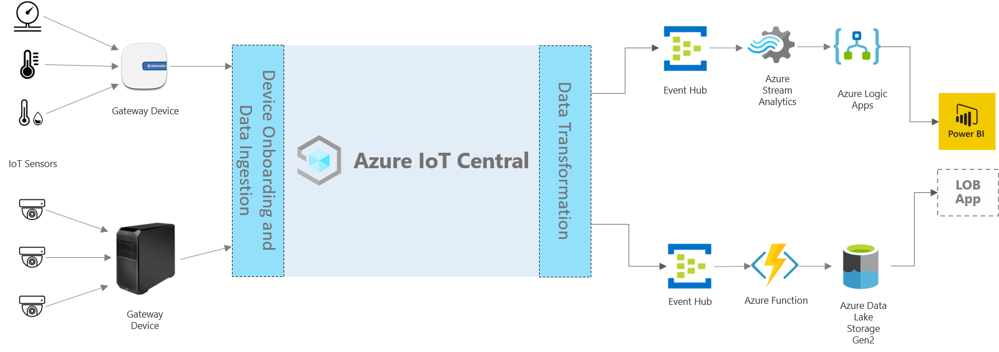

# Store Analytics architecture

This article provides an architectural overview for a solution built with Store Analytics application template in IoT Central.

 

You can utilize one of the Store Analytics application templates within IoT Central to build an end to end solution that allows you to monitor various conditions within the retail store environment. 

In the figure above, we highlight various components that generally play a part in a store analytics solution. 

### Get Connected

An IoT solution starts with a set of sensors capturing meaningful signals from within a retail store environment. This is reflected by a variety of sensors on the far left of the architecture diagram above. 

These IoT sensors can feed raw signals directly to IoT Central or to a gateway device that can aggregate the data at the Edge and send summary insights to the IoT Central application.

### Stay Connected

The Azure IoT Central tile in the architecture diagram refers to the Central application instance capturing signals from the IoT sensors. The Central user experience enables an operator to monitor and manage the sensor and gateway devices. 

### Transform
The IoT Central application instance within a solution can be configured to send raw or aggregated insights captured from the IoT sensors over to a multitude of endpoints. 

These endpoints include but are not limited to a variety of Azure services that allow the solution to further transform or consume the insights into a business application. 

In the architecture diagram above, we highlight PowerBI as one of the business applications that a retail store manager or staff member might utilize to visualize business insights powered by the IoT data. 

## Next steps
* Get started with the [Store Analytics Checkout](https://aka.ms/checkouttemplate) and [Store Analytics Condition Monitoring](https://aka.ms/conditiontemplate) application templates. 
* Take a look at the [end to end tutorial](https://aka.ms/storeanalytics-tutorial) that walks you through how to build a solution leveraging one of the Store Analytics application template. 