# Tutorial: Create a condition monitoring retail application in Azure IoT Central

[!INCLUDE [iot-central-pnp-original](../../../includes/iot-central-pnp-original-note.md)]

This tutorial shows you, as a builder, how to create an Azure IoT Central application to monitor environmental conditions in a retail store. This application is a solution to the common business need to monitor and adapt to environmental conditions in a store or facility.

You develop the solution in three parts:

* Create the application and connect devices to monitor conditions
* Customize the dashboard to enable operators to monitor and manage devices
* Configure data export to enable store managers to run analytics and visualize insights

In this tutorial, you learn how to:
> [!div class="checklist"]
> * Use the Azure IoT Central **Store Analytics - Condition Monitoring** template to create a retail store application
> * Customize the application settings
> * Create and customize IoT device templates
> * Connect real and simulated devices to your application
> * Add rules and actions to monitor conditions

## Prerequisites

To complete this tutorial series, you need:
* An Azure subscription. If you don't have an Azure subscription, you can create one on the [Azure sign-up page](https://aka.ms/createazuresubscription).
* Access to a gateway device and environmental sensors (you can optionally use simulated devices as described in the tutorial)
* Device templates for the devices you use (templates are provided for the real devices used in the tutorial)

## Create an application
In this section you create a new Azure IoT Central application from a template. You'll use this application throughout the tutorial series to build a complete condition monitoring solution.

To create an application:

1. Navigate to the [Azure IoT Central application manager](https://aka.ms/iotcentral) website.

1. Sign in with the credentials you use to access your Azure subscription:

    

1. To start creating a new Azure IoT Central application, select **New Application**.

To create a new Azure IoT Central condition monitoring application that uses preview features:  

1. Choose **Pay-As-You-Go**. A subscription is required to for this option.

1. Choose **Preview application**.

1. Optionally, choose a friendly **Application name** such as *Fabrikam, Inc.* By default Azure IoT Central generates a unique application name and URL prefix. You can change both values to something more memorable.

1. Select your *Directory, Azure subscription, and Region*. 

    For more information about directories and subscriptions, see the [create an application quickstart](../quick-deploy-iot-central-pnp.md?toc=/azure/iot-central-pnp/toc.json&bc=/azure/iot-central-pnp/breadcrumb/toc.json).

1. Select **Create**.

    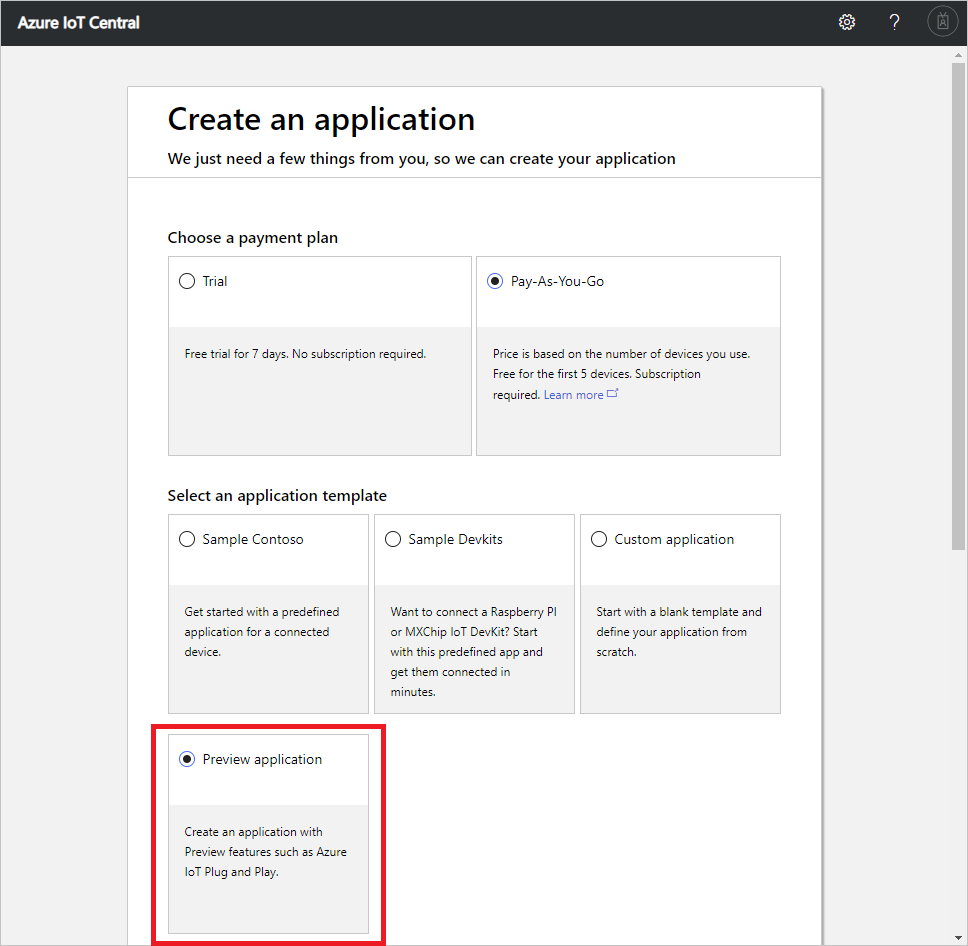

## Customize application settings
As a builder, you can change several settings to customize the user experience in your application.

To change the application theme:

1. Select **Settings** on the masthead.

    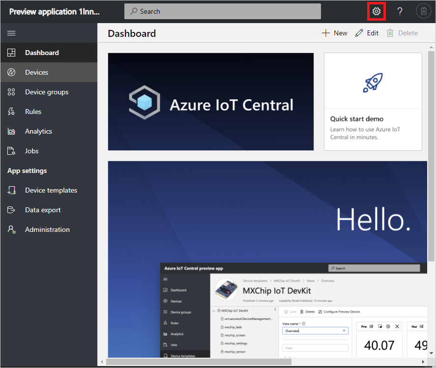

2. Select a new **Theme**.

    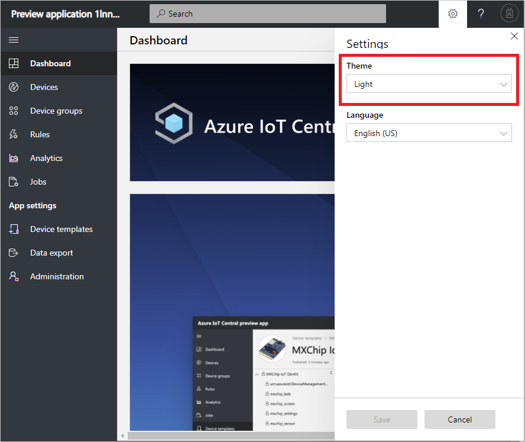

3. Select **Save**.

To change the application logo and browser icon:

1. Expand the primary navigation, if not already expanded.

    

1. Select **Administration** on the menu.

1. Select **Customize your application** in the secondary navigation.

    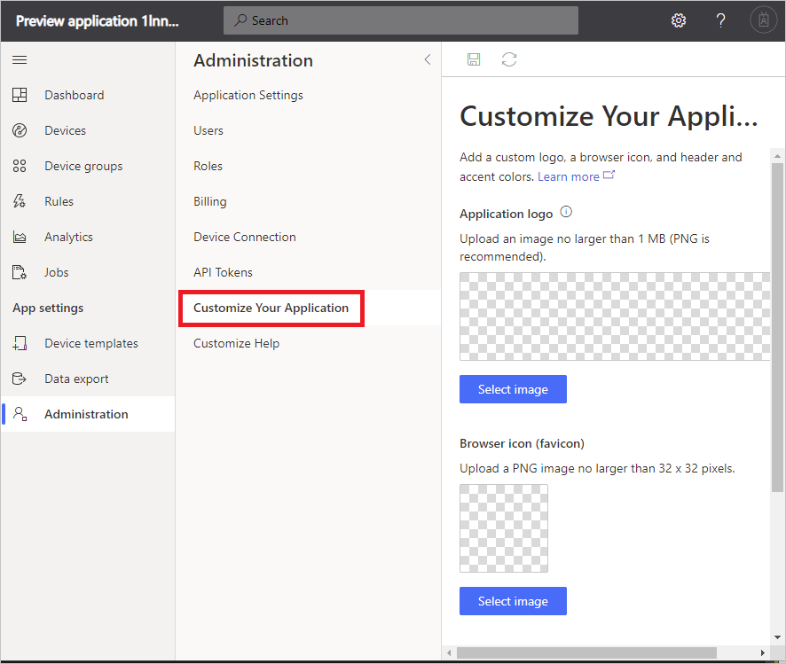

1. Use the **Select image** button to choose an image to upload as the **Application logo**.  Optionally, select a browser icon image that will appear on browser tabs.

    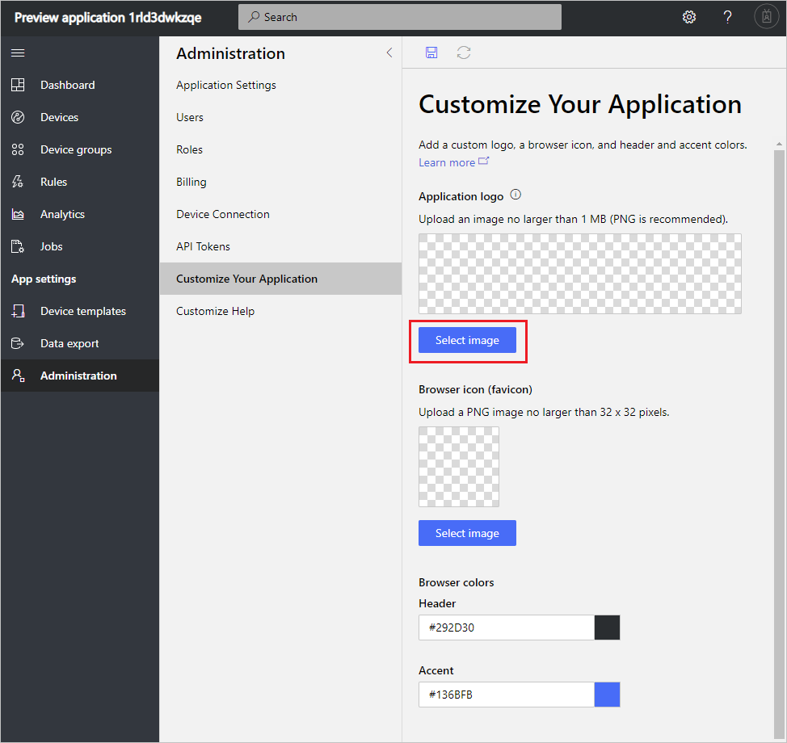

1. Select **Save**. After the upload completes, the application logo appears in the masthead.

    

## Create device templates
As a builder, you can create device templates that enable you and the application operators to configure and manage devices. You can create a template by building a custom one, by importing an existing template file, or by importing a template from the Azure IoT device catalog. After you create and customize a device template, you can use it to connect real devices to your application. Optionally, you can use a device template to generate simulated devices for testing.

To add a new device template to your application:

1. Select **Device Templates** in the primary navigation.

1. Select **+ New** to create a new device template.

    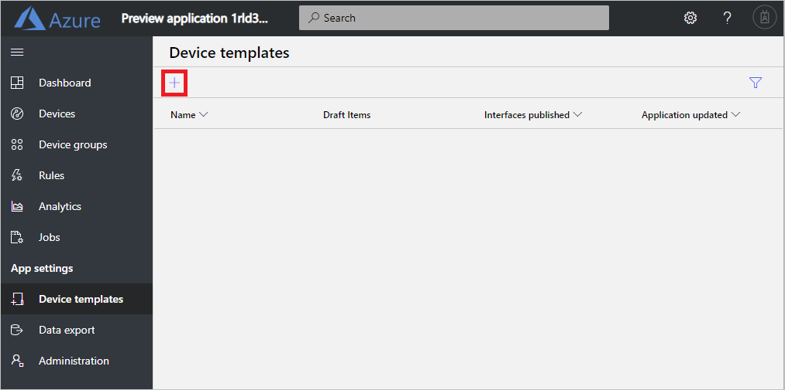

1. Select the **C500** Rigado gateway device template in the Azure IoT device catalog. Selecting the template adds it to your application. 

    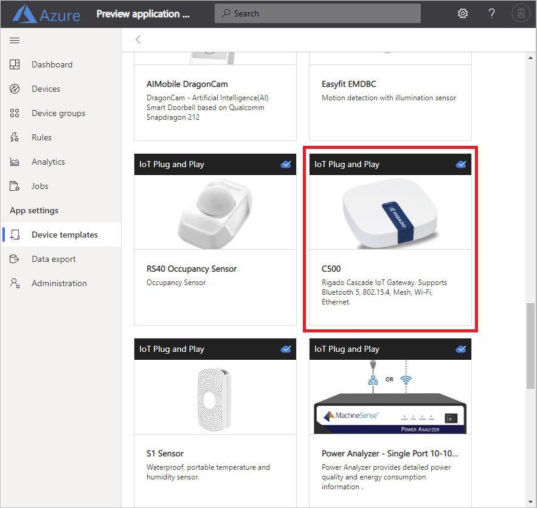

    After you add the template, a summary view displays a list of device interfaces and capabilities.

1. Select **Device Templates** in the primary navigation.

1. Select **+ New** to create another new device template.

1. Select the **RuuviTag** sensor device template in the Azure IoT device catalog.

    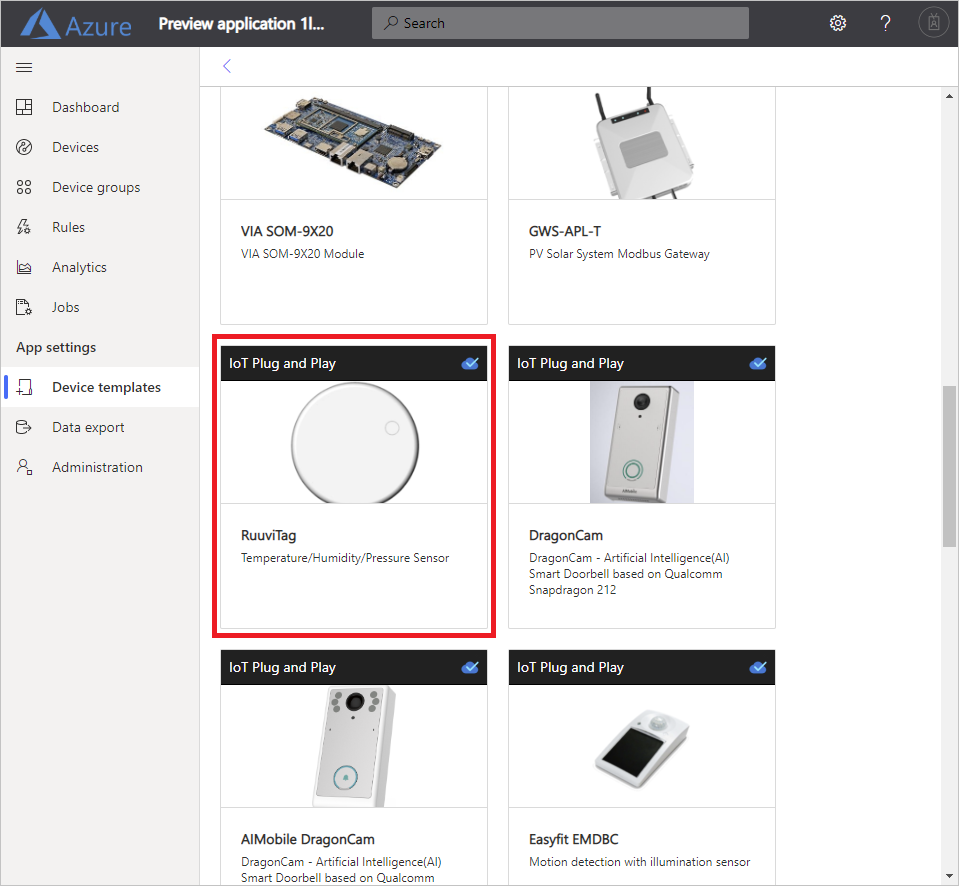

## Customize device templates
You can customize the device templates in your application in two ways. First, you can customize the native built-in interfaces in your devices by changing the device capabilities. For example, if you use a temperature sensor, you can change details such as the display name of the temperature interface, the data type of the captured data, the units of measurement, and minimum and maximum operating ranges. Second, you can customize your device templates by adding cloud properties. Cloud properties aren't part of the built-in device capabilities. Cloud properties are custom data that your Azure IoT Central application creates, stores, and associates with your devices. An example of a cloud property could be a calculated value, or metadata such as a location that you want to associate with a set of devices.

To customize the built-in interfaces of a device template in your application:

1. Select **Device Templates** again in the primary navigation. This page lists all device templates you added to your application.

1. Select the template for the RuuviTag sensors in the **Device Templates** page. Optionally, if you used a different device template, select it now.

1. Hide the primary navigation. The summary view of the template displays the device capabilities.

    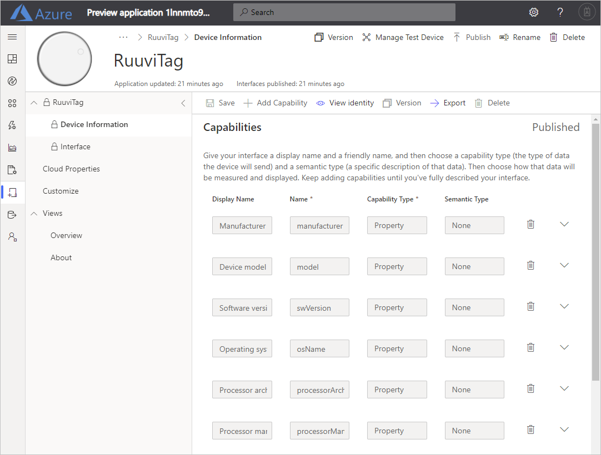

1. Select **Customize** in the secondary navigation.

1. Scroll in the list of capabilities and find the `humidity` interface. It's the row item with the editable **Display name** value of *humidity*.

In the following steps you customize the `humidity` interface for the RuuviTag sensors. Optionally, customize some of the other interfaces.

For the `humidity` interface make the following set of changes:

1. Select the **Expand** control to expand the schema details for the row.

1. Update the **Display Name** value from *humidity* to a custom value such as *Relative humidity*.

1. Change the **Semantic Type** option from *None* to *Humidity*.  Optionally, you can set schema values for the humidity interface in the expanded schema view. Schema settings allow you to create detailed validation requirements for the data that your sensors track. For example, you could set minimum and maximum operating range values for a given interface.

1. Select **Save** to save your changes.

    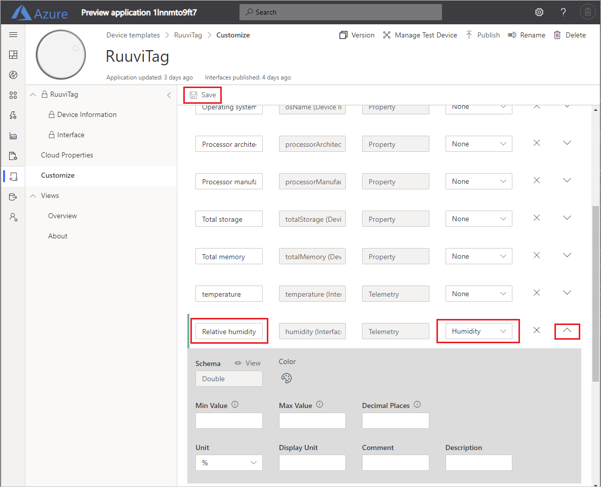

To add a cloud property to a device template in your application:

1. Select **Cloud Properties** in the secondary navigation.

1. Select **Add Cloud Property**. 

Specify the following values to create a custom property to store the location of each device:

1. Enter the value *Location* for the **Display Name**. This value is automatically copied to the **Name** field, which is a friendly name for the property. You can use the copied value or change it.

1. Select *String* in the **Schema** dropdown. This enables you to associate a location name string such as a geographical area, or an area within a facility, with each device. Optionally, you can set the **Semantic Type** of your property to *Location*, and this automatically sets the **Schema** to *Geopoint*. This enables you to associate GPS coordinates with a device. 

1. Set **Minimum Length** to *2*. 

1. Set **Trim Whitespace** to **On**.

1. Select **Save** to save your custom cloud property.

    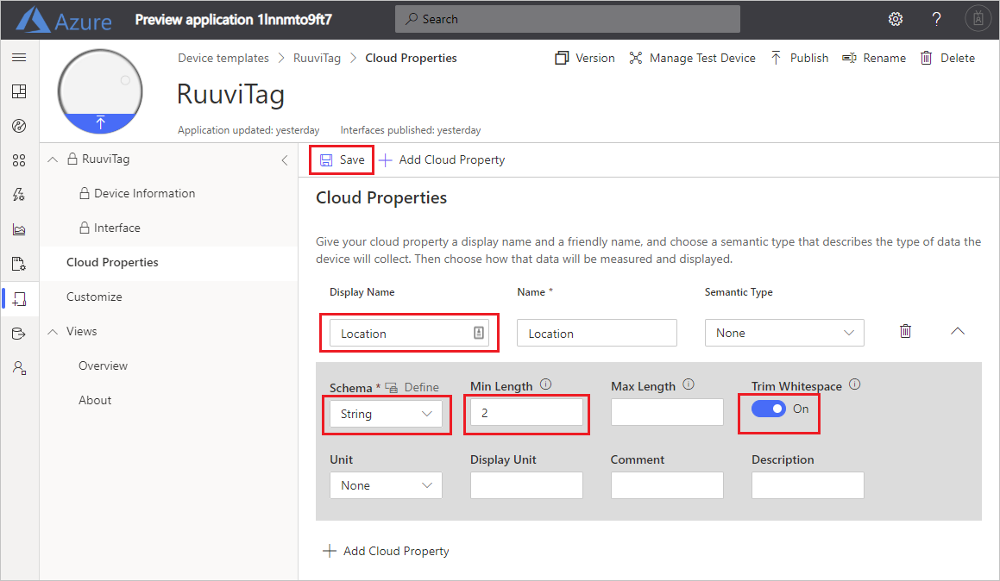

1. Select **Publish**. 

    Publishing a device template makes it visible to application operators. After you've published a template, use it to generate simulated devices for testing, or to connect real devices to your application. If you already have devices connected to your application, publishing a customized template pushes the changes to the devices.

## Add devices
After you have created and customized device templates, you can add devices to your application. The primary way to add devices is to connect real devices. As an alternative, use the device templates to generate simulated devices for testing. This section shows how to use your device templates to connect a Rigado gateway and RuuviTag sensors to the application.  It also shows how to generate a simulated gateway and sensors.

> [!NOTE]
> If you do not have real devices to use, follow the steps to create simulated devices and complete the tutorial.

To connect a Rigado C500 gateway and RuuviTag sensors, follow the steps in [Connect a Rigado Cascade 500 to your Azure IoT Central application](../howto-connect-rigado-cascade-500-pnp.md?toc=/azure/iot-central/retail/toc.json&bc=/azure/iot-central-pnp/breadcrumb/toc.json).

To create a simulated Rigado C500 gateway: 

1. Select **Devices** on the primary navigation. 

1. Select the **C500** gateway template on the secondary navigation.

1. Select **+ New** to create a simulated gateway based on the template.

   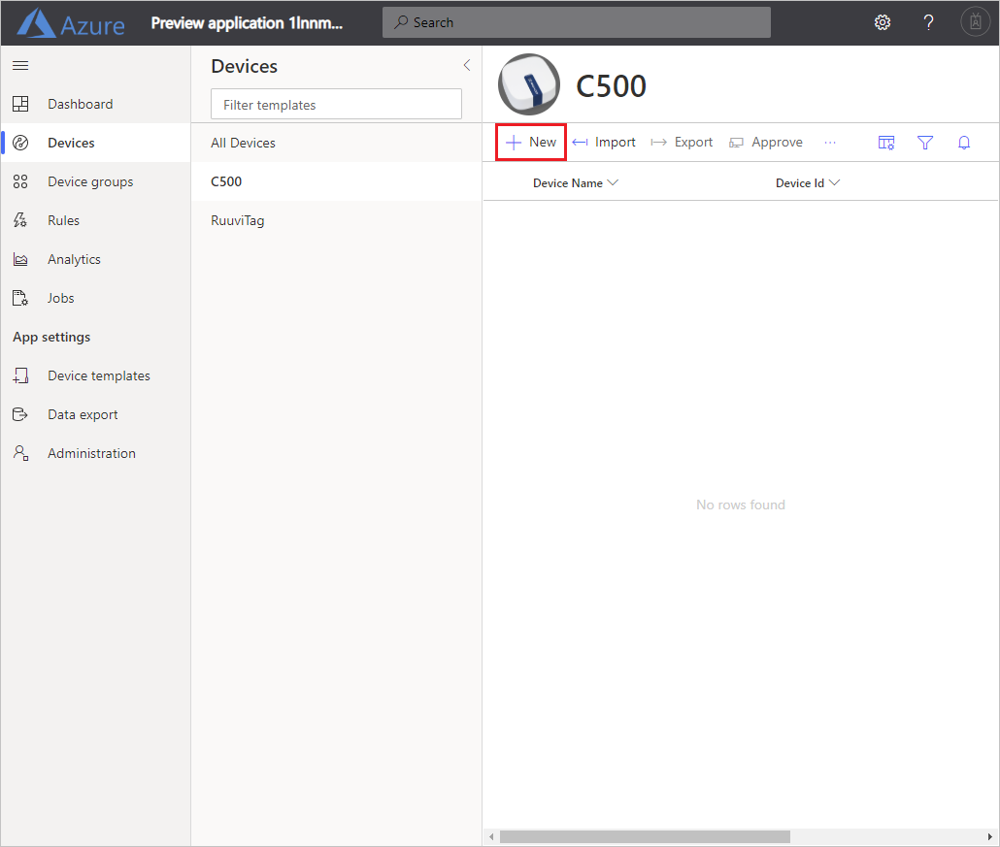

1. Enable the **Simulated** setting. Optionally, you can change the **Device Name** of the device to a more friendly or memorable name. 

   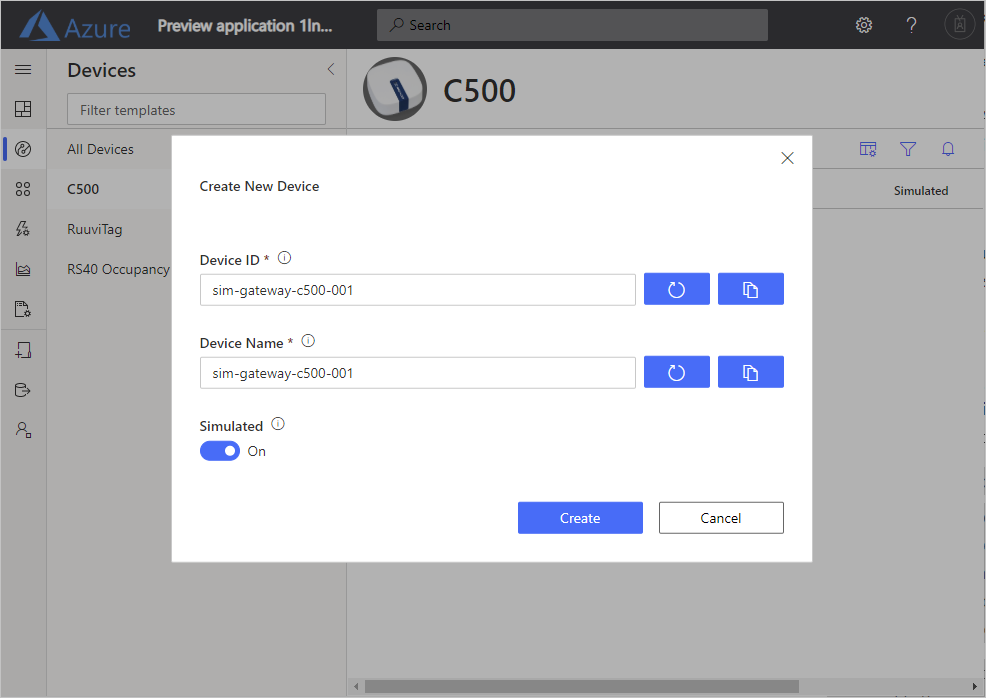

1. Select **Create**. This generates a simulated instance of the gateway device in your Azure IoT Central application.

To create a simulated RuuviTag sensor:

1. Select the **RuuviTag** sensor template on the secondary navigation.

1. Select **+ New** to create a simulated sensor based on the template.

1. Enable the **Simulated** setting.

1. Select **Create**.  

1. Repeat the preceding steps twice, to create two more simulated RuuviTag sensors. The resulting device list for the RuuviTag device template shows your list of simulated sensors. 

   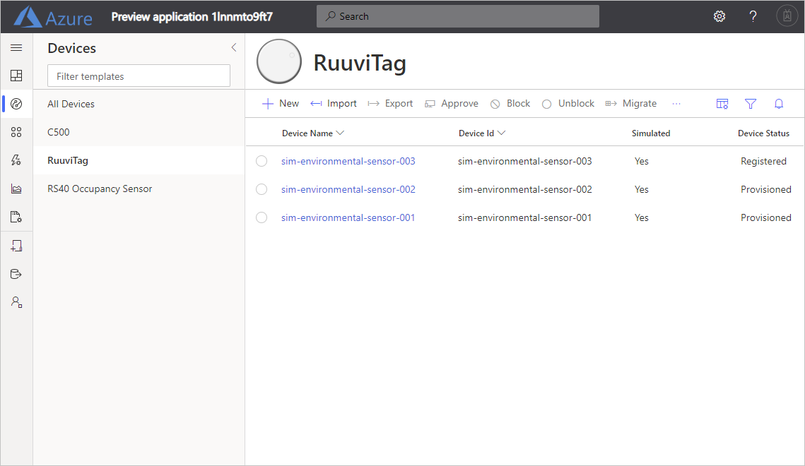

1. Select one of the real or simulated RuuviTag devices in your application whose device status is `Provisioned`. The **Overview** tab provides a view of the sensor telemetry.

   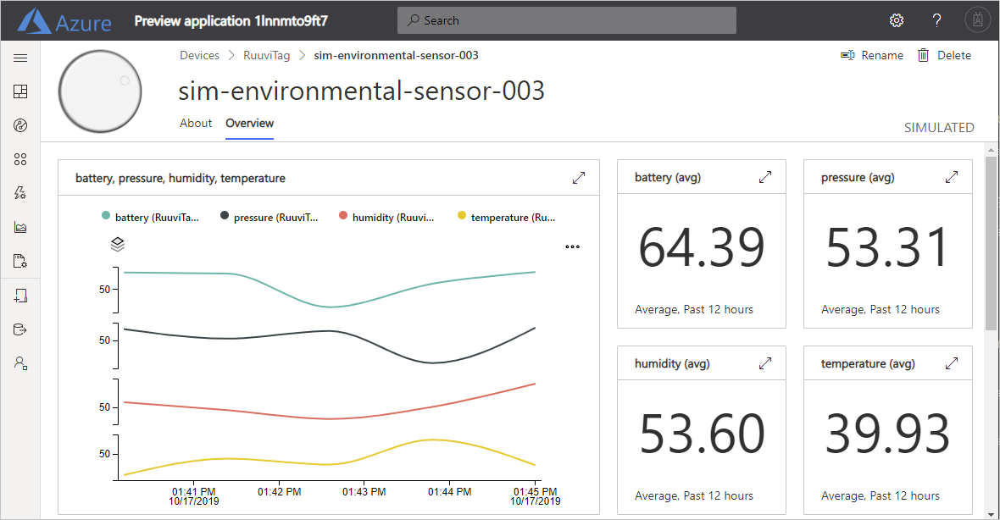

## Add rules and actions
As part of using sensors in your Azure IoT Central application to monitor conditions, you can create rules to run actions when certain conditions are met. A rule is associated with a device template and one or more devices, and contains conditions that must be met based on device telemetry or events. A rule also has one or more associated actions. The actions may include sending email notifications, or triggering a Microsoft Flow action or a webhook action to send data to other services. 

In this section you create a rule that checks the maximum relative humidity level based on the RuuviTag sensor telemetry. You add an action to the rule so that if the humidity exceeds the maximum, the application sends email. 

To create a rule: 

1. Expand the primary navigation.

1. Select **Rules** on the primary navigation.

1. Select **+ New Rule**. 

1. Choose **Telemetry**. This type of rule is based on the telemetry generated by your sensors. 

   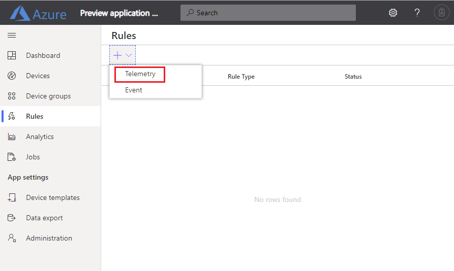

1. Enter *Humidity level* as the name of the rule. 

1. Choose the RuuviTag device template in **Scopes**. The rule you define will apply to all sensors based on that template. Optionally, you could create a filter that would apply the rule only to a defined subset of the sensors, such as sensors that have certain properties.

1. Choose `Relative humidity` as the **Measurement**. This is the device capability that you customized in a previous step.

1. Choose `Greater than` as the **Operator**. 

1. Enter a typical indoor humidity level such as *50* as the **Value**. You've defined a condition for your rule that occurs when relative humidity in any RuuviTag sensor exceeds 50 percent. You may need to adjust this value up or down depending on the normal humidity range in your environment.  

   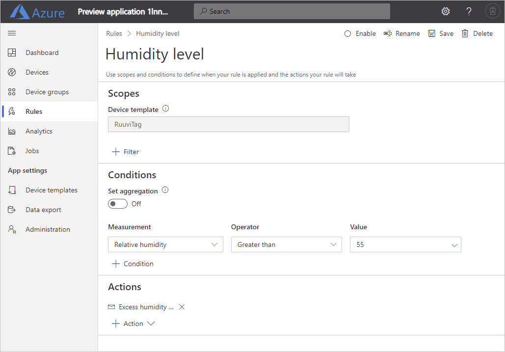

To add an action to a rule:

1. Select **+ Actions**. 

1. Choose **Email**. 

1. Enter *Excess humidity notification* as the friendly **Display name** for the action. 

1. Enter an email address in **To**. This email address must be for a user who has been added to the application and who has signed in and out of the application at least once.

1. Optionally, enter a note to include in text of the email.

   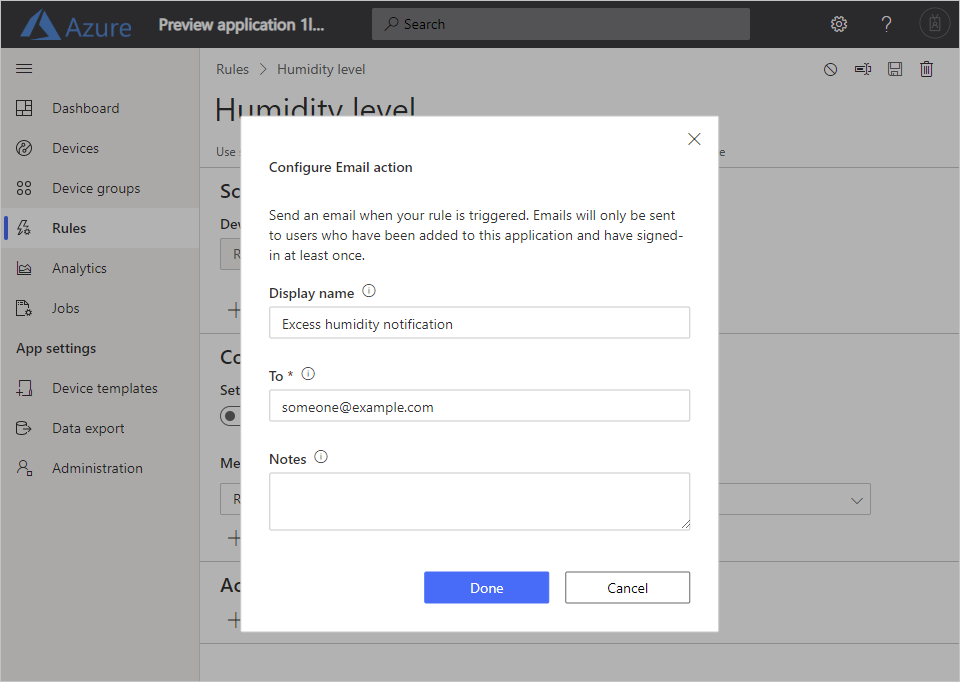

1. Select **Done** to complete the action.

1. Select **Save** to save and activate the new rule. 

   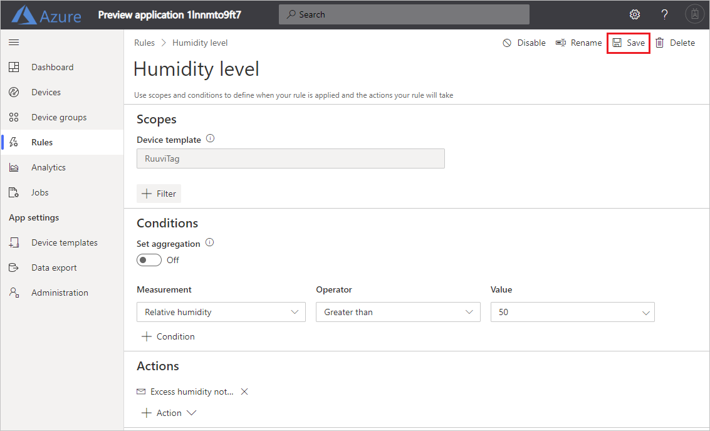

    Within a few minutes, the specified email account should begin to receive emails. The application sends email each time a sensor indicates that the humidity level exceeded the value in your condition.

## Next steps
In this tutorial, you learned how to:

* Use the Azure IoT Central **Store Analytics - Condition Monitoring** template to create a retail store application
* Customize the application settings
* Create and customize IoT device templates
* Connect real and simulated devices to your application
* Add rules and actions to monitor conditions

Now that you've created an Azure IoT Central condition monitoring application, here is the suggested next step:

> [!div class="nextstepaction"]
> [Customize the operator dashboard](tutorial-condition-monitor-customize-dashboard-pnp.md)