# Tutorial: Export data from Azure IoT Central and visualize insights in Power BI


In the two previous tutorials, you created and customized an IoT Central application using the **In-store analytics - checkout** application template. In this tutorial, you configure your IoT Central application to export telemetry collected from the devices. You then use Power BI to create a custom dashboard for the store manager to visualize the insights derived from the telemetry.

In this tutorial, you will learn how to:
> [!div class="checklist"]
> * Configure an IoT Central application to export telemetry to an event hub.
> * Use Logic Apps to send data from an event hub to a Power BI streaming dataset.
> * Create a Power BI dashboard to visualize data in the streaming dataset.

## Prerequisites

To complete this tutorial, you need:

* To complete the previous two tutorials, [Create an in-store analytics application in Azure IoT Central](./tutorial-in-store-analytics-create-app.md) and [Customize the operator dashboard and manage devices in Azure IoT Central](./tutorial-in-store-analytics-customize-dashboard.md).
* An Azure subscription. If you don't have an Azure subscription, create a [free account](https://azure.microsoft.com/free/?WT.mc_id=A261C142F) before you begin.
* A Power BI account. If you don't have a Power BI account, sign up for a [free Power BI Pro trial](https://app.powerbi.com/signupredirect?pbi_source=web) before you begin.

## Create a resource group

Before you create your event hub and logic app, you need to create a resource group to manage them. The resource group should be in the same location as your **In-store analytics - checkout** IoT Central application. To create a resource group:

1. Sign in to the [Azure portal](https://portal.azure.com).
1. In the left navigation, select **Resource groups**. Then select **Add**.
1. For **Subscription**, select the name of the Azure subscription you used to create your IoT Central application.
1. For the **Resource group** name, enter _retail-store-analysis_*.
1. For the **Region**, select the same region you chose for the IoT Central application.
1. Select **Review + Create**.
1. On the **Review + Create** page, select **Create**.

You now have a resource group called **retail-store-analysis** in your subscription.

## Create an event hub

Before you can configure the retail monitoring application to export telemetry, you need to create an event hub to receive the exported data. The following steps show you how to create your event hub:

1. In the Azure portal, select **Create a resource** at the top left of the screen.
1. In **Search the Marketplace**, enter _Event Hubs_, and then press **Enter**.
1. On the **Event Hubs** page, select **Create**.
1. On the **Create Namespace** page, take the following steps:
    * Enter a unique name for the namespace such as _yourname-retail-store-analysis_. The system checks to see if this name is available.
    * Choose the **Basic** pricing tier.
    * Select the same **Subscription** you used to create your IoT Central application.
    * Select the **retail-store-analysis** resource group.
    * Select the same location you used for your IoT Central application.
    * Select **Create**. You may have to wait a few minutes for the system to provision the resources.
1. In the portal, navigate to the **retail-store-analysis** resource group. Wait for the deployment to complete. You may need to select **Refresh** to update the deployment status. You can also check the status of the event hub namespace creation in the **Notifications**.
1. In the **retail-store-analysis** resource group, select the **Event Hubs Namespace**. You see the home page for your **Event Hubs Namespace** in the portal.

Now you have an **Event Hubs Namespace**, you can create an **Event Hub** to use with your IoT Central application:

1. On the home page for your **Event Hubs Namespace** in the portal, select **+ Event Hub**.
1. On the **Create Event Hub** page, enter _store-telemetry_ as the name, and then select **Create**.

You now have an event hub you can use when you configure data export from your IoT Central application:


## Configure data export

Now you have an event hub, you can configure your **In-store analytics - checkout** application to export telemetry from the connected devices. The following steps show you how to configure the export:

1. Sign in to your **In-store analytics - checkout** IoT Central application.
1. Select **Data export** in the left pane.
1. Select **New > Azure Event Hubs**.
1. Enter _Telemetry export_ as the **Display Name**.
1. Select your **Event Hubs namespace**.
1. Select the **store-telemetry** event hub.
1. Switch off **Devices** and **Device Templates** in the **Data to export** section.
1. Select **Save**.

The data export may take a few minutes to start sending telemetry to your event hub. You can see the status of the export on the **Data exports** page:

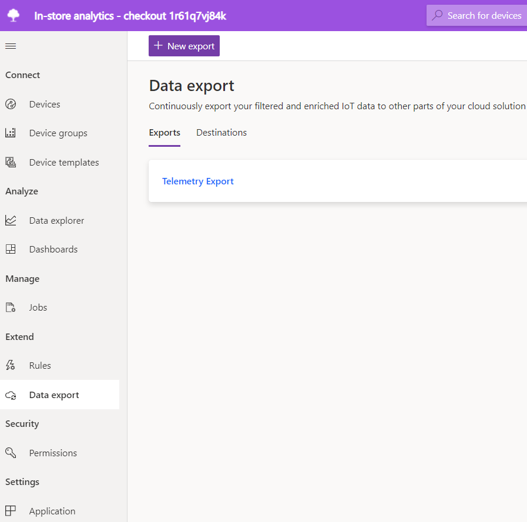

## Create the Power BI datasets

Your Power BI dashboard will display data from your retail monitoring application. In this solution, you use Power BI streaming datasets as the data source for the Power BI dashboard. In this section, you define the schema of the streaming datasets so that the logic app can forward data from the event hub. The following steps show you how to create two streaming datasets for the environmental sensors and one streaming dataset for the occupancy sensor:

1. Sign in to your **Power BI** account.
1. Select **Workspaces**, and then select **Create a workspace**.
1. On the **Create a workspace** page, enter _In-store analytics - checkout_ as the **Workspace name**.
1. Scroll to the bottom of the **Welcome to the In-store analytics - checkout workspace** page, and select **Skip**.
1. On the workspace page, select **Create > Streaming dataset**.
1. On the **New streaming dataset** page, choose **API**, and then select **Next**.
1. Enter _Zone 1 sensor_ as the **Dataset name**.
1. Enter the three **Values from stream** in following table:

    | Value name  | Value type |
    | ----------- | ---------- |
    | Timestamp   | DateTime   |
    | Humidity    | Number     |
    | Temperature | Number     |

1. Switch **Historic data analysis** on.
1. Select **Create** and then **Done**.
1. Create another streaming dataset called **Zone 2 sensor** with the same schema and settings as the **Zone 1 sensor** streaming dataset.

You now have two streaming datasets. The logic app will route telemetry from the two environmental sensors connected to your **In-store analytics - checkout** application to these two datasets:

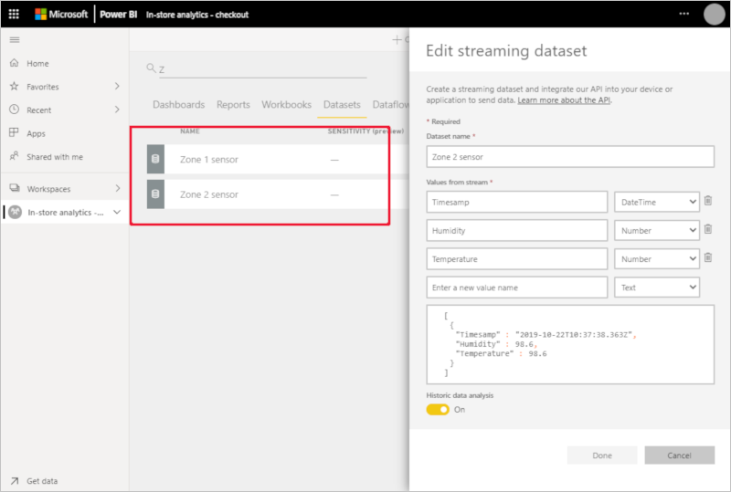

This solution uses one streaming dataset for each sensor because it's not possible to apply filters to streaming data in Power BI.

You also need a streaming dataset for the occupancy telemetry:

1. On the workspace page, select **Create > Streaming dataset**.
1. On the **New streaming dataset** page, choose **API**, and then select **Next**.
1. Enter _Occupancy sensor_ as the **Dataset name**.
1. Enter the five **Values from stream** in following table:

    | Value name     | Value type |
    | -------------- | ---------- |
    | Timestamp      | DateTime   |
    | Queue Length 1 | Number     |
    | Queue Length 2 | Number     |
    | Dwell Time 1   | Number     |
    | Dwell Time 2   | Number     |

1. Switch **Historic data analysis** on.
1. Select **Create** and then **Done**.

You now have a third streaming dataset that stores values from the simulated occupancy sensor. This sensor reports the queue length at the two checkouts in the store, and how long customers are waiting in these queues:


## Create a logic app

In this solution, the logic app reads telemetry from the event hub, parses the data, and then sends it to the Power BI streaming datasets you created.

Before you create the logic app, you need the device IDs of the two RuuviTag sensors you connected to your IoT Central application in the [Create an in-store analytics application in Azure IoT Central](./tutorial-in-store-analytics-create-app.md) tutorial:

1. Sign in to your **In-store analytics - checkout** IoT Central application.
1. Select **Devices** in the left pane. Then select **RuuviTag**.
1. Make a note of the **Device IDs**. In the following screenshot, the IDs are **f5dcf4ac32e8** and **e29ffc8d5326**:

    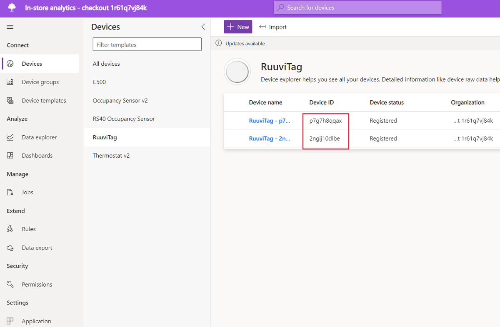

The following steps show you how to create the logic app in the Azure portal:

1. Sign in to the [Azure portal](https://portal.azure.com) and select **Create a resource** at the top left of the screen.
1. In **Search the Marketplace**, enter _Logic App_, and then press **Enter**.
1. On the **Logic App** page, select **Create**.
1. On the **Logic App** create page:
    * Enter a unique name for your logic app such as _yourname-retail-store-analysis_.
    * Select the same **Subscription** you used to create your IoT Central application.
    * Select the **retail-store-analysis** resource group.
    * Select the same location you used for your IoT Central application.
    * Select **Create**. You may have to wait a few minutes for the system to provision the resources.
1. In the Azure portal, navigate to your new logic app.
1. On the **Logic Apps Designer** page, scroll down and select **Blank Logic App**.
1. In **Search connectors and triggers**, enter _Event Hubs_.
1. In **Triggers**, select **When events are available in Event Hub**.
1. Enter _Store telemetry_ as the **Connection name**, and select your **Event Hubs Namespace**.
1. Select the **RootManageSharedAccess** policy, and select **Create**.
1. In the **When events are available in Event Hub** action:
    * In **Event Hub name**, select **store-telemetry**.
    * In **Content type**, select **application/json**.
    * Set the **Interval** to three and the **Frequency** to seconds
1. Select **Save** to save your logic app.

To add the logic to your logic app design, select **Code view**:

1. Replace `"actions": {},` with the following JSON. Replace the two placeholders `[YOUR RUUVITAG DEVICE ID 1]` and `[YOUR RUUVITAG DEVICE ID 2]` with the IDs you noted of your two RuuviTag devices:

    ```json
    "actions": {
        "Initialize_Device_ID_variable": {
            "inputs": {
                "variables": [
                    {
                        "name": "DeviceID",
                        "type": "String"
                    }
                ]
            },
            "runAfter": {},
            "type": "InitializeVariable"
        },
        "Initialize_Interface_ID_variable": {
            "inputs": {
                "variables": [
                    {
                        "name": "InterfaceID",
                        "type": "String",
                        "value": "Other"
                    }
                ]
            },
            "runAfter": {
                "Initialize_Device_ID_variable": [
                    "Succeeded"
                ]
            },
            "type": "InitializeVariable"
        },
        "Parse_Properties": {
            "inputs": {
                "content": "@triggerBody()?['Properties']",
                "schema": {
                    "properties": {
                        "iothub-connection-auth-generation-id": {
                            "type": "string"
                        },
                        "iothub-connection-auth-method": {
                            "type": "string"
                        },
                        "iothub-connection-device-id": {
                            "type": "string"
                        },
                        "iothub-enqueuedtime": {
                            "type": "string"
                        },
                        "iothub-interface-name": {
                            "type": "string"
                        },
                        "iothub-message-source": {
                            "type": "string"
                        },
                        "x-opt-enqueued-time": {
                            "type": "string"
                        },
                        "x-opt-offset": {
                            "type": "string"
                        },
                        "x-opt-sequence-number": {
                            "type": "integer"
                        }
                    },
                    "type": "object"
                }
            },
            "runAfter": {
                "Initialize_Interface_ID_variable": [
                    "Succeeded"
                ]
            },
            "type": "ParseJson"
        },
        "Parse_Telemetry": {
            "inputs": {
                "content": "@triggerBody()?['ContentData']",
                "schema": {
                    "properties": {
                        "DwellTime1": {
                            "type": "number"
                        },
                        "DwellTime2": {
                            "type": "number"
                        },
                        "count1": {
                            "type": "number"
                        },
                        "count2": {
                            "type": "number"
                        },
                        "humidity": {
                            "type": "number"
                        },
                        "temperature": {
                            "type": "number"
                        }
                    },
                    "type": "object"
                }
            },
            "runAfter": {
                "Initialize_Interface_ID_variable": [
                    "Succeeded"
                ]
            },
            "type": "ParseJson"
        },
        "Set_Device_ID_variable": {
            "inputs": {
                "name": "DeviceID",
                "value": "@body('Parse_Properties')?['iothub-connection-device-id']"
            },
            "runAfter": {
                "Parse_Properties": [
                    "Succeeded"
                ]
            },
            "type": "SetVariable"
        },
        "Set_Interface_ID_variable": {
            "inputs": {
                "name": "InterfaceID",
                "value": "@body('Parse_Properties')?['iothub-interface-name']"
            },
            "runAfter": {
                "Set_Device_ID_variable": [
                    "Succeeded"
                ]
            },
            "type": "SetVariable"
        },
        "Switch_by_DeviceID": {
            "cases": {
                "Occupancy": {
                    "actions": {
                        "Switch_by_InterfaceID": {
                            "cases": {
                                "Dwell_Time_interface": {
                                    "actions": {},
                                    "case": "RS40_Occupancy_Sensor_v2_1l0"
                                },
                                "People_Count_interface": {
                                    "actions": {},
                                    "case": "RS40_Occupancy_Sensor_iv"
                                }
                            },
                            "default": {
                                "actions": {}
                            },
                            "expression": "@variables('InterfaceID')",
                            "runAfter": {},
                            "type": "Switch"
                        }
                    },
                    "case": "Occupancy"
                },
                "Zone 2 environment": {
                    "actions": {},
                    "case": "[YOUR RUUVITAG DEVICE ID 2]"
                },
                "Zone_1_environment": {
                    "actions": {},
                    "case": "[YOUR RUUVITAG DEVICE ID 1]"
                }
            },
            "default": {
                "actions": {}
            },
            "expression": "@variables('DeviceID')",
            "runAfter": {
                "Parse_Telemetry": [
                    "Succeeded"
                ],
                "Set_Interface_ID_variable": [
                    "Succeeded"
                ]
            },
            "type": "Switch"
        }
    },
    ```

1. Select **Save** and then select **Designer** to see the visual version of the logic you added:

    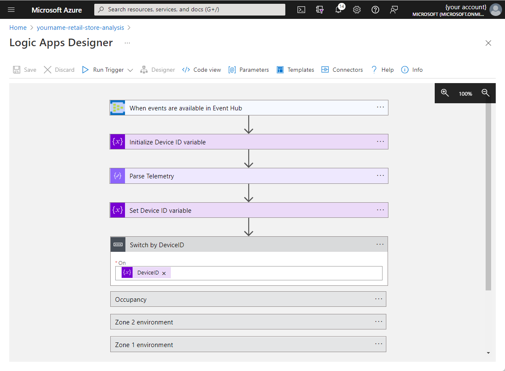

1. Select **Switch by DeviceID** to expand the action. Then select **Zone 1 environment**, and select **Add an action**.
1. In **Search connectors and actions**, enter **Power BI**, and then press **Enter**.
1. Select the **Add rows to a dataset (preview)** action.
1. Select **Sign in** and follow the prompts to sign in to your Power BI account.
1. After the sign-in process is complete, in the **Add rows to a dataset** action:
    * Select **In-store analytics - checkout** as the workspace.
    * Select **Zone 1 sensor** as the dataset.
    * Select **RealTimeData** as the table.
    * Select **Add new parameter** and then select the **Timestamp**, **Humidity**, and **Temperature** fields.
    * Select the **Timestamp** field, and then select **x-opt-enqueuedtime** from the **Dynamic content** list.
    * Select the **Humidity** field, and then select **See more** next to **Parse Telemetry**. Then select **humidity**.
    * Select the **Temperature** field, and then select **See more** next to **Parse Telemetry**. Then select **temperature**.
    * Select **Save** to save your changes. The **Zone 1 environment** action looks like the following screenshot:
    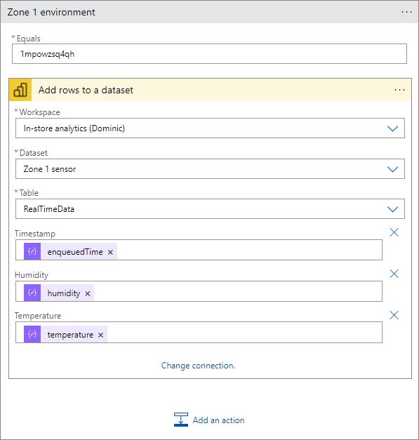
1. Select the **Zone 2 environment** action, and select **Add an action**.
1. In **Search connectors and actions**, enter **Power BI**, and then press **Enter**.
1. Select the **Add rows to a dataset (preview)** action.
1. In the **Add rows to a dataset 2** action:
    * Select **In-store analytics - checkout** as the workspace.
    * Select **Zone 2 sensor** as the dataset.
    * Select **RealTimeData** as the table.
    * Select **Add new parameter** and then select the **Timestamp**, **Humidity**, and **Temperature** fields.
    * Select the **Timestamp** field, and then select **x-opt-enqueuedtime** from the **Dynamic content** list.
    * Select the **Humidity** field, and then select **See more** next to **Parse Telemetry**. Then select **humidity**.
    * Select the **Temperature** field, and then select **See more** next to **Parse Telemetry**. Then select **temperature**.
    Select **Save** to save your changes.  The **Zone 2 environment** action looks like the following screenshot:
    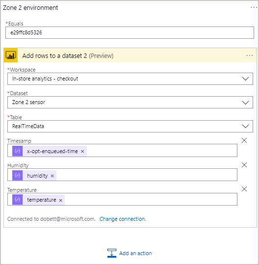
1. Select the **Occupancy** action, and then select the **Switch by Interface ID** action.
1. Select the **Dwell Time interface** action, and select **Add an action**.
1. In **Search connectors and actions**, enter **Power BI**, and then press **Enter**.
1. Select the **Add rows to a dataset (preview)** action.
1. In the **Add rows to a dataset** action:
    * Select **In-store analytics - checkout** as the workspace.
    * Select **Occupancy Sensor** as the dataset.
    * Select **RealTimeData** as the table.
    * Select **Add new parameter** and then select the **Timestamp**, **Dwell Time 1**, and **Dwell Time 2** fields.
    * Select the **Timestamp** field, and then select **x-opt-enqueuedtime** from the **Dynamic content** list.
    * Select the **Dwell Time 1** field, and then select **See more** next to **Parse Telemetry**. Then select **DwellTime1**.
    * Select the **Dwell Time 2** field, and then select **See more** next to **Parse Telemetry**. Then select **DwellTime2**.
    * Select **Save** to save your changes. The **Dwell Time interface** action looks like the following screenshot:
    
1. Select the **People Count interface** action, and select **Add an action**.
1. In **Search connectors and actions**, enter **Power BI**, and then press **Enter**.
1. Select the **Add rows to a dataset (preview)** action.
1. In the **Add rows to a dataset** action:
    * Select **In-store analytics - checkout** as the workspace.
    * Select **Occupancy Sensor** as the dataset.
    * Select **RealTimeData** as the table.
    * Select **Add new parameter** and then select the **Timestamp**, **Queue Length 1**, and **Queue Length 2** fields.
    * Select the **Timestamp** field, and then select **x-opt-enqueuedtime** from the **Dynamic content** list.
    * Select the **Queue Length 1** field, and then select **See more** next to **Parse Telemetry**. Then select **count1**.
    * Select the **Queue Length 2** field, and then select **See more** next to **Parse Telemetry**. Then select **count2**.
    * Select **Save** to save your changes. The **People Count interface** action looks like the following screenshot:
    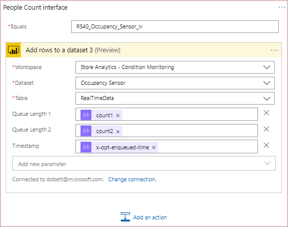

The logic app runs automatically. To see the status of each run, navigate to the **Overview** page for the logic app in the Azure portal:

## Create a Power BI dashboard

Now you have telemetry flowing from your IoT Central application through your event hub. Then your logic app parses the event hub messages and adds them to a Power BI streaming dataset. Now, you can create a Power BI dashboard to visualize the telemetry:

1. Sign in to your **Power BI** account.
1. Select **Workspaces > In-store analytics - checkout**.
1. Select **Create > Dashboard**.
1. Enter **Store analytics** as the dashboard name, and select **Create**.

### Add line charts

Add four line chart tiles to show the temperature and humidity from the two environmental sensors. Use the information in the following table to create the tiles. To add each tile, start by selecting **...(More options) > Add Tile**. Select **Custom Streaming Data**, and then select **Next**:

| Setting | Chart #1 | Chart #2 | Chart #3 | Chart #4 |
| ------- | -------- | -------- | -------- | -------- |
| Dataset | Zone 1 sensor | Zone 1 sensor | Zone 2 sensor | Zone 2 sensor |
| Visualization type | Line chart | Line chart | Line chart | Line chart |
| Axis | Timestamp | Timestamp | Timestamp | Timestamp |
| Values | Temperature | Humidity | Temperature | Humidity |
| Time window | 60 minutes | 60 minutes | 60 minutes | 60 minutes |
| Title | Temperature (1 hour) | Humidity (1 hour) | Temperature (1 hour) | Humidity (1 hour) |
| Subtitle | Zone 1 | Zone 1 | Zone 2 | Zone 2 |

The following screenshot shows the settings for the first chart:

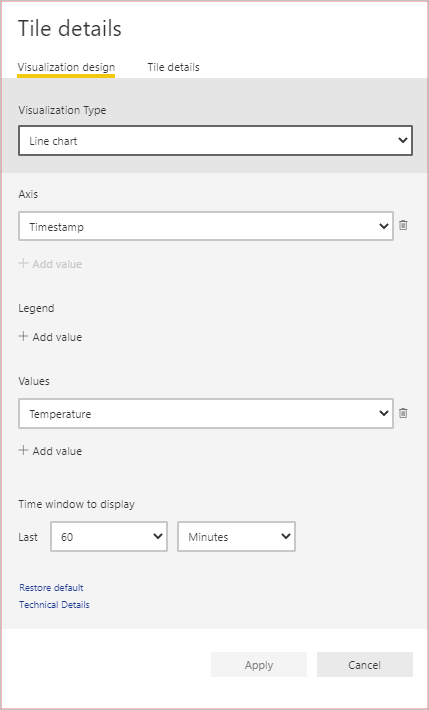

### Add cards to show environmental data

Add four card tiles to show the most recent temperature and humidity values from the two environmental sensors. Use the information in the following table to create the tiles. To add each tile, start by selecting **...(More options) > Add Tile**. Select **Custom Streaming Data**, and then select **Next**:

| Setting | Card #1 | Card #2 | Card #3 | Card #4 |
| ------- | ------- | ------- | ------- | ------- |
| Dataset | Zone 1 sensor | Zone 1 sensor | Zone 2 sensor | Zone 2 sensor |
| Visualization type | Card | Card | Card | Card |
| Fields | Temperature | Humidity | Temperature | Humidity |
| Title | Temperature (F) | Humidity (%) | Temperature (F) | Humidity (%) |
| Subtitle | Zone 1 | Zone 1 | Zone 2 | Zone 2 |

The following screenshot shows the settings for the first card:

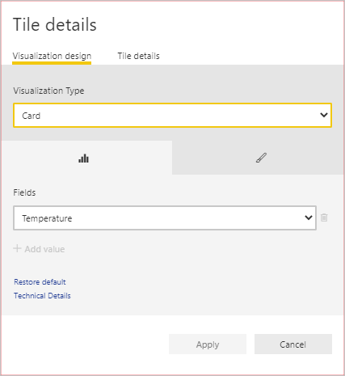

### Add tiles to show checkout occupancy data

Add four card tiles to show the queue length and dwell time for the two checkouts in the store. Use the information in the following table to create the tiles. To add each tile, start by selecting **...(More options) > Add Tile**. Select **Custom Streaming Data**, and then select **Next**:

| Setting | Card #1 | Card #2 | Card #3 | Card #4 |
| ------- | ------- | ------- | ------- | ------- |
| Dataset | Occupancy sensor | Occupancy sensor | Occupancy sensor | Occupancy sensor |
| Visualization type | Clustered column chart | Clustered column chart | Gauge | Gauge |
| Axis    | Timestamp | Timestamp | N/A | N/A |
| Value | Dwell Time 1 | Dwell Time 2 | Queue Length 1 | Queue Length 2 |
| Time window | 60 minutes | 60 minutes |  N/A | N/A |
| Title | Dwell Time | Dwell Time | Queue Length | Queue Length |
| Subtitle | Checkout 1 | Checkout 2 | Checkout 1 | Checkout 2 |

Resize and rearrange the tiles on your dashboard to look like the following screenshot:

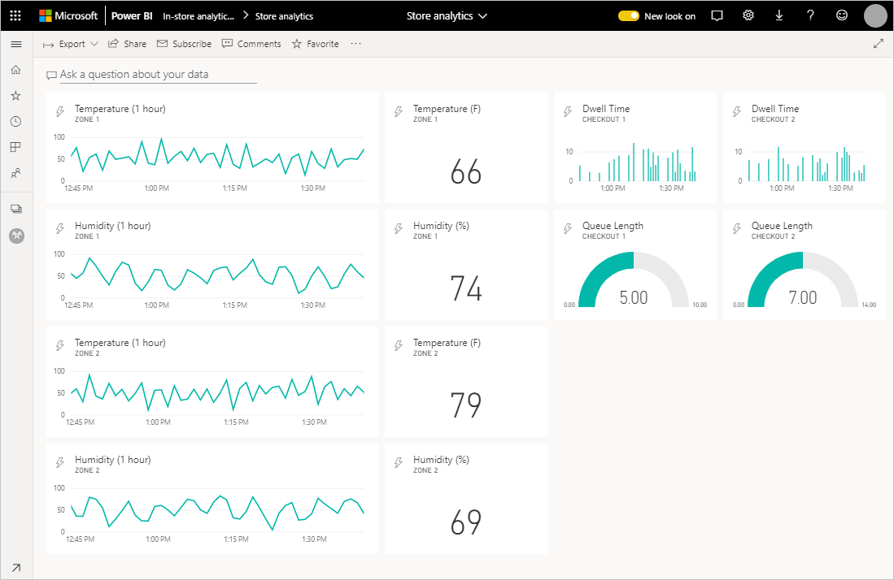

You could add some addition graphics resources to further customize the dashboard:

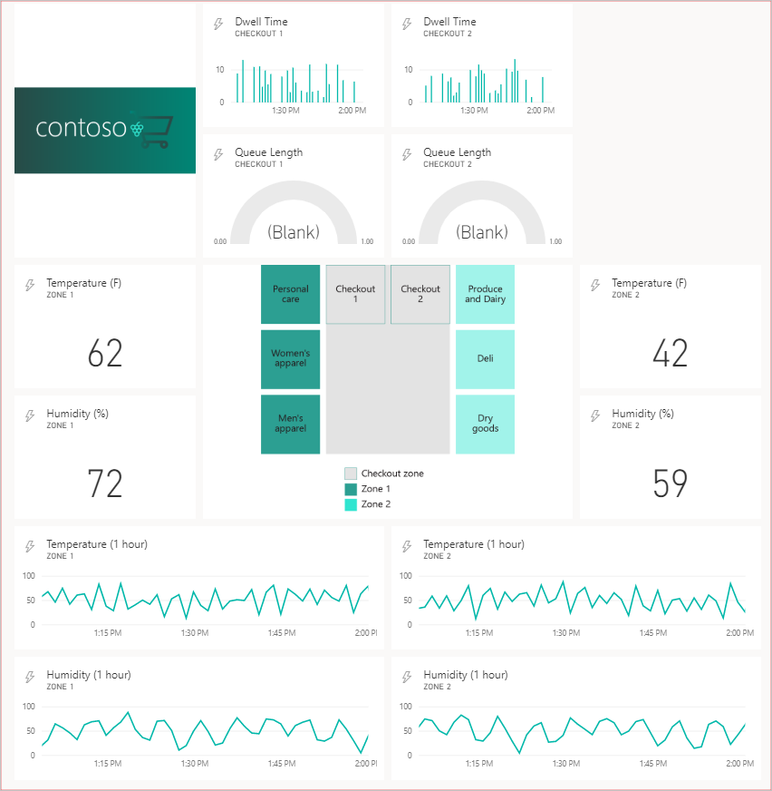

## Clean up resources

If you've finished with your IoT Central application, you can delete it by signing in to the application and navigating to the **Application Settings** page in the **Administration** section.

If you want to keep the application but reduce the costs associated with it, disable the data export that's sending telemetry to your event hub.

You can delete the event hub and logic app in the Azure portal by deleting the resource group called **retail-store-analysis**.

You can delete your Power BI datasets and dashboard by deleting the workspace from the Power BI settings page for the workspace.

## Next Steps

These three tutorials have shown you an end-to-end solution that uses the **In-store analytics - checkout** IoT Central application template. You've connected devices to the application, used IoT Central to monitor the devices, and used Power BI to build a dashboard to view insights from the device telemetry. A recommended next step is to explore one of the other IoT Central application templates:

> [!div class="nextstepaction"]
> * [Build energy solutions with IoT Central](../energy/overview-iot-central-energy.md)
> * [Build government solutions with IoT Central](../government/overview-iot-central-government.md)
> * [Build healthcare solutions with IoT Central](../healthcare/overview-iot-central-healthcare.md)
