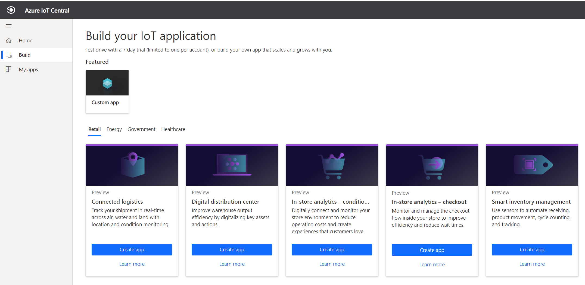
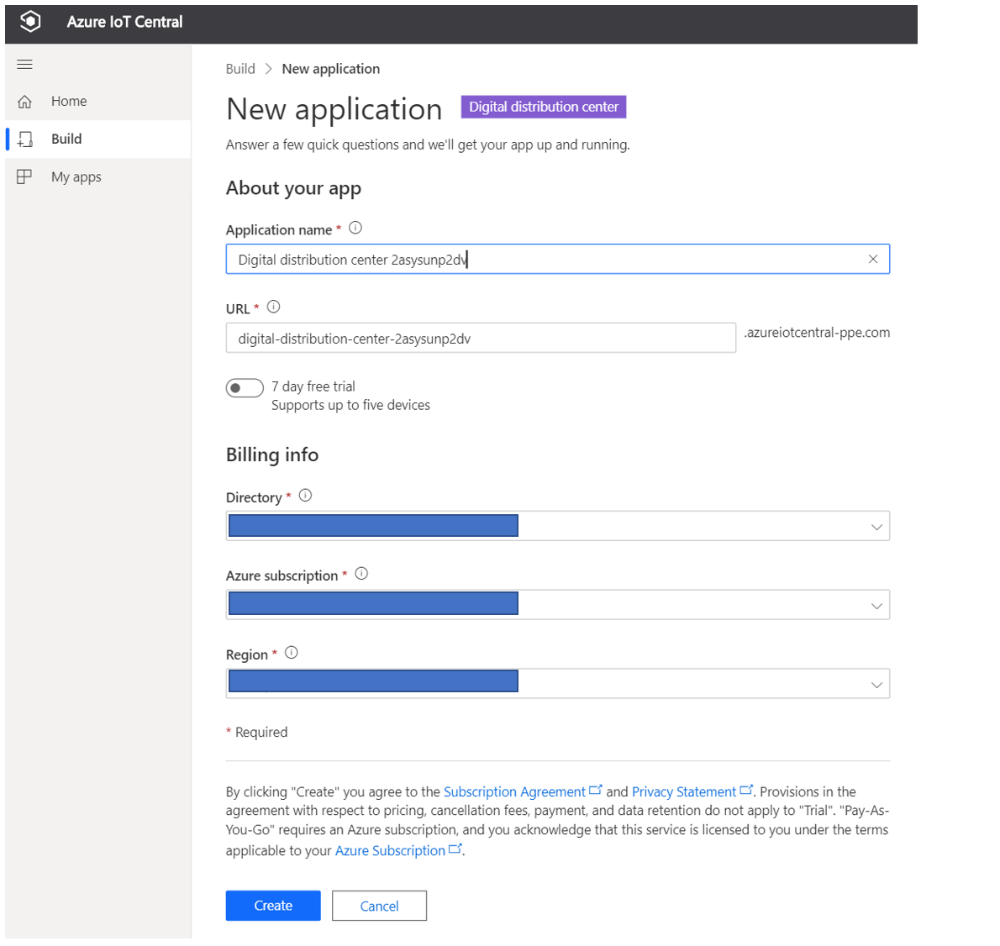
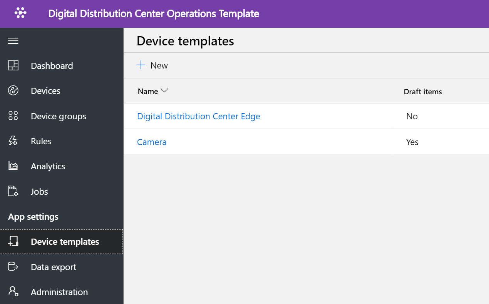
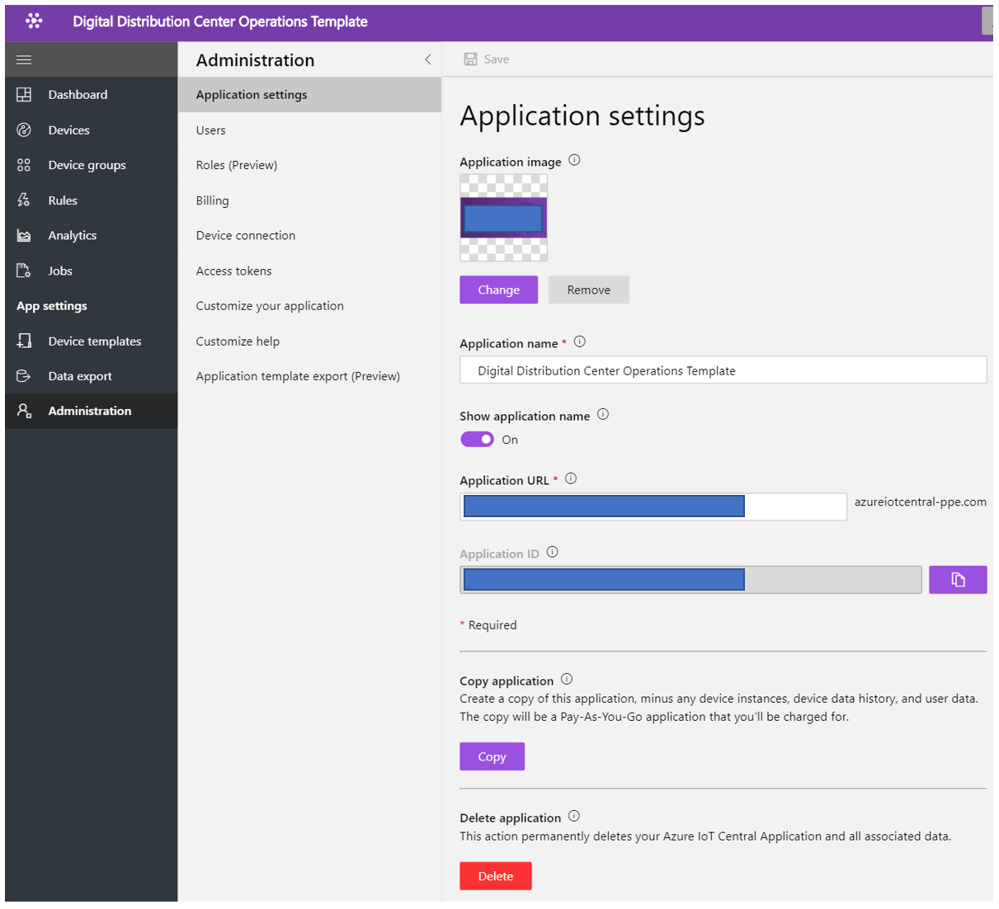

# Tutorial: Deploy and walkthrough a digital distribution center application template

This tutorial shows you how to get started by deploying an IoT Central digital distribution center application template. You will learn how to deploy the template, what is included out of the box, and what you might want to do next.

## Details

In this tutorial, you learn how to, 
• create digital distribution center application 
• walk through the application 

## Prerequisites

• No specific pre-requisites required to deploy this app
• Recommended to have Azure subscription, but you can even try without it

## Create digital distribution center application template

You can create application using following steps

1. Navigate to the Azure IoT Central application manager website. Select Build from the left-hand navigation bar and then click the **Retail** tab.

2. Select **Retail** tab and select **Create app** under **digital distribution center application **

3. **Create app** will open New application form and fill up the requested details as show below.
**Application name**: you can use default suggested name or enter your friendly application name.
**URL**: you can use the suggested default URL or enter your friendly unique, memorable URL. Next, the default setting is recommended if you already have an Azure Subscription. Else you can start with seven day free trial and choose to convert pay-as-you-go at any time before the free trail expiration.
**Billing Info**: The Directory, Azure Subscription, and Region details are required to provision the resources.
**Create**: Select create at the bottom of the page to deploy your application.

## Walk through the application dashboard 

After successfully deploying the app template, your default dashboard is a distribution center operator focused portal. Northwind Trader is a fictitious distribution center solution provider managing conveyor systems. 

In this dashboard, you will see one edge gateway and one camera acting as an IoT device. Gateway is providing telemetry about packages such as valid, invalid, unidentified, and size along with associated device twin properties. All downstream commands are executed at IoT devices, such as a camera. This dashboard is pre-configured to showcase the critical distribution center device operations activity.

< New section about for Azure IoT Edge simulation here. > 

The dashboard is logically organized to show the device management capabilities of the Azure IoT Edge gateway and IoT device.  
* You can perform edge gateway command & control tasks
* Manage all cameras that are part of the solution. 

## Device Template

Click on the **Device templates** tab, and you will see the distinct device templates for Azure IoT Edge & camera. 

Azure IoT Edge gateway device template represents a blueprint that defines the characteristics and behavior of an edge gateway device. Some of the components of an edge device are,
* Deployment manifest
* Relationship with downstream devices
* Software modules
* Modules properties & commands 

Deployment manifest has the list of software modules that will run on the Azure IoT Edge device & module twins configured with their desired properties. Using deployment manifest that is part of the device template, Azure IoT Edge run time knows which modules to install and how to configure them to work together.

In this device template here, you can see module device capability models are generated from deployment manifest. 

Here you can add downstream device relations, cloud property, create views along customize module and device capabilities.

Click on the **Device** tab and choose the **ddcgateway** device that is associated with Digital Distribution Center Azure IoT Edge. Here you will see the custom edge modules & downstream camera that is part device relationship. IoT Edge modules are the smallest computation unit, and it can contain Azure services (such as Azure Stream Analytics, AI modules) or your solution-specific code.

## Gateway Commands
This interface organizes all the gateway command capabilities

## Rules
Select the rules tab to see two different rules that exist in this application template. These rules are configured to email notifications to the operators for further investigations.
 ** Too many invalid packages alert **: This rule is triggered when the camera detects a high number of invalid packages flowing through the conveyor system.
 
** Very large package **: This rule will trigger if the camera detects huge package that cannot be inspected for the quality. 

## Jobs
Select the jobs tab to see three different jobs that exist as part of this application template:
You can leverage jobs feature to perform solution-wide operations such as modifying the telemetry interval using twin capability.
 
The next set of jobs enables you to perform system-wide operations such as updating the camera firmware or modifying the telemetry interval on the gateways.

## Cleanup resources
If you're not going to continue to use this application, delete the application template by visiting Administration > Application settings and click Delete.

