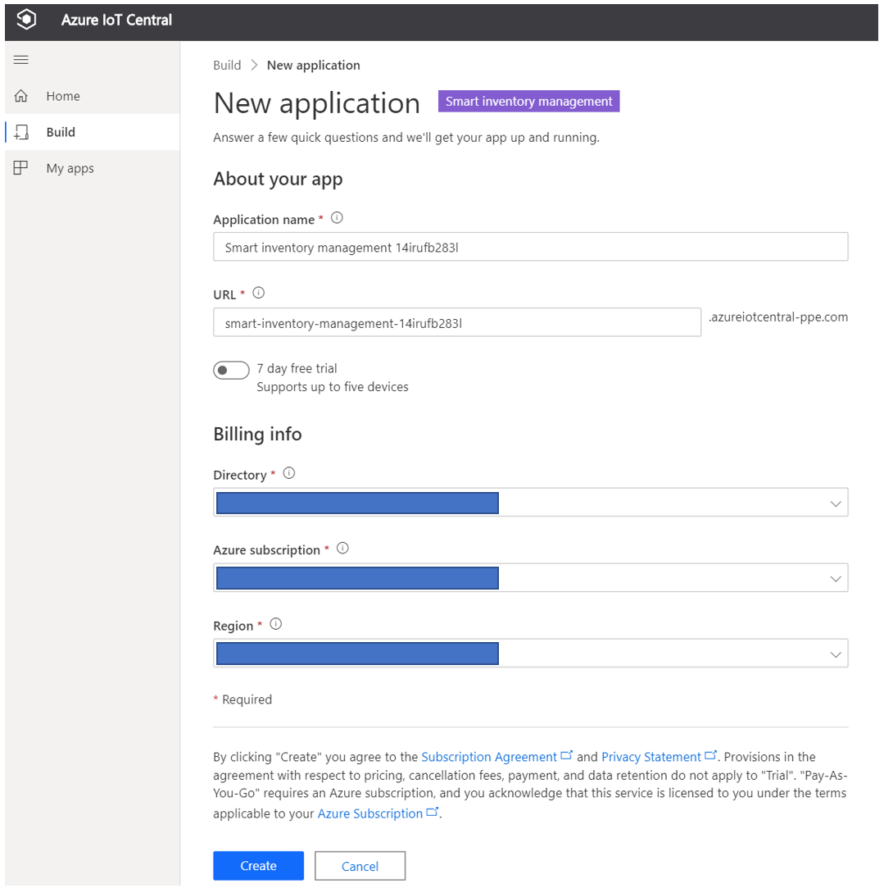
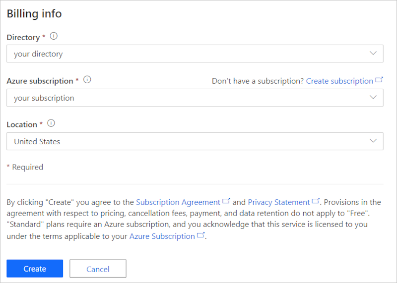
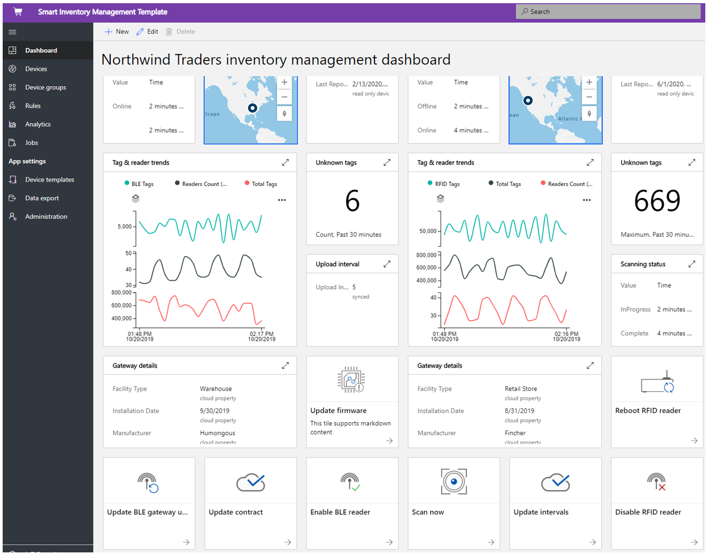
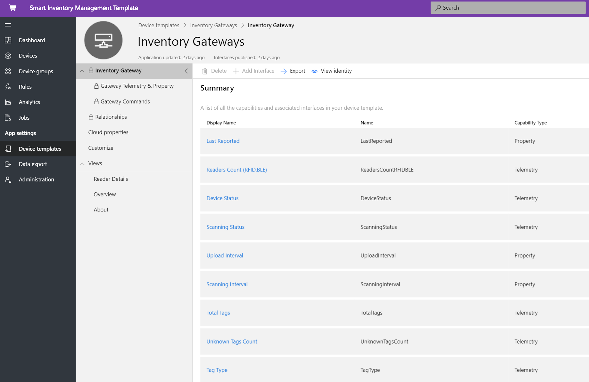
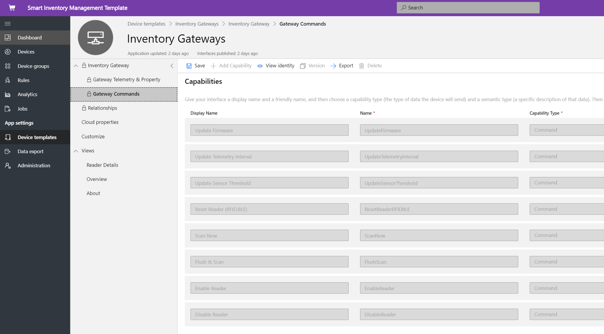
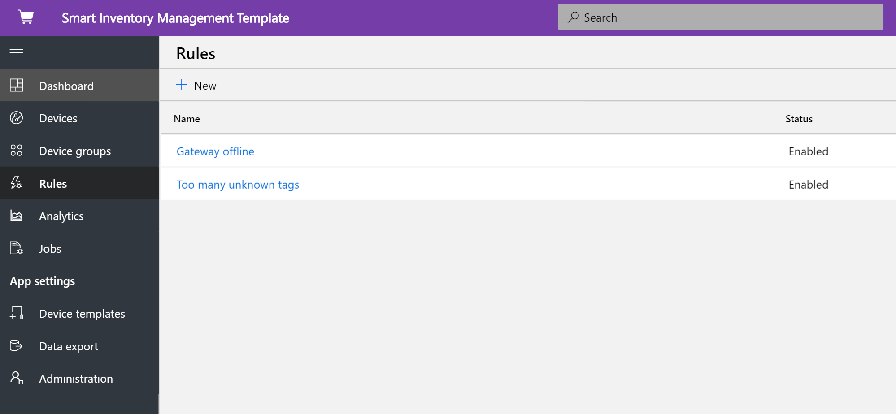
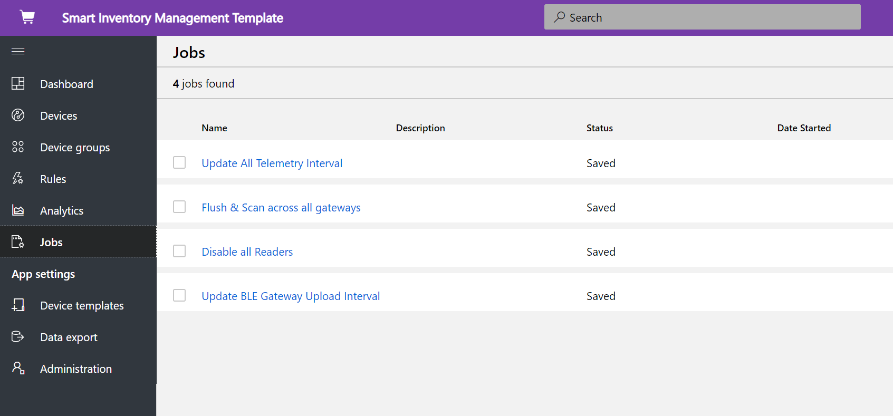
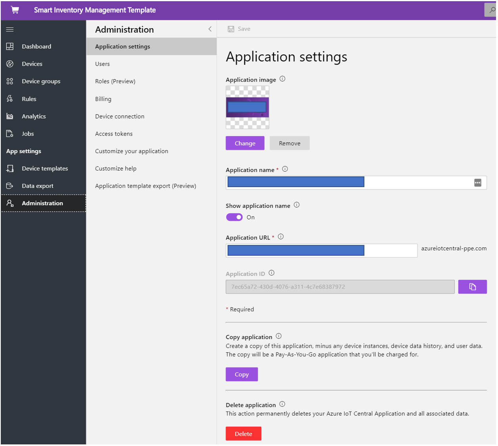

# Tutorial: Deploy and walk through a smart inventory management application template

This tutorial shows you how to get started by deploying an IoT Central **smart inventory management** application template. You will learn how to deploy the template, what is included out of the box, and what you might want to do next.

In this tutorial, you learn how to, 
* create smart inventory management application 
* walk through the application 

## Prerequisites

* No specific pre-requisites required to deploy this app
* Recommended to have Azure subscription, but you can even try without it

## Create smart inventory management application template

You can create application using following steps

1. Navigate to the Azure IoT Central application manager website. Select **Build** from the left-hand navigation bar and then click the **Retail** tab.

    > [!div class="mx-imgBorder"]
    > 

2. Select **Retail** tab and select **Create app** under **smart inventory management**

3. **Create app** will open New application form and fill up the requested details as show below.
   **Application name**: you can use default suggested name or enter your friendly application name.
   **URL**: you can use suggested default URL or enter your friendly unique memorable URL. Next, the default setting is recommended if you already have an Azure Subscription. You can start with 7-day free trial pricing plan and choose to convert to a standard pricing plan at any time before the free trail expires.
   **Billing Info**: The Directory, Azure Subscription, and Region details are required to provision the resources.
   **Create**: Select create at the bottom of the page to deploy your application.

    > [!div class="mx-imgBorder"]
    > 

    > [!div class="mx-imgBorder"]
    > 

## Walk through the application 

### Dashboard 

After successfully deploying the app template, your default dashboard is a smart inventory management operator focused portal. Northwind Trader is a fictitious smart inventory provider managing warehouse with Bluetooth low energy (BLE) and retail store with Radio-frequency identification (RFID). In this dashboard, you will see two different gateways providing telemetry about inventory along with associated commands, jobs, and actions that you can perform. 
This dashboard is pre-configured to showcase the critical smart inventory management device operations activity.
The dashboard is logically divided between two different gateway device management operations, 
   * The warehouse is deployed with a fixed BLE gateway & BLE tags on pallets to track & trace inventory at a larger facility
   * Retail store is implemented with a fixed RFID gateway & RFID tags at individual an item level to track and trace the stock in a store outlet
   * View the gateway location, status & related details 

> [!div class="mx-imgBorder"]
> 

   * You can easily track the total number of gateways, active, and unknown tags.
   * You can perform device management operations such as update firmware, disable sensor, enable sensor, update sensor threshold, update telemetry intervals & update device service contracts
   * Gateway devices can perform on-demand inventory management with a complete or incremental scan.

> [!div class="mx-imgBorder"]
> 

## Device Template
Click on the Device templates tab, and you will see the gateway capability model. A capability model is structured around two different interfaces **Gateway Telemetry & Property** and **Gateway Commands**

**Gateway Telemetry & Property** - This interface represents all the telemetry related to sensors, location, device info, and device twin property capability such as gateway thresholds and update intervals.

> [!div class="mx-imgBorder"]
> 

**Gateway Commands** - This interface organizes all the gateway command capabilities

> [!div class="mx-imgBorder"]
> 

## Rules
Select the rules tab to see two different rules that exist in this application template. These rules are configured to email notifications to the operators for further investigations.

**Gateway offline**: This rule will trigger if the gateway doesn't report to the cloud for a prolonged period. Gateway could be unresponsive because of low battery mode, loss of connectivity, device health.

**Unknown tags**: It's critical to track every RFID & BLE tags associated with an asset. If the gateway is detecting too many unknown tags, it's an indication of synchronization challenges with tag sourcing applications.

> [!div class="mx-imgBorder"]
> 

## Jobs
Select the jobs tab to see five different jobs that exist as part of this application template:
You can use jobs feature to perform solution-wide operations. Here inventory management jobs are using the device commands and twin capability to perform tasks such as,
   * disabling readers across all the gateway
   * modifying the telemetry threshold between 
   * perform on-demand inventory scanning across the entire solution.

> [!div class="mx-imgBorder"]
> 

## Clean up resources

If you're not going to continue to use this application, delete the application template by visiting **Administration** > **Application settings** and click **Delete**.

> [!div class="mx-imgBorder"]
> 

## Next steps
* Learn more about smart inventory management [smart inventory management concept](./architecture-smart-inventory-management.md)
* Learn more about other [IoT Central retail templates](./overview-iot-central-retail.md)
* Learn more about IoT Central refer to [IoT Central overview](../core/overview-iot-central.md)
