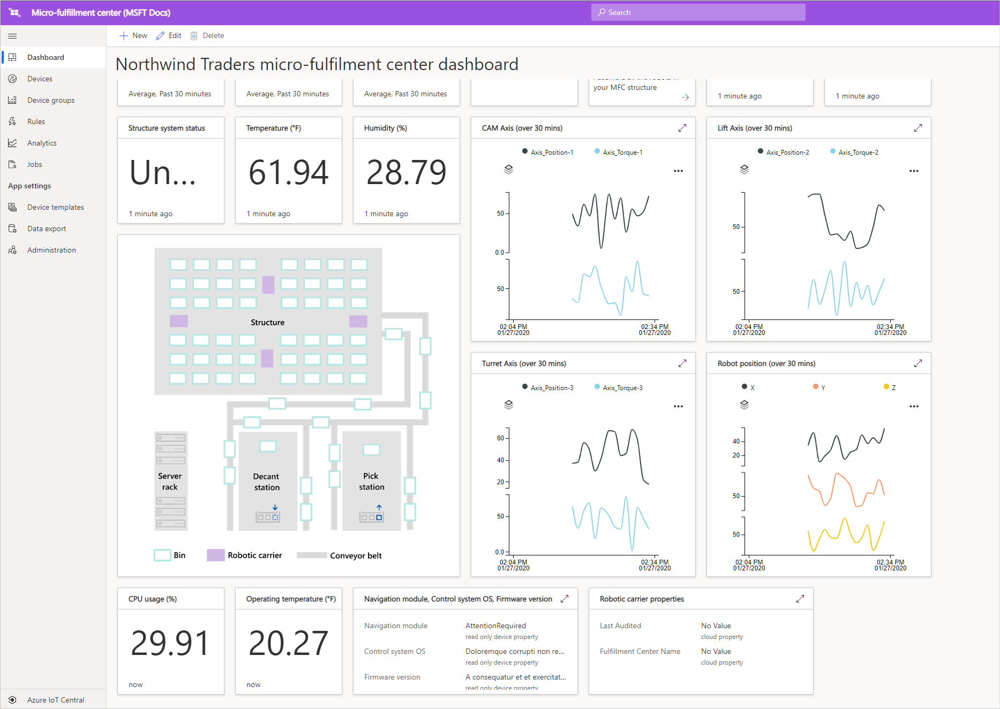

# Tutorial: Deploy and walk through a micro-fulfillment center application template

[!INCLUDE [iot-central-pnp-original](../../../includes/iot-central-pnp-original-note.md)]

In this tutorial, we will leverage the Azure IoT Central ***Micro-fulfillment center*** application template to show you how to build a retail solution. You will learn about how to deploy the MFC template, what is included out of the box and what you might want to do next.

In this tutorial, you learn how to: 
> [!div class="checklist"]
> * Use the Azure IoT Central **Micro-fulfillment center** template to create a retail application
> * Walk through of the application 

## Prerequisites
To complete this tutorial series, you need:
* An Azure subscription. You can optionally use a free 7-day trial. If you don't have an Azure subscription, you can create one on the [Azure sign-up page](https://aka.ms/createazuresubscription).

## Create an application 
In this section, you create a new Azure IoT Central application from a template. You'll use this application throughout the tutorial series to build a complete solution.

To create a new Azure IoT Central application:

1. Navigate to the [Azure IoT Central application manager](https://aka.ms/iotcentral) website.
1. If you have an Azure subscription, sign in with the credentials you use to access it, otherwise sign in using a Microsoft account:

   

1. To start creating a new Azure IoT Central application, select **New Application**.

1. Select **Retail**.  The retail page displays several retail application templates.

To create a new micro-fulfillment center application that uses preview features:  
1. Select the **Micro-fulfillment center** application template. This template includes device templates for all devices used in the tutorial. The template also provides an operator dashboard for monitoring conditions within your fulfillment center as well as the conditions for your robotic carriers. 

    > [!div class="mx-imgBorder"]
    > 
    
1. Optionally, choose a friendly **Application name**.  The application template is based on the fictional company Northwind Traders. 

    > [!NOTE]
    > If you use a friendly **Application name**, you still must use a unique value for the application **URL**.

1. If you have an Azure subscription, enter your *Directory, Azure subscription, and Region*. If you don't have a subscription, you can enable **7-day free trial** and complete the required contact information.  

    For more information about directories and subscriptions, see the [create an application quickstart](../preview/quick-deploy-iot-central.md).

1. Select **Create**.

> [!div class="mx-imgBorder"]
> 

## Walk through the application 

### Dashboard 

After successfully deploying the app template, you will first land on the **Northwind Traders micro-fulfillment center dashboard**. Northwind Trader's is a fictitious retailer that has a micro-fulfillment center being managed in this IoT Central application. On this operator dashboard, you will see information and telemetry about the devices in this template along with a set of commands, jobs, and actions that you can take. The dashboard is logically split into two sections (left and right). On the left, you have the ability to monitor the environmental conditions within the fulfillment structure and on the right, you can monitor the health of a robotic carrier within the facility.  

From the dashboard you can:
   * See device telemetry such as # of picks, # of orders processed, and properties such as the structure system status, etc.  
   * View the **floor plan** and location of the robotic carriers within the fulfillment structure.
   * Trigger commands such as resetting the control system, updating carrier's firmware, reconfiguring the network, etc.

> [!div class="mx-imgBorder"]
> 
   * See an example of the dashboard that an operator can leverage to monitor the conditions within the fulfillment center. 
   * Monitor the health of the payloads running on the gateway device within the fulfillment center.    

> [!div class="mx-imgBorder"]
> 

## Device Template
If you click on the Device templates tab, you will see that there are two different device types that are part of the template: 
   * **Robotic Carrier**: This device template represents the definition for a functioning robotic carrier that has been deployed in the fulfillment structure and is performing appropriate storage and retrieval operations. If you click on the template, you'll see that the robot is sending device data such as temperature, axis position and properties like robotic carrier status, etc. 
   * **Structure Condition Monitoring**: This device template represents a device collection that allows you to monitor environment condition as well as the gateway device hosting various edge workloads to power your fulfillment center. The device sends telemetry data such as the temperature, # of picks, # of orders, etc. in addition to state and health of the compute workloads running in your environment. 

> [!div class="mx-imgBorder"]
> 

If you click on the Device groups tab you will also see that these device templates automatically have device groups created for them.

## Rules
When jumping to the rules tab, you will see a sample rule that exists in the application template to monitor the temperature conditions for the robotic carrier. You could use this rule to alert the operator if a specific robot in the facility is overheating and needs to be taken offline for servicing. 

Please leverage the sample rule as inspiration to define rules that are more appropriate for your business functions.

   - **Robotic carrier too warm**: This rule will trigger if the robotic carrier reaches a temperature threshold over a period of time. 

> [!div class="mx-imgBorder"]
> 

## Clean up resources

If you're not going to continue to use this application, delete the application template by visiting **Administration** > **Application settings** and click **Delete**.

> [!div class="mx-imgBorder"]
> 

## Next steps
* Learn more about the [micro-fulfillment center solution architecture](./architecture-micro-fulfillment-center-pnp.md)
* Learn more about other [IoT Central retail templates](./overview-iot-central-retail-pnp.md)
* Learn more about IoT Central refer to [IoT Central overview](../preview/overview-iot-central.md)