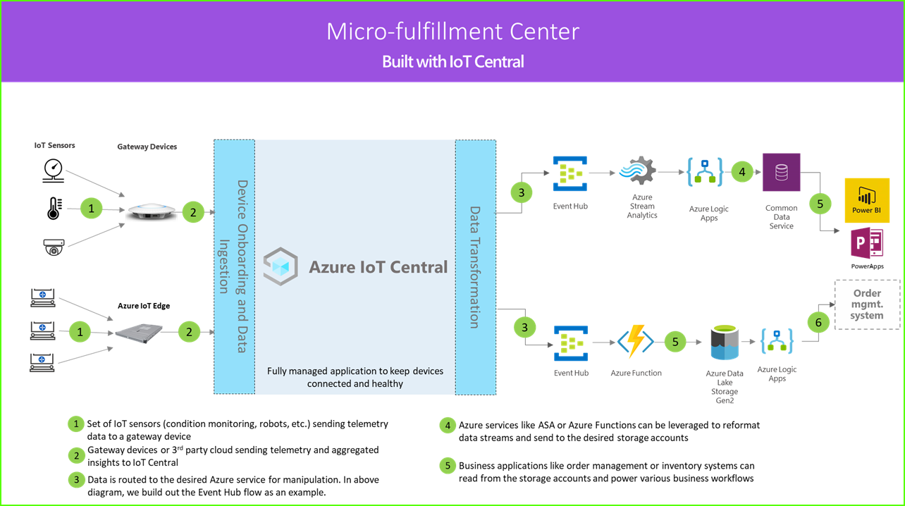

# Tutorial: Deploy and walk through the micro-fulfillment center application template

Use the IoT Central *micro-fulfillment center* application template and the guidance in this article to develop an end-to-end micro-fulfillment center solution.

1. Set of IoT sensors sending telemetry data to a gateway device
2. Gateway devices sending telemetry and aggregated insights to IoT Central
3. Continuous data export to the desired Azure service for manipulation
4. Data can be structured in the desired format and sent to a storage service
5. Business applications can query data and generate insights that power retail operations

### Robotic carriers

A micro-fulfillment center solution will likely have a large set of robotic carriers generating different kinds of telemetry signals. These signals can be ingested by a gateway device, aggregated, and then sent to IoT Central as reflected by the left side of the architecture diagram.  

### Condition monitoring sensors

An IoT solution starts with a set of sensors capturing meaningful signals from within your fulfillment center. It's reflected by different kinds of sensors on the far left of the architecture diagram above.

### Gateway devices

Many IoT sensors can feed raw signals directly to the cloud or to a gateway device located near them. The gateway device performs data aggregation at the edge before sending summary insights to an IoT Central application. The gateway devices are also responsible for relaying command and control operations to the sensor devices when applicable. 

### IoT Central application

The Azure IoT Central application ingests data from different kinds of IoT sensors, robots, as well gateway devices within the fulfillment center environment and generates a set of meaningful insights.

Azure IoT Central also provides a tailored experience to the store operator enabling them to remotely monitor and manage the infrastructure devices.

### Data transform

The Azure IoT Central application within a solution can be configured to export raw or aggregated insights to a set of Azure PaaS (Platform-as-a-Service) services that can perform data manipulation and enrich these insights before landing them in a business application. 

### Business application

The IoT data can be used to power different kinds of business applications deployed within a retail environment. A fulfillment center manager or employee can use these applications to visualize business insights and take meaningful actions in real time. To learn how to build a real-time Power BI dashboard for your retail team, follow the [tutorial](./tutorial-in-store-analytics-create-app.md).

In this tutorial, you learn:

> [!div class="checklist"]

> * How to deploy the application template
> * How to use the application template

## Prerequisites

* There are no specific prerequisites required to deploy this app.
* You can use the free pricing plan or use an Azure subscription.

## Create micro-fulfillment application

Create the application using following steps:

1. Navigate to the [Azure IoT Central Build](https://aka.ms/iotcentral) site. Then sign in with a Microsoft personal, work, or school account. Select **Build** from the left-hand navigation bar and then select the **Retail** tab:

   :::image type="content" source="media/tutorial-micro-fulfillment-center-app/iotc-retail-homepage-mfc.png" alt-text="Screenshot showing how to create an app.":::

1. Select **Create app** under **micro-fulfillment center**.

## Walk through the application 

The following sections walk you through the key features of the application:

After successfully deploying the app template, you see the **Northwind Traders micro-fulfillment center dashboard**. Northwind Traders is a fictitious retailer that has a micro-fulfillment center being managed in this Azure IoT Central application. On this dashboard, you see information and telemetry about the devices in this template, along with a set of commands, jobs, and actions that you can take. The dashboard is logically split into two sections. On the left, you can monitor the environmental conditions within the fulfillment structure, and on the right, you can monitor the health of a robotic carrier within the facility.  

From the dashboard, you can:
   * See device telemetry, such as the number of picks, the number of orders processed, and properties, such as the structure system status.  
   * View the floor plan and location of the robotic carriers within the fulfillment structure.
   * Trigger commands, such as resetting the control system, updating the carrier's firmware, and reconfiguring the network.

  :::image type="content" source="media/tutorial-micro-fulfillment-center-app/mfc-dashboard-1.png" alt-text="Screenshot of the top half of the Northwind Traders micro-fulfillment center dashboard.":::
   * See an example of the dashboard that an operator can use to monitor conditions within the fulfillment center.
   * Monitor the health of the payloads that are running on the gateway device within the fulfillment center.

  :::image type="content" source="media/tutorial-micro-fulfillment-center-app/mfc-dashboard-2.png" alt-text="Screenshot of the botton half of the Northwind Traders micro-fulfillment center dashboard.":::

### Device template

If you select the device templates tab, you see that there are two different device types that are part of the template: 
   * **Robotic Carrier**: This device template represents the definition for a functioning robotic carrier that has been deployed in the fulfillment structure, and is performing appropriate storage and retrieval operations. If you select the template, you see that the robot is sending device data, such as temperature and axis position, and properties like the robotic carrier status. 
   * **Structure Condition Monitoring**: This device template represents a device collection that allows you to monitor environment condition, as well as the gateway device hosting various edge workloads to power your fulfillment center. The device sends telemetry data, such as the temperature, the number of picks, and the number of orders. It also sends information about the state and health of the compute workloads running in your environment. 

  :::image type="content" source="media/tutorial-micro-fulfillment-center-app/device-templates.png" alt-text="Micro-fulfillment Center Device Templates.":::

If you select the device groups tab, you also see that these device templates automatically have device groups created for them.

### Rules

On the **Rules** tab, you see a sample rule that exists in the application template to monitor the temperature conditions for the robotic carrier. You might use this rule to alert the operator if a specific robot in the facility is overheating, and needs to be taken offline for servicing. 

Use the sample rule as inspiration to define rules that are more appropriate for your business functions.

  :::image type="content" source="media/tutorial-micro-fulfillment-center-app/rules.png" alt-text="Screenshot of the Rules tab.":::

### Clean up resources

If you're not going to continue to use this application, delete the application template. Go to **Administration** > **Application settings**, and select **Delete**.

  :::image type="content" source="media/tutorial-micro-fulfillment-center-app/delete.png" alt-text="Screenshot of Micro-fulfillment center Application settings page.":::

## Next steps

Learn more about:

> [!div class="nextstepaction"]
> [micro-fulfillment center solution architecture](./architecture-micro-fulfillment-center.md)
