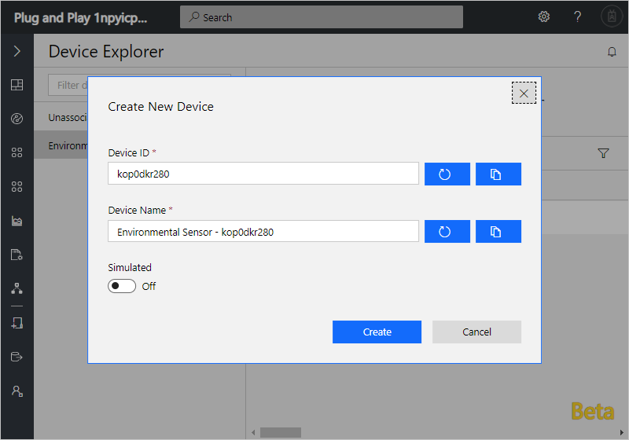
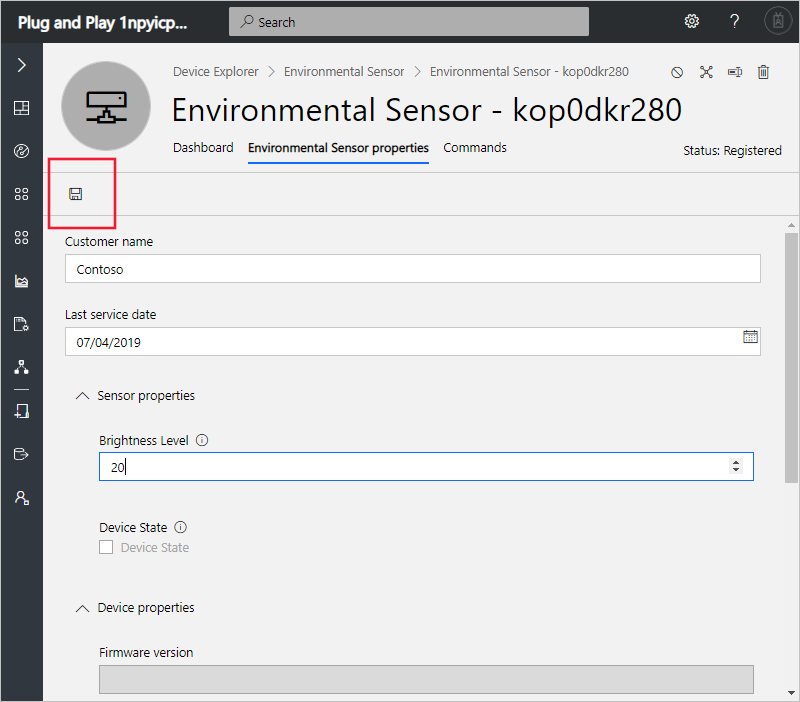
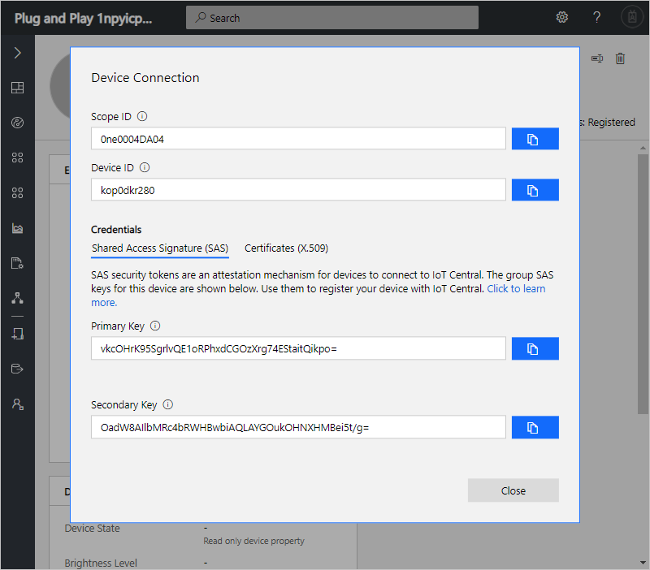
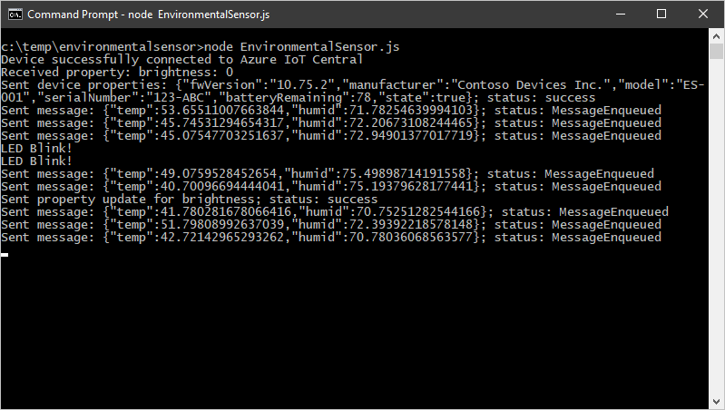
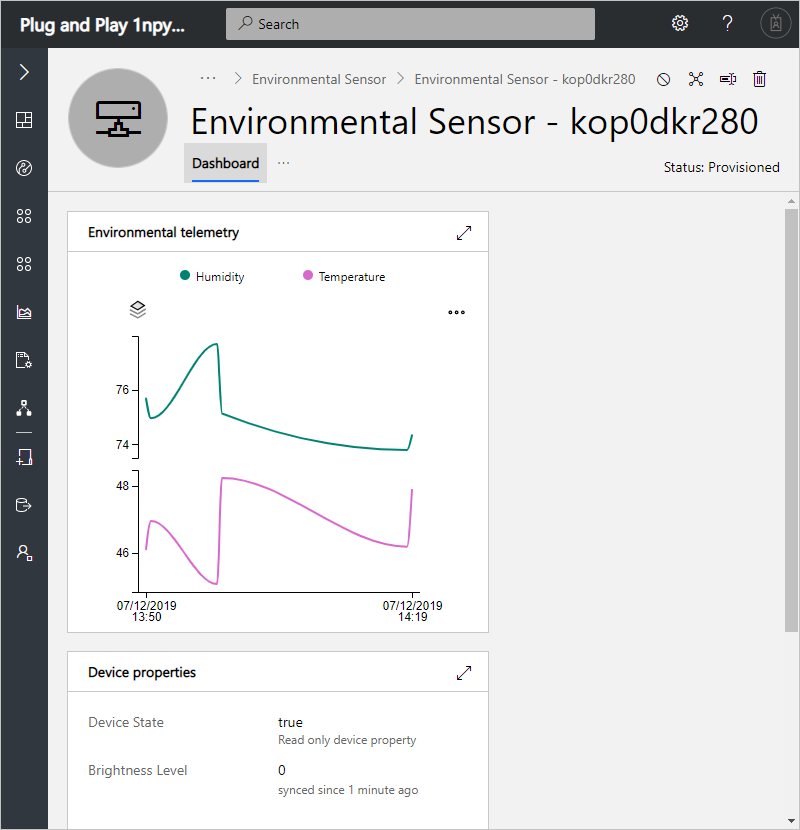
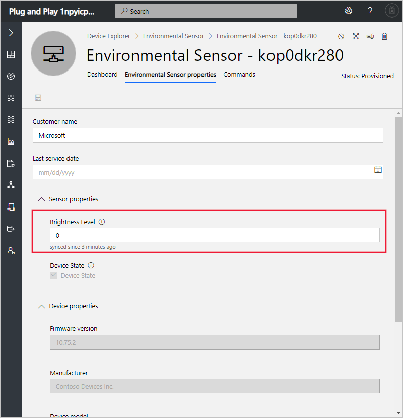
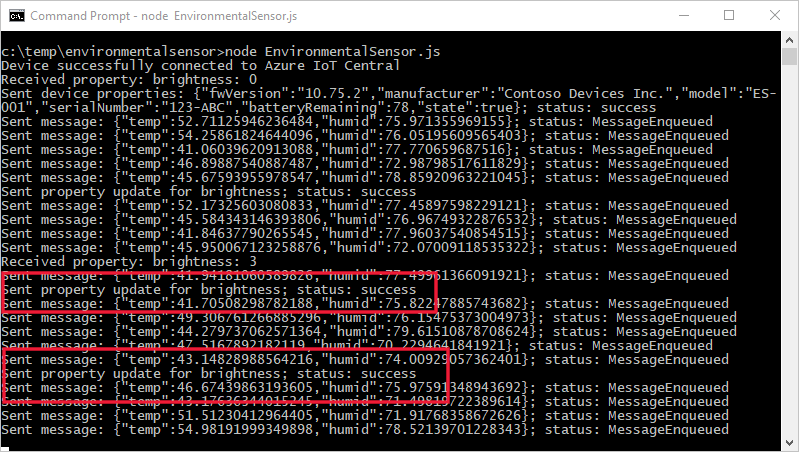

# Tutorial: Add a real device to your Azure IoT Central application (Plug and Play)

[!INCLUDE [iot-central-pnp-original](../../includes/iot-central-pnp-original-note.md)]

This tutorial shows you how to add and configure a real device to your Microsoft Azure IoT Central application.

This tutorial is made up of two parts:

1. First, as an operator, you learn how to add and configure a real device in your Azure IoT Central application. At the end of this part, you retrieve a connection string to use in the second part.
2. Then, as a device developer, you learn about the code in your real device. You add the connection string from the first part to the sample code.

In this tutorial, you learn how to:

> [!div class="checklist"]
> * Add a new real device
> * Configure the real device
> * Get connection string for real device from the application
> * Understand how client code maps to the application
> * Configure client code for the real device

## Prerequisites

Before you begin, the builder should complete at least the first builder tutorial to create the Azure IoT Central application:

* [Define a new device type](tutorial-define-device-type-pnp.md?toc=/azure/iot-central-pnp/toc.json&bc=/azure/iot-central-pnp/breadcrumb/toc.json) (Required)
* [Configure rules and actions for your device](tutorial-configure-rules-pnp.md?toc=/azure/iot-central-pnp/toc.json&bc=/azure/iot-central-pnp/breadcrumb/toc.json) (Optional)
* [Customize the operator's views](tutorial-customize-operator-pnp.md?toc=/azure/iot-central-pnp/toc.json&bc=/azure/iot-central-pnp/breadcrumb/toc.json) (Optional)

Install [Node.js](https://nodejs.org/) version 8.0.0 or later on your development machine. You can run `node --version` in the command line to check your version. Node.js is available for a wide variety of operating systems.

## Add a real device

To add a real device to your application, you use the **Environmental Sensor** device definition you created in the [Define a new device type](tutorial-define-device-type-pnp.md?toc=/azure/iot-central-pnp/toc.json&bc=/azure/iot-central-pnp/breadcrumb/toc.json) tutorial.

1. To add a new device as an operator choose **Device Explorer** in the left navigation menu. The **Device Explorer** shows the **Environmental Sensor** device definition and the simulated device you created in a previous tutorial.

1. To start connecting a real environmental sensor device, select **+ New**. Use the suggested **Device ID** or enter your own lowercase **Device ID**. You can also enter a name for your new device. Then select **Create**:

    

## Configure a real device

The real device is created from the **Environmental Sensor** device definition. You can use **Environmental Sensor properties** page to update writeable device properties and cloud properties.

1. On the **Environmental Sensor properties** page for your real device, update the **Customer name** and **Last service date** cloud properties.

1. On the **Environmental Sensor properties** page for your real device, update the writeable **Brightness Level** device property. IoT Central sends writeable device properties to the device when it connects. Select **Save**:

    

1. You can also view the **Dashboard**, **Commands** pages for your real device.

## Generate connection string

A device developer needs to embed the *connection string* for your real device in the code that runs on the device. The connection string enables the device to connect securely to your application. The following steps show you generate the connection string and prepare the client Node.js code.

## Prepare the client code

The example code in this article is written in [Node.js](https://nodejs.org/) and shows enough code to:

* Connect as a device to your Azure IoT Central application.
* Send temperature telemetry as an environmental sensor device.
* Send device properties to your Azure IoT Central application.
* Receive writeable device properties.
* Handle commands called from your Azure IoT Central application.

The articles listed in the [Next Steps](#next-steps) section include more complete samples and show other programming languages. For more information about how devices connect to Azure IoT Central, see the [Device connectivity](concepts-connectivity.md?toc=/azure/iot-central-pnp/toc.json&bc=/azure/iot-central-pnp/breadcrumb/toc.json) article.

The following steps show how to prepare the [Node.js](https://nodejs.org/) sample:

### Get the device connection information

The connection string for a device instance in your application is generated from device information provided by the IoT Central:

1. On the device screen for your real environmental sensor, choose **Connect**.

1. On the Device Connection page, make a note of the **Scope ID**, **Device ID, and **Primary Key** values. You use these values in a following step:

   

### Generate the connection string

[!INCLUDE [iot-central-howto-connection-string](../../includes/iot-central-howto-connection-string.md)]

### Prepare the Node.js project

1. Create a folder called `environmentalsensor` on your development machine.

1. In your command-line environment, navigate to the `environmentalsensor` folder you created.

1. To initialize your Node.js project, run the following command accepting all the defaults:

    ```cmd/sh
    npm init
      ```

1. To install the necessary packages, run the following command:

    ```cmd/sh
    npm install azure-iot-device azure-iot-device-mqtt --save
    ```

1. Using a text editor, create a file called **EnvironmentalSensor.js** in the `environmentalsensor` folder.

1. Add the following `require` statements at the start of the **EnvironmentalSensor.js** file:

    ```javascript
    'use strict';

    var clientFromConnectionString = require('azure-iot-device-mqtt').clientFromConnectionString;
    var Message = require('azure-iot-device').Message;
    var ConnectionString = require('azure-iot-device').ConnectionString;
    ```

1. Add the following variable declarations to the file:

    ```javascript
    var connectionString = '{your device connection string}';
    var client = clientFromConnectionString(connectionString);
    ```

    > [!NOTE]
    > You update the placeholder `{your device connection string}` in a later step.

1. Save the changes you have made so far, but keep the file open.

## Review client code

In the previous section, you created a skeleton Node.js project for an application that connects to your Azure IoT Central application. The next step is to add code to:

* Connect to your Azure IoT Central application.
* Send telemetry to your Azure IoT Central application.
* Send device properties to your Azure IoT Central application.
* Receive settings from your Azure IoT Central application.
* Handle the Echo command from your Azure IoT Central application.

1. To send temperature telemetry to your Azure IoT Central application, add the following code to the **EnvironmentalSensor.js** file:

    ```javascript
    // Send device measurements.
    function sendTelemetry() {
      var temperature = 40 + (Math.random() * 15);
      var humidity= 70 + (Math.random() * 10);
      var data = JSON.stringify({
        temp: temperature,
        humid: humidity
        });
      var message = new Message(data);
      client.sendEvent(message, (err, res) => console.log(`Sent message: ${message.getData()}` +
        (err ? `; error: ${err.toString()}` : '') +
        (res ? `; status: ${res.constructor.name}` : '')));
    }
    ```

    The name of the field in the JSON you send must match the name of the field in your device definition. In this example, the name of the field is **temp**.

1. To send the device properties such as the firmware version and serial number, add the following definition:

    ```javascript
    // Send device reported properties.
    function sendDeviceProperties(twin, properties) {
      twin.properties.reported.update(properties, (err) => console.log(`Sent device properties: ${JSON.stringify(properties)}; ` +
        (err ? `error: ${err.toString()}` : `status: success`)));
    }
    ```

1. To define the **brightness** writeable property your device supports, add the following definition:

    ```javascript
    // Add any writeable properties your device supports,
    // mapped to a function that is called when the property is changed.
    var properties = {
      'brightness': (newValue, callback) => {
          // Simulate it taking 5 seconds to set the brightness.
          setTimeout(() => {
            callback(newValue, 'completed');
          }, 5000);
      }
    };
    ```

1. To handle writeable property updates sent from Azure IoT Central, add the following function that locates and executes the appropriate device code:

    ```javascript
    // Handle property changes that come from Azure IoT Central via the device twin.
    function handleWriteableProperties(twin) {
      twin.on('properties.desired', function (desiredChange) {
        for (let property in desiredChange) {
          if (properties[property]) {
            console.log(`Received property: ${property}: ${desiredChange[property].value}`);
            properties[property](desiredChange[property].value, (newValue, status, message) => {
              var patch = {
                [property]: {
                  value: newValue,
                  status: status,
                  desiredVersion: desiredChange.$version,
                  message: message
                }
              }
              twin.properties.reported.update(patch, (err) => console.log(`Sent property update for ${property}; ` +
                (err ? `error: ${err.toString()}` : `status: success`)));
            });
          }
        }
      });
    }
    ```

    This function:

    * Watches for Azure IoT Central sending a writeable property update.
    * Locates the appropriate function to call to handle the property change.
    * Sends an acknowledgment back to your Azure IoT Central application.

1. To respond to a command such as **blink** from your Azure IoT Central application, add the following definitions:

    ```javascript
    // Handle blink command
    function onBlink(request, response) {
      console.log('LED Blink!');
      console.log('LED Blink!');
      response.send(200, 'Success', function (errorMessage) {});
    }

    // Handle TurnOn command
    function onTurnOn(request, response) {
      console.log('Turning LED on...');
      response.send(200, 'Success', function (errorMessage) {});
    }

    // Handle TurnOff command
    function onTurnOff(request, response) {
      console.log('Turning LED off...');
      response.send(200, 'Success', function (errorMessage) {});
    }
    ```

1. Add the following code to complete the connection to Azure IoT Central and hook up the functions in the client code:

    ```javascript
    // Handle device connection to Azure IoT Central.
    var connectCallback = (err) => {
      if (err) {
        console.log(`Device could not connect to Azure IoT Central: ${err.toString()}`);
      } else {
        console.log('Device successfully connected to Azure IoT Central');

        // Create handlers for commands
        client.onDeviceMethod('blink', onBlink);
        client.onDeviceMethod('turnon', onTurnOn);
        client.onDeviceMethod('turnoff', onTurnOff);

        // Send telemetry measurements to Azure IoT Central every 1 second.
        setInterval(sendTelemetry, 1000);

        // Get device twin from Azure IoT Central.
        client.getTwin((err, twin) => {
          if (err) {
            console.log(`Error getting device twin: ${err.toString()}`);
          } else {
            // Send device properties once on device start up.
            var properties = {
              //serial number, battery remaining
              fwVersion: '10.75.2',
              manufacturer: 'Contoso Devices Inc.',
              model: 'ES-001',
              serialNumber: '9001-876-123',
              serialNumber: '123-ABC',
              batteryRemaining: 78,
              state: true
            };
            sendDeviceProperties(twin, properties);

            // Handle changes to writeable device properties.
            handleWriteableProperties(twin);
          }
        });
      }
    };

    // Start the device (connect it to Azure IoT Central).
    client.open(connectCallback);
    ```

1. Save the changes you have made so far, but keep the file open.

## Configure client code

To configure your client code to connect to your Azure IoT Central application, you need to add the connection string for your real device that you noted earlier in this tutorial.

1. In the **EnvironmentalSensor.js** file, find the following line of code:

    ```javascript
    var connectionString = '{your device connection string}';
    ```

1. Replace `{your device connection string}` with the connection string of your real device. You copied the connection string you generated in a previous step.

1. Save the changes to the **EnvironmentalSensor.js** file.

1. To run the sample, enter the following command in your command-line environment:

    ```cmd/sh
    node EnvironmentalSensor.js
    ```

    > [!NOTE]
    > Make sure you are in the `environmentalsensor` folder when you run this command.

1. The application prints output to the console:

   

1. After about 30 seconds, you see the telemetry on the device **Dashboard** page:

   

1. On the **Environmental Sensor properties** page, you can see the properties are now synchronized. When the device first connected, it received the property value and acknowledged the change:

   

1. On the **Environmental Sensor properties** page, set the brightness to **3** and select **Save**. Your sample application receives and processes this change:

   

   > [!NOTE]
   > There are two "property update" messages. One when the `pending` status is sent and one when the `completed` status is sent.

## Next steps

In this tutorial, you learned how to:

> [!div class="nextstepaction"]
> * Add a new real device
> * Configure the new device
> * Get connection string for real device from the application
> * Understand how client code maps to the application
> * Configure client code for the real device

Now that you've connected a real device to your Azure IoT Central application, here are some suggested next steps.

As an operator, you can learn how to:

* [Manage your devices](howto-manage-devices-pnp.md?toc=/azure/iot-central-pnp/toc.json&bc=/azure/iot-central-pnp/breadcrumb/toc.json)
* [Use device sets](howto-use-device-sets-pnp.md?toc=/azure/iot-central-pnp/toc.json&bc=/azure/iot-central-pnp/breadcrumb/toc.json)
* [Create custom analytics](howto-use-device-sets-pnp.md?toc=/azure/iot-central-pnp/toc.json&bc=/azure/iot-central-pnp/breadcrumb/toc.json)

As a device developer, you can learn how to:

* [Prepare and connect a DevKit device (C)](howto-connect-devkit.md?toc=/azure/iot-central-pnp/toc.json&bc=/azure/iot-central-pnp/breadcrumb/toc.json)
* [Prepare and connect a Raspberry Pi (Python)](howto-connect-raspberry-pi-python.md?toc=/azure/iot-central-pnp/toc.json&bc=/azure/iot-central-pnp/breadcrumb/toc.json)
* [Prepare and connect a Raspberry Pi (C#)](howto-connect-raspberry-pi-csharp.md?toc=/azure/iot-central-pnp/toc.json&bc=/azure/iot-central-pnp/breadcrumb/toc.json)
* [Prepare and connect a Windows 10 IoT core device (C#)](howto-connect-windowsiotcore.md?toc=/azure/iot-central-pnp/toc.json&bc=/azure/iot-central-pnp/breadcrumb/toc.json)
* [Connect a generic Node.js client to your Azure IoT Central application](howto-connect-nodejs.md?toc=/azure/iot-central-pnp/toc.json&bc=/azure/iot-central-pnp/breadcrumb/toc.json)