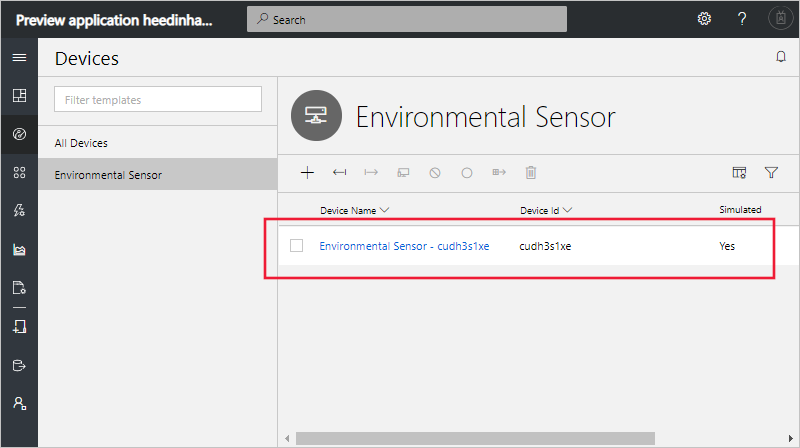
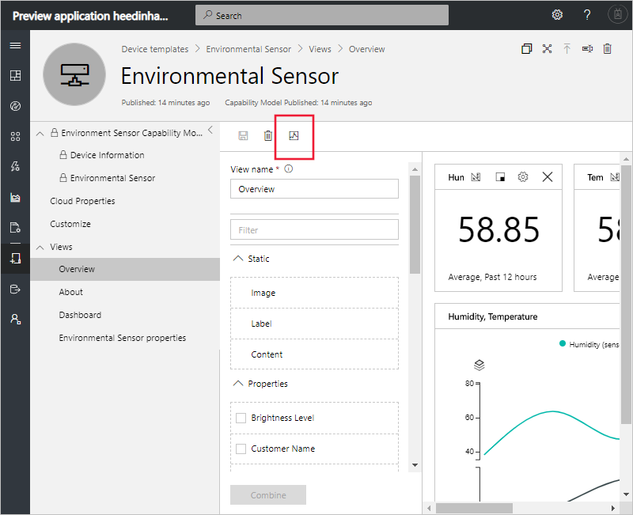

# Tutorial: Add a simulated device to your Azure IoT Central application (preview features)

[!INCLUDE [iot-central-pnp-original](../../includes/iot-central-pnp-original-note.md)]

This tutorial shows you how to add and configure a simulated device to your Microsoft Azure IoT Central application.

In this tutorial, you learn how to:

> [!div class="checklist"]
> * Add a new simulated device
> * Use a simulated device in the building experience

## Prerequisites

Before you begin, the builder should complete the first builder tutorial to create the Azure IoT Central application:

* [Define a new device type](tutorial-define-device-type-pnp.md?toc=/azure/iot-central-pnp/toc.json&bc=/azure/iot-central-pnp/breadcrumb/toc.json) (Required)

## Add a simulated device

To add a real device to your application, you use the **Environmental Sensor** device template you created in the [Define a new device type](tutorial-define-device-type-pnp.md?toc=/azure/iot-central-pnp/toc.json&bc=/azure/iot-central-pnp/breadcrumb/toc.json) tutorial.

1. To add a new device as an operator choose **Devices** in the left navigation menu. The **Devices** tab shows **All devices** and the **Environmental Sensor** device template.

1. To add a simulated environmental sensor device, select **+ New**. Use the suggested **Device ID** or enter your own lowercase **Device ID**. You can also enter a name for your new device. Switch the **simulated** toggle to **On** and then select **Create**.

    

Now you can interact with the views that were created by the builder for the device template using simulated data.

## Use a simulated device to improve views

After you create a new simulated device, the builder can use this device to continue to improve and build upon the views for the device template.

1. While in your device's view, copy the **Device ID** of the simulated device you created.

1. Choose the **Device templates** tab in the left navigation menu and select the **Environmental Sensor** template.

1. Select any of the views you would like to edit, or create a new view. Click **Configure preview device**. Here you can choose between having no preview device, using a real device you can configure for testing, or from an existing device you have added into IoT Central.

1. Choose **Select from a running device** and enter in the **Device ID** of the simulated device that you had copied.

1. Choose **Apply**. Now you can see the same simulated device in your device template views building experience. This view is particularly useful for charts and other visualizations.

    

## Next steps

In this tutorial, you learned how to:

* Add a new simulated device
* Use a simulated device in the building experience

Now that you've connected a simulated device to your Azure IoT Central application, here are some suggested next steps.

As an operator, you can learn how to:

> [!div class="nextstepaction"]
> [Configure rules](tutorial-configure-rules.md?toc=/azure/iot-central-pnp/toc.json&bc=/azure/iot-central-pnp/breadcrumb/toc.json)

As a device developer, you can learn how to:

> [!div class="nextstepaction"]
> [Connect an MXChip IoT DevKit device to your Azure IoT Central application](howto-connect-devkit-pnp.md?toc=/azure/iot-central-pnp/toc.json&bc=/azure/iot-central-pnp/breadcrumb/toc.json)

