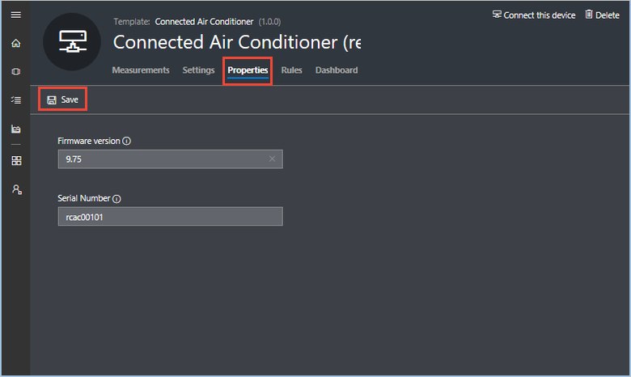
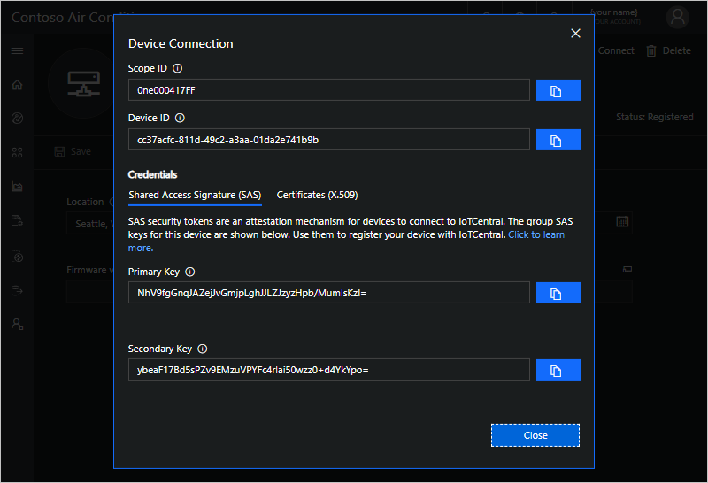

# Tutorial: Add a real device to your Azure IoT Central application

This tutorial shows you how to add and configure a real device to your Microsoft Azure IoT Central application.

This tutorial is made up of two parts:

1. First, as an operator, you learn how to add and configure a real device in your Azure IoT Central application. At the end of this part, you retrieve a connection string to use in the second part.
2. Then, as a device developer, you learn about the code in your real device. You add the connection string from the first part to the sample code.

In this tutorial, you learn how to:

> [!div class="checklist"]
> * Add a new real device
> * Configure the new device
> * Get connection string for real device from the application
> * Understand how client code maps to the application
> * Configure client code for the real device

## Prerequisites

Before you begin, the builder should complete at least the first builder tutorial to create the Azure IoT Central application:

* [Define a new device type](tutorial-define-device-type.md) (Required)
* [Configure rules and actions for your device](tutorial-configure-rules.md) (Optional)
* [Customize the operator's views](tutorial-customize-operator.md) (Optional)

## Add a real device

To add a real device to your application, you use the **Connected Air Conditioner** device template you created in the [Define a new device type](tutorial-define-device-type.md) tutorial.

1. To add a new device as an operator choose **Device Explorer** in the left navigation menu:

   

   The **Device Explorer** shows the **Connected Air Conditioner** device template and the simulated device that was automatically created when the builder created the device template.

2. To start connecting a real connected air conditioner device, choose **New**, then **Real**:

   

3. Enter the Device Id (**should be lower case**) or use the suggested Device Id. You can also enter the name for your new device.  

   

## Configure a real device

The real device is created from the **Connected Air Conditioner** device template. As a builder, you can use **Settings** to configure your device and set property values to record information about your device.

1. On the **Settings** page, notice that the **Set Temperature** setting status is **no update**. It stays in this state until the real device connects and acknowledges that it has acted on the setting:

    

2. On the **Properties** page for your new, real connected air conditioner device, set **Serial Number** to **rcac0010**, and **Firmware version** to 9.75. Then choose **Save**:

    

3. As a builder, you can view the **Measurements**, **Rules**, and **Dashboard** pages for your real device.

## Get connection details for real device from application

A device developer needs to embed the *device connection details* for your real device in the code that runs on the device. The connection string enables the device to connect securely to your Azure IoT Central application. The following steps show you how to find the connection string for a device instance in your application:

1. On the **Device** screen for your real connected air conditioner device, choose **Connect this device**:

    

2. On the **Connect** page, copy **Scope ID, Device ID, and Primary key**, and save it.

   

   Use the below commandline tool to get the device connection string  

    ```cmd/sh
    npm i -g dps-keygen
    ```
    **Usage**
    
    In order to create a connection string, find your binary under bin/ folder
    ```cmd/sh
    dps_cstr <scope_id> <device_id> <Primary Key(for device)>
    ```
    Learn more about the [command line tool here](https://www.npmjs.com/package/dps-keygen).

> [!NOTE]
> Azure IoT Central has transitioned to using Azure IoT Hub Device Provisioning service (DPS) for all device connections, follow these instrustions to [get the device connection string](concepts-connectivity.md#getting-device-connection-string) and continue with the rest of the tutorial.

## Prepare the client code

The example code in this article is written in [Node.js](https://nodejs.org/) and shows just enough code to:

* Connect as a device to your Azure IoT Central application.
* Send temperature telemetry as a connected air conditioner device.
* Respond to an operator who uses the **Set Temperature** setting.

The "How to" articles referenced in the [Next Steps](#next-steps) section provide more complete samples and show the use of other programming languages. For more information about how devices connect to Azure IoT Central, see the [Device connectivity](concepts-connectivity.md) article.

The following steps show how to prepare the [Node.js](https://nodejs.org/) sample:

1. Install [Node.js](https://nodejs.org/) version 4.0.x or later in your machine. Node.js is available for a wide variety of operating systems.

2. Create a folder called `connectedairconditioner` on your machine.

3. In your command-line environment, navigate to the `connectedairconditioner` folder you created.

4. To initialize your Node.js project, run the following command accepting all the defaults:

   ```cmd/sh
   npm init
   ```

5. To install the necessary packages, run the following command:

   ```cmd/sh
   npm install azure-iot-device azure-iot-device-mqtt --save
   ```

6. Using a text editor, create a file called **ConnectedAirConditioner.js** in the `connectedairconditioner` folder.

7. Add the following `require` statements at the start of the **ConnectedAirConditioner.js** file:

   ```javascript
   'use strict';

   var clientFromConnectionString = require('azure-iot-device-mqtt').clientFromConnectionString;
   var Message = require('azure-iot-device').Message;
   var ConnectionString = require('azure-iot-device').ConnectionString;
   ```

8. Add the following variable declarations to the file:

 

   ```javascript
   var connectionString = '{your device connection string}';
   var targetTemperature = 0;
   var client = clientFromConnectionString(connectionString);
   ```
   

   > [!NOTE]
   > You update the placeholder `{your device connection string}` in a later step. 

9. Save the changes you have made so far, but keep the file open.

## Understand how client code maps to the application

In the previous section, you created a skeleton Node.js project for an application that connects to your Azure IoT Central application. In this section, you add the code to:

* Connect to your Azure IoT Central application.
* Send telemetry to your Azure IoT Central application.
* Receive settings from your Azure IoT Central application.

1. To send temperature telemetry to your Azure IoT Central application, add the following code to the **ConnectedAirConditioner.js** file:

   ```javascript
   // Send device telemetry.
   function sendTelemetry() {
     var temperature = targetTemperature + (Math.random() * 15);
     var data = JSON.stringify({ temperature: temperature });
     var message = new Message(data);
     client.sendEvent(message, (err, res) => console.log(`Sent message: ${message.getData()}` +
       (err ? `; error: ${err.toString()}` : '') +
       (res ? `; status: ${res.constructor.name}` : '')));
   }
   ```

   The name of the field in the JSON you send must match the name of the field you specified for temperature telemetry in your device template. In this example, the name of the field is **temperature**.

2. To define the settings your device supports, such as **setTemperature**, add the following definition:

   ```javascript
   // Add any settings your device supports
   // mapped to a function that is called when the setting is changed.
   var settings = {
     'setTemperature': (newValue, callback) => {
       // Simulate the temperature setting taking two steps.
       setTimeout(() => {
         targetTemperature = targetTemperature + (newValue - targetTemperature) / 2;
         callback(targetTemperature, 'pending');
         setTimeout(() => {
           targetTemperature = newValue;
           callback(targetTemperature, 'completed');
         }, 5000);
       }, 5000);
     }
   };
   ```

3. To handle settings sent from Azure IoT Central, add the following function that locates and executes the appropriate device code:

   ```javascript
   // Handle settings changes that come from Azure IoT Central via the device twin.
   function handleSettings(twin) {
     twin.on('properties.desired', function (desiredChange) {
       for (let setting in desiredChange) {
         if (settings[setting]) {
           console.log(`Received setting: ${setting}: ${desiredChange[setting].value}`);
           settings[setting](desiredChange[setting].value, (newValue, status, message) => {
             var patch = {
               [setting]: {
                 value: newValue,
                 status: status,
                 desiredVersion: desiredChange.$version,
                 message: message
               }
             }
             twin.properties.reported.update(patch, (err) => console.log(`Sent setting update for ${setting}; ` +
               (err ? `error: ${err.toString()}` : `status: success`)));
           });
         }
       }
     });
   }
   ```

    This function:

    * Watches for Azure IoT Central sending a desired property.
    * Locates the appropriate function to call to handle the setting change.
    * Sends an acknowledgement back to your Azure IoT Central application.

4. Add the following code to complete the connection to Azure IoT Central and hook up the functions in the client code:

   ```javascript
   // Handle device connection to Azure IoT Central.
   var connectCallback = (err) => {
     if (err) {
       console.log(`Device could not connect to Azure IoT Central: ${err.toString()}`);
     } else {
       console.log('Device successfully connected to Azure IoT Central');
        // Send telemetry measurements to Azure IoT Central every 1 second.
       setInterval(sendTelemetry, 1000);
        // Get device twin from Azure IoT Central.
       client.getTwin((err, twin) => {
         if (err) {
           console.log(`Error getting device twin: ${err.toString()}`);
         } else {
           // Apply device settings and handle changes to device settings.
           handleSettings(twin);
         }
       });
     }
   };

   client.open(connectCallback);
   ```

5. Save the changes you have made so far, but keep the file open.

## Configure client code for the real device

<!-- Add the connection string to the sample code, build, and run -->
To configure your client code to connect to your Azure IoT Central application, you need to add the connection string for your real device that you noted earlier in this tutorial.

1. In the **ConnectedAirConditioner.js** file, find the following line of code:

   ```javascript
   var connectionString = '{your device connection string}';
   ```

2. Replace `{your device connection string}` with the connection string of your real device. You made a note of the connection string at the end of the "Get connection string for real device from application" section.

3. Save the changes to the **ConnectedAirConditioner.js** file.

4. To run the sample, enter the following command in your command-line environment:

   ```cmd/sh
   node ConnectedAirConditioner.js
   ```

   > [!NOTE]
   > Make sure you are in the `connectedairconditioner` folder when you run this command.

5. The application prints output to the console:

   

6. After about 30 seconds, you see the telemetry on the device **Measurements** page:

   

7. On the **Settings** page, you can see the setting is now synchronized. When the device first connected, it received the setting value and acknowledged the change:

   

8. On the **Settings** page, set the device temperature to **95** and choose **Update device**. Your sample application receives and processes this change:

   

   > [!NOTE]
   > There are two "setting update" messages. One when the `pending` status is sent and one when the `completed` status is sent.

1. On the **Measurements** page you can see that the device is sending higher temperature values:

    

## Next steps

In this tutorial, you learned how to:

> [!div class="nextstepaction"]
> * Add a new real device
> * Configure the new device
> * Get connection string for real device from the application
> * Understand how client code maps to the application
> * Configure client code for the real device

Now that you have connected a real device to your Azure IoT Central application, here are the suggested next steps:

As an operator, you can learn how to:

* [Manage your devices](howto-manage-devices.md)
* [Use device sets](howto-use-device-sets.md)
* [Create custom analytics](howto-create-analytics.md)

As a device developer, you can learn how to:

* [Prepare and connect a DevKit](howto-connect-devkit.md)
* [Prepare and connect a Raspberry Pi](howto-connect-raspberry-pi-python.md)
* [Connect a generic Node.js client to your Azure IoT Central application](howto-connect-nodejs.md)