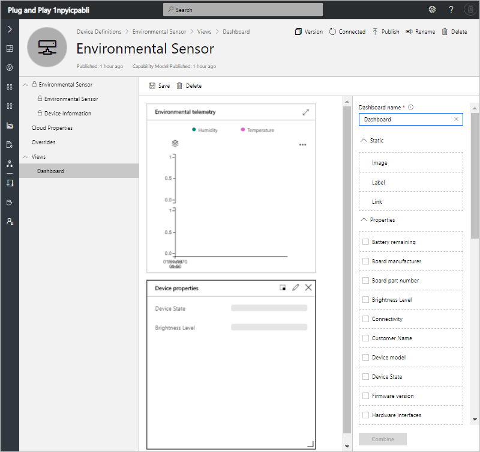
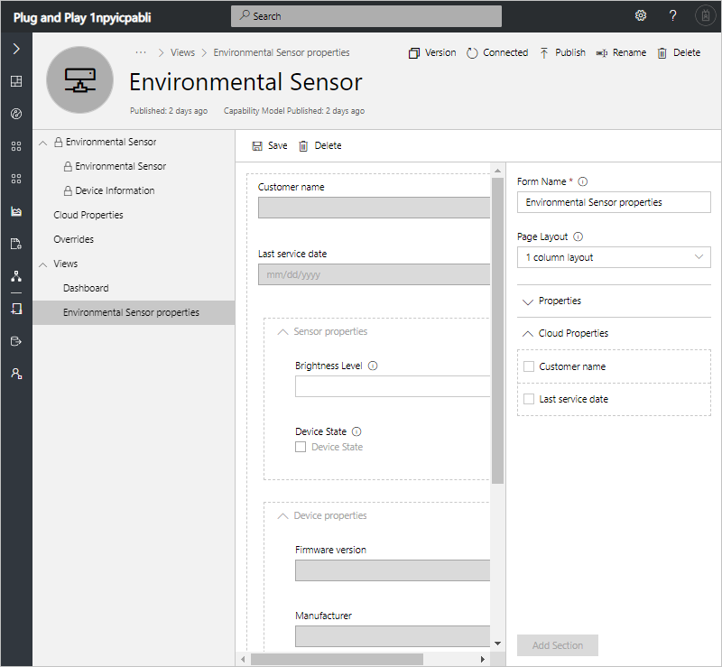
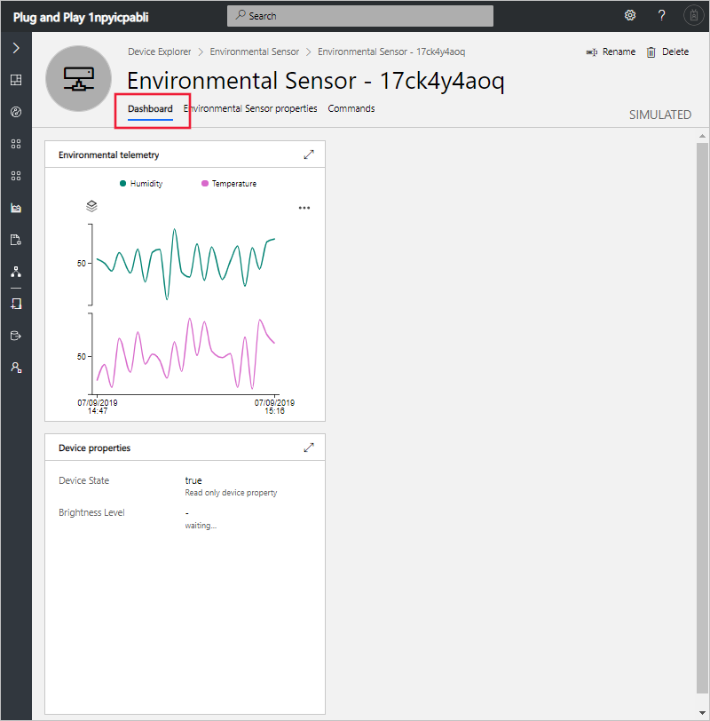
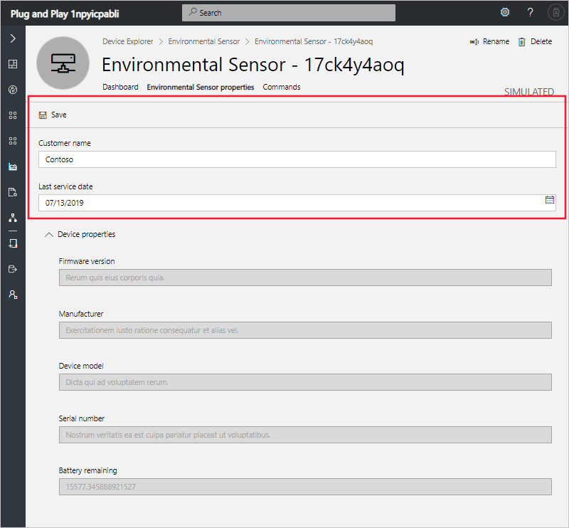

# Tutorial: Customize the Azure IoT Central operator's view (Plug and Play)

[!INCLUDE [iot-central-pnp-original](../../includes/iot-central-pnp-original-note.md)]

This tutorial shows you, as a builder, how to customize the operator's view of your application. When you make a change to the application as a builder, you can preview the operator's view in the Microsoft Azure IoT Central application.

In this tutorial, you customize the application to display relevant information about the environmental sensor device to an operator. Your customizations enable the operator to manage the environmental sensor devices connected to the application.

In this tutorial, you learn how to:

> [!div class="checklist"]
> * Configure your device dashboard
> * Configure your device properties layout
> * Preview the device as an operator
> * Configure your default application dashboard
> * Preview the default application dashboard as an operator

## Prerequisites

Before you begin, you should complete the two previous tutorials:

* [Define a new device type in your Azure IoT Central application](tutorial-define-device-type-pnp.md?toc=/azure/iot-central-pnp/toc.json&bc=/azure/iot-central-pnp/breadcrumb/toc.json).
* [Configure rules and actions for your device](tutorial-configure-rules-pnp.md?toc=/azure/iot-central-pnp/toc.json&bc=/azure/iot-central-pnp/breadcrumb/toc.json).

## Configure a device dashboard

 A device dashboard lets an operator visualize a device using charts and metrics. As a builder, you can define what information displays on a device dashboard. You can define multiple dashboards for devices. In the [Define a new device type in your application](tutorial-define-device-type-pnp.md?toc=/azure/iot-central-pnp/toc.json&bc=/azure/iot-central-pnp/breadcrumb/toc.json) tutorial, you added a line-chart to the **Environmental Sensor** dashboard. To edit this dashboard:

1. Choose **Device Definitions** on the left navigation menu. Choose the **Environmental Sensor** device definition, and expand **Views**, and then select **Dashboard**. The existing dashboard includes a chart that plots the temperature and humidity telemetry from a device.

1. To edit this chart, select the pencil icon. Change to title of the chart to **Environmental telemetry**. Then select **Apply**.

1. To show the device state and brightness values, select these two properties, and then select **Combine**. Then edit the title of the new tile to be **Device properties**.

1. Select **Save**. You have now updated your device dashboard:

    

You can add more tiles that show other properties or telemetry values. You can also add static text, links, and images. To move or resize a tile on the dashboard, move the mouse pointer over the tile. You can drag the tile to a new location or resize it.

## Add a device form

A device form lets an operator edit writeable device properties and cloud properties. As a builder, you can define multiple forms and choose which device and cloud properties to show on each form. You can also display read-only device properties on a form.

To create form to view and edit environmental sensor properties:

1. Select **Views** and then **Editing Device and Cloud data**.

1. Enter the form name **Environmental Sensor properties**.

1. Drag the **Customer name** and **Last service dater** cloud properties on to the existing section on the form.

1. Select the **Battery remaining**, **Device model**, **Firmware version**, **Manufacturer**, and **Serial number** device properties. Then select **Add Section**. Edit the title of the section to be **Device properties**. Select **Apply**.

1. Select **Save** to save your form definition:

    

1. To make the dashboard and form changes visible to an operator, you must republish the device definition. Make sure you've selected the **Environmental Sensor** device definition, then select **Publish**. You don't need to create a new version when you make a change to a dashboard or form.

## Preview the device

You use the **Device Definitions** page to customize the dashboard and properties views for an operator. An operator uses the **Device Explorer** page to view and use the device definition.

1. To view and use the environmental sensor definition as an operator, navigate to the **Device Explorer** page and choose the simulated device you generated in the previous tutorial:

    

    You can expand individual tiles to view the information in full-screen mode.

2. To update the customer name and last serviced date for this device, choose **Environmental Sensor properties** and edit the values. Then select **Save**:

    

## Configure the default dashboard

When a builder or operator signs in to an Azure IoT Central application, they see the application dashboard. As a builder, you can configure the content of the default dashboard to include the most useful and relevant content for an operator.

> [!NOTE]
> Users can also create their own personal dashboards and choose one as their default.

1. To customize the default application dashboard, navigate to the **Dashboard** page and select **Edit** on the top right of the page. A panel appears with a library of objects you can add to the dashboard.

    

2. To customize the dashboard, add tiles from the **Library**. Choose **Link**, and add details of your organization's web site. Then choose **Save**:

    

    > [!NOTE]
    > You can also add links to pages within your Azure IoT Central application. For example, you could add a link to a device dashboard or settings page.

3. Optionally, choose **Image** and upload an image to display on your dashboard. An image can have a URL to which you navigate when you select it:

    

    To learn more, see [How to prepare and upload images to your Azure IoT Central application](howto-prepare-images.md?toc=/azure/iot-central-pnp/toc.json&bc=/azure/iot-central-pnp/breadcrumb/toc.json).

## Preview the dashboard

To preview the application dashboard as an operator, select **Done** on the top right of the page.

You can select the link and image tiles to navigate to the URLs you set as a builder.

## Next steps

In this tutorial, you learned how to customize the operator's view of the application.

<!-- Repeat task list from intro -->
> [!div class="nextstepaction"]
> * Configure your device dashboard
> * Configure your device properties layout
> * Preview the device as an operator
> * Configure your default application dashboard
> * Preview the default application dashboard as an operator

Now that you have learned how to customize the operator's view of the application, the suggested next steps are:

* [Monitor your devices (as an operator)](tutorial-monitor-devices-pnp.md?toc=/azure/iot-central-pnp/toc.json&bc=/azure/iot-central-pnp/breadcrumb/toc.json)
* [Add a new device to your application (as an operator and device developer)](tutorial-add-device-pnp.md?toc=/azure/iot-central-pnp/toc.json&bc=/azure/iot-central-pnp/breadcrumb/toc.json)