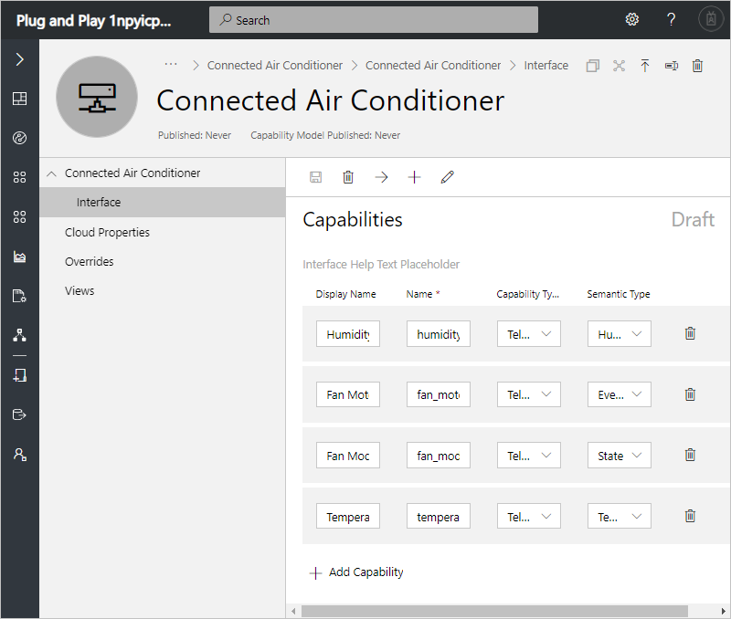
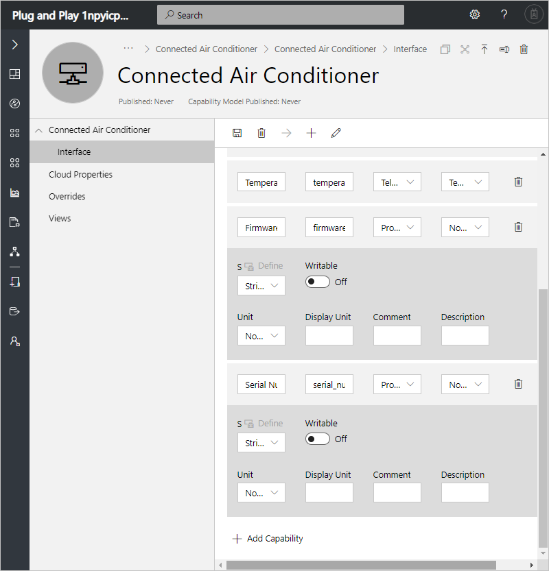
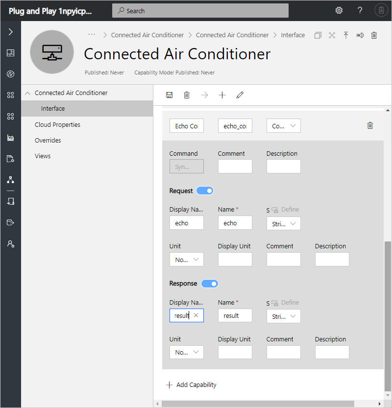
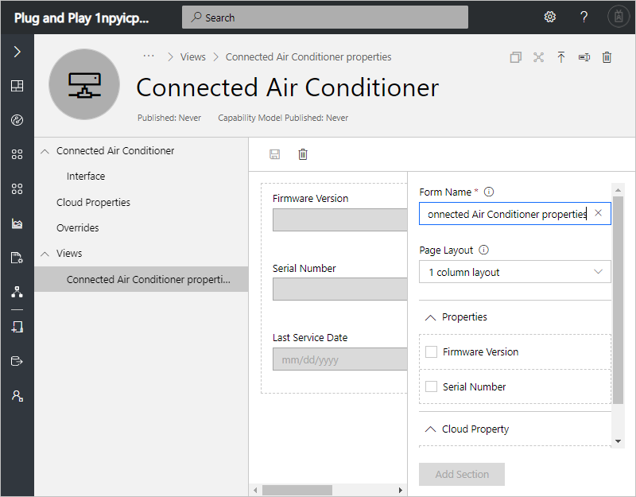

# Tutorial: Define a new device type in your Azure IoT Central application (Plug and Play)

[!INCLUDE [iot-central-pnp-original](../../includes/iot-central-pnp-original-note.md)]

This tutorial shows you, as a builder, how to use a device definition to define a new type of device in your Microsoft Azure IoT Central application. A device definition defines the capabilities of your device. Capabilities include telemetry the device sends, device state, device properties, and the commands a device responds to.

To enable you to test your application before you connect a real device, IoT Central generates a simulated device from the device definition when you create it.

In this tutorial, you create a **Connected Air Conditioner** device definition. A connected air conditioner device:

* Sends temperature telemetry.
* Reports fan on and off events.
* Reports state such as whether it's on or off.
* Has device properties such as firmware version and serial number.
* Responds to a restart command.

In this tutorial, you learn how to:

> [!div class="checklist"]
> * Create a new device definition
> * Add telemetry to your device
> * Define event measurements
> * Define state measurements
> * Define properties
> * Define commands
> * Publish your device definition
> * Create a simulated device from your device definition
> * View your simulated device

## Prerequisites

To complete this tutorial, you need an Azure IoT Central application. If you completed the [Create an Azure IoT Central application](quick-deploy-iot-central-pnp.md?toc=/azure/iot-central-pnp/toc.json&bc=/azure/iot-central-pnp/breadcrumb/toc.json) quickstart, you can reuse the application you created in the quickstart. Otherwise, complete the following steps to create an empty Azure IoT Central application:

1. Navigate to the Azure IoT Central [Application Manager](https://aka.ms/iotcentral) page.

1. If you have an Azure subscription, sign in with the credentials you use to access it, otherwise sign it using a Microsoft account:

    

1. To start creating a new Azure IoT Central application, select **New Application**.

1. To create a new Azure IoT Central application that uses Plug and Play devices:

   * Choose **Trial**. You don't need an Azure subscription to create a trial application.

      For more information about directories and subscriptions, see the [create an application quickstart](quick-deploy-iot-central-pnp.md?toc=/azure/iot-central-pnp/toc.json&bc=/azure/iot-central-pnp/breadcrumb/toc.json).

   * Choose **Plug and Play**.

   * Optionally you can choose a friendly application name, such as **Contoso Air Conditioners**. Azure IoT Central generates a unique URL prefix for you. You can change this URL prefix to something more memorable.

   * If you're creating a trial application, you need to provide your contact details.

   * Select **Create**.

     

     For more information, see the [create an application quickstart](quick-deploy-iot-central-pnp.md?toc=/azure/iot-central-pnp/toc.json&bc=/azure/iot-central-pnp/breadcrumb/toc.json).

## Create a device definition

As a builder, you can create and edit device definitions in your application. After you publish a device definition, you can generate a simulated device or connect real devices that implement the definition. Simulated devices let you test the behavior of your application before you connect a real device.

To add a new device definition to your application, go to the **Device Definitions** page. To do so select the **Device Definitions** on the left navigation menu.

### Add a device definition

The following steps show you how to create a new **Connected Air Conditioner** device definition. These devices send telemetry, such as temperature, to your application:

1. To add a new device definition, select **+** on the **Device Definitions** page.

1. Choose **Custom** from the list of device capability models.

1. Enter **Connected Air Conditioner** as the name of your device definition.

1. Choose **Custom** to create a new device capability model from scratch. You see a new, empty device definition:

    

1. In the **Connected Air Conditioner** device definition, select **+** and then choose **Custom** to add a new interface to your definition.

You can now add telemetry capabilities to the interface:

1. Use the information in the following table to add telemetry capabilities:

    | Display Name | Capability Type | Semantic Type | Schema | Unit |
    | ------------ | --------------- | ------------- | ------ | ---- |
    | Temperature  | Telemetry       | Temperature   | Double | °F   |
    | Humidity     | Telemetry       | Humidity      | Double | %    |

1. Use the information in the following table to add an event capability:

    | Display Name     | Capability Type | Semantic Type | Severity    | Unit |
    | ---------------- | --------------- | ------------- | ----------- | ---- |
    | Fan Motor Event  | Telemetry       | Event         | Information | None |

1. Use the information in the following table to add a state capability:

    | Display Name | Capability Type | Semantic Type |
    | ------------ | --------------- | ------------- |
    | Fan Mode     | Telemetry       | State         |

    Add the following **State Values** to the **Fan Mode** state definition:

    | Display Name | Schema (Enum) | Value |
    | ------------ | ------------- | ----- |
    | Operating    | Integer       | 1     |
    | Stopped      | Integer       | 0     |

1. Select **Save** to save your changes:

    

An interface can also define the properties that a device reports:

1. Use the information in the following table to define the properties. To add a property, select **Add Capability**:

    | Display Name     | Capability Type | Semantic Type | Schema |
    | ---------------- | --------------- | ------------- | ------ |
    | Firmware Version | Property        | None          | String |
    | Serial Number    | Property        | None          | String |

1. Select **Save** to save your changes:

    

Properties defined on an interface are properties that a device reports to your IoT Central application. You can make these properties writeable if you want to modify them from your IoT Central application. You can also define *cloud properties* that are maintained in your IoT Central application. Cloud properties are never sent to a device.

An interface can also define the commands that a device responds to:

1. Use the information in the following tables to define a command. To add a command, select **Add Capability**:

    | Display Name  | Capability Type | Request | Response |
    | ------------- | --------------- | ------- | -------- |
    | Echo Command  | Command         | Yes     | Yes      |

    To define the request and response parameters:

    | Parameter | Display Name  | Schema |
    | ----------| ------------- | ------ |
    | Request   | echo          | String |
    | Response  | result        | String |

1. Select **Save** to save your changes:

    

A device definition can include cloud properties. Cloud properties only exist in the IoT Central application and are never sent to a device.

1. Select **Cloud Properties** and then **+ Add Cloud Property**. Use the information in the following table to add a cloud property to your device definition.

    | Display Name      | Semantic Type | Schema |
    | ----------------- | ------------- | ------ |
    | Last Service Date | None          | Date   |

1. Select **Save** to save your changes:

    

1. To add a last service date property to your device definition, choose **Date**.

### Create views

You can create two types of view that an operator can use to interact with devices:

* Forms to view and edit device and cloud properties.
* Dashboards to visualize devices.

To create form to view and edit connected air conditioner properties, select **Views** and then **Editing Device and Cloud data**:

1. Enter the form name **Connected Air Conditioner properties**.

1. Drag the **Firmware Version** and **Serial Number** properties on to the form.

1. Drag the **Last Service Date** cloud property onto the form.

1. Select **Save** to save your form definition:

    

To create a dashboard to visualize a connected air conditioner, select **Views** and then **Visualizing the Device**:

1. To add a chart that plots telemetry, select **Humidity** and **Temperature**, and then select **Combine**.

1. To display the property values, select **Firmware Version**, **Serial Number**, and **Last Service Date**. Then select **Combine**.

1. Select **Save** to save your dashboard definition:

    

## Publish device definition

Before you can create a simulated connected air conditioner, or connect a real connected air conditioner, you need to publish your device definition.

To publish a device definition:

1. Go to your device definition from the **Device Definitions** page.

1. Select **Publish**.

1. On the **Publish a Device Definition** page, choose **Publish**:

    

## Create a simulated device

You can create a simulated connected air conditioner in your IoT Central application to see how it behaves before you connect a real device:

1. Go to the **Device Explorer** page and select the **Connected Air Conditioner** device definition.

1. Select **+ New**, and then on the **Create New Device** page, set **Simulated** to **On**, and select **Create**. Your simulated device appears in the list of **Connected Air Conditioner** devices:

    

### View the simulated device

Now you can view the form and dashboard you created for **Connected Air Conditioner** devices:

1. On the **Device Explorer** page, in the list of **Connected Air Conditioner** devices, select your simulated device.

1. On the Connected Air Conditioner properties page, you can view the device properties and edit the cloud property.

1. On the Command page, you can call the **Echo** command.

1. On the **Dashboard** page, you can view the temperature and humidity telemetry and the properties.

If you want to edit the layout of these pages, go back to the views in **Device Definitions**.

## Next steps

In this tutorial, you learned how to:

<!-- Repeat task list from intro -->
> [!div class="nextstepaction"]
> * Create a new device definition
> * Add telemetry to your device
> * Define event measurements
> * Define state measurements
> * Define properties
> * Define commands
> * Publish your device definition
> * Create a simulated device from your device definition
> * View your simulated device

Now that you've created a device definition in your Azure IoT Central application, here are the suggested next steps:

* [Configure rules and actions for your device](tutorial-configure-rules-pnp.md?toc=/azure/iot-central-pnp/toc.json&bc=/azure/iot-central-pnp/breadcrumb/toc.json)
* [Customize the operator's views](tutorial-customize-operator-pnp.md?toc=/azure/iot-central-pnp/toc.json&bc=/azure/iot-central-pnp/breadcrumb/toc.json)