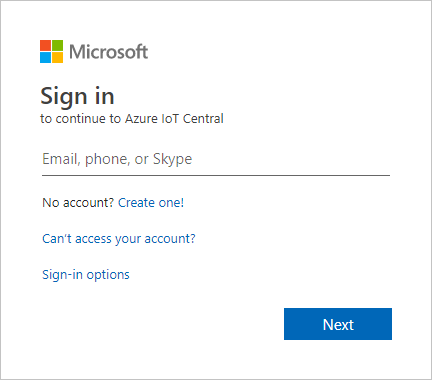
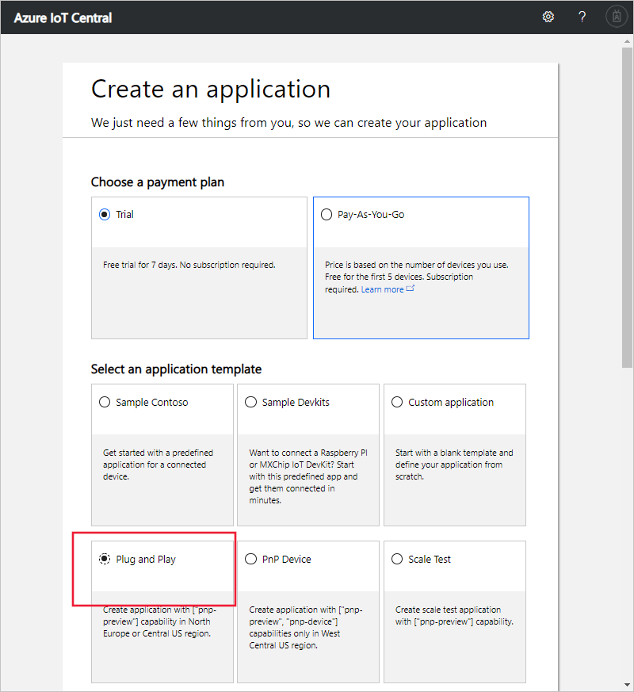
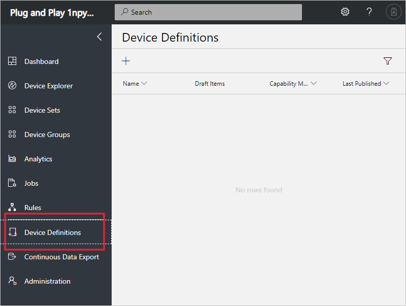
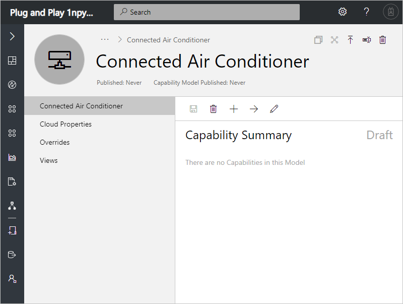
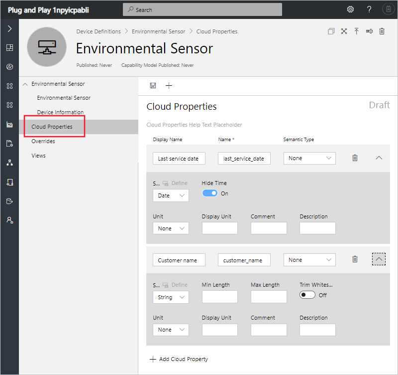
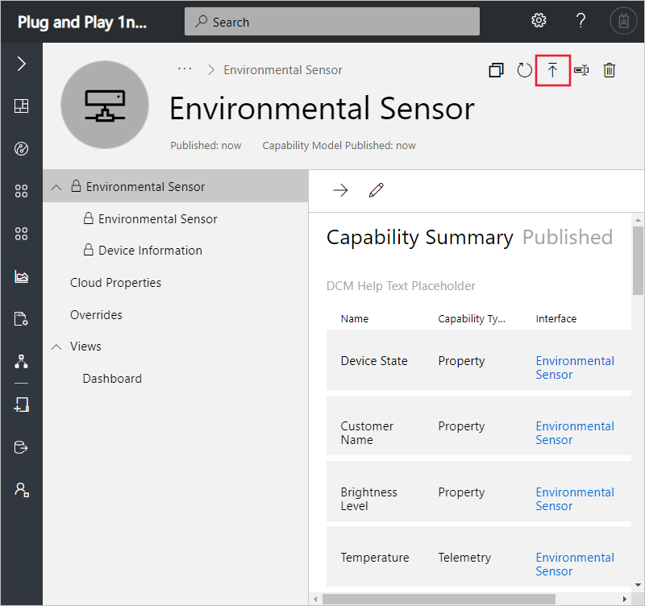

# Tutorial: Define a new device type in your Azure IoT Central application (preview features)

[!INCLUDE [iot-central-pnp-original](../../includes/iot-central-pnp-original-note.md)]

This tutorial shows you, as a builder, how to use a device template to define a new type of device in your Microsoft Azure IoT Central application. A device template defines the capabilities of your device. Capabilities include telemetry the device sends, device properties, and the commands a device responds to.

In this tutorial, you create an **Environment Sensor** device template. An environmental sensor device:

* Sends telemetry such as temperature.
* Reports device-specific properties such as brightness level.
* Responds to commands such as turn on and turn off.
* Reports generic device properties such as firmware version and serial number.

In this tutorial, you learn how to:

> [!div class="checklist"]
> * Create a new device template.
> * Import a device capability model.
> * Create cloud properties.
> * Define a visualization for the device telemetry.
> * Publish your device template.
> * Create a simulated device for your device template.
> * View your simulated device.

## Prerequisites

To complete this tutorial, you need an Azure IoT Central application. If you completed the [Create an Azure IoT Central application](quick-deploy-iot-central-pnp.md?toc=/azure/iot-central-pnp/toc.json&bc=/azure/iot-central-pnp/breadcrumb/toc.json) quickstart, you can reuse the application you created in the quickstart. Otherwise, complete the following steps to create an empty Azure IoT Central application:

1. Navigate to the [Azure IoT Central application manager](https://aka.ms/iotcentral) website.

1. If you have an Azure subscription, sign in with the credentials you use to access it, otherwise sign it using a Microsoft account:

    

1. To start creating a new Azure IoT Central application, select **New Application**.

To create a new Azure IoT Central application that uses preview features, including IoT Plug and Play:

1. Choose **Trial**. You don't need an Azure subscription to create a trial application.

    For more information about directories and subscriptions, see the [create an application quickstart](quick-deploy-iot-central-pnp.md?toc=/azure/iot-central-pnp/toc.json&bc=/azure/iot-central-pnp/breadcrumb/toc.json).

1. Choose **Preview application**.

1. Optionally you can choose a friendly application name, such as **Contoso Air Conditioners**. Azure IoT Central generates a unique URL prefix for you. You can change this URL prefix to something more memorable.

1. If you're creating a trial application, you need to provide your contact details.

1. Select **Create**.

    

    For more information, see the [create an application quickstart](quick-deploy-iot-central-pnp.md?toc=/azure/iot-central-pnp/toc.json&bc=/azure/iot-central-pnp/breadcrumb/toc.json).

You also need a local copy of the **EnvironmentalSensorInline.capabilitymodel.json** file that contains the [IoT Plug and Play](../iot-pnp/overview-iot-plug-and-play.md) device capability model. You can download it from [here](https://raw.githubusercontent.com/Azure/IoTPlugandPlay/master/samples/EnvironmentalSensorInline.capabilitymodel.json). Right-click on the page and select **Save as**.

After you download the file, open it in a text editor, and replace the two instances of `<YOUR_COMPANY_NAME_HERE>` with your name. Use only the characters a-z, A-Z, 0-9, and underscore.

## Create a template

As a builder, you can create and edit device templates in your application. After you publish a device template, you can generate a simulated device or connect real devices that implement the device template. Simulated devices let you test the behavior of your application before you connect a real device.

To add a new device template to your application, go to the **Device Templates** page. To do so select the **Device Templates** tab on the left navigation menu.

### Add a device capability model

There are several options for authoring a device capability model in IoT Central. You can choose to create a custom model from scratch, import from a file, select from the device catalog, or connect an IoT Plug and Play device through a device-first connection where the device capability model has been published in the public repository. In this tutorial, you import a device capability model from a file.

The following steps show you how to import the capability model for an **Environmental Sensor** device. These devices send telemetry, such as temperature, to your application:

1. To add a new device template, select **+ New** on the **Device Templates** page.

1. Choose **Custom** from the list of templates.

1. Enter **Environmental Sensor** as the name of your device template.

1. Choose **Import Capability Model** to create a new device capability model from a JSON file. Navigate to the folder where you saved the **EnvironmentalSensorInline.capabilitymodel.json** file on your local machine. Select the file **EnvironmentalSensorInline.capabilitymodel.json** and then select **Open**. The environmental sensor capability model includes the **Environmental Sensor** and **Device Information** interfaces:

    

    These interfaces define the capabilities of an **Environmental Sensor** device. Capabilities include the telemetry a device sends, the properties a device reports, and the commands a device responds to.

### Add cloud properties

A device template can include cloud properties. Cloud properties only exist in the IoT Central application and are never sent to, or received from, a device.

1. Select **Cloud Properties** and then **+ Add Cloud Property**. Use the information in the following table to add a cloud property to your device template.

    | Display Name      | Semantic Type | Schema |
    | ----------------- | ------------- | ------ |
    | Last Service Date | None          | Date   |
    | Customer name     | None          | String |

1. Select **Save** to save your changes:

    

### Add customizations

Use customizations when you need to modify an interface or add IoT Central-specific features to a capability that doesn't require you to version your device capability model. You can customize fields when the capability model is in a draft or published state. You can only customize fields that don't break interface compatibility. For example, you can:

- Customize the display name and units of a capability.
- Add a default color to use when the value appears on a chart.
- Specify initial, minimum, and maximum values for a property.

You can't customize the capability name or capability type.

## Create views

As a builder, you can customize the application to display relevant information about the environmental sensor device to an operator. Your customizations enable the operator to manage the environmental sensor devices connected to the application. You can create two types of views for an operator to use to interact with devices:

* Forms to view and edit device and cloud properties.
* Dashboards to visualize devices.

### Generate default views

Generating default views is a quick way to get started with visualizing your important device information. You can have up to three default views generated for your device template:

* The **Commands** view lets your operator dispatch commands to your device.
* The **Overview** view uses charts and metrics to display device telemetry.
* The **About** view displays device properties.

After you select **Generate default views**, they're automatically added under the **Views** section of your device template.

### Configure a view to visualize devices

A device dashboard lets an operator visualize a device using charts and metrics. As a builder, you can define what information displays on a device dashboard. You can define multiple dashboards for devices. To create a dashboard to visualize the environmental sensor telemetry, select **Views** and then **Visualizing the Device**:

1. All of the device properties, cloud properties, telemetry, and static options are listed under **Properties**. You can drag and drop any of these items out into the view. Drag the **Brightness Level** property to the view. You can configure the tile using the gear icon.

1. To add a chart that plots telemetry, select **Humidity** and **Temperature**, and then select **Combine**. To view this chart in a different format, such as a pie chart or bar chart, select the **Change Visualization** button at the top of the tile.

1. Select **Save** to save your view:

You can add more tiles that show other properties or telemetry values. You can also add static text, links, and images. To move or resize a tile on the dashboard, move the mouse pointer over the tile and drag the tile to a new location or resize it.

### Add a device form

A device form lets an operator edit writeable device properties and cloud properties. As a builder, you can define multiple forms and choose which device and cloud properties to show on each form. You can also display read-only device properties on a form.

To create a form to view and edit environmental sensor properties:

1. Navigate to **Views** in the **Environmental Sensor** template. Select the **Editing Device and Cloud data** tile to add a new view.

1. Enter the form name **Environmental Sensor properties**.

1. Drag the **Customer name** and **Last service date** cloud properties onto the existing section on the form.

1. Select the **Brightness Level** and **Device State**  device properties. Then select **Add Section**. Edit the title of the section to be **Sensor properties**. Select **Apply**.

1. Select the **Device model**, **Software version**, **Manufacturer**, and **Processor manufacturer** device properties. Then select **Add Section**. Edit the title of the section to be **Device properties**. Select **Apply**.

1. Select **Save** to save your view.

## Publish device template

Before you can create a simulated environmental sensor, or connect a real environmental sensor, you need to publish your device template.

To publish a device template:

1. Go to your device template from the **Device Templates** page.

1. Select **Publish**.

1. On the **Publish a Device Template** dialog, choose **Publish**:

    

After a device template is published, it's visible on the **Devices** page and to the operator. In a published device template, you can't edit a device capability model without creating a new version. However, you can make updates to cloud properties, customizations, and views, in a published device template without versioning. After making any changes, select **Publish**  to push those changes out to your operator.

## Next steps

In this tutorial, you learned how to:

* Create a new device template
* Import a device capability model.
* Create cloud properties.
* Create customizations.
* Define a visualization for the device telemetry.
* Publish your device template.

Now that you've created a device template in your Azure IoT Central application, here is the suggested next step:

> [!div class="nextstepaction"]
> [Add device](tutorial-add-device-pnp.md?toc=/azure/iot-central-pnp/toc.json&bc=/azure/iot-central-pnp/breadcrumb/toc.json)
