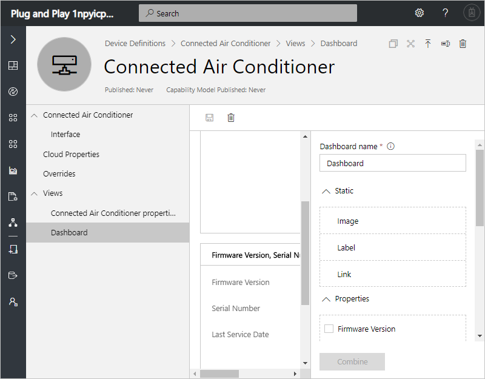
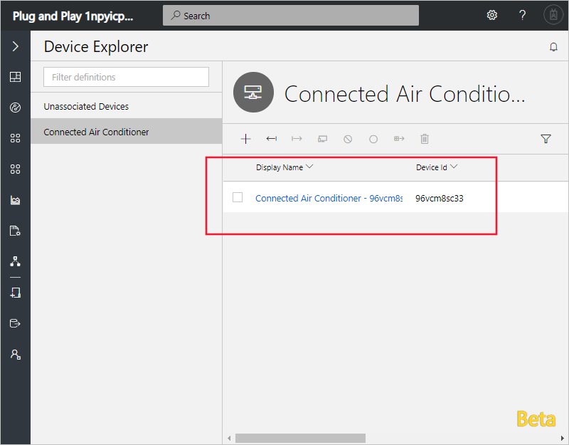
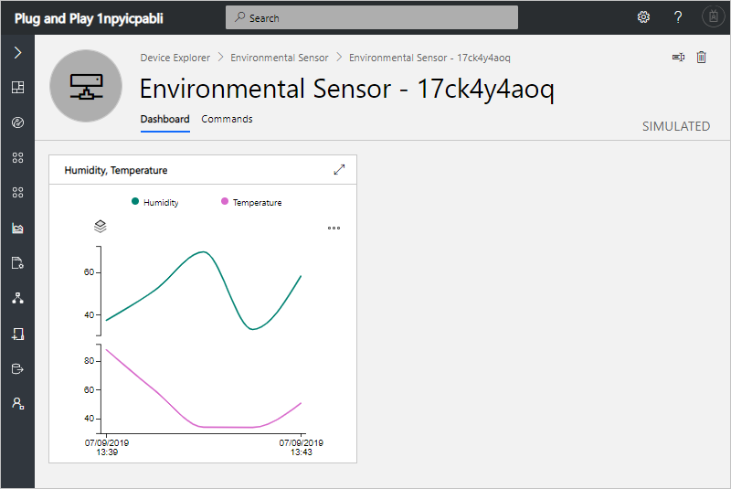
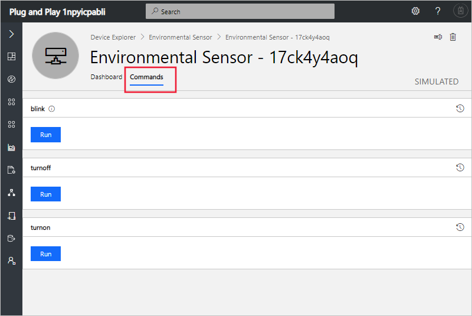

# Tutorial: Define a new device type in your Azure IoT Central application (Plug and Play)

[!INCLUDE [iot-central-pnp-original](../../includes/iot-central-pnp-original-note.md)]

This tutorial shows you, as a builder, how to use a device definition to define a new type of device in your Microsoft Azure IoT Central application. A device definition defines the capabilities of your device. Capabilities include telemetry the device sends, device state, device properties, and the commands a device responds to.

<!-- A couple of options - use "connect" to generate code, or publish and create simulated -->
To enable you to test your application before you connect a real device, IoT Central generates a simulated device from the device definition when you create it.

In this tutorial, you create an **Environment Sensor** device definition. An environmental sensor device:

* Sends telemetry such as temperature.
* Reports device-specific properties such as brightness level.
* Responds to commands such as turn on and turn off.
* Reports generic device properties such as firmware version and serial number.

In this tutorial, you learn how to:

> [!div class="checklist"]
> * Create a new device definition
> * Import a device capability model.
> * Create cloud properties.
> * Define a visualization for the device telemetry.
> * Publish your device definition.
> * Create a simulated device from your device definition.
> * View your simulated device.

## Prerequisites

To complete this tutorial, you need an Azure IoT Central application. If you completed the [Create an Azure IoT Central application](quick-deploy-iot-central-pnp.md?toc=/azure/iot-central-pnp/toc.json&bc=/azure/iot-central-pnp/breadcrumb/toc.json) quickstart, you can reuse the application you created in the quickstart. Otherwise, complete the following steps to create an empty Azure IoT Central application:

1. Navigate to the Azure IoT Central [Application Manager](https://aka.ms/iotcentral) page.

1. If you have an Azure subscription, sign in with the credentials you use to access it, otherwise sign it using a Microsoft account:

    

1. To start creating a new Azure IoT Central application, select **New Application**.

1. To create a new Azure IoT Central application that uses Plug and Play devices:

   * Choose **Trial**. You don't need an Azure subscription to create a trial application.

      For more information about directories and subscriptions, see the [create an application quickstart](quick-deploy-iot-central-pnp.md?toc=/azure/iot-central-pnp/toc.json&bc=/azure/iot-central-pnp/breadcrumb/toc.json).

   * Choose **Plug and Play**.

   * Optionally you can choose a friendly application name, such as **Contoso Air Conditioners**. Azure IoT Central generates a unique URL prefix for you. You can change this URL prefix to something more memorable.

   * If you're creating a trial application, you need to provide your contact details.

   * Select **Create**.

     

     For more information, see the [create an application quickstart](quick-deploy-iot-central-pnp.md?toc=/azure/iot-central-pnp/toc.json&bc=/azure/iot-central-pnp/breadcrumb/toc.json).

<!-- Need to determine where to find this file online -->
You also need a local copy of the **EnvironmentalSensor.json** file that contains the device capability model. You can download it from here.

## Create a device definition

As a builder, you can create and edit device definitions in your application. After you publish a device definition, you can generate a simulated device or connect real devices that implement the definition. Simulated devices let you test the behavior of your application before you connect a real device.

To add a new device definition to your application, go to the **Device Definitions** page. To do so select the **Device Definitions** on the left navigation menu.

### Add a device capability model

The following steps show you how to import the capability model for an **Environmental Sensor** device. These devices send telemetry, such as temperature, to your application:

1. To add a new device definition, select **+ New** on the **Device Definitions** page.

1. Choose **Custom** from the list of device capability models.

1. Enter **Environmental Sensor** as the name of your device definition.

1. Choose **Import Capability Model** to create a new device capability model from a JSON file. Navigate to the folder where you saved the **EnvironmentalSensor.json** file on your local machine. Select the file **EnvironmentalSensor.json** and then select import. The environmental sensor capability model includes the **Environmental Sensor** and **Device Information** interfaces:

    

    These interfaces define the capabilities of an **Environmental Sensor** device. Capabilities include the telemetry a device sends, the properties a device reports, and the commands a device responds to.

### Add cloud properties

A device definition can include cloud properties. Cloud properties only exist in the IoT Central application and are never sent to, or received from, a device.

1. Select **Cloud Properties** and then **+ Add Cloud Property**. Use the information in the following table to add a cloud property to your device definition.

    | Display Name      | Semantic Type | Schema |
    | ----------------- | ------------- | ------ |
    | Last Service Date | None          | Date   |
    | Customer name     | None          | String |

1. Select **Save** to save your changes:

    

### Create views

You can create two types of view for an operator to use to interact with devices:

* Forms to view and edit device and cloud properties.
* Dashboards to visualize devices.

To create a dashboard to visualize the environmental sensor telemetry, select **Views** and then **Visualizing the Device**:

1. To add a chart that plots telemetry, select **Humidity** and **Temperature**, and then select **Combine**.

1. Select **Save** to save your dashboard definition:

    

## Publish device definition

Before you can create a simulated environmental sensor, or connect a real environmental sensor, you need to publish your device definition.

To publish a device definition:

1. Go to your device definition from the **Device Definitions** page.

1. Select **Publish**.

1. On the **Publish a Device Definition** page, choose **Publish**:

    

## Create a simulated device

You can create a simulated environmental sensor in your IoT Central application to see how it behaves before you connect a real device:

1. Go to the **Device Explorer** page and select the **Environmental Sensor** device definition.

1. Select **+ New**, and then on the **Create New Device** page, set **Simulated** to **On**, and select **Create**. Your simulated device appears in the list of **Environmental Sensor** devices:

    

### View the simulated device

Now you can view the dashboard you created for **Environmental Sensor** devices:

1. On the **Device Explorer** page, in the list of **Environmental Sensor** devices, select your simulated device.

1. On the **Dashboard** page, you can view the temperature and humidity telemetry and the properties.

    

    If you want to edit the layout of the dashboard or add more tiles, go back to the views in **Device Definitions**.

1. On the Command page, you can call the device commands:

    

## Next steps

In this tutorial, you learned how to:

<!-- Repeat task list from intro -->
> [!div class="nextstepaction"]
> * Create a new device definition
> * Import a device capability model.
> * Create cloud properties.
> * Define a visualization for the device telemetry.
> * Publish your device definition.
> * Create a simulated device from your device definition.
> * View your simulated device.

Now that you've created a device definition in your Azure IoT Central application, here are the suggested next steps:

* [Configure rules and actions for your device](tutorial-configure-rules-pnp.md?toc=/azure/iot-central-pnp/toc.json&bc=/azure/iot-central-pnp/breadcrumb/toc.json)
* [Customize the operator's views](tutorial-customize-operator-pnp.md?toc=/azure/iot-central-pnp/toc.json&bc=/azure/iot-central-pnp/breadcrumb/toc.json)