# Tutorial: Define a new device type in your Azure IoT Central application

This tutorial shows you, as a builder, how to use a device template to define a new type of device in your Microsoft Azure IoT Central application. A device template defines the telemetry, state, properties, and settings for your device type.

To enable you to test your application before you connect a real device, Azure IoT Central generates a simulated device from the device template when you create it.

In this tutorial, you create a **Connected Air Conditioner** device template. A connected air conditioner device:

* Sends telemetry such as temperature and humidity.
* Reports state such as whether it is on or off.
* Has device properties such as firmware version and serial number.
* Has settings such as target temperature.

In this tutorial, you learn how to:

> [!div class="checklist"]
> * Create a new device template
> * Add telemetry to your device
> * View simulated telemetry
> * Define event measurement
> * View simulated events
> * Define state measurement
> * View simulated state
> * Use settings and properties
> * Use commands
> * View your simulated device in the dashboard

## Prerequisites

To complete this tutorial, you need an Azure IoT Central application. If you completed the [Create an Azure IoT Central application](quick-deploy-iot-central.md) quickstart, you can reuse the application you created in the quickstart. Otherwise, complete the following steps to create an empty Azure IoT Central application:

1. Navigate to the Azure IoT Central [Application Manager](https://aka.ms/iotcentral) page.

2. Enter the email address and password you use to access your Azure subscription:

   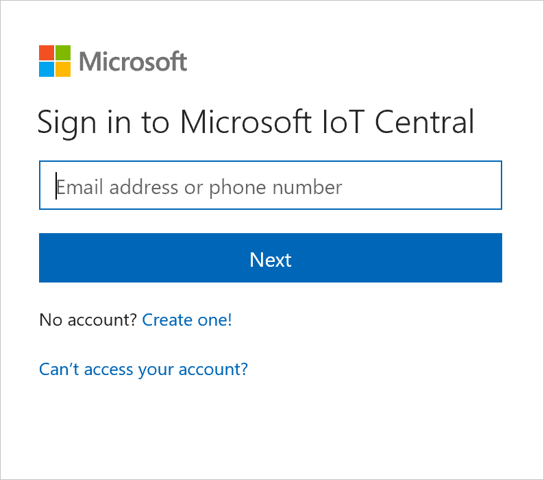

3. To start creating a new Azure IoT Central application, choose **New Application**:

    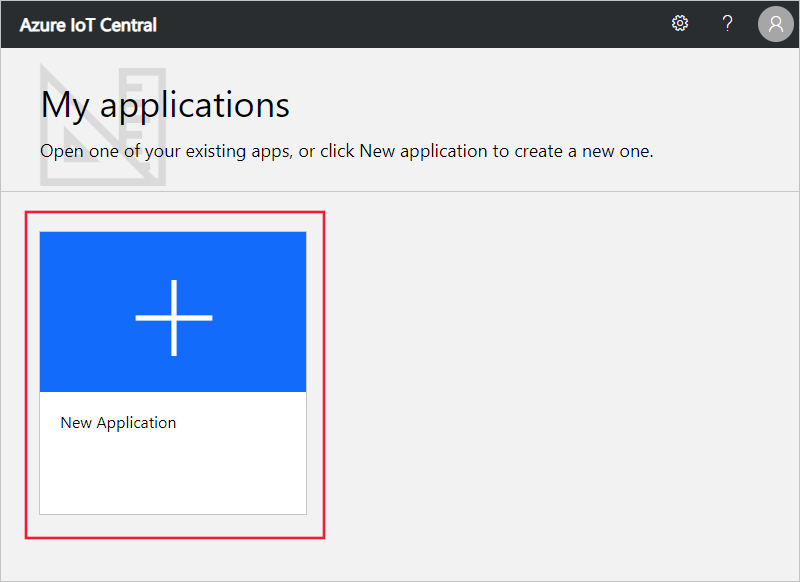

4. To create a new Azure IoT Central application:
    
    * Choose **Free**. The free 7-day trial has no subscription requirement.
    
       For more information about directories and subscriptions, see [Create your Azure IoT Central application](howto-create-application.md).
    
    * Choose **Custom Application**.
    
    * Optionally you can choose a friendly application name, such as **Contoso Air Conditioners**. Azure IoT Central generates a unique URL prefix for you. You can change this URL prefix to something more memorable.
    
    * Choose **Create**.

    

    For more information, see [How to create your Azure IoT Central application](howto-create-application.md).

## Create a new custom device template

As a builder, you can create and edit the device templates in your application. When you create a device template, Azure IoT Central generates a simulated device from the template. The simulated device generates telemetry that enables you to test the behavior of your application before you connect a physical device.

To add a new device template to your application, you need to go to the **Application Builder** page. To do so choose the **Application builder** on the left navigation menu.

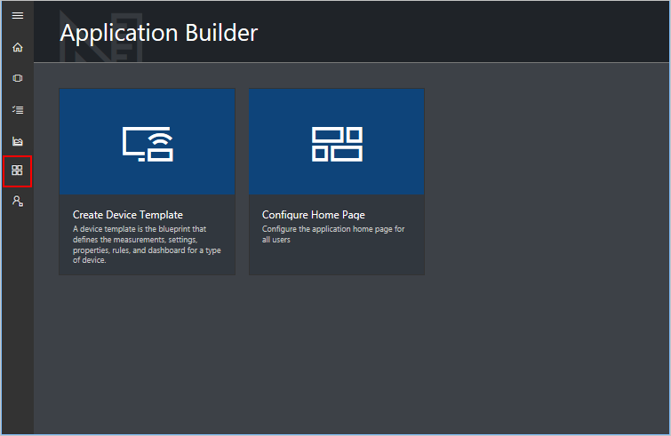

## Add a device and define telemetry

The following steps show you how to create a new **Connected Air Conditioner** device template for devices that send temperature telemetry to your application:

1. On the **Application Builder** page, choose **Create Device Template**:

    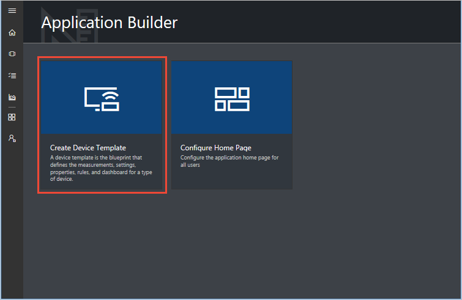

2. On the **Device Templates** page, choose **Custom**. A **Custom** device template enables you to define all the characteristics and behaviors of your connected air conditioner:

    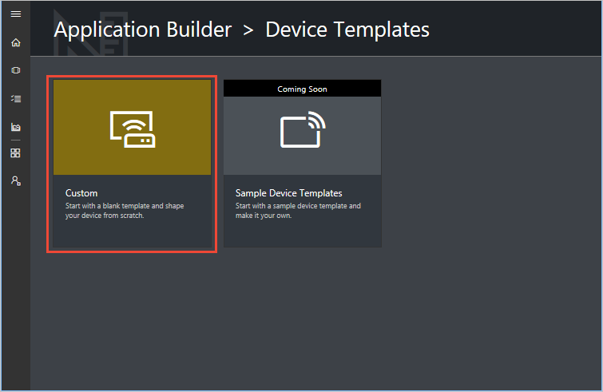

3. On the **New Device Template** page, enter **Connected Air Conditioner** as the name of your device, and then choose **Create**. You can also upload an image of your device that's visible to operators in the device explorer:

    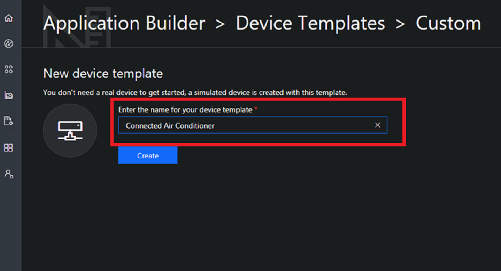

4. In the **Connected Air Conditioner** device template, make sure you are on the **Measurements** page where you define the telemetry. Each device template you define has separate pages for you to:

    * Specify the measurements, such as telemetry, event, and state, sent by the device.
    
    * Define the settings used to control the device.
    
    * Define the properties that are the device metadata.

    * Define the commands to be run directly on the device.
    
    * Define the rules associated with the device.
    
    * Customize the device dashboard for your operators.

    Whenever you're defining the device template, choose **Edit Template** first to edit the template. When you're finished, choose **Done**. 

    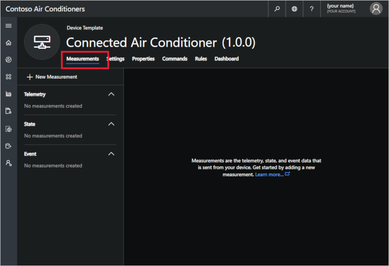

    > [!NOTE]
    > To change the name of the device or device template, click on the text at the top of the page.

5. To add the temperature telemetry measurement, choose **New Measurement**. Then choose **Telemetry** as the measurement type:

    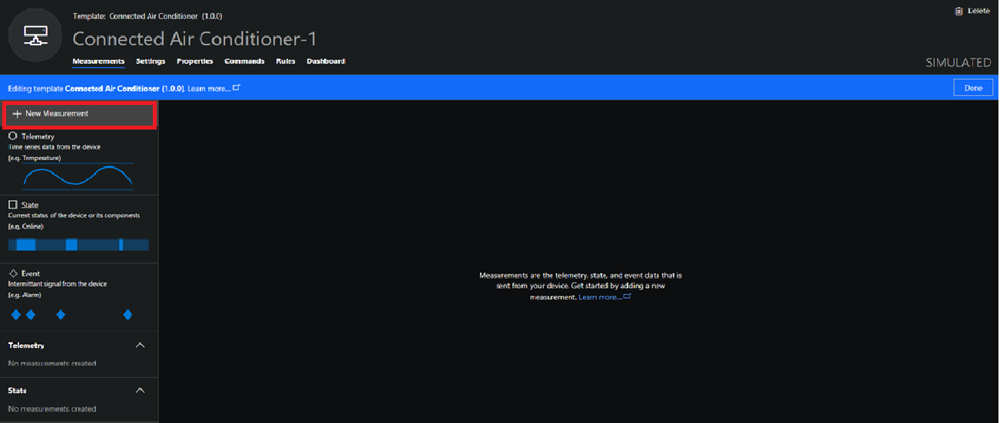

6. Each type of telemetry you define for a device template includes [configuration options](howto-set-up-template.md) such as:

    * Display options.

    * Details of the telemetry.

    * Simulation parameters.

    To configure your **Temperature** telemetry, use the information in the following table:

    | Setting              | Value         |
    | -------------------- | -----------   |
    | Display Name         | Temperature   |
    | Field Name           | temperature   |
    | Units                | F             |
    | Min                  | 60            |
    | Max                  | 110           |
    | Decimal places       | 0             |

    You can also choose a color for the telemetry display. To save the telemetry definition, choose **Save**:

    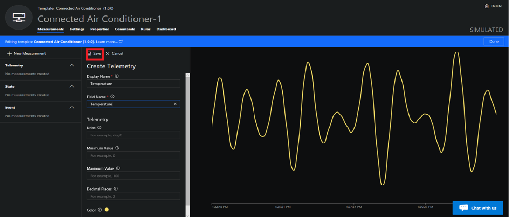

7. After a short while, the **Measurements** page shows a chart of the temperature telemetry from your simulated connected air conditioner device. Use the controls to manage visibility, aggregation, or to edit the telemetry definition:

    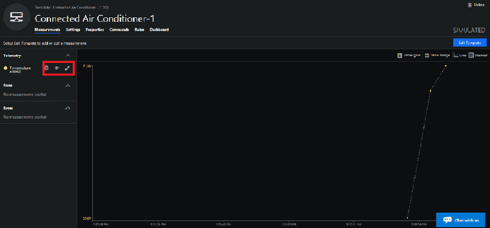

8. You can also customize the chart using the **Line**, **Stacked**, and **Edit Time Range** controls:

    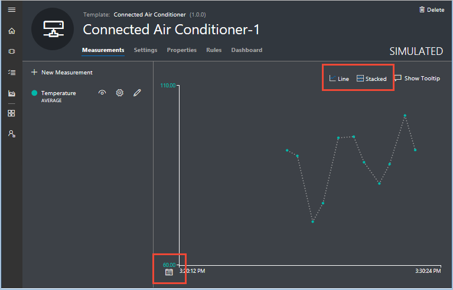

## Define Event measurement

You can use Event to define point-in-time data that is sent by the device to signify something of significance like an error or a component failure. Like telemetry measurements, Azure IoT Central can simulate device events to enable you to test the behavior of your application before you connect a physical device. You define event measurements for your device type in the **Measurements** view.

1. To add the **Fan Motor Error** event measurement, choose **New Measurement**. Then choose **Event** as the measurement type:

    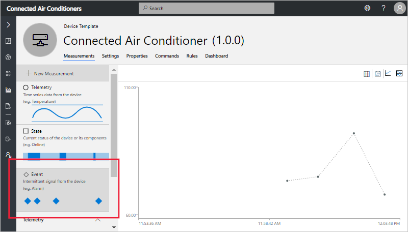

2. Each type of Event you define for a device template includes [configuration options](howto-set-up-template.md) such as:

   * Display Name.

   * Field Name.

   * Severity.

    To configure your **Fan Motor Error** event, use the information in the following table:

    | Setting              | Value             |
    | -------------------- | -----------       |
    | Display Name         | Fan Motor Error   |
    | Field Name           | fanmotorerr       |
    | Severity             | Error             |

    To save the event definition, choose **Save**:

    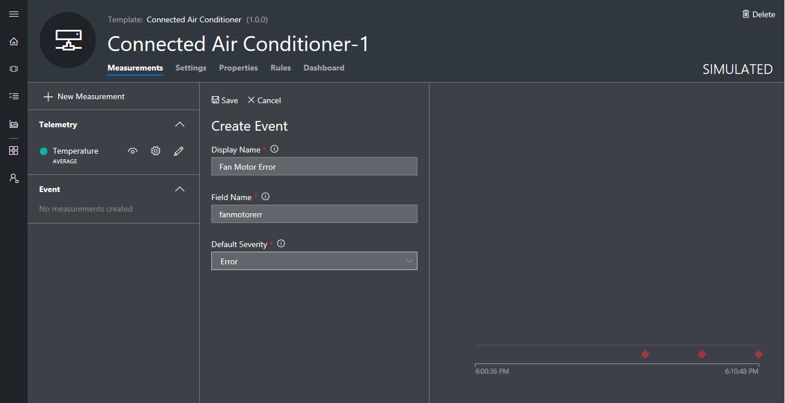

3. After a short while, the **Measurements** page shows a chart of the events randomly generated from your simulated connected air conditioner device. Use the controls to manage visibility, or to edit the event definition:

    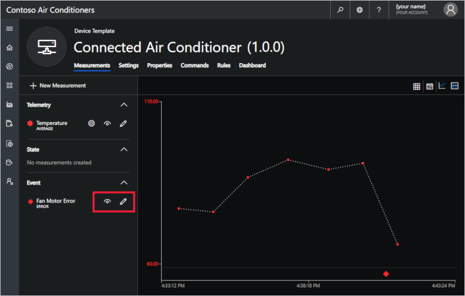

1. To see additional details about the event, click the event on the chart:

    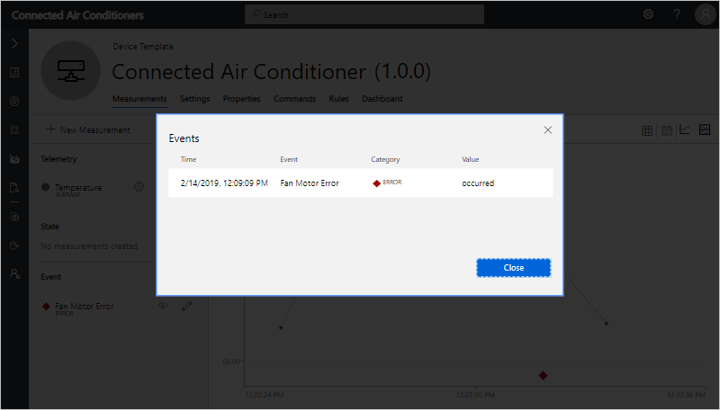

## Define State measurement

You can use State to define and visualize the state of the device or its component over a period of time. Like telemetry measurements, Azure IoT Central can simulate device state to enable you to test the behavior of your application before you connect a physical device. You define state measurements for your device type in the **Measurements** view.

1. To add **Fan Mode** measurement, choose **New Measurement**. Then choose **State** as the measurement type:

    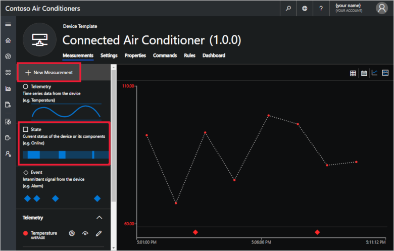

2. Each type of State you define for a device template includes [configuration options](howto-set-up-template.md) such as:

   * Display Name.

   * Field Name.

   * Values with optional display labels.

   * Color for each value.

    To configure your **Fan Mode** state, use the information in the following table:

    | Setting              | Value             |
    | -------------------- | -----------       |
    | Display Name         | Fan Mode          |
    | Field Name           | fanmode           |
    | Value                | 1                 |
    | Display label        | Operating         |
    | Value                | 0                 |
    | Display label        | Stopped           |

    To save the state measurement definition, choose **Save**:

    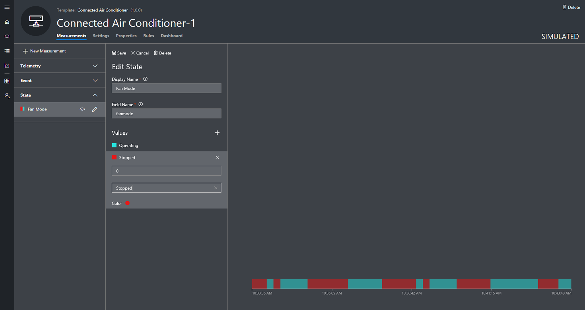

3. After a short while, the **Measurements** page shows a chart of the states randomly generated from your simulated connected air conditioner device. Use the controls to manage visibility, or to edit the state definition:

    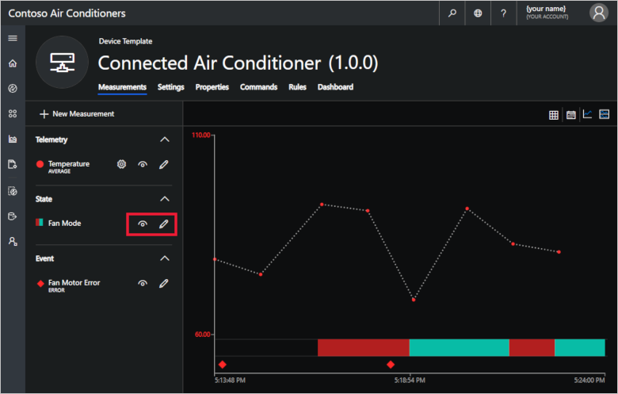

4. In case, there are too many data points sent by the device within a small duration, the state measurement is shown with a different visual as shown below. If you click on the chart, then all the data points within that time period are displayed in a chronological order. You can also narrow the time range so see the measurements in more detail.

    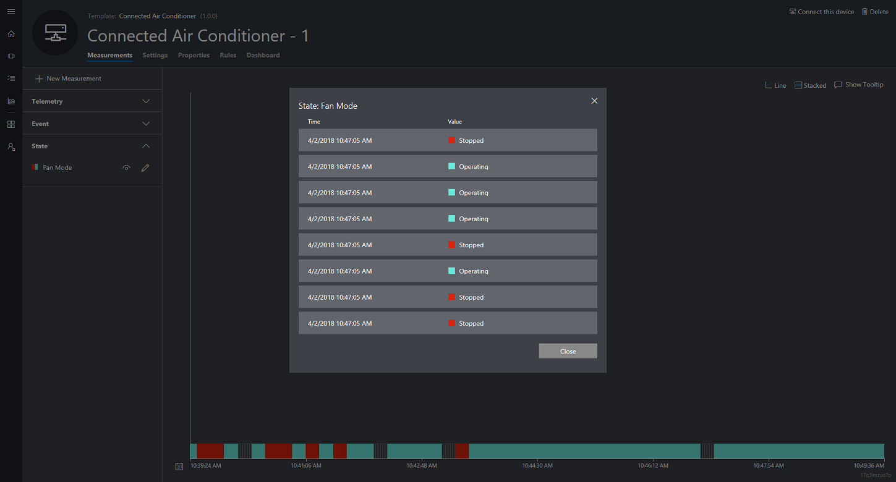

## Settings, properties, and commands

Settings, properties, and commands are different values defined in a device template and associated with each individual device:

* You use _settings_ to send configuration data to a device from your application. For example, an operator could use a setting to change the device's telemetry interval from two seconds to five seconds. When an operator changes a setting, the setting is marked as pending in the UI until the device acknowledges that it has actioned the setting change.

* You use _properties_ to define metadata that's associated with your device. There are two categories of properties:
    
    * You use _application properties_ to record information about your device in your application. For example, you can use application properties to record a device's location and its last service date. These properties are stored in the application and do not synchronize with the device. An operator can assign values to properties.

    * You use _device properties_ to enable a device to send property values to your application. These properties can only be changed by the device. For an operator, device properties are read-only. In this scenario of a connected air conditioner, the firmware version and device serial number are device properties reported by the device. 
    
    For more information, see [Properties][lnk-define-template] in the how-to guide on setting up a device template.

* You use _commands_ to remotely manage your device from your application. You can directly run commands on the device from the cloud to control the devices. For example, an operator can run commands such as reboot, to instantly reboot the device.

## Use settings

You use *settings* to enable an operator to send configuration data to a device. In this section, you add a setting to your **Connected Air Conditioner** device template that enables an operator to set the target temperature of the connected air conditioner.

1. Navigate to the **Settings** page for your **Connected Air Conditioner** device template:

    

    You can create settings of different types such as numbers or text.

2. Choose **Number** to add a number setting to your device.

3. To configure your **Set Temperature** setting, use the information in the following table:

    | Field                | Value           |
    | -------------------- | -----------     |
    | Display Name         | Set Temperature |
    | Field Name           | setTemperature  |
    | Unit of Measure      | F               |
    | Decimal Places       | 1               |
    | Minimum Value        | 20              |
    | Maximum Value        | 200             |
    | Initial Value        | 80              |
    | Description          | Set the target temperature for the air conditioner |

    Then choose **Save**:

    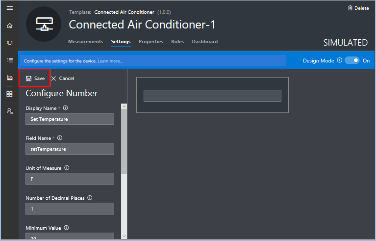

    > [!NOTE]
    > When the device acknowledges a setting change, the status of the setting changes to **synced**.

4. You can customize the layout of the **Settings** page by moving and resizing settings tiles:

    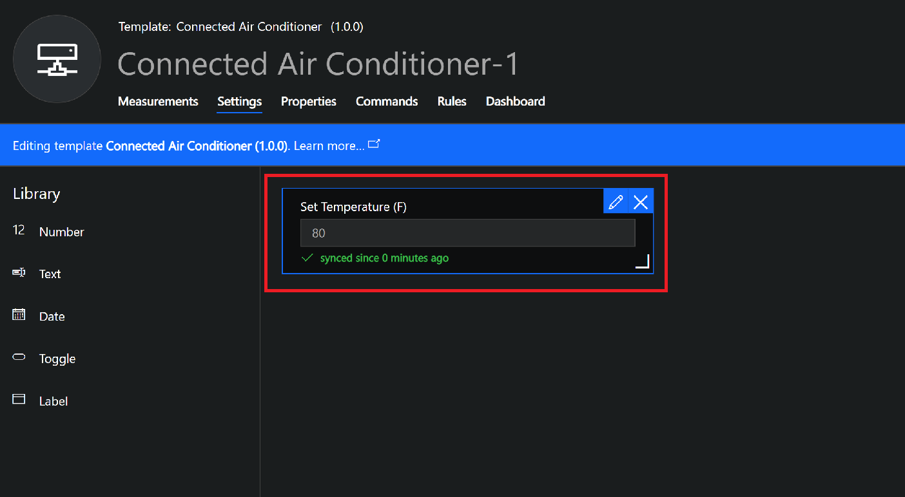

## Use properties 

You use *application properties* to store information about your device in the application. In this section, you add application properties to your **Connected Air Conditioner** device template to store the location of the device and the last service date. Note that both of these are editable properties of the device. There are also read-only device properties reported by the device that cannot be changed such as the device serial number and firmware version.
 
1. Navigate to the **Properties** page for your **Connected Air Conditioner** device template:

    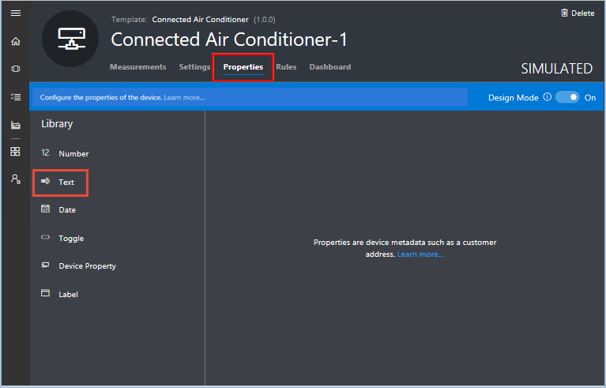

    You can create device properties of different types such as numbers or text. To add a location property to your device template, choose **Location**.

1. To configure your location property, use the information in the following table:

    | Field                | Value                |
    | -------------------- | -------------------- |
    | Display Name         | Location             |
    | Field Name           | location             |
    | Initial Value        | Seattle, WA          |
    | Description          | Device location      |

    Leave other fields with their default values.

    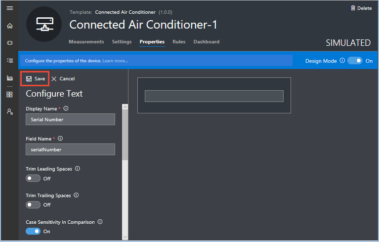

    Choose **Save**.

1. To add a last service date property to your device template, choose **Date**.

1. To configure your last service date property, use the information in the following table:

    | Field                | Value                   |
    | -------------------- | ----------------------- |
    | Display Name         | Last Service Date       |
    | Field Name           | serviceDate             |
    | Initial Value        | 1/1/2018                |
    | Description          | Last serviced           |

    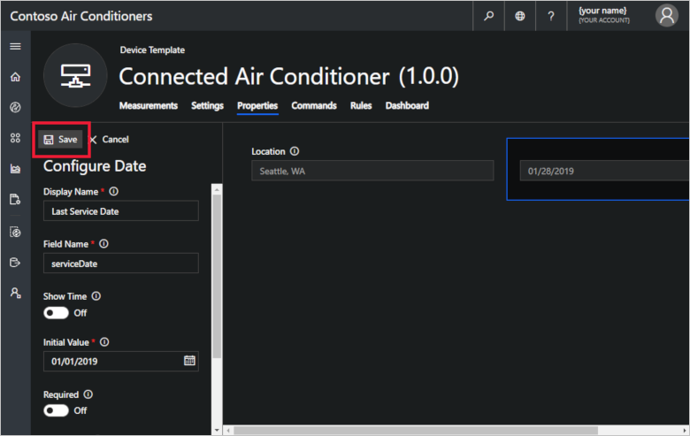

    Choose **Save**.

5. You can customize the layout of the **Properties** page by moving and resizing property tiles:

    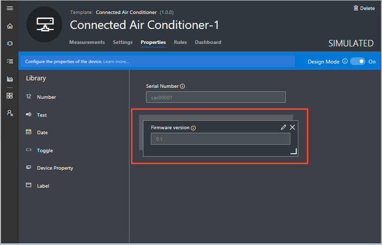

1. To add a device property such as firmware version to your device template, choose **Device Property**.

1.  To configure your firmware version, use the information in the following table:

    | Field                | Value                   |
    | -------------------- | ----------------------- |
    | Display Name         | Firmware version        |
    | Field Name           | firmwareVersion         |
    | Data Type            | text                    |
    | Description          | The firmware version of the air conditioner |

    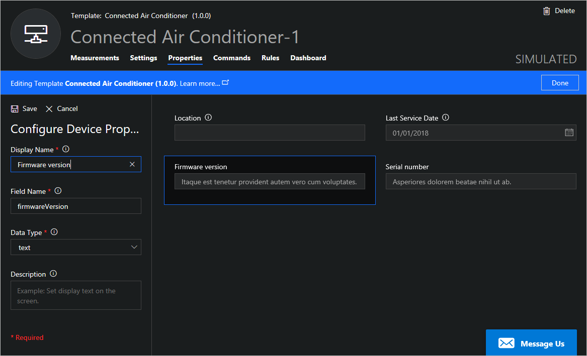
    
    Choose **Save**.

1. To add a device property such as a serial number to your device template, choose **Device Property**.

1. To configure the serial number, use the information in the following table:

    | Field                | Value                   |
    | -------------------- | ----------------------- |
    | Display Name         | Serial number           |
    | Field Name           | serialNumber            |
    | Data Type            | text                    |
    | Description          | The serial number of the air conditioner  |

    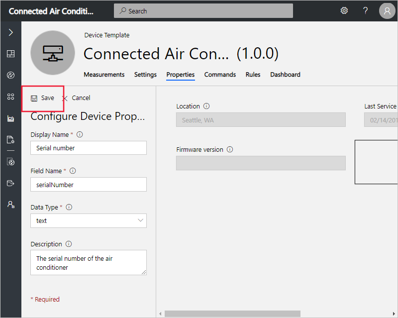
    
    Choose **Save**.
    
    > [!NOTE]
    > Device Property is sent from the device to the application. The values of firmware version and serial number will update when your real device connects to IoT Central.

## Use commands

You use _commands_ to enable an operator to run commands directly on the device. In this section, you add a command to your **Connected Air Conditioner** device template that enables an operator to echo a certain message on the connected air conditioner.

1. Navigate to the **Commands** page for your **Connected Air Conditioner** device template to edit the template. 

1. Click **New Command** to add a command to your device and begin configuring your new command.

   You can create commands of different types based on your requirements. 

1. To configure your new command, use the information in the following table:

    | Field                | Value           |
    | -------------------- | -----------     |
    | Display Name         | Echo Command    |
    | Field Name           | echo            |
    | Default Timeout      | 30              |
    | Display Type         | text            |
    | Description          | Device Command  |  

    You can add additional inputs to the command by clicking **+** for **Input Fields**.

    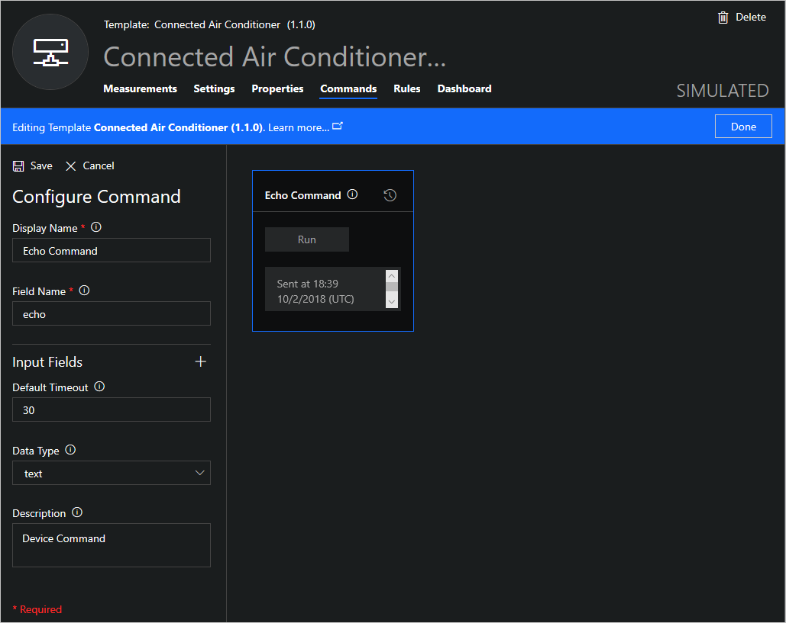

     Choose **Save**.

1. You can customize the layout of the **Commands** page by moving and resizing commands tiles:

    

## View your simulated device

Now you have defined your **Connected Air Conditioner** device template, you can customize its **Dashboard** to include the measurements, settings, and properties you defined. Then you can preview the dashboard as an operator:

1. Choose the **Dashboard** page for your **Connected Air Conditioner** device template:

    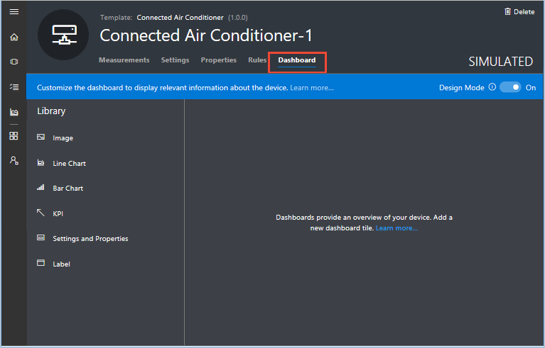

1. Choose **Line Chart** to add the component onto the **Dashboard**:

    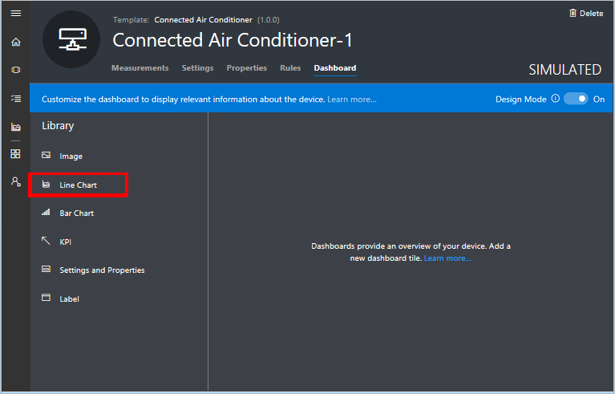

1. Configure the **Line Chart** component using the information in the following table:

    | Setting      | Value       |
    | ------------ | ----------- |
    | Title        | Temperature |
    | Time Range   | Past 30 minutes |
    | Measures     | temperature (choose **Visibility** next to **temperature**) |

    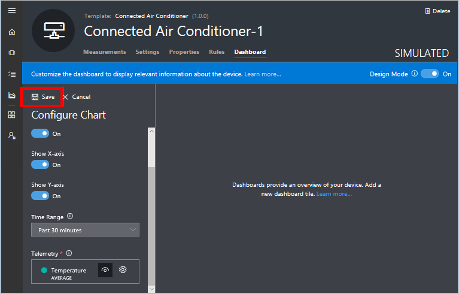

    Then choose **Save**.

1. Configure the **Event History** component using the information in the following table:

    | Setting      | Value       |
    | ------------ | ----------- |
    | Title        | Events |
    | Time Range   | Past 30 minutes |
    | Measures     | Fan Motor Error (choose **Visibility** next to **Fan Motor Error**) |

    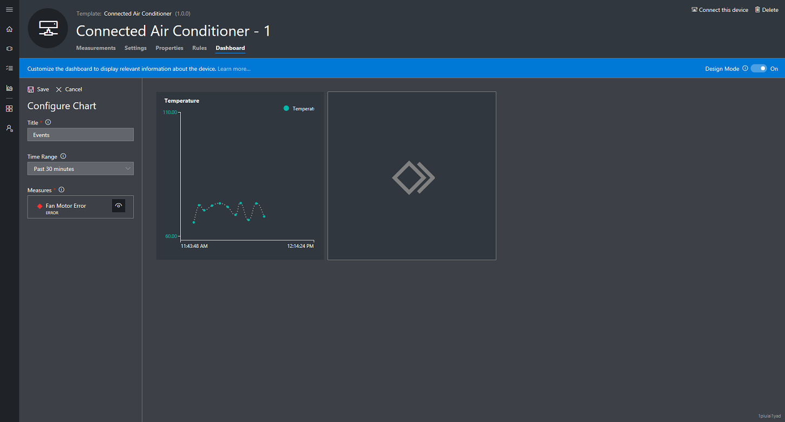

    Then choose **Save**.

1. Configure the **State History** component using the information in the following table:

    | Setting      | Value       |
    | ------------ | ----------- |
    | Title        | Fan Mode |
    | Time Range   | Past 30 minutes |
    | Measures | Fan Mode (choose **Visibility** next to **Fan Mode**) |

    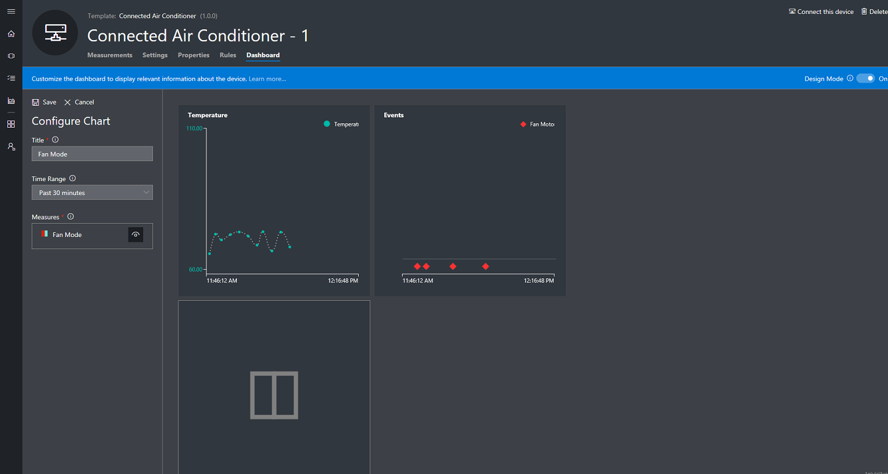

    Then choose **Save**.

1. To add the set temperature setting to the dashboard, choose **Settings and Properties**. Click **Add/Remove** to add the settings or properties that you'd like to see in the dashboard. 

    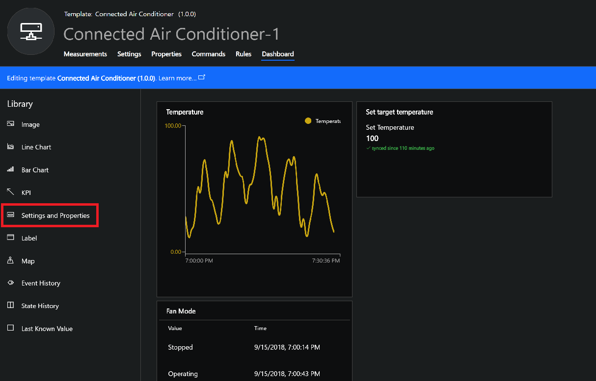

1. Configure the **Settings and Properties** component using the information in the following table:

    | Setting                 | Value         |
    | ----------------------- | ------------- |
    | Title                   | Set target temperature |
    | Settings and Properties | Set Temperature |

    Settings and properties that you have previously defined on the Settings and Properties pages are shown in the Available Columns. 

    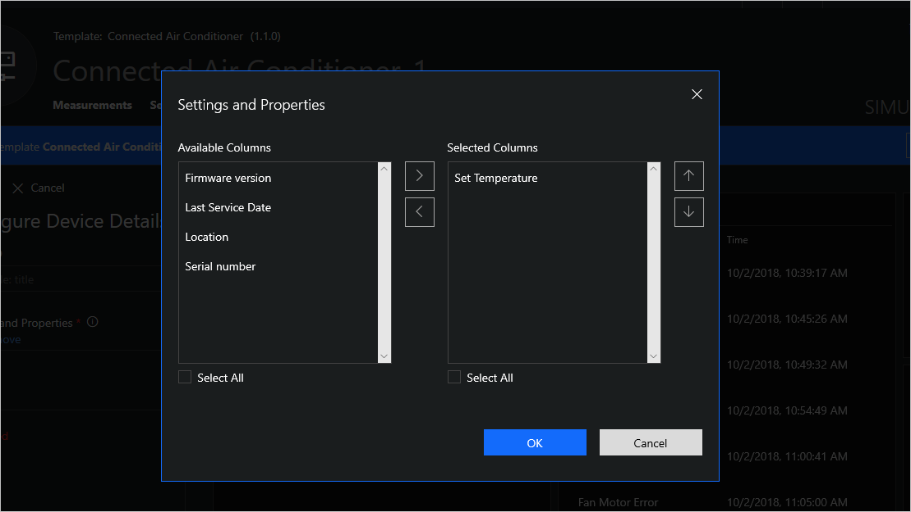

    Then choose **Ok**.

1. To add the device serial number to the dashboard, choose **Settings and Properties**:

    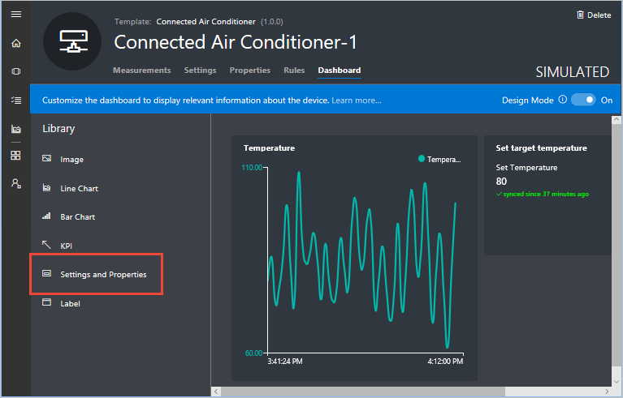

1. Configure the **Settings and Properties** component using the information in the following table:

    | Setting                 | Value         |
    | ----------------------- | ------------- |
    | Title                   | Serial number |
    | Settings and Properties | Serial number |

    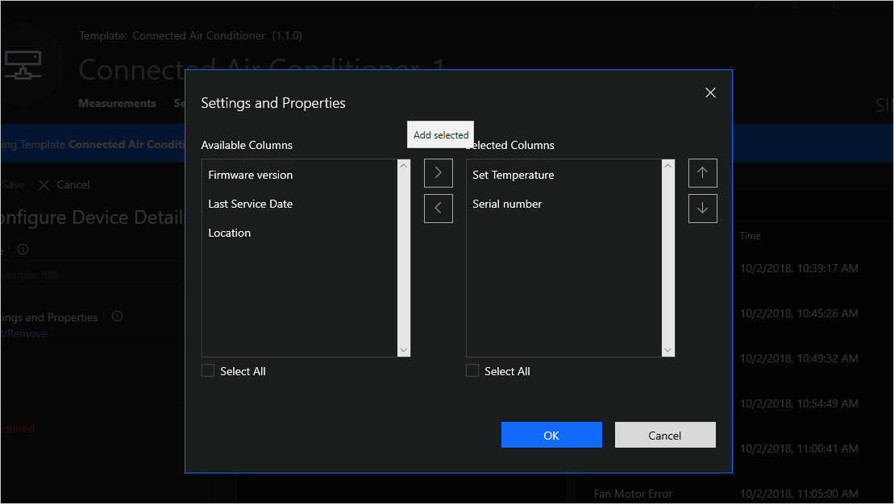

    Then choose **Ok**.

1. To add the device firmware version to the dashboard, choose **Settings and Properties**:

    

1. Configure the **Settings and Properties** component using the information in the following table:

    | Setting                 | Value            |
    | ----------------------- | ---------------- |
    | Title                   | Firmware version |
    | Settings and Properties | Firmware version |

    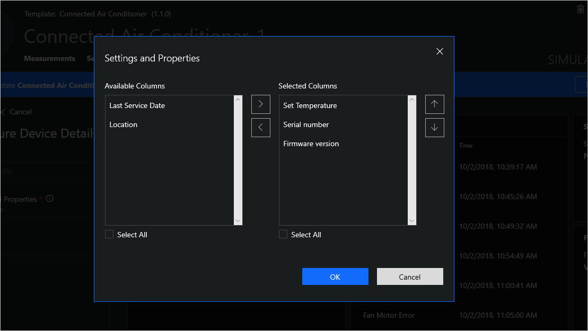

    Then choose **Ok**.

1. To view the dashboard as an operator, switch off **Edit Template** on the top right of the page.

## Next steps

In this tutorial, you learned how to:

<!-- Repeat task list from intro -->
> [!div class="nextstepaction"]
> * Create a new device template
> * Add telemetry to your device
> * View simulated telemetry
> * Define device events
> * View simulated events
> * Define your state
> * View simulated state
> * Use settings and properties
> * Use commands
> * View your simulated device in the dashboard

Now that you have defined a device template in your Azure IoT Central application, here are the suggested next steps:

* [Configure rules and actions for your device](tutorial-configure-rules.md)
* [Customize the operator's views](tutorial-customize-operator.md)

[lnk-define-template]: /azure/iot-central/howto-set-up-template#properties