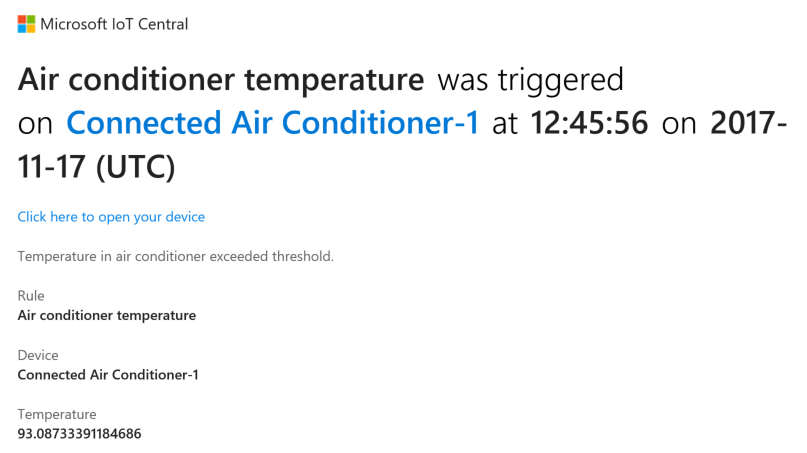
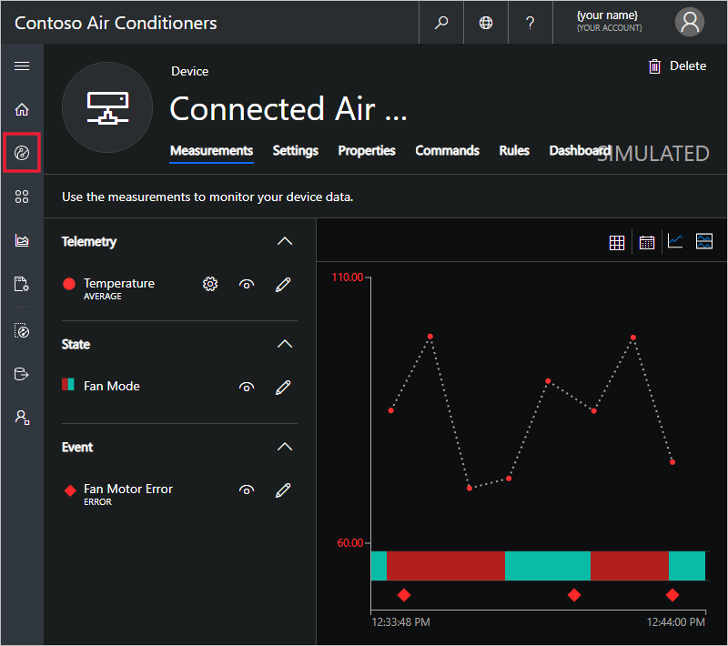
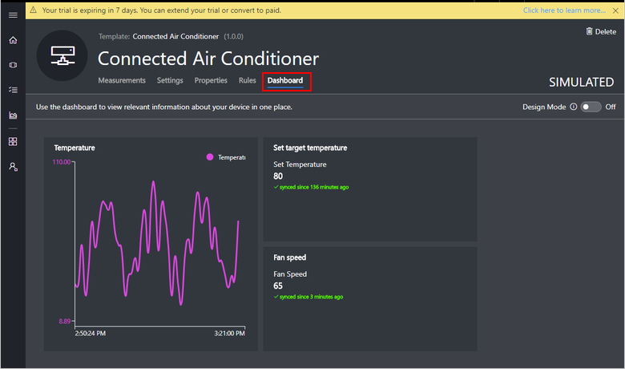
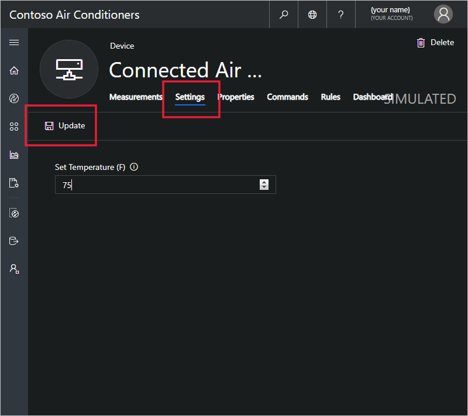
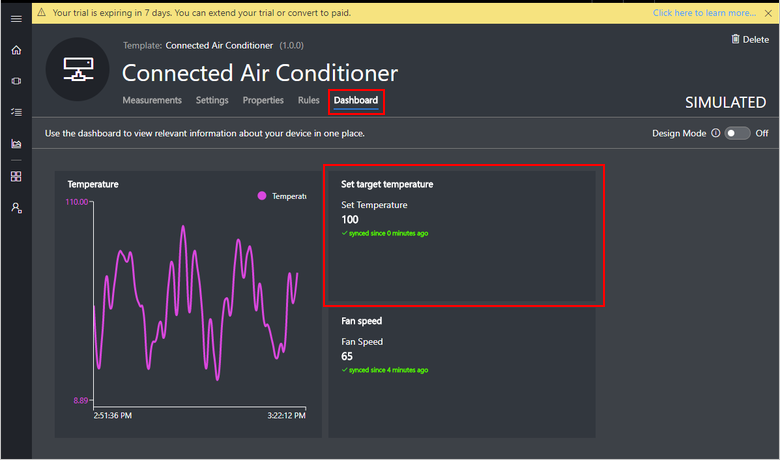

# Tutorial: Use Azure IoT Central to monitor your devices

This tutorial shows you, as an operator, how to use your Microsoft Azure IoT Central application to monitor your devices and change settings.

In this tutorial, you learn how to:

> [!div class="checklist"]
> * Receive a notification
> * Investigate an issue
> * Remediate an issue

## Prerequisites

Before you begin, the builder should complete the three builder tutorials to create the Azure IoT Central application:

* [Define a new device type](tutorial-define-device-type.md)
* [Configure rules and actions for your device](tutorial-configure-rules.md)
* [Customize the operator's views](tutorial-customize-operator.md)

## Receive a notification

Azure IoT Central sends notifications about devices as email messages. The builder added a rule to send a notification when the temperature in a connected air conditioner device exceeded a threshold. Check the emails sent to the account the builder chose to receive notifications.

Open the email message you received at the end of the [Configure rules and actions for your device](tutorial-configure-rules.md) tutorial. In the email, choose **Click here to open your device**:

The **Device** page for the **Connected Air Conditioner-1** simulated device you created in the previous tutorials opens in your browser:

## Investigate an issue

As an operator, you can view information about the device on the **Measurements**, **Settings**, **Properties**, **Rules**, and **Dashboard** pages. The builder customized the **Dashboard** to display important information about a connected air conditioner device.

Choose the **Dashboard** view to see information about the device.

The chart on the dashboard shows a plot of the device temperature. You can also see the current target temperature for the device in the **Set target temperature** tile. You decide that the target temperature is too high.

## Remediate an issue

To change the target temperature of the device, use the **Settings** page:

1. Choose **Settings**. Change **Set Temperature** to 75. Choose **Update** to send the new target temperature to the device. When the device acknowledges the settings change, the status of the setting value changes to **synced**:

    

2. Choose **Dashboard** and verify the new setting value:

    

## Next steps

In this tutorial, you learned how to:

> [!div class="nextstepaction"]
> * Receive a notification
> * Investigate an issue
> * Remediate an issue

Now that you know now to monitor your device, the suggested next step is to [Add a device](tutorial-add-device.md).