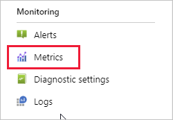
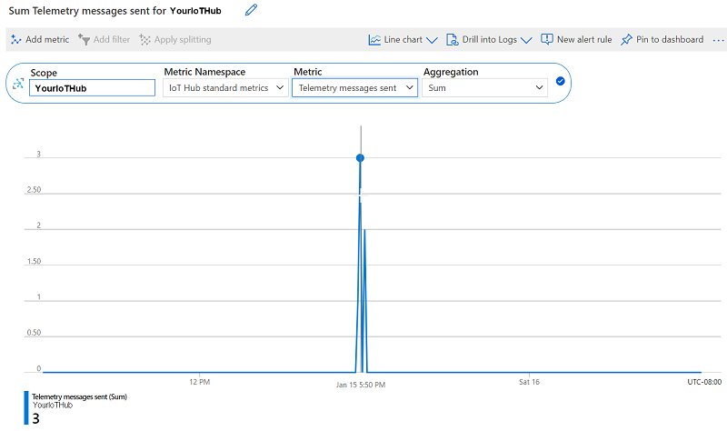

# Quickstart: Send telemetry from a device to an IoT hub (Python)

In this quickstart, you learn a basic Azure IoT application workflow for securely connecting a device to the cloud and sending device-to-cloud telemetry. You use the Azure CLI to create an IoT hub and a simulated device, then you use the Azure IoT Python SDK to access the device and send telemetry to the hub. You also use the Azure portal to visualize device metrics.

## Prerequisites
- If you don't have an Azure subscription, [create one for free](https://azure.microsoft.com/free/?WT.mc_id=A261C142F) before you begin.
- Azure CLI. You can run all commands in this quickstart using the Azure Cloud Shell, an interactive CLI shell that runs in your browser. If you use the Cloud Shell, you don't need to install anything. If you prefer to use the CLI locally, this quickstart requires Azure CLI version 2.0.76 or later. Run az --version to find the version. To install or upgrade, see [Install Azure CLI]( /cli/azure/install-azure-cli).
- [Python 3.7+](https://www.python.org/downloads/). For other versions of Python supported, see [Azure IoT Device Features](https://github.com/Azure/azure-iot-sdk-python/tree/master/azure-iot-device#azure-iot-device-features).
    - **Note that this sample is configured for Python 3.7+.** To ensure that your Python version is up to date, run `python --version`. If you have both Python 2 and Python 3 installed (and are using a Python 3 environment for this SDK), then install all libraries using `pip3` as opposed to `pip`. This ensures that the libraries are installed to your Python 3 runtime. 
- Port 8883 open in your firewall. The device sample in this quickstart uses MQTT protocol, which communicates over port 8883. This port may be blocked in some corporate and educational network environments. For more information and ways to work around this issue, see [Connecting to IoT Hub (MQTT)](../iot-hub/iot-hub-mqtt-support.md).

[!INCLUDE [iot-hub-include-create-hub-cli](../../includes/iot-hub-include-create-hub-cli.md)]

## Use the Python SDK to send messages
In this section, you will use the Python SDK to send messages from your simulated device to your IoT hub. 

1. Open a new terminal window. You will use this terminal to install the Python SDK and work with Python sample code. You should now have two terminals open: the one you just opened to work with Python, and the CLI shell that you used in previous sections to enter Azure CLI commands. 

1. Copy the [Azure IoT Python SDK device samples](https://github.com/Azure/azure-iot-sdk-python/tree/master/azure-iot-device/samples) to your local machine:

    ```console
    git clone https://github.com/Azure/azure-iot-sdk-python
    ```

    and navigating to the *azure-iot-sdk-python/azure-iot-device/samples* directory:

    ```console
    cd azure-iot-sdk-python/azure-iot-device/samples
    ```
1. Install the Azure IoT Python SDK:

    ```console
    pip install azure-iot-device
    ```
1. Set the Device Connection String as an environment variable called `IOTHUB_DEVICE_CONNECTION_STRING`. This is the string you obtained in the previous section after creating your simulated Python device. 

    **Windows (cmd)**

    ```console
    set IOTHUB_DEVICE_CONNECTION_STRING=<your connection string here>
    ```

    * Note that there are **NO** quotation marks around the connection string.

    **Linux (bash)**

    ```bash
    export IOTHUB_DEVICE_CONNECTION_STRING="<your connection string here>"
    ```

1. In your open CLI shell, run the [az iot hub monitor-events](https://docs.microsoft.com/cli/azure/ext/azure-iot/iot/hub?view=azure-cli-latest#ext-azure-iot-az-iot-hub-monitor-events&preserve-view=true) command to begin monitoring for events on your simulated IoT device.  Event messages will be printed in the terminal as they arrive.

    ```azurecli
    az iot hub monitor-events --output table --hub-name {YourIoTHubName}
    ```

1. In your Python terminal, run the code for the installed sample file *simple_send_message.py* . This code accesses the simulated IoT device and sends a message to the IoT hub.

    To run the Python sample from the terminal:
    ```console
    python ./simple_send_message.py
    ```

    Optionally, you can run the Python code from the sample in your Python IDE:
    ```python
    import os
    import asyncio
    from azure.iot.device.aio import IoTHubDeviceClient


    async def main():
        # Fetch the connection string from an environment variable
        conn_str = os.getenv("IOTHUB_DEVICE_CONNECTION_STRING")

        # Create instance of the device client using the authentication provider
        device_client = IoTHubDeviceClient.create_from_connection_string(conn_str)

        # Connect the device client.
        await device_client.connect()

        # Send a single message
        print("Sending message...")
        await device_client.send_message("This is a message that is being sent")
        print("Message successfully sent!")

        # finally, disconnect
        await device_client.disconnect()


    if __name__ == "__main__":
        asyncio.run(main())
    ```

As the Python code sends a message from your device to the IoT hub, the message appears in your CLI shell that is monitoring events:

```output
Starting event monitor, use ctrl-c to stop...
event:
origin: <your Device name>
payload: This is a message that is being sent
```

Your device is now securely connected and sending telemetry to Azure IoT Hub.

## View messaging metrics in the portal
The Azure portal enables you to manage all aspects of your IoT Hub and devices. In a typical IoT Hub application that ingests telemetry from devices, you might want to monitor devices or view metrics on device telemetry. 

To visualize messaging metrics in the Azure portal:
1. In the left navigation menu on the portal, select **All Resources**. This lists all resources in your subscription, including the IoT hub you created. 

1. Select the link on the IoT hub you created. The portal displays the overview page for the hub.

1. Select **Metrics** in the left pane of your IoT Hub. 

    

1. Enter your IoT hub name in **Scope**.

2. Select *Iot Hub Standard Metrics* in **Metric Namespace**.

3. Select *Total number of messages used* in **Metric**. 

4. Hover your mouse pointer over the area of the timeline in which your device sent messages. The total number of messages at a point in time appears in the lower left corner of the timeline.

    

5. Optionally, use the **Metric** dropdown to display other metrics on your simulated device. For example, *C2d message deliveries completed* or *Total devices (preview)*. 

## Clean up resources
If you no longer need the Azure resources created in this quickstart, you can use the Azure CLI to delete them.

> [!IMPORTANT]
> Deleting a resource group is irreversible. The resource group and all the resources contained in it are permanently deleted. Make sure that you do not accidentally delete the wrong resource group or resources. 

To delete a resource group by name:
1. Run the [az group delete](https://docs.microsoft.com/cli/azure/group?view=azure-cli-latest#az-group-delete&preserve-view=true) command. This removes the resource group, the IoT Hub, and the device registration you created.

    ```azurecli
    az group delete --name MyResourceGroup
    ```
1. Run the [az group list](https://docs.microsoft.com/cli/azure/group?view=azure-cli-latest#az-group-list&preserve-view=true) command to confirm the resource group is deleted.  

    ```azurecli
    az group list
    ```

## Next steps

In this quickstart, you learned a basic Azure IoT application workflow for securely connecting a device to the cloud and sending device-to-cloud telemetry. You used the Azure CLI to create an IoT hub and a simulated device, then you used the Azure IoT Python SDK to access the device and send telemetry to the hub. You also used the Azure portal to visualize device metrics.

As a next step, explore the Azure IoT Python SDK through application samples.

- [Asynchronous Samples](https://github.com/Azure/azure-iot-sdk-python/tree/master/azure-iot-device/samples/async-hub-scenarios): This directory contains asynchronous Python samples for additional IoT Hub scenarios.
- [Synchronous Samples](https://github.com/Azure/azure-iot-sdk-python/tree/master/azure-iot-device/samples/sync-samples): This directory contains Python samples for use with Python 2.7 or synchronous compatibility scenarios for Python 3.5+
- [IoT Edge samples](https://github.com/Azure/azure-iot-sdk-python/tree/master/azure-iot-device/samples/async-edge-scenarios): This directory contains Python samples for working with Edge modules and downstream devices.
