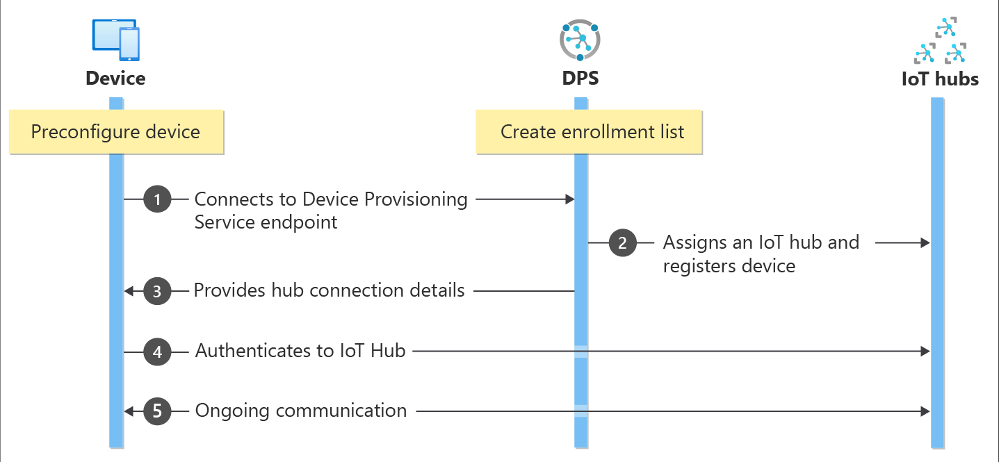

# Provisioning devices with Azure IoT Hub Device Provisioning Service
Microsoft Azure provides a rich set of integrated public cloud services for all your IoT solution needs. The IoT Hub Device Provisioning Service (DPS) is a helper service for IoT Hub that enables zero-touch, just-in-time provisioning to the right IoT hub without requiring human intervention. DPS enables the provisioning of millions of devices in a secure and scalable manner.

## When to use Device Provisioning Service
There are many provisioning scenarios in which DPS is an excellent choice for getting devices connected and configured to IoT Hub, such as:

* Zero-touch provisioning to a single IoT solution without hardcoding IoT Hub connection information at the factory (initial setup)
* Load-balancing devices across multiple hubs
* Connecting devices to their owner's IoT solution based on sales transaction data (multitenancy)
* Connecting devices to a particular IoT solution depending on use-case (solution isolation)
* Connecting a device to the IoT hub with the lowest latency (geo-sharding)
* Reprovisioning based on a change in the device
* Rolling the keys used by the device to connect to IoT Hub (when not using X.509 certificates to connect)

## Behind the scenes
All the scenarios listed in the previous section can be done using DPS for zero-touch provisioning with the same flow. Many of the manual steps traditionally involved in provisioning are automated with DPS to reduce the time to deploy IoT devices and lower the risk of manual error. The following section describes what goes on behind the scenes to get a device provisioned. The first step is manual, all of the following steps are automated.

1. Device manufacturer adds the device registration information to the enrollment list in the Azure portal.
2. Device contacts the DPS endpoint set at the factory. The device passes the identifying information to DPS to prove its identity.
3. DPS validates the identity of the device by validating the registration ID and key against the enrollment list entry using either a nonce challenge ([Trusted Platform Module](https://trustedcomputinggroup.org/work-groups/trusted-platform-module/)) or standard X.509 verification (X.509).
4. DPS registers the device with an IoT hub and populates the device's [desired twin state](../iot-hub/iot-hub-devguide-device-twins.md).
5. The IoT hub returns device ID information to DPS.
6. DPS returns the IoT hub connection information to the device. The device can now start sending data directly to the IoT hub.
7. The device connects to IoT hub.
8. The device gets the desired state from its device twin in IoT hub.

## Provisioning process
There are two distinct steps in the deployment process of a device in which DPS takes a part that can be done independently:

* The **manufacturing step** in which the device is created and prepared at the factory, and
* The **cloud setup step** in which the Device Provisioning Service is configured for automated provisioning.

Both these steps fit in seamlessly with existing manufacturing and deployment processes. DPS even simplifies some deployment processes that involve manual work to get connection information onto the device.

### Manufacturing step
This step is all about what happens on the manufacturing line. The roles involved in this step include silicon designer, silicon manufacturer, integrator and/or the end manufacturer of the device. This step is concerned with creating the hardware itself.

DPS does not introduce a new step in the manufacturing process; rather, it ties into the existing step that installs the initial software and (ideally) the HSM on the device. Instead of creating a device ID in this step, the device is programmed with the provisioning service information, enabling it to call the provisioning service to get its connection info/IoT solution assignment when it is switched on.

Also in this step, the manufacturer supplies the device deployer/operator with identifying key information. Supplying that information could be as simple as confirming that all devices have an X.509 certificate generated from a signing certificate provided by the device deployer/operator, or as complicated as extracting the public portion of a TPM endorsement key from each TPM device. These services are offered by many silicon manufacturers today.

### Cloud setup step
This step is about configuring the cloud for proper automatic provisioning. Generally there are two types of users involved in the cloud setup step: someone who knows how devices need to be initially set up (a device operator), and someone else who knows how devices are to be split among the IoT hubs (a solution operator).

There is a one-time initial setup of the provisioning that must occur, which is usually handled by the solution operator. Once the provisioning service is configured, it does not have to be modified unless the use case changes.

After the service has been configured for automatic provisioning, it must be prepared to enroll devices. This step is done by the device operator, who knows the desired configuration of the device(s) and is in charge of making sure the provisioning service can properly attest to the device's identity when it comes looking for its IoT hub. The device operator takes the identifying key information from the manufacturer and adds it to the enrollment list. There can be subsequent updates to the enrollment list as new entries are added or existing entries are updated with the latest information about the devices.

## Registration and provisioning
*Provisioning* means various things depending on the industry in which the term is used. In the context of provisioning IoT devices to their cloud solution, provisioning is a two part process:

1. The first part is establishing the initial connection between the device and the IoT solution by registering the device.
2. The second part is applying the proper configuration to the device based on the specific requirements of the solution it was registered to.

Once both of those two steps have been completed, we can say that the device has been fully provisioned. Some cloud services only provide the first step of the provisioning process, registering devices to the IoT solution endpoint, but do not provide the initial configuration. DPS automates both steps to provide a seamless provisioning experience for the device.

## Features of the Device Provisioning Service
DPS has many features, making it ideal for provisioning devices.

* **Secure attestation** support for both X.509 and TPM-based identities.
* **Enrollment list** containing the complete record of devices/groups of devices that may at some point register. The enrollment list contains information about the desired configuration of the device once it registers, and it can be updated at any time.
* **Multiple allocation policies** to control how DPS assigns devices to IoT hubs in support of your scenarios: Lowest latency, evenly weighted distribution (default), and static configuration via the enrollment list. Latency is determined using the same method as [Traffic Manager](https://docs.microsoft.com/azure/traffic-manager/traffic-manager-routing-methods#performance).
* **Monitoring and diagnostics logging** to make sure everything is working properly.
* **Multi-hub support** allows DPS to assign devices to more than one IoT hub. DPS can talk to hubs across multiple Azure subscriptions.
* **Cross-region support** allows DPS to assign devices to IoT hubs in other regions.
* **Encryption for data at rest** allows data in DPS to be encrypted and decrypted transparently using 256-bit AES encryption, one of the strongest block ciphers available, and is FIPS 140-2 compliant.

You can learn more about the concepts and features involved in device provisioning in [device concepts](concepts-device.md), [service concepts](concepts-service.md), and [security concepts](concepts-security.md).

## Cross-platform support
Just like all Azure IoT services, DPS works cross-platform with a variety of operating systems. Azure offers open-source SDKs in a variety of [languages](https://github.com/Azure/azure-iot-sdks) to facilitate connecting devices and managing the service. DPS supports the following protocols for connecting devices:

* HTTPS
* AMQP
* AMQP over web sockets
* MQTT
* MQTT over web sockets

DPS only supports HTTPS connections for service operations.

## Regions
DPS is available in many regions. The updated list of existing and newly announced regions for all services is at [Azure Regions](https://azure.microsoft.com/regions/). You can check availability of the Device Provisioning Service on the [Azure Status](https://azure.microsoft.com/status/) page.

> [!NOTE]
> DPS is global and not bound to a location. However, you must specify a region in which the metadata associated with your DPS profile will reside.

## Availability
There is a 99.9% Service Level Agreement for DPS, and you can [read the SLA](https://azure.microsoft.com/support/legal/sla/iot-hub/). The full [Azure SLA](https://azure.microsoft.com/support/legal/sla/) explains the guaranteed availability of Azure as a whole.

## Quotas
Each Azure subscription has default quota limits in place that could impact the scope of your IoT solution. The current limit on a per-subscription basis is 10 Device Provisioning Services per subscription.

[!INCLUDE [azure-iotdps-limits](../../includes/iot-dps-limits.md)]

For more details on quota limits:
* [Azure Subscription Service Limits](../azure-resource-manager/management/azure-subscription-service-limits.md)

## Related Azure components
DPS automates device provisioning with Azure IoT Hub. Learn more about [IoT Hub](https://docs.microsoft.com/azure/iot-hub/).

## Next steps
You now have an overview of provisioning IoT devices in Azure. The next step is to try out an end-to-end IoT scenario.
> [!div class="nextstepaction"]
> [Set up IoT Hub Device Provisioning Service with the Azure portal](quick-setup-auto-provision.md)
> [Create and provision a simulated device](quick-create-simulated-device.md)
> [Set up device for provisioning](tutorial-set-up-device.md)
