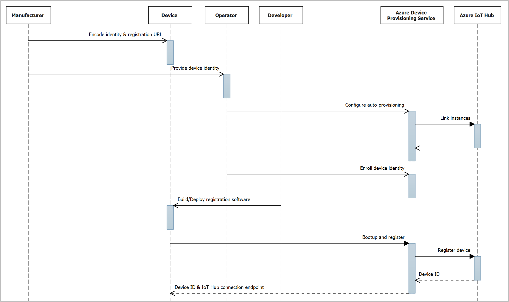

# Auto-provisioning concepts

As described in the [Overview](about-iot-dps.md), the Device Provisioning Service is a helper service that enables just-in-time provisioning of devices to an IoT hub, without requiring human intervention. After successful provisioning, devices connect directly with their designated IoT Hub. This process is referred to as auto-provisioning, and provides an out-of-the-box registration and initial configuration experience for devices.

## Overview

Azure IoT auto-provisioning can be broken into three phases:

1. **Service configuration** - a one-time configuration of the Azure IoT Hub and IoT Hub Device Provisioning Service instances, establishing them and creating linkage between them.

   > [!NOTE]
   > Regardless of the size of your IoT solution, even if you plan to support millions of devices, this is a **one-time configuration**.

2. **Device enrollment** - the process of making the Device Provisioning Service instance aware of the devices that will attempt to register in the future. [Enrollment](concepts-service.md#enrollment) is accomplished by configuring device identity information in the provisioning service, as either an "individual enrollment" for a single device, or a "group enrollment" for multiple devices. Identity is based on the [attestation mechanism](concepts-security.md#attestation-mechanism) the device is designed to use, which allows the provisioning service to attest to the device's authenticity during registration:

   - **TPM**: configured as an "individual enrollment", the device identity is based on the TPM registration ID and the public endorsement key. Given that TPM is a [specification](https://trustedcomputinggroup.org/work-groups/trusted-platform-module/), the service only expects to attest per the specification, regardless of TPM implementation (hardware or software). See [Device provisioning: Identity attestation with TPM](https://azure.microsoft.com/blog/device-provisioning-identity-attestation-with-tpm/) for details on TPM-based attestation. 

   - **X509**: configured as either an "individual enrollment" or "group enrollment", the device identity is based on an X.509 digital certificate, which is uploaded to the enrollment as a .pem or .cer file.

   > [!IMPORTANT]  
   > Although not a prerequisite for using Device Provisioning Services, we strongly recommend that your device use a Hardware Security Module (HSM) to store sensitive device identity information, such as keys and X.509 certificates.

3. **Device registration and configuration** - initiated upon boot up by registration software, which is built using a Device Provisioning Service client SDK appropriate for the device and attestation mechanism. The software establishes a connection to the provisioning service for authentication of the device, and subsequent registration in the IoT Hub. Upon successful registration, the device is provided with its IoT Hub unique device ID and connection information, allowing it to pull its initial configuration and begin the telemetry process. In production environments, this phase can occur weeks or months after the previous two phases.

## Roles and operations

The phases discussed in the previous section can span weeks or months, due to production realities like manufacturing time, shipping, customs process, etc. In addition, they can span activities across multiple roles given the various entities involved. This section takes a deeper look at the various roles and operations related to each phase, then illustrates the flow in a sequence diagram. 

Auto-provisioning also places requirements on the device manufacturer, specific to enabling the attestation mechanism. Manufacturing operations can also occur independent of the timing of auto-provisioning phases, especially in cases where new devices are procured after auto-provisioning has already been established.

A series of Quickstarts are provided in the table of contents to the left, to help explain auto-provisioning through hands-on experience. In order to facilitate/simplify the learning process, software is used to simulate a physical device for enrollment and registration. Some Quickstarts require you to fulfill operations for multiple roles, including operations for non-existent roles, due to the simulated nature of the Quickstarts.

| Role | Operation | Description | 
|------| --------- | ------------| 
| Manufacturer | Encode identity and registration URL | Based on the attestation mechanism used, the manufacturer is responsible for encoding the device identity info, and the Device Provisioning Service registration URL.  **Quickstarts**: since the device is simulated, there is no Manufacturer role. See the Developer role for details on how you get this information, which is used in coding a sample registration application. |  
| | Provide device identity | As the originator of the device identity info, the manufacturer is responsible for communicating it to the operator (or a designated agent), or directly enrolling it to the Device Provisioning Service via APIs.  **Quickstarts**: since the device is simulated, there is no Manufacturer role. See the Operator role for details on how you get the device identity, which is used to enroll a simulated device in your Device Provisioning Service instance. | 
| Operator | Configure auto-provisioning | This operation corresponds with the first phase of auto-provisioning.  **Quickstarts**: You perform the Operator role, configuring the Device Provisioning Service and IoT Hub instances in your Azure subscription. | Set-up auto-provisioning |
|  | Enroll device identity | This operation corresponds with the second phase of auto-provisioning.  **Quickstarts**: You perform the Operator role, enrolling your simulated device in your Device Provisioning Service instance. The device identity is determined by the attestation method being simulated in the Quickstart (TPM or X.509). See the Developer role for attestation details. | 
| Device Provisioning Service, IoT Hub | \<all operations\> | For both a production implementation with physical devices, and Quickstarts with simulated devices, these roles are fulfilled via the IoT services you configure in your Azure subscription. The roles/operations function exactly the same, as the IoT services are indifferent to provisioning of physical vs. simulated devices. | 
| Developer | Build/Deploy registration software | This operation corresponds with the third phase of auto-provisioning. The Developer is responsible for building and deploying the registration software to the device, using the appropriate SDK.  **Quickstarts**: The sample registration application you build simulates a real device, for your platform/language of choice, which runs on your workstation (instead of deploying it to a physical device). The registration application performs the same operations as one deployed to a physical device. You specify the attestation method (TPM or X.509 certificate), plus the registration URL and "ID Scope" of your Device Provisioning Service instance. The device identity is determined by the SDK attestation logic at runtime, based on the method you specify: <ul><li>**TPM attestation** - your development workstation runs a [TPM simulator application](how-to-use-sdk-tools.md#trusted-platform-module-tpm-simulator). Once running, a separate application is used to extract the TPM's "Endorsement Key" and "Registration ID" for use in enrolling the device identity. The SDK attestation logic also uses the simulator during registration, to present a signed SAS token for authentication and enrollment verification.</li><li>**X509 attestation** - you use a tool to [generate a certificate](how-to-use-sdk-tools.md#x509-certificate-generator). Once generated, you create the certificate file required for use in enrollment. The SDK attestation logic also uses the certificate during registration, to present for authentication and enrollment verification.</li></ul> | 
| Device | Bootup and register | This operation corresponds with the third phase of auto-provisioning, fulfilled by the device registration software built by the Developer. See the Developer role for details. Upon first boot: <ol><li>The application connects with the Device Provisioning Service instance, per the global URL and service "ID Scope" specified during development.</li><li>Once connected, the device is authenticated against the attestation method and identity specified during enrollment.</li><li>Once authenticated, the device is registered with the IoT Hub instance specified by the provisioning service instance.</li><li>Upon successful registration, a unique device ID and IoT Hub endpoint are returned to the registration application for communicating with IoT Hub.</li><li> From there, the device can pull down its initial [device twin](~/articles/iot-hub/iot-hub-devguide-device-twins.md) state for configuration, and begin the process of reporting telemetry data.</li></ol>**Quickstarts**: since the device is simulated, the registration software runs on your development workstation.| 

The following diagram summarizes the roles and sequencing of operations during device auto-provisioning:
  
 

> [!NOTE]
> Optionally, the manufacturer can also perform the "Enroll device identity" operation using Device Provisioning Service APIs (instead of via the Operator). For a detailed discussion of this sequencing and more, see the [Zero touch device registration with Azure IoT video](https://youtu.be/cSbDRNg72cU?t=2460) (starting at marker 41:00)

## Next steps

You may find it helpful to bookmark this article as a point of reference, as you work your way through the corresponding auto-provisioning Quickstarts. 

Begin by completing a "Set up auto-provisioning" Quickstart that best suits your management tool preference, which walks you through the "Service configuration" phase:

- [Set up auto-provisioning using Azure CLI](quick-setup-auto-provision-cli.md)
- [Set up auto-provisioning using the Azure Portal](quick-setup-auto-provision.md)
- [Set up auto-provisioning using a Resource Manager template](quick-setup-auto-provision-rm.md)

Then continue with an "Auto-provision a simulated device" Quickstart that suits your device attestation mechanism and Device Provisioning Service SDK/language preference. In this Quickstart, you walk through the "Device enrollment" and "Device registration and configuration" phases: 

|  | Simulated device attestation mechanism | Quickstart SDK/Language |  |
|--|--|--|--|
|  | Trusted Platform Module (TPM) | [C](quick-create-simulated-device.md) [Java](quick-create-simulated-device-tpm-java.md) [C#](quick-create-simulated-device-tpm-csharp.md) [Python](quick-create-simulated-device-tpm-python.md) |  |
|  | X.509 certificate | [C](quick-create-simulated-device-x509.md) [Java](quick-create-simulated-device-x509-java.md) [C#](quick-create-simulated-device-x509-csharp.md) [Node.js](quick-create-simulated-device-x509-node.md) [Python](quick-create-simulated-device-x509-python.md) |  |

