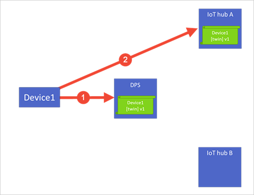
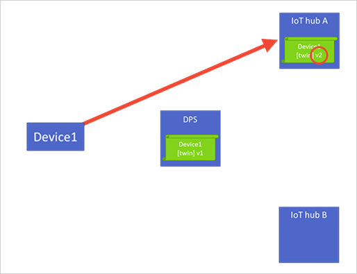
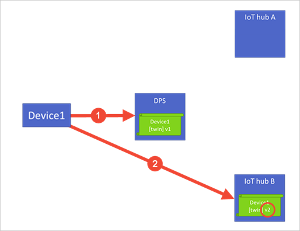
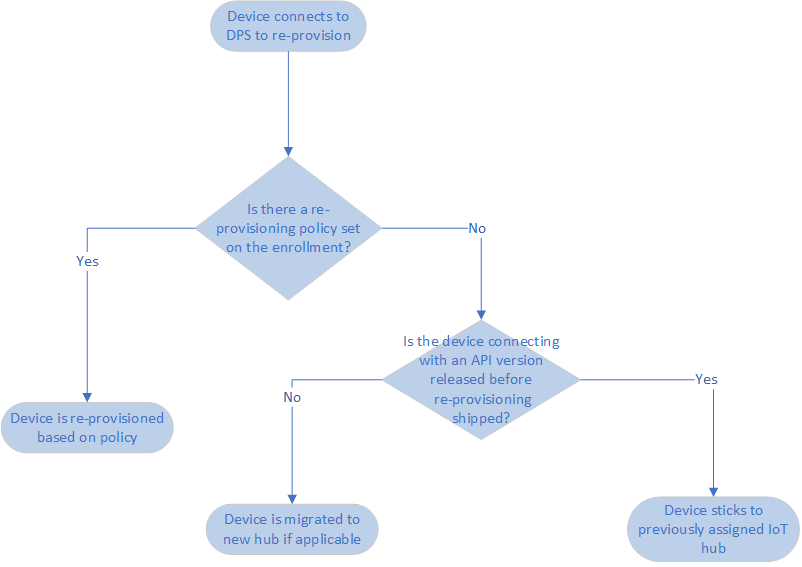

# IoT Hub Device reprovisioning concepts

During the lifecycle of an IoT solution, it's common to move devices between IoT hubs. The reasons for this move may include the following scenarios:

* **Geolocation / GeoLatency**: As a device moves between locations, network latency is improved by having the device migrated to a closer IoT hub.

* **Multi-tenancy**: A device may be used within the same IoT solution and reassigned to a new customer, or customer site. This new customer may be serviced using a different IoT hub.

* **Solution change**: A device could be moved into a new or updated IoT solution. This reassignment may require the device to communicate with a new IoT hub that's connected to other back-end components.

* **Quarantine**: Similar to a solution change. A device that's malfunctioning, compromised, or out-of-date may be reassigned to an IoT hub that can only update and get back in compliance. Once the device is functioning properly, it's then migrated back to its main hub.

Reprovisioning support within the Device Provisioning Service addresses these needs. Devices can be automatically reassigned to new IoT hubs based on the reprovisioning policy that's configured on the device's enrollment entry.

## Device state data

Device state data is composed of the [device twin](../iot-hub/iot-hub-devguide-device-twins.md) and device capabilities. This data is stored in the Device Provisioning Service instance and the IoT hub that a device is assigned to.

When a device is initially provisioned with a Device Provisioning Service instance, the following steps are done:

1. The device sends a provisioning request to a Device Provisioning Service instance. The service instance authenticates the device identity based on an enrollment entry, and creates the initial configuration of the device state data. The service instance assigns the device to an IoT hub based on the enrollment configuration and returns that IoT hub assignment to the device.

2. The provisioning service instance gives a copy of any initial device state data to the assigned IoT hub. The device connects to the assigned IoT hub and begins operations.

Over time, the device state data on the IoT hub may be updated by [device operations](../iot-hub/iot-hub-devguide-device-twins.md#device-operations) and [back-end operations](../iot-hub/iot-hub-devguide-device-twins.md#back-end-operations). The initial device state information stored in the Device Provisioning Service instance stays untouched. This untouched device state data is the initial configuration.

Depending on the scenario, as a device moves between IoT hubs, it may also be necessary to migrate device state updated on the previous IoT hub over to the new IoT hub. This migration is supported by reprovisioning policies in the Device Provisioning Service.

## Reprovision policies

Depending on the scenario, a device could send a request to a provisioning service instance on reboot. It also supports a method to manually trigger provisioning on demand. The reprovisioning policy on an enrollment entry determines how the device provisioning service instance handles these provisioning requests. The policy also determines whether device state data should be migrated during reprovisioning. The same policies are available for individual enrollments and enrollment groups:

* **Reprovision and migrate data**: This policy is the default for new enrollment entries. This policy takes action when devices associated with the enrollment entry submit a new request (1). Depending on the enrollment entry configuration, the device may be reassigned to another IoT hub. If the device is changing IoT hubs, the device registration with the initial IoT hub will be removed. The updated device state information from that initial IoT hub will be migrated over to the new IoT hub (2). During migration, the device's status will be reported as **Assigning**.

    

* **Reprovision and reset to initial config**: This policy takes action when devices associated with the enrollment entry submit a new provisioning request (1). Depending on the enrollment entry configuration, the device may be reassigned to another IoT hub. If the device is changing IoT hubs, the device registration with the initial IoT hub will be removed. The initial configuration data that the provisioning service instance received when the device was provisioned is provided to the new IoT hub (2). During migration, the device's status will be reported as **Assigning**.

    This policy is often used for a factory reset without changing IoT hubs.

    

* **Never reprovision**: The device is never reassigned to a different hub. This policy is provided for managing backwards compatibility.

> [!NOTE]
> DPS will always call the custom allocation webhook regardless of reprovisioning policy in case there is new [ReturnData](concepts-custom-allocation.md#use-device-payloads-in-custom-allocation) for the device. If the reprovisioning policy is set to **never reprovision**, the webhook will be called but the device will not change its assigned hub.

When designing your solution and defining a reprovisioning logic there are a few things to consider. For example:

* How often you expect your devices to restart
* The [DPS quotas and limits](about-iot-dps.md#quotas-and-limits)
* Expected deployment time for your fleet (phased rollout vs all at once)
* Retry capability implemented on your client code, as described on the [Retry general guidance](/azure/architecture/best-practices/transient-faults) at the Azure Architecture Center

>[!TIP]
> We recommend not provisioning on every reboot of the device, as this could cause some issues when reprovisioning several thousands or millions of devices at once. Instead you should attempt to use the [Device Registration Status Lookup](/rest/api/iot-dps/device/runtime-registration/device-registration-status-lookup) API and try to connect with that information to IoT Hub. If that fails, then try to reprovision as the IoT Hub information might have changed.  Keep in mind that querying for the registration state will count as a new device registration, so you should consider the [Device registration limit]( about-iot-dps.md#quotas-and-limits). Also consider implementing an appropriate retry logic, such as exponential back-off with randomization, as described on the [Retry general guidance](/azure/architecture/best-practices/transient-faults).
>In some cases, depending on the device capabilities, it’s possible to save the IoT Hub information directly on the device to connect directly to IoT Hub after the first-time provisioning using DPS occurred.  If you choose to do this, make sure you implement a fallback mechanism in case you get specific [errors from Hub occur](../iot-hub/troubleshoot-message-routing.md#common-error-codes), for example, consider the following scenarios:
> * Retry the Hub operation if the result code is 429 (Too Many Requests) or an error in the 5xx range. Do not retry for any other errors. 
> * For 429 errors, only retry after the time indicated in the Retry-After header. 
> * For 5xx errors, use exponential back-off, with the first retry at least 5 seconds after the response. 
> * On errors other than 429 and 5xx, re-register through DPS 
> * Ideally you should also support a [method](../iot-hub/iot-hub-devguide-direct-methods.md) to manually trigger provisioning on demand.
> 
> We also recommend taking into account the service limits when planning activities like pushing updates to your fleet. For example, updating the fleet all at once could cause all devices to re-register through DPS (which could easily be above the registration quota limit) - For such scenarios, consider planning for device updates in phases instead of updating your entire fleet at the same time.

### Managing backwards compatibility

Before September 2018, device assignments to IoT hubs had a sticky behavior. When a device went back through the provisioning process, it would only be assigned back to the same IoT hub.

For solutions that have taken a dependency on this behavior, the provisioning service includes backwards compatibility. This behavior is presently maintained for devices according to the following criteria:

1. The devices connect with an API version before the availability of native reprovisioning support in the Device Provisioning Service. Refer to the API table below.

2. The enrollment entry for the devices doesn't have a reprovisioning policy set on them.

This compatibility makes sure that previously deployed devices experience the same behavior that's present during initial testing. To preserve the previous behavior, don't save a reprovisioning policy to these enrollments. If a reprovisioning policy is set, the reprovisioning policy takes precedence over the behavior. By allowing the reprovisioning policy to take precedence, customers can update device behavior without having to reimage the device.

The following flow chart helps to show when the behavior is present:

The following table shows the API versions before the availability of native reprovisioning support in the Device Provisioning Service:

| REST API | C SDK | Python SDK |  Node SDK | Java SDK | .NET SDK |
| -------- | ----- | ---------- | --------- | -------- | -------- |
| [2018-04-01 and earlier](/rest/api/iot-dps/service/individual-enrollment/create-or-update#uri-parameters) | [1.2.8 and earlier](https://github.com/Azure/azure-iot-sdk-c/blob/master/version.txt) | [1.4.2 and earlier](https://github.com/Azure/azure-iot-sdk-python/blob/0a549f21f7f4fc24bc036c1d2d5614e9544a9667/device/iothub_client_python/src/iothub_client_python.cpp#L53) | [1.7.3 or earlier](https://github.com/Azure/azure-iot-sdk-node/blob/074c1ac135aebb520d401b942acfad2d58fdc07f/common/core/package.json#L3) | [1.13.0 or earlier](https://github.com/Azure/azure-iot-sdk-java/blob/794c128000358b8ed1c4cecfbf21734dd6824de9/device/iot-device-client/pom.xml#L7) | [1.1.0 or earlier](https://github.com/Azure/azure-iot-sdk-csharp/blob/9f7269f4f61cff3536708cf3dc412a7316ed6236/provisioning/device/src/Microsoft.Azure.Devices.Provisioning.Client.csproj#L20)

> [!NOTE]
> These values and links are likely to change. This is only a placeholder attempt to determine where the versions can be determined by a customer and what the expected versions will be.

## Next steps

* [How to reprovision devices](how-to-reprovision.md)
