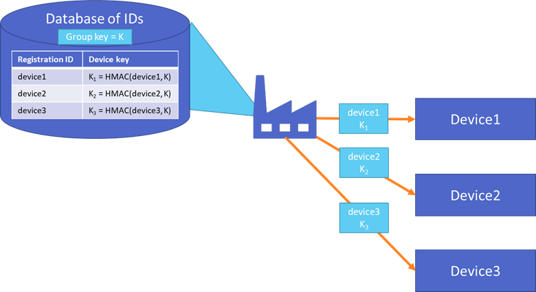

# Symmetric key attestation

This article describes the identity attestation process when using symmetric keys with the Device Provisioning Service. 

Symmetric key attestation is a simple approach to authenticating a device with a Device Provisioning Service instance. This attestation method represents a "Hello world" experience for developers who are new to device provisioning, or do not have strict security requirements. Device attestation using a [TPM](concepts-tpm-attestation.md) or an [X.509 certificate](concepts-security.md#x509-certificates) is more secure, and should be used for more stringent security requirements.

Symmetric key enrollments also provide a great way for legacy devices, with limited security functionality, to bootstrap to the cloud via Azure IoT. For more information on symmetric key attestation with legacy devices, see [How to use symmetric keys with legacy devices](how-to-legacy-device-symm-key.md).


## Symmetric key creation

By default, the Device Provisioning Service creates new symmetric keys with a default length of 32 bytes when new enrollments are saved with the **Auto-generate keys** option enabled.


You can also provide your own symmetric keys for enrollments by disabling this option. When specifying your own symmetric keys, your keys must have a key length between 16 bytes and 64 bytes. Also, symmetric keys must be provided in valid Base64 format.


## Detailed attestation process

Symmetric key attestation with the Device Provisioning Service is performed using the same [Security tokens](../iot-hub/iot-hub-devguide-security.md#security-token-structure) supported by IoT hubs to identify devices. These security tokens are [Shared Access Signature (SAS) tokens](../service-bus-messaging/service-bus-sas.md). 

SAS tokens have a hashed *signature* that is created using the symmetric key. The signature is recreated by the Device Provisioning Service to verify whether a security token presented during attestation is authentic or not.

SAS tokens have the following form:

`SharedAccessSignature sig={signature}&se={expiry}&skn={policyName}&sr={URL-encoded-resourceURI}`

Here are the components of each token:

| Value | Description |
| --- | --- |
| {signature} |An HMAC-SHA256 signature string. For individual enrollments, this signature is produced by using the symmetric key (primary or secondary) to perform the hash. For enrollment groups, a key derived from the enrollment group key is used to perform the hash. The hash is performed on a message of the form: `URL-encoded-resourceURI + "\n" + expiry`. **Important**: The key must be decoded from base64 before being used to perform the HMAC-SHA256 computation. Also, the signature result must be URL-encoded. |
| {resourceURI} |URI of the registration endpoint that can be accessed with this token, starting with scope ID for the Device Provisioning Service instance. For example, `{Scope ID}/registrations/{Registration ID}` |
| {expiry} |UTF8 strings for number of seconds since the epoch 00:00:00 UTC on 1 January 1970. |
| {URL-encoded-resourceURI} |Lower case URL-encoding of the lower case resource URI |
| {policyName} |The name of the shared access policy to which this token refers. The policy name used when provisioning with symmetric key attestation is **registration**. |

When a device is attesting with an individual enrollment, the device uses the symmetric key defined in the individual enrollment entry to create the hashed signature for the SAS token.

For code examples that create a SAS token, see [Security Tokens](../iot-hub/iot-hub-devguide-security.md#security-token-structure).

Creating security tokens for symmetric key attestation is supported by the Azure IoT C SDK. For an example using the Azure IoT C SDK to attest with an individual enrollment, see [Provision a simulated device with symmetric keys](quick-create-simulated-device-symm-key.md).


## Group Enrollments

The symmetric keys for group enrollments are not used directly by devices when provisioning. Instead devices that belong to an enrollment group provision using a derived device key. 

First, a unique registration ID is defined for each device attesting with an enrollment group. Valid characters for the registration ID are lowercase alphanumeric and dash ('-'). This registration ID should be something unique that identifies the device. For example, a legacy device may not support many security features. The legacy device may only have a MAC address or serial number available to uniquely identify that device. In that case, a registration ID can be composed of the MAC address and serial number similar to the following:

```
sn-007-888-abc-mac-a1-b2-c3-d4-e5-f6
```

This exact example is used in the [How to provision legacy devices using symmetric keys](how-to-legacy-device-symm-key.md) article.

Once a registration ID has been defined for the device, the symmetric key for the enrollment group is used to compute an [HMAC-SHA256](https://wikipedia.org/wiki/HMAC) hash of the registration ID to produce a derived device key. The hashing of the registration ID can be performed with the following C# code:

```csharp
using System; 
using System.Security.Cryptography; 
using System.Text;  

public static class Utils 
{ 
    public static string ComputeDerivedSymmetricKey(byte[] masterKey, string registrationId) 
    { 
        using (var hmac = new HMACSHA256(masterKey)) 
        { 
            return Convert.ToBase64String(hmac.ComputeHash(Encoding.UTF8.GetBytes(registrationId))); 
        } 
    } 
} 
```

```csharp
String deviceKey = Utils.ComputeDerivedSymmetricKey(Convert.FromBase64String(masterKey), registrationId);
```

The resulting device key is then used to generate a SAS token to be used for attestation. Each device in an enrollment group is required to attest using a security token generated from a unique derived key. The enrollment group symmetric key cannot be used directly for attestation.

#### Installation of the derived device key

Ideally the device keys are derived and installed in the factory. This method guarantees the group key is never included in any software deployed to the device. When the device is assigned a MAC address or serial number, the key can be derived and injected into the device however the manufacturer chooses to store it.

Consider the following diagram that shows a table of device keys generated in a factory by hashing each device registration ID with the group enrollment key (**K**). 



The identity of each device is represented by the registration ID and derived device key that is installed at the factory. The device key is never copied to another location and the group key is never stored on a device.

If the device keys are not installed in the factory, a [hardware security module HSM](concepts-security.md#hardware-security-module) should be used to securely store the device identity.

## Next steps

Now that you have an understanding of Symmetric Key attestation, check out the following articles to learn more:

* [Quickstart: Provision a simulated device with symmetric keys](quick-create-simulated-device-symm-key.md)
* [Learn about the concepts in auto-provisioning](./concepts-auto-provisioning.md)
* [Get started using auto-provisioning](./quick-setup-auto-provision.md) 
