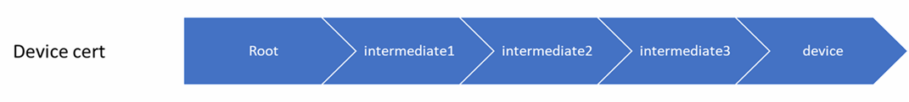
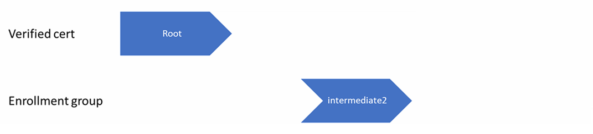
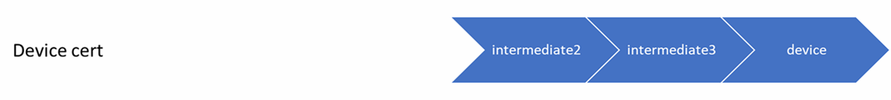

# X.509 certificate attestation

This article gives an overview of the Device Provisioning Service (DPS) concepts involved when provisioning devices using X.509 certificate attestation. This article is relevant to all personas involved in getting a device ready for deployment.

X.509 certificates can be stored in a hardware security module HSM.

> [!TIP]
> We strongly recommend using an HSM with devices to securely store secrets, like the X.509 certificate, on your devices in production.

## X.509 certificates

Using X.509 certificates as an attestation mechanism is an excellent way to scale production and simplify device provisioning. X.509 certificates are typically arranged in a certificate chain of trust in which each certificate in the chain is signed by the private key of the next higher certificate, and so on, terminating in a self-signed root certificate. This arrangement establishes a delegated chain of trust from the root certificate generated by a trusted root certificate authority (CA) down through each intermediate CA to the end-entity "leaf" certificate installed on a device. To learn more, see [Device Authentication using X.509 CA Certificates](../iot-hub/iot-hub-x509ca-overview.md). 

Often the certificate chain represents some logical or physical hierarchy associated with devices. For example, a manufacturer may:

- issue a self-signed root CA certificate
- use the root certificate to generate a unique intermediate CA certificate for each factory
- use each factory's certificate to generate a unique intermediate CA certificate for each production line in the plant
- and finally use the production line certificate, to generate a unique device (end-entity) certificate for each device manufactured on the line.

To learn more, see [Conceptual understanding of X.509 CA certificates in the IoT industry](../iot-hub/iot-hub-x509ca-concept.md). 

### Root certificate

A root certificate is a self-signed X.509 certificate representing a certificate authority (CA). It is the terminus, or trust anchor, of the certificate chain. Root certificates can be self-issued by an organization or purchased from a root certificate authority. To learn more, see [Get X.509 CA certificates](../iot-hub/tutorial-x509-scripts.md). The root certificate can also be referred to as a root CA certificate.

### Intermediate certificate

An intermediate certificate is an X.509 certificate, which has been signed by the root certificate (or by another intermediate certificate with the root certificate in its chain). The last intermediate certificate in a chain is used to sign the leaf certificate. An intermediate certificate can also be referred to as an intermediate CA certificate.

#### Why are intermediate certs useful?

Intermediate certificates are used in a variety of ways. For example, intermediate certificates can be used to group devices by product lines, customers purchasing devices, company divisions, or factories. 

Imagine that Contoso is a large corporation with its own Public Key Infrastructure (PKI) using the root certificate named *ContosoRootCert*. Each subsidiary of Contoso has their own intermediate certificate that is signed by *ContosoRootCert*. Each subsidiary will then use their intermediate certificate to sign their leaf certificates for each device. In this scenario, Contoso can use a single DPS instance where *ContosoRootCert* has been verified with [proof-of-possession](./how-to-verify-certificates.md). They can have an enrollment group for each subsidiary. This way each individual subsidiary will not have to worry about verifying certificates.

### End-entity "leaf" certificate

The leaf certificate, or end-entity certificate, identifies the certificate holder. It has the root certificate in its certificate chain as well as zero or more intermediate certificates. The leaf certificate is not used to sign any other certificates. It uniquely identifies the device to the provisioning service and is sometimes referred to as the device certificate. During authentication, the device uses the private key associated with this certificate to respond to a proof of possession challenge from the service.

Leaf certificates used with [Individual enrollment](./concepts-service.md#individual-enrollment) or [Enrollment group](./concepts-service.md#enrollment-group) entries must have the subject common name (CN) set to the registration ID. The registration ID identifies the device registration with DPS and must be unique to the DPS instance (ID scope) where the device registers. The registration ID is a case-insensitive string of alphanumeric characters plus the special characters: `'-'`, `'.'`, `'_'`, `':'`. The last character must be alphanumeric or dash (`'-'`). DPS supports registration IDs up to 128 characters long; however, the maximum length of the subject common name in an X.509 certificate is 64 characters. The registration ID, therefore, is limited to 64 characters when using X.509 certificates.

For enrollment groups, the subject common name (CN) also sets the device ID that is registered with IoT Hub. The device ID will be shown in the **Registration Records** for the authenticated device in the enrollment group. For individual enrollments, the device ID can be set in the enrollment entry. If it's not set in the enrollment entry, then the subject common name (CN) is used.

To learn more, see [Authenticate devices signed with X.509 CA certificates](../iot-hub/iot-hub-x509ca-overview.md#authenticate-devices-signed-with-x509-ca-certificates).

## Controlling device access to the provisioning service with X.509 certificates

The provisioning service exposes two enrollment types that you can use to control device access with the X.509 attestation mechanism:  

- [Individual enrollment](./concepts-service.md#individual-enrollment) entries are configured with the device certificate associated with a specific device. These entries control enrollments for specific devices.
- [Enrollment group](./concepts-service.md#enrollment-group) entries are associated with a specific intermediate or root CA certificate. These entries control enrollments for all devices that have that intermediate or root certificate in their certificate chain.

A certificate can be specified in only one enrollment entry in your DPS instance.

### Mutual TLS support

When DPS enrollments are configured for X.509 attestation, mutual TLS (mTLS) is supported by DPS.

### DPS device chain requirements

When a device is attempting registration through DPS using an enrollment group, the device must send the certificate chain from the leaf certificate to a certificate verified with [proof-of-possession](how-to-verify-certificates.md). Otherwise, authentication will fail.

For example, if only the root certificate is verified and an intermediate certificate is uploaded to the enrollment group, the device should present the certificate chain from leaf certificate all the way to the verified root certificate. This certificate chain would include any intermediate certificates in-between. Authentication will fail if DPS cannot traverse the certificate chain to a verified certificate.

For example, consider a corporation using the following device chain for a device.

 

Only the root certificate is verified, and *intermediate2* certificate is uploaded on the enrollment group.

 

If the device only sends the following device chain during provisioning, authentication will fail. Because DPS can't attempt authentication assuming the validity of *intermediate1* certificate

 

If the device sends the full device chain as follows during provisioning, then DPS can attempt authentication of the device.

 

> [!NOTE]
> Intermediate certificates can also be verified with [proof-of-possession](how-to-verify-certificates.md)..

### DPS order of operations with certificates

When a device connects to the provisioning service, the service walks its certificate chain beginning with the device (leaf) certificate and looks for a corresponding enrollment entry. It uses the first entry that it finds in the chain to determine whether to provision the device. That is, if an individual enrollment for the device (leaf) certificate exists, the provisioning service applies that entry. If there isn't an individual enrollment for the device, the service looks for an enrollment group that corresponds to the first intermediate certificate. If it finds one, it applies that entry; otherwise, it looks for an enrollment group for the next intermediate certificate, and so on down the chain to the root.  

The service applies the first entry that it finds, such that:

- If the first enrollment entry found is enabled, the service provisions the device.
- If the first enrollment entry found is disabled, the service doesn't provision the device.  
- If no enrollment entry is found for any of the certificates in the device's certificate chain, the service doesn't provision the device.

Note that each certificate in a device's certificate chain can be specified in an enrollment entry, but it can be specified in only one entry in the DPS instance.

This mechanism and the hierarchical structure of certificate chains provides powerful flexibility in how you can control access for individual devices as well as for groups of devices. For example, imagine five devices with the following certificate chains:

- *Device 1*: root certificate -> certificate A -> device 1 certificate
- *Device 2*: root certificate -> certificate A -> device 2 certificate
- *Device 3*: root certificate -> certificate A -> device 3 certificate
- *Device 4*: root certificate -> certificate B -> device 4 certificate
- *Device 5*: root certificate -> certificate B -> device 5 certificate

Initially, you can create a single enabled group enrollment entry for the root certificate to enable access for all five devices. If certificate B later becomes compromised, you can create a disabled enrollment group entry for certificate B to prevent *Device 4* and *Device 5* from enrolling. If still later *Device 3* becomes compromised, you can create a disabled individual enrollment entry for its certificate. This revokes access for *Device 3*, but still allows *Device 1* and *Device 2* to enroll.
