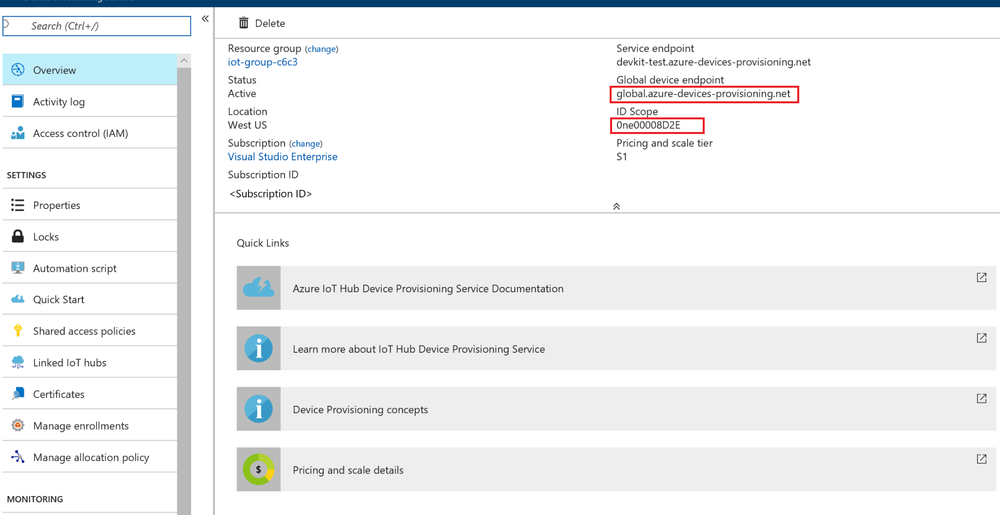
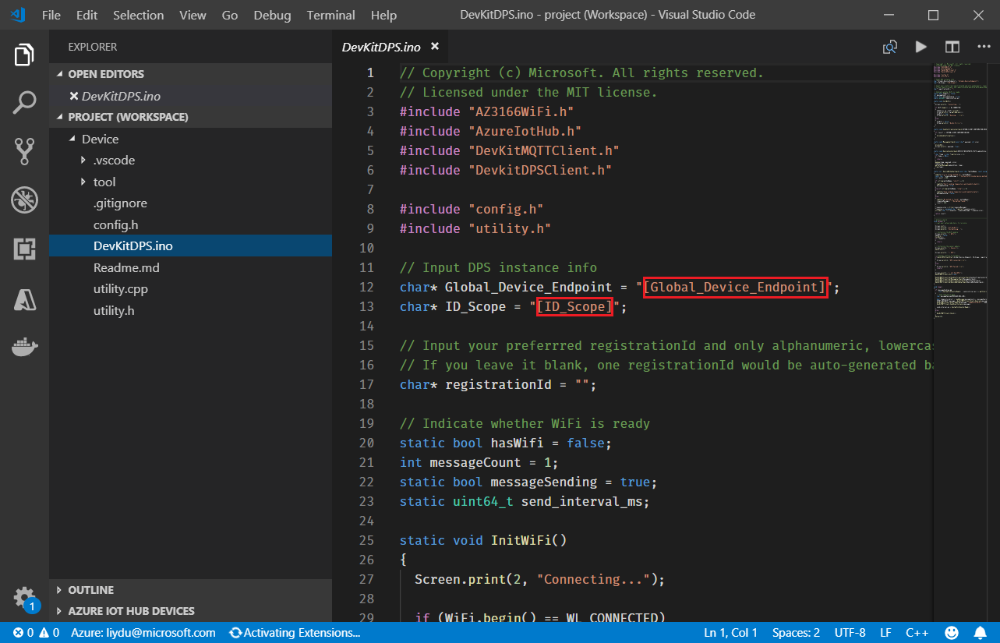
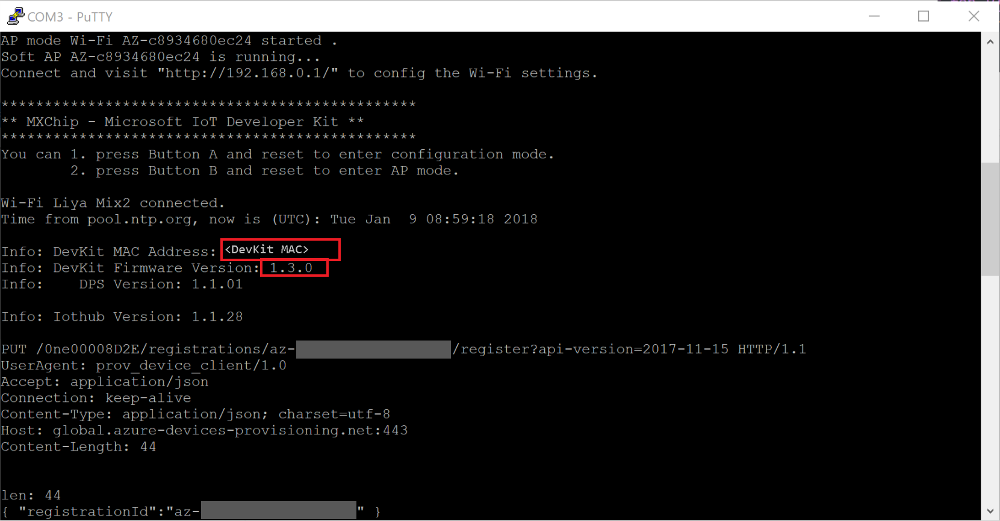
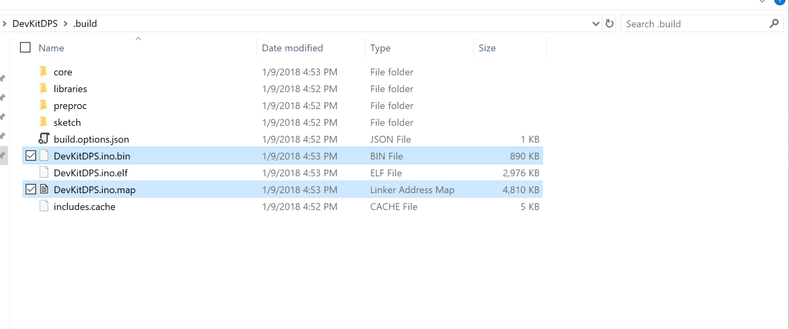
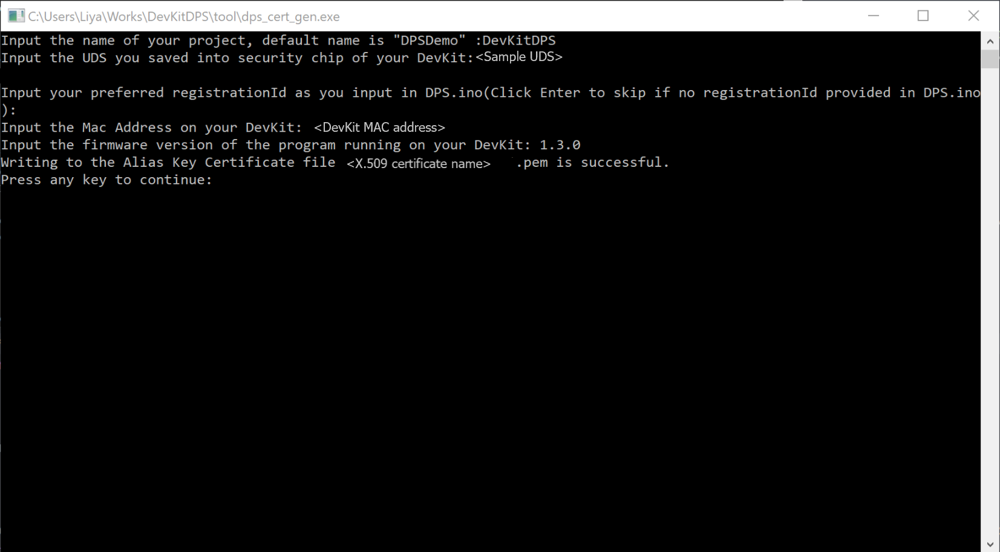
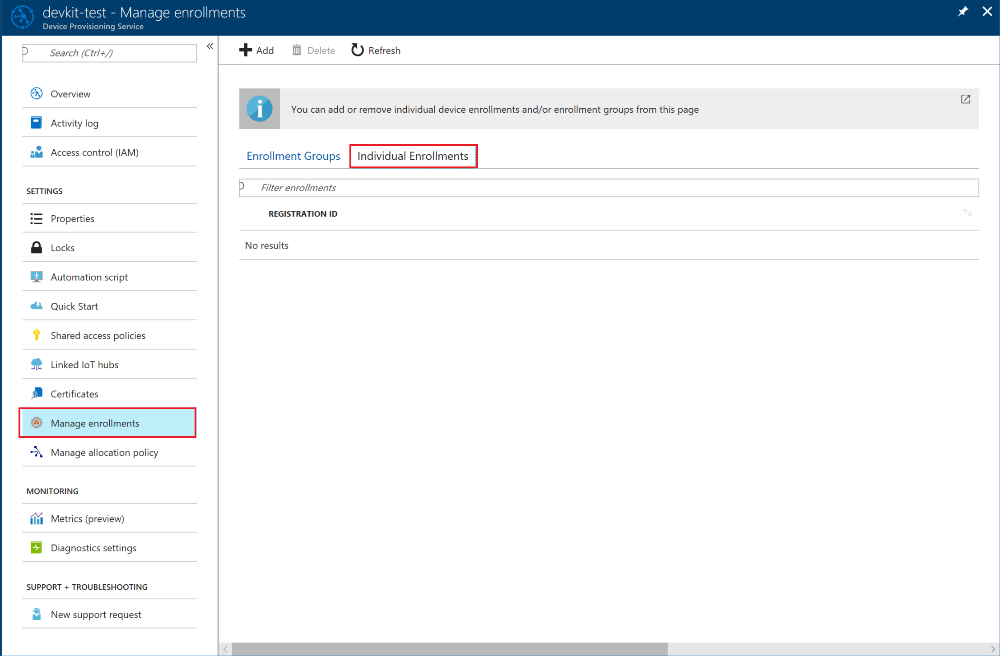
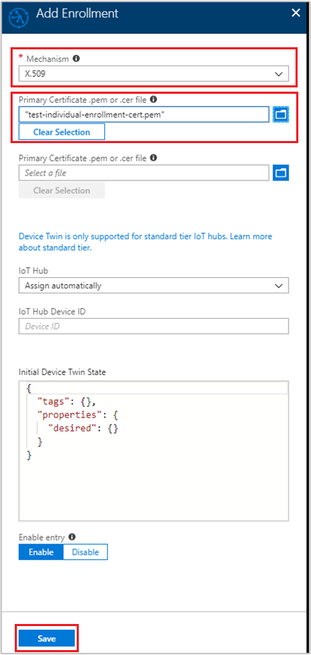
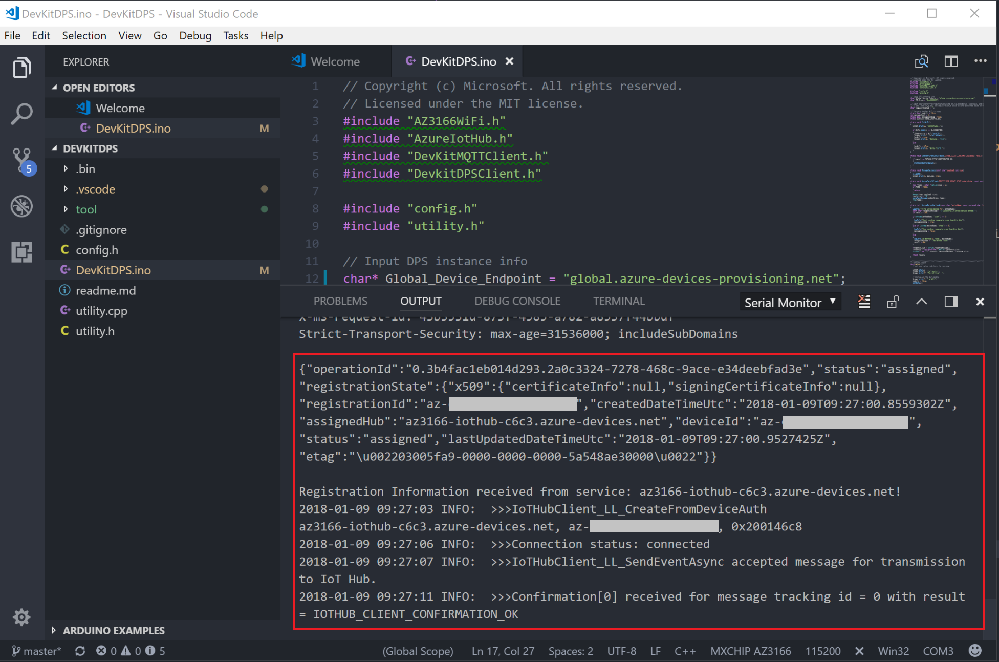
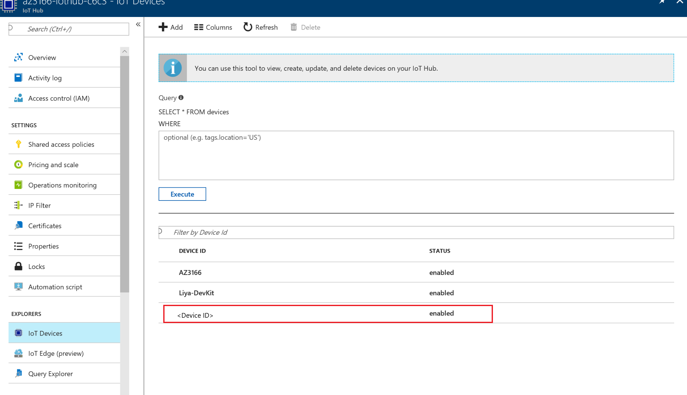

# Use Azure IoT Hub Device Provisioning Service auto-provisioning to register the MXChip IoT DevKit with IoT Hub

This article describes how to use Azure IoT Hub Device Provisioning Service [auto-provisioning](concepts-auto-provisioning.md), to register the MXChip IoT DevKit with Azure IoT Hub. In this tutorial, you learn how to:

* Configure the global endpoint of the Device Provisioning service on a device.
* Use a unique device secret (UDS) to generate an X.509 certificate.
* Enroll an individual device.
* Verify that the device is registered.

The [MXChip IoT DevKit](https://aka.ms/iot-devkit) is an all-in-one Arduino-compatible board with rich peripherals and sensors. You can develop for it by using the [Visual Studio Code extension for Arduino](https://aka.ms/arduino). The DevKit comes with a growing [projects catalog](https://microsoft.github.io/azure-iot-developer-kit/docs/projects/) to guide your prototype Internet of Things (IoT) solutions that take advantage of Azure services.

## Before you begin

To complete the steps in this tutorial, first do the following tasks:

* Prepare your DevKit by following the steps in [Connect IoT DevKit AZ3166 to Azure IoT Hub in the cloud](/azure/iot-hub/iot-hub-arduino-iot-devkit-az3166-get-started).
* Upgrade to the latest firmware (1.3.0 or later) with the [Update DevKit firmware](https://microsoft.github.io/azure-iot-developer-kit/docs/firmware-upgrading/) tutorial.
* Create and link an IoT Hub with a Device Provisioning service instance by following the steps in [Set up the IoT Hub Device Provisioning Service with the Azure portal](/azure/iot-dps/quick-setup-auto-provision).

## Build and deploy auto-provisioning registration software to the device

To connect the DevKit to the Device Provisioning service instance that you created:

1. In the Azure portal, select the **Overview** pane of your Device Provisioning service and note down the **Global device endpoint** and **ID Scope** values.
  

2. Make sure you have `git` installed on your machine and that it's added to the environment variables accessible to the command window. See [Software Freedom Conservancy's Git client tools](https://git-scm.com/download/) to have the latest version installed.

3. Open a command prompt. Clone the GitHub repo for the Device Provisioning service sample code:
  ```bash
  git clone https://github.com/DevKitExamples/DevKitDPS.git
  ```

4. Open Visual Studio Code, connect the DevKit to your computer, and then open the folder that contains the code you cloned.

5. Open **DevKitDPS.ino**. Find and replace `[Global Device Endpoint]` and `[ID Scope]` with the values you just noted down.
  
  You can leave the **registrationId** blank. The application generates one for you based on the MAC address and firmware version. If you want to customize the Registration ID, you must use only alphanumeric, lowercase, and hyphen combinations with a maximum of 128 characters. For more information, see [Manage device enrollments with Azure portal](https://docs.microsoft.com/azure/iot-dps/how-to-manage-enrollments).

6. Use Quick Open in VS Code (Windows: `Ctrl+P`, macOS: `Cmd+P`) and type *task device-upload* to build and upload the code to the DevKit.

7. The output window shows whether the task was successful.

## Save a unique device secret on an STSAFE security chip

Auto-provisioning can be configured on a device based on the device's [attestation mechanism](concepts-security.md#attestation-mechanism). The MXChip IoT DevKit uses the [Device Identity Composition Engine](https://trustedcomputinggroup.org/wp-content/uploads/Foundational-Trust-for-IOT-and-Resource-Constrained-Devices.pdf) from the [Trusted Computing Group](https://trustedcomputinggroup.org). A *unique device secret* (UDS) saved in an STSAFE security chip on the DevKit is used to generate the device's unique [X.509 certificate](concepts-security.md#x509-certificates). The certificate is used later for the enrollment process in the Device Provisioning service, and during registration at runtime.

A typical unique device secret is a 64-character string, as seen in the following sample:

```
19e25a259d0c2be03a02d416c05c48ccd0cc7d1743458aae1cb488b074993eae
```

The string is broken up into characters pairs that are used in the security calculation. The preceding sample UDS is resolved to: `0x19`, `0xe2`, `0x5a`, `0x25`, `0x9d`, `0x0c`, `0x2b`, `0xe0`, `0x3a`, `0x02`, `0xd4`, `0x16`, `0xc0`, `0x5c`, `0x48`, `0xcc`, `0xd0`, `0xcc`, `0x7d`, `0x17`, `0x43`, `0x45`, `0x8a`, `0xae`, `0x1c`, `0xb4`, `0x88`, `0xb0`, `0x74`, `0x99`, `0x3e`, `0xae`.

To save a unique device secret on the DevKit:

1. Open the serial monitor by using a tool such as Putty. See [Use configuration mode](https://microsoft.github.io/azure-iot-developer-kit/docs/use-configuration-mode/) for details.

2. With the DevKit connected to your computer, hold down the **A** button, and then press and release the **Reset** button to enter configuration mode. The screen shows the DevKit ID and Configuration.

3. Take the sample UDS string and change one or more characters to other values between `0` and `f` for your own UDS.

4. In the serial monitor window, type *set_dps_uds [your_own_uds_value]* and select Enter.
  > [!NOTE]
  > For example, if you set your own UDS by changing the last two characters to `f`, you need to enter the command like this: 
  > `set_dps_uds 19e25a259d0c2be03a02d416c05c48ccd0cc7d1743458aae1cb488b074993eff`.

5. Without closing the serial monitor window, press the **Reset** button on the DevKit.

6. Note down the **DevKit MAC Address** and **DevKit Firmware Version** values.
  

## Generate an X.509 certificate

Now you need to generate an X.609 certificate. 

### Windows

1. Open File Explorer and go to the folder that contains the Device Provisioning Service sample code that you cloned earlier. In the **.build** folder, find and copy **DPS.ino.bin** and **DPS.ino.map**.
  
  > [!NOTE]
  > If you changed the `built.path` configuration for Arduino to another folder, you need to find those files in the folder you configured.

2. Paste these two files into the **tools** folder on the same level with the **.build** folder.

3. Run **dps_cert_gen.exe**. Follow the prompts to enter your **UDS**, the **MAC address** for the DevKit, and the **firmware version** to generate the X.509 certificate.
  

4. After the X.509 certificate is generated, a **.pem** certificate is saved to the same folder.

## Create a device enrollment entry in the Device Provisioning service

1. In the Azure portal, go to your Device Provisioning service instance. Select **Manage enrollments**, and then select the **Individual Enrollments** tab.
  

2. Select **Add**.

3. On the "Add enrollment" panel:

   - Select **X.509** under **Mechanism**.
   - Click "Select a file" under **Primary Certificate .pem or .cer file**.
   - On the File Open dialog, navigate to and upload the **.pem** certificate you just generated.
   - Leave the rest as default and click **Save**.

   

  > [!NOTE]
  > If you have an error with this message:
  >
  > `{"message":"BadRequest:{\r\n \"errorCode\": 400004,\r\n \"trackingId\": \"1b82d826-ccb4-4e54-91d3-0b25daee8974\",\r\n \"message\": \"The certificate is not a valid base64 string value\",\r\n \"timestampUtc\": \"2018-05-09T13:52:42.7122256Z\"\r\n}"}`
  >
  > Open the certificate file **.pem** as text (open with Notepad or any text editor), and delete the lines:
  >
  > `"-----BEGIN CERTIFICATE-----"` and `"-----END CERTIFICATE-----"`.
  >

## Start the DevKit

1. Open VS Code and the serial monitor.

2. Press the **Reset** button on your DevKit.

You see the DevKit start the registration with your Device Provisioning service.



## Verify that the DevKit is registered with Azure IoT Hub

After the device boots, the following actions take place:

1. The device sends a registration request to your Device Provisioning service.
2. The Device Provisioning service sends back a registration challenge to which your device responds.
3. On successful registration, the Device Provisioning service sends the IoT Hub URI, device ID, and the encrypted key back to the device.
4. The IoT Hub client application on the device connects to your hub.
5. On successful connection to the hub, you see the device appear in the IoT Hub Device Explorer.
  

## Problems and feedback

If you encounter problems, refer to the Iot DevKit [FAQs](https://microsoft.github.io/azure-iot-developer-kit/docs/faq/), or reach out to the following channels for support:

* [Gitter.im](http://gitter.im/Microsoft/azure-iot-developer-kit)
* [Stackoverflow](https://stackoverflow.com/questions/tagged/iot-devkit)

## Next steps

In this tutorial, you learned to enroll a device securely to the Device Provisioning Service by using the Device Identity Composition Engine, so that the device can automatically register with Azure IoT Hub. 

In summary, you learned how to:

> [!div class="checklist"]
> * Configure the global endpoint of the Device Provisioning service on a device.
> * Use a unique device secret to generate an X.509 certificate.
> * Enroll an individual device.
> * Verify that the device is registered.

Learn how to [Create and provision a simulated device](./quick-create-simulated-device.md).

