# Use Azure IoT Hub Device Provisioning Service auto-provisioning to register the MXChip IoT DevKit with IoT Hub

This article describes how to use Azure IoT Hub Device Provisioning Service [auto-provisioning](concepts-auto-provisioning.md), to register the MXChip IoT DevKit with Azure IoT Hub. In this tutorial, you learn how to:

* Configure the global endpoint of the Device Provisioning service on a device.
* Use a unique device secret (UDS) to generate an X.509 certificate.
* Enroll an individual device.
* Verify that the device is registered.

The [MXChip IoT DevKit](https://aka.ms/iot-devkit) is an all-in-one Arduino-compatible board with rich peripherals and sensors. You can develop for it using [Azure IoT Device Workbench](https://aka.ms/iot-workbench) or [Azure IoT Tools](https://aka.ms/azure-iot-tools) extension pack in Visual Studio Code. The DevKit comes with a growing [projects catalog](https://microsoft.github.io/azure-iot-developer-kit/docs/projects/) to guide your prototype Internet of Things (IoT) solutions that take advantage of Azure services.

## Before you begin

To complete the steps in this tutorial, first do the following tasks:

* Configure your DevKit's Wi-Fi and prepare your development environment by following the "Prepare the development environment" section steps in [Connect IoT DevKit AZ3166 to Azure IoT Hub in the cloud](/azure/iot-hub/iot-hub-arduino-iot-devkit-az3166-get-started#prepare-the-development-environment).
* Upgrade to the latest firmware (1.3.0 or later) with the [Update DevKit firmware](https://microsoft.github.io/azure-iot-developer-kit/docs/firmware-upgrading/) tutorial.
* Create and link an IoT Hub with a Device Provisioning service instance by following the steps in [Set up the IoT Hub Device Provisioning Service with the Azure portal](/azure/iot-dps/quick-setup-auto-provision).

## Open sample project

1. Make sure your IoT DevKit is **not connected** to your computer. Start VS Code first, and then connect the DevKit to your computer.

1. Click `F1` to open the command palette, type and select **Azure IoT Device Workbench: Open Examples...**. Then select **IoT DevKit** as board.

1. In the IoT Workbench Examples page, find **Device Registration with DPS** and click **Open Sample**. Then selects the default path to download the sample code.
    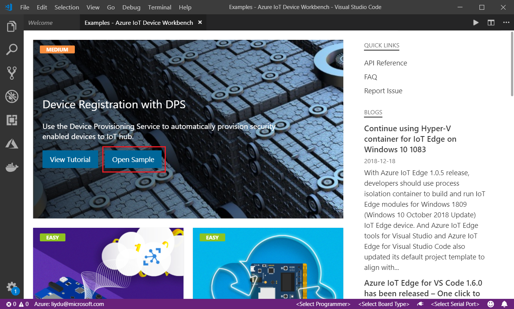

## Save a Unique Device Secret on device security storage

Auto-provisioning can be configured on a device based on the device's [attestation mechanism](concepts-security.md#attestation-mechanism). The MXChip IoT DevKit uses the [Device Identity Composition Engine](https://trustedcomputinggroup.org/wp-content/uploads/Foundational-Trust-for-IOT-and-Resource-Constrained-Devices.pdf) from the [Trusted Computing Group](https://trustedcomputinggroup.org). A **Unique Device Secret** (UDS) saved in an STSAFE security chip ([STSAFE-A100](https://microsoft.github.io/azure-iot-developer-kit/docs/understand-security-chip/)) on the DevKit is used to generate the device's unique [X.509 certificate](concepts-security.md#x509-certificates). The certificate is used later for the enrollment process in the Device Provisioning service, and during registration at runtime.

A typical UDS is a 64-character string, as seen in the following sample:

```
19e25a259d0c2be03a02d416c05c48ccd0cc7d1743458aae1cb488b074993eae
```

To save a UDS on the DevKit:

1. In VS Code, click on the status bar to select the COM port for the DevKit.
  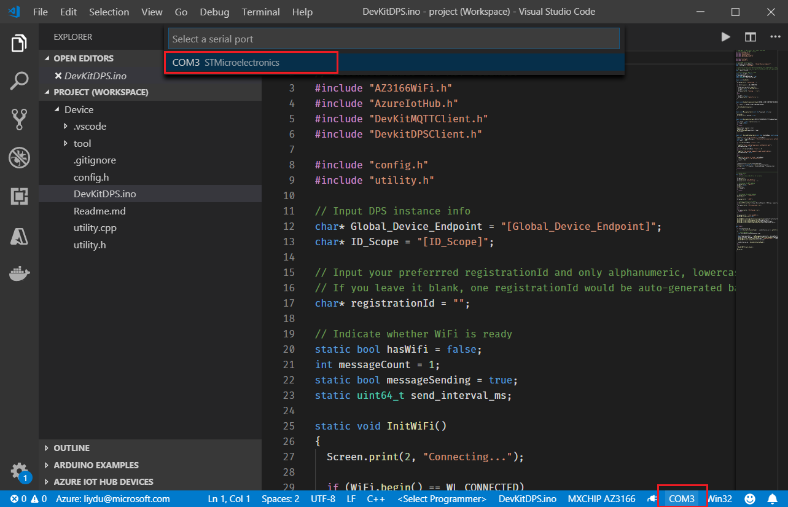

1. On DevKit, hold down **button A**, push and release the **reset** button, and then release **button A**. Your DevKit enters configuration mode.

1. Click `F1` to open the command palette, type and select **Azure IoT Device Workbench: Configure Device Settings... > Config Unique Device String (UDS)**.
  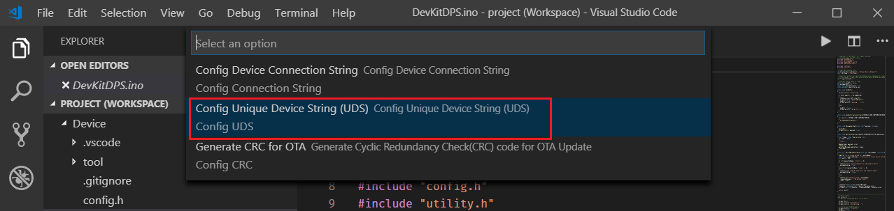

1. Note down the generated UDS string. You will need it to generate the X.509 certificate. Then press `Enter`.
  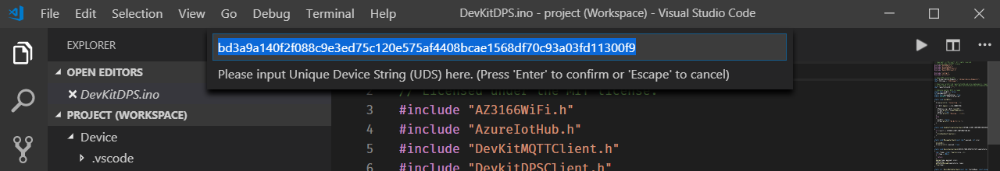

1. Confirm from the notification that UDS has been configured on the STSAFE successfully.
  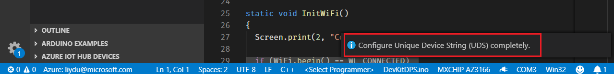

> [!NOTE]
> Alternatively, you can configure UDS via serial port by using utilities such as Putty. Follow [Use configuration mode](https://microsoft.github.io/azure-iot-developer-kit/docs/use-configuration-mode/) to do so.

## Update the Global Device Endpoint and ID Scope

In device code, you need to specify the [Device provisioning endpoint](/azure/iot-dps/concepts-service#device-provisioning-endpoint) and ID scope to ensure the tenant isolation.

1. In the Azure portal, select the **Overview** pane of your Device Provisioning service and note down the **Global device endpoint** and **ID Scope** values.
  

1. Open **DeKitDPS.ino**. Find and replace `[Global Device Endpoint]` and `[ID Scope]` with the values you just noted down.
  

1. Fill the `registrationId` variable in the code. Only alphanumeric, lowercase, and hyphen combination with a maximum of 128 characters is allowed. Also noted down the value.
  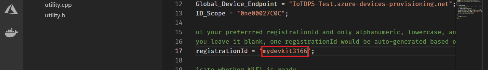

1. Click `F1`, type and select **Azure IoT Device Workbench: Upload Device Code**. It starts compiling and uploading the code to DevKit.
  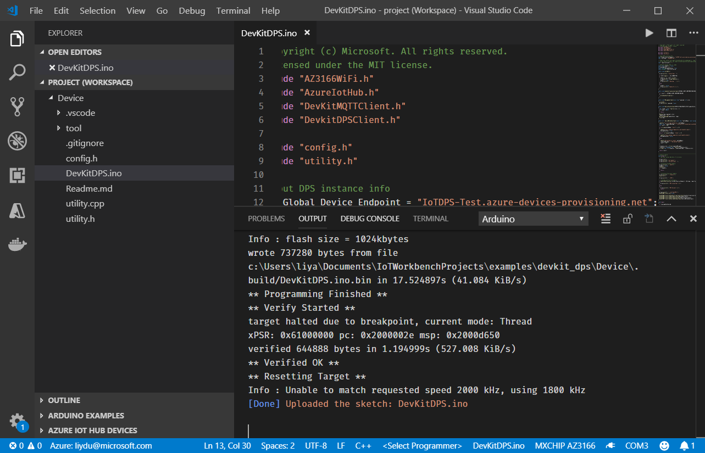

## Generate X.509 certificate

The [attestation mechanism](/azure/iot-dps/concepts-device#attestation-mechanism) used by this sample is X.509 certificate. You need to use a utility to generate it.

> [!NOTE]
> The X.509 certificate generator only supports Windows now.

1. In VS Code, click `F1`, type and select **Open New Terminal** to open terminal window.

1. Run `dps_cert_gen.exe` in `tool` folder.

1. Specify the compiled binary file location as `..\.build\DevKitDPS`. Then paste the **UDS** and **registrationId** you just noted down. 
  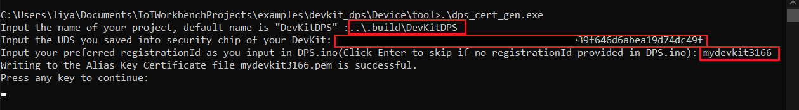

1. A `.pem` X.509 certificate generates in the same folder.
  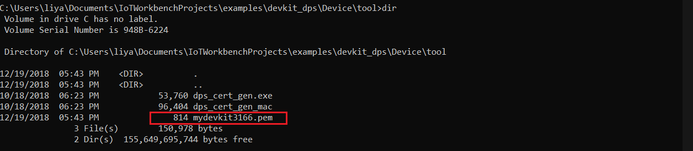

## Create a device enrollment entry

1. In the Azure portal, open your Device Provision Service, navigate to Manage enrollments section, and click **Add individual enrollment**.
  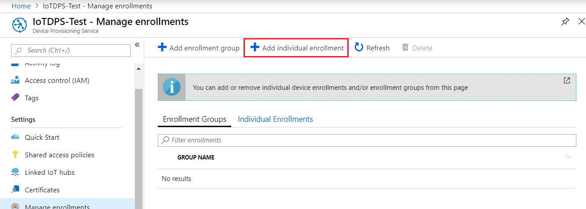

1. Click file icon next to **Primary Certificate .pem or .cer file** to upload the `.pem` file generated.
  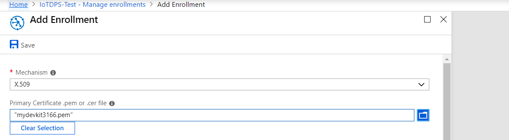

## Verify the DevKit is registered with Azure IoT Hub

Press the **Reset** button on your DevKit. You should see **DPS Connected!** on DevKit screen. After the device reboots, the following actions take place:

1. The device sends a registration request to your Device Provisioning service.
1. The Device Provisioning service sends back a registration challenge to which your device responds.
1. On successful registration, the Device Provisioning service sends the IoT Hub URI, device ID, and the encrypted key back to the device.
1. The IoT Hub client application on the device connects to your hub.
1. On successful connection to the hub, you see the device appear in the IoT Hub Device Explorer.
  

## Problems and feedback

If you encounter problems, refer to the Iot DevKit [FAQs](https://microsoft.github.io/azure-iot-developer-kit/docs/faq/), or reach out to the following channels for support:

* [Gitter.im](https://gitter.im/Microsoft/azure-iot-developer-kit)
* [Stack Overflow](https://stackoverflow.com/questions/tagged/iot-devkit)

## Next steps

In this tutorial, you learned to enroll a device securely to the Device Provisioning Service by using the Device Identity Composition Engine, so that the device can automatically register with Azure IoT Hub. 

In summary, you learned how to:

> [!div class="checklist"]
> * Configure the global endpoint of the Device Provisioning service on a device.
> * Use a unique device secret to generate an X.509 certificate.
> * Enroll an individual device.
> * Verify that the device is registered.

Learn how to [Create and provision a simulated device](./quick-create-simulated-device.md).

