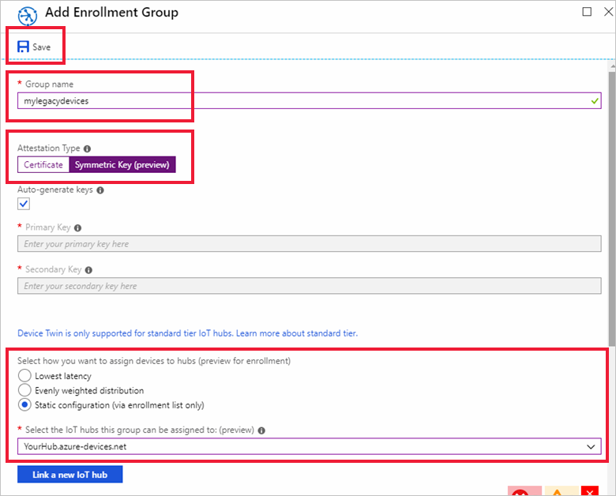
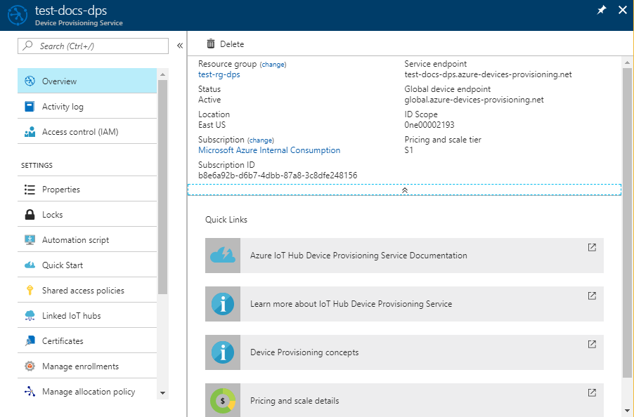
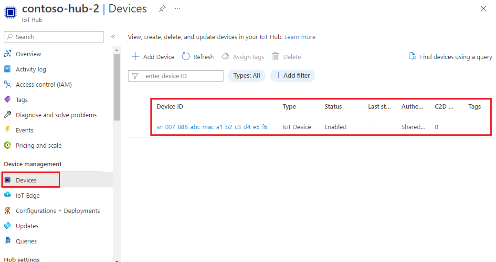

# How to provision legacy devices using symmetric keys

A common problem with many legacy devices is that they often have an identity that is composed of a single piece of information. This identity information is usually a MAC address or a serial number. Legacy devices may not have a certificate, TPM, or any other security feature that can be used to securely identify the device. The Device Provisioning Service for IoT hub includes symmetric key attestation. Symmetric key attestation can be used to identify a device based off information like the MAC address or a serial number.

If you can easily install a [hardware security module (HSM)](concepts-security.md#hardware-security-module) and a certificate, then that may be a better approach for identifying and provisioning your devices. Since that approach may allow you to bypass updating the code deployed to all your devices, and you would not have a secret key embedded in your device image.

This article assumes that neither an HSM or a certificate is a viable option. However, it is assumed that you do have some method of updating device code to use the Device Provisioning Service to provision these devices. 

This article also assumes that the device update takes place in a secure environment to prevent unauthorized access to the master group key or the derived device key.

This article is oriented toward a Windows-based workstation. However, you can perform the procedures on Linux. For a Linux example, see [How to provision for multitenancy](how-to-provision-multitenant.md).

> [!NOTE]
> The sample used in this article is written in C. There is also a [C# device provisioning symmetric key sample](https://github.com/Azure-Samples/azure-iot-samples-csharp/tree/master/provisioning/Samples/device/SymmetricKeySample) available. To use this sample, download or clone the [azure-iot-samples-csharp](https://github.com/Azure-Samples/azure-iot-samples-csharp) repository and follow the in-line instructions in the sample code. You can follow the instructions in this article to create a symmetric key enrollment group using the portal and to find the ID Scope and enrollment group primary and secondary keys needed to run the sample. You can also create individual enrollments using the sample.

## Overview

A unique registration ID will be defined for each device based on information that identifies that device. For example, the MAC address or a serial number.

An enrollment group that uses [symmetric key attestation](concepts-symmetric-key-attestation.md) will be created with the Device Provisioning Service. The enrollment group will include a group master key. That master key will be used to hash each unique registration ID to produce a unique device key for each device. The device will use that derived device key with its unique registration ID to attest with the Device Provisioning Service and be assigned to an IoT hub.

The device code demonstrated in this article will follow the same pattern as the [Quickstart: Provision a simulated device with symmetric keys](quick-create-simulated-device-symm-key.md). The code will simulate a device using a sample from the [Azure IoT C SDK](https://github.com/Azure/azure-iot-sdk-c). The simulated device will attest with an enrollment group instead of an individual enrollment as demonstrated in the quickstart.

[!INCLUDE [quickstarts-free-trial-note](../../includes/quickstarts-free-trial-note.md)]


## Prerequisites

* Completion of the [Set up IoT Hub Device Provisioning Service with the Azure portal](./quick-setup-auto-provision.md) quickstart.

The following prerequisites are for a Windows development environment. For Linux or macOS, see the appropriate section in [Prepare your development environment](https://github.com/Azure/azure-iot-sdk-c/blob/master/doc/devbox_setup.md) in the SDK documentation.

* [Visual Studio](https://visualstudio.microsoft.com/vs/) 2019 with the ['Desktop development with C++'](https://docs.microsoft.com/cpp/?view=vs-2019#pivot=workloads) workload enabled. Visual Studio 2015 and Visual Studio 2017 are also supported.

* Latest version of [Git](https://git-scm.com/download/) installed.

## Prepare an Azure IoT C SDK development environment

In this section, you will prepare a development environment used to build the [Azure IoT C SDK](https://github.com/Azure/azure-iot-sdk-c). 

The SDK includes the sample code for the simulated device. This simulated device will attempt provisioning during the device's boot sequence.

1. Download the [CMake build system](https://cmake.org/download/).

    It is important that the Visual Studio prerequisites (Visual Studio and the 'Desktop development with C++' workload) are installed on your machine, **before** starting the `CMake` installation. Once the prerequisites are in place, and the download is verified, install the CMake build system.

2. Find the tag name for the [latest release](https://github.com/Azure/azure-iot-sdk-c/releases/latest) of the SDK.

3. Open a command prompt or Git Bash shell. Run the following commands to clone the latest release of the [Azure IoT C SDK](https://github.com/Azure/azure-iot-sdk-c) GitHub repository. Use the tag you found in the previous step as the value for the `-b` parameter:

    ```cmd/sh
    git clone -b <release-tag> https://github.com/Azure/azure-iot-sdk-c.git
    cd azure-iot-sdk-c
    git submodule update --init
    ```

    You should expect this operation to take several minutes to complete.

4. Create a `cmake` subdirectory in the root directory of the git repository, and navigate to that folder. Run the following commands from the `azure-iot-sdk-c` directory:

    ```cmd/sh
    mkdir cmake
    cd cmake
    ```

5. Run the following command, which builds a version of the SDK specific to your development client platform. A Visual Studio solution for the simulated device will be generated in the `cmake` directory. 

    ```cmd
    cmake -Dhsm_type_symm_key:BOOL=ON -Duse_prov_client:BOOL=ON  ..
    ```
    
    If `cmake` does not find your C++ compiler, you might get build errors while running the above command. If that happens, try running this command in the [Visual Studio command prompt](https://docs.microsoft.com/dotnet/framework/tools/developer-command-prompt-for-vs). 

    Once the build succeeds, the last few output lines will look similar to the following output:

    ```cmd/sh
    $ cmake -Dhsm_type_symm_key:BOOL=ON -Duse_prov_client:BOOL=ON  ..
    -- Building for: Visual Studio 15 2017
    -- Selecting Windows SDK version 10.0.16299.0 to target Windows 10.0.17134.
    -- The C compiler identification is MSVC 19.12.25835.0
    -- The CXX compiler identification is MSVC 19.12.25835.0

    ...

    -- Configuring done
    -- Generating done
    -- Build files have been written to: E:/IoT Testing/azure-iot-sdk-c/cmake
    ```


## Create a symmetric key enrollment group

1. Sign in to the [Azure portal](https://portal.azure.com), and open your Device Provisioning Service instance.

2. Select the **Manage enrollments** tab, and then click the **Add enrollment group** button at the top of the page. 

3. On **Add Enrollment Group**, enter the following information, and click the **Save** button.

   - **Group name**: Enter **mylegacydevices**.

   - **Attestation Type**: Select **Symmetric Key**.

   - **Auto Generate Keys**: Check this box.

   - **Select how you want to assign devices to hubs**: Select **Static configuration** so you can assign to a specific hub.

   - **Select the IoT hubs this group can be assigned to**: Select one of your hubs.

     

4. Once you saved your enrollment, the **Primary Key** and **Secondary Key** will be generated and added to the enrollment entry. Your symmetric key enrollment group appears as **mylegacydevices** under the *Group Name* column in the *Enrollment Groups* tab. 

    Open the enrollment and copy the value of your generated **Primary Key**. This key is your master group key.


## Choose a unique registration ID for the device

A unique registration ID must be defined to identify each device. You can use the MAC address, serial number, or any unique information from the device. 

In this example, we use a combination of a MAC address and serial number forming the following string for a registration ID.

```
sn-007-888-abc-mac-a1-b2-c3-d4-e5-f6
```

Create a unique registration ID for your device. Valid characters are lowercase alphanumeric and dash ('-').


## Derive a device key 

To generate the device key, use the group master key to compute an [HMAC-SHA256](https://wikipedia.org/wiki/HMAC) of the unique registration ID for the device and convert the result into Base64 format.

Do not include your group master key in your device code.


#### Linux workstations

If you are using a Linux workstation, you can use openssl to generate your 
derived device key as shown in the following example.

Replace the value of **KEY** with the **Primary Key** you noted earlier.

Replace the value of **REG_ID** with your registration ID.

```bash
KEY=8isrFI1sGsIlvvFSSFRiMfCNzv21fjbE/+ah/lSh3lF8e2YG1Te7w1KpZhJFFXJrqYKi9yegxkqIChbqOS9Egw==
REG_ID=sn-007-888-abc-mac-a1-b2-c3-d4-e5-f6

keybytes=$(echo $KEY | base64 --decode | xxd -p -u -c 1000)
echo -n $REG_ID | openssl sha256 -mac HMAC -macopt hexkey:$keybytes -binary | base64
```

```bash
Jsm0lyGpjaVYVP2g3FnmnmG9dI/9qU24wNoykUmermc=
```


#### Windows-based workstations

If you are using a Windows-based workstation, you can use PowerShell to generate your derived device key as shown in the following example.

Replace the value of **KEY** with the **Primary Key** you noted earlier.

Replace the value of **REG_ID** with your registration ID.

```powershell
$KEY='8isrFI1sGsIlvvFSSFRiMfCNzv21fjbE/+ah/lSh3lF8e2YG1Te7w1KpZhJFFXJrqYKi9yegxkqIChbqOS9Egw=='
$REG_ID='sn-007-888-abc-mac-a1-b2-c3-d4-e5-f6'

$hmacsha256 = New-Object System.Security.Cryptography.HMACSHA256
$hmacsha256.key = [Convert]::FromBase64String($KEY)
$sig = $hmacsha256.ComputeHash([Text.Encoding]::ASCII.GetBytes($REG_ID))
$derivedkey = [Convert]::ToBase64String($sig)
echo "`n$derivedkey`n"
```

```powershell
Jsm0lyGpjaVYVP2g3FnmnmG9dI/9qU24wNoykUmermc=
```


Your device will use the derived device key with your unique registration ID to perform symmetric key attestation with the enrollment group during provisioning.


## Create a device image to provision

In this section, you will update a provisioning sample named **prov\_dev\_client\_sample** located in the Azure IoT C SDK you set up earlier. 

This sample code simulates a device boot sequence that sends the provisioning request to your Device Provisioning Service instance. The boot sequence will cause the device to be recognized and assigned to the IoT hub you configured on the enrollment group.

1. In the Azure portal, select the **Overview** tab for your Device Provisioning service and note down the **_ID Scope_** value.

     

2. In Visual Studio, open the **azure_iot_sdks.sln** solution file that was generated by running CMake earlier. The solution file should be in the following location:

    ```
    \azure-iot-sdk-c\cmake\azure_iot_sdks.sln
    ```

3. In Visual Studio's *Solution Explorer* window, navigate to the **Provision\_Samples** folder. Expand the sample project named **prov\_dev\_client\_sample**. Expand **Source Files**, and open **prov\_dev\_client\_sample.c**.

4. Find the `id_scope` constant, and replace the value with your **ID Scope** value that you copied earlier. 

    ```c
    static const char* id_scope = "0ne00002193";
    ```

5. Find the definition for the `main()` function in the same file. Make sure the `hsm_type` variable is set to `SECURE_DEVICE_TYPE_SYMMETRIC_KEY` as shown below:

    ```c
    SECURE_DEVICE_TYPE hsm_type;
    //hsm_type = SECURE_DEVICE_TYPE_TPM;
    //hsm_type = SECURE_DEVICE_TYPE_X509;
    hsm_type = SECURE_DEVICE_TYPE_SYMMETRIC_KEY;
    ```

6. Find the call to `prov_dev_set_symmetric_key_info()` in **prov\_dev\_client\_sample.c** which is commented out.

    ```c
    // Set the symmetric key if using they auth type
    //prov_dev_set_symmetric_key_info("<symm_registration_id>", "<symmetric_Key>");
    ```

    Uncomment the function call, and replace the placeholder values (including the angle brackets) with the unique registration ID for your device and the derived device key you generated.

    ```c
    // Set the symmetric key if using they auth type
    prov_dev_set_symmetric_key_info("sn-007-888-abc-mac-a1-b2-c3-d4-e5-f6", "Jsm0lyGpjaVYVP2g3FnmnmG9dI/9qU24wNoykUmermc=");
    ```
   
    Save the file.

7. Right-click the **prov\_dev\_client\_sample** project and select **Set as Startup Project**. 

8. On the Visual Studio menu, select **Debug** > **Start without debugging** to run the solution. In the prompt to rebuild the project, click **Yes**, to rebuild the project before running.

    The following output is an example of the simulated device successfully booting up, and connecting to the provisioning Service instance to be assigned to an IoT hub:

    ```cmd
    Provisioning API Version: 1.2.8

    Registering Device

    Provisioning Status: PROV_DEVICE_REG_STATUS_CONNECTED
    Provisioning Status: PROV_DEVICE_REG_STATUS_ASSIGNING
    Provisioning Status: PROV_DEVICE_REG_STATUS_ASSIGNING

    Registration Information received from service: 
    test-docs-hub.azure-devices.net, deviceId: sn-007-888-abc-mac-a1-b2-c3-d4-e5-f6

    Press enter key to exit:
    ```

9. In the portal, navigate to the IoT hub your simulated device was assigned to and click the **IoT Devices** tab. On successful provisioning of the simulated to the hub, its device ID appears on the **IoT Devices** blade, with *STATUS* as **enabled**. You might need to click the **Refresh** button at the top. 

     


## Security concerns

Be aware that this leaves the derived device key included as part of the image, which is not a recommended security best practice. This is one reason why security and ease-of-use are tradeoffs. 


## Next steps

* To learn more Reprovisioning, see [IoT Hub Device reprovisioning concepts](concepts-device-reprovision.md) 
* [Quickstart: Provision a simulated device with symmetric keys](quick-create-simulated-device-symm-key.md)
* To learn more Deprovisioning, see [How to deprovision devices that were previously auto-provisioned](how-to-unprovision-devices.md) 


