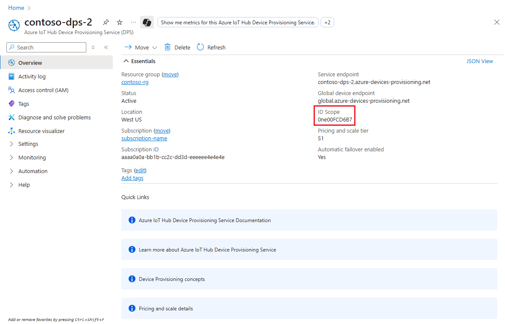

# Tutorial: Provision devices using symmetric key enrollment groups

This tutorial shows how to securely provision multiple simulated symmetric key devices to a single IoT Hub using an enrollment group.

Some devices may not have a certificate, TPM, or any other security feature that can be used to securely identify the device. The Device Provisioning Service includes [symmetric key attestation](concepts-symmetric-key-attestation.md). Symmetric key attestation can be used to identify a device based off unique information like the MAC address or a serial number.

If you can easily install a [hardware security module (HSM)](concepts-service.md#hardware-security-module) and a certificate, then that may be a better approach for identifying and provisioning your devices. Using an HSM will allow you to bypass updating the code deployed to all your devices, and you would not have a secret key embedded in your device images. This tutorial assumes that neither an HSM or a certificate is a viable option. However, it is assumed that you do have some method of updating device code to use the Device Provisioning Service to provision these devices. 

This tutorial also assumes that the device update takes place in a secure environment to prevent unauthorized access to the master group key or the derived device key.

This tutorial is oriented toward a Windows-based workstation. However, you can perform the procedures on Linux. For a Linux example, see [Tutorial: Provision for geolatency](how-to-provision-multitenant.md).

> [!NOTE]
> The sample used in this tutorial is written in C. There is also a [C# device provisioning symmetric key sample](https://github.com/Azure/azure-iot-sdk-csharp/tree/main/provisioning/device/samples/How%20To/SymmetricKeySample) available. To use this sample, download or clone the [azure-iot-sdk-csharp](https://github.com/Azure/azure-iot-sdk-csharp) repository and follow the in-line instructions in the sample code. You can follow the instructions in this tutorial to create a symmetric key enrollment group using the portal and to find the ID Scope and enrollment group primary and secondary keys needed to run the sample. You can also create individual enrollments using the sample.

## Prerequisites

* If you don't have an Azure subscription, create a [free account](https://azure.microsoft.com/free/?ref=microsoft.com&utm_source=microsoft.com&utm_medium=docs&utm_campaign=visualstudio) before you begin.

* Complete the steps in [Set up IoT Hub Device Provisioning Service with the Azure portal](./quick-setup-auto-provision.md).
::: zone pivot="programming-language-ansi-c"

* If you're using a Windows development environment, install [Visual Studio](https://visualstudio.microsoft.com/vs/) 2019 with the ['Desktop development with C++'](/cpp/ide/using-the-visual-studio-ide-for-cpp-desktop-development) workload enabled. Visual Studio 2015 and Visual Studio 2017 are also supported. For Linux or macOS, see the appropriate section in [Prepare your development environment](https://github.com/Azure/azure-iot-sdk-c/blob/master/doc/devbox_setup.md) in the SDK documentation.

::: zone-end

::: zone pivot="programming-language-csharp"

* Install [.NET SDK 6.0](https://dotnet.microsoft.com/download) or later on your Windows-based machine. You can use the following command to check your version.

    ```cmd
    dotnet --info
    ```

::: zone-end

::: zone pivot="programming-language-nodejs"

* Install [Node.js v4.0+](https://nodejs.org).

::: zone-end

::: zone pivot="programming-language-python"

* Install [Python 3.7](https://www.python.org/downloads/) or later installed on your Windows-based machine. You can check your version of Python by running `python --version`.

::: zone-end

::: zone pivot="programming-language-java"

* Install [Java SE Development Kit 8](/azure/developer/java/fundamentals/java-support-on-azure) or later installed on your machine.

* Download and install [Maven](https://maven.apache.org/install.html).

::: zone-end

* Install the latest version of [Git](https://git-scm.com/download/). Make sure that Git is added to the environment variables accessible to the command window. See [Software Freedom Conservancy's Git client tools](https://git-scm.com/download/) for the latest version of `git` tools to install, which includes *Git Bash*, the command-line app that you can use to interact with your local Git repository.

## Overview

A unique registration ID will be defined for each device based on information that identifies that device. For example, the MAC address or a serial number.

An enrollment group that uses [symmetric key attestation](concepts-symmetric-key-attestation.md) will be created with the Device Provisioning Service. The enrollment group will include a group master key. That master key will be used to hash each unique registration ID to produce a unique device key for each device. The device will use that derived device key with its unique registration ID to attest with the Device Provisioning Service and be assigned to an IoT hub.

## Prepare your development environment

::: zone pivot="programming-language-ansi-c"

In this section, you'll prepare a development environment that's used to build the [Azure IoT C SDK](https://github.com/Azure/azure-iot-sdk-c). The sample code attempts to provision the device, during the device's boot sequence.

1. Download the latest [CMake build system](https://cmake.org/download/).

    >[!IMPORTANT]
    >Confirm that the Visual Studio prerequisites (Visual Studio and the 'Desktop development with C++' workload) are installed on your machine, **before** starting the `CMake` installation. Once the prerequisites are in place, and the download is verified, install the CMake build system. Also, be aware that older versions of the CMake build system fail to generate the solution file used in this article. Make sure to use the latest version of CMake.

2. Open a web browser, and go to the [Release page of the Azure IoT C SDK](https://github.com/Azure/azure-iot-sdk-c/releases/latest).

3. Select the **Tags** tab at the top of the page.

4. Copy the tag name for the latest release of the Azure IoT C SDK.

5. Open a command prompt or Git Bash shell. Run the following commands to clone the latest release of the [Azure IoT C SDK](https://github.com/Azure/azure-iot-sdk-c) GitHub repository(replace `<release-tag>` with the tag you copied in the previous step).

    ```cmd
    git clone -b <release-tag> https://github.com/Azure/azure-iot-sdk-c.git
    cd azure-iot-sdk-c
    git submodule update --init
    ```

    This operation could take several minutes to complete.

6. When the operation is complete, run the following commands from the `azure-iot-sdk-c` directory:

    ```cmd
    mkdir cmake
    cd cmake
    ```

7. The code sample uses a symmetric key to provide attestation. Run the following command to build a version of the SDK specific to your development client platform that includes the device provisioning client:

    ```cmd
    cmake -Dhsm_type_symm_key:BOOL=ON -Duse_prov_client:BOOL=ON  ..
    ```

    >[!TIP]
    >If `cmake` does not find your C++ compiler, you may get build errors while running the above command. If that happens, try running the command in the [Visual Studio command prompt](/dotnet/framework/tools/developer-command-prompt-for-vs).

8. When the build completes successfully, the last few output lines will look similar to the following output:

    ```output
    $ cmake -Dhsm_type_symm_key:BOOL=ON -Duse_prov_client:BOOL=ON  ..
    -- Building for: Visual Studio 16 2019
    -- Selecting Windows SDK version 10.0.19041.0 to target Windows 10.0.19042.
    -- The C compiler identification is MSVC 19.29.30040.0
    -- The CXX compiler identification is MSVC 19.29.30040.0

    ...

    -- Configuring done
    -- Generating done
    -- Build files have been written to: E:/IoT Testing/azure-iot-sdk-c/cmake
    ```

::: zone-end

::: zone pivot="programming-language-csharp"

1. Open a Git CMD or Git Bash command-line environment.

2. Clone the [Azure IoT SDK for C#](https://github.com/Azure/azure-iot-sdk-csharp) GitHub repository using the following command:

    ```cmd
    git clone https://github.com/Azure/azure-iot-sdk-csharp.git
    ```

::: zone-end

::: zone pivot="programming-language-nodejs"

1. Open a Git CMD or Git Bash command-line environment.

2. Clone the [Azure IoT SDK for Node.js](https://github.com/Azure/azure-iot-sdk-node.git) GitHub repository using the following command:

    ```cmd
    git clone https://github.com/Azure/azure-iot-sdk-node.git --recursive
    ```

::: zone-end

::: zone pivot="programming-language-python"

1. Open a Git CMD or Git Bash command-line environment.

2. Clone the [Azure IoT SDK for Python](https://github.com/Azure/azure-iot-sdk-python.git) GitHub repository using the following command:

    ```cmd
    git clone https://github.com/Azure/azure-iot-sdk-python.git --recursive
    ```

::: zone-end

::: zone pivot="programming-language-java"

1. Open a Git CMD or Git Bash command-line environment.

2. Clone the [Azure IoT SDK for Java](https://github.com/Azure/azure-iot-sdk-java.git) GitHub repository using the following command:

    ```cmd
    git clone https://github.com/Azure/azure-iot-sdk-java.git --recursive
    ```

3. Go to the root `azure-iot-sdk-java` directory and build the project to download all needed packages. This step can take several minutes to complete.

   ```cmd
   cd azure-iot-sdk-java
   mvn install -DskipTests=true
   ```

::: zone-end

## Create a symmetric key enrollment group

1. Sign in to the [Azure portal](https://portal.azure.com), and navigate to your Device Provisioning Service instance.

1. Select the **Manage enrollments** tab and then select **+ Add enrollment group** at the top of the page.

1. On **Add Enrollment Group**, enter the following information:

   * **Group name**: Enter **mylegacydevices**. The enrollment group name is a case-insensitive string (up to 128 characters long) of alphanumeric characters plus the special characters: `'-'`, `'.'`, `'_'`, `':'`. The last character must be alphanumeric or dash (`'-'`).

   * **Attestation Type**: Select **Symmetric Key**.

   * **Auto Generate Keys**: Check this box.

   * **Select how you want to assign devices to hubs**: Select **Static configuration** so you can assign to a specific hub.

   * **Select the IoT hubs this group can be assigned to**: Select one of the IoT hubs from the drop-down list.

     

1. Select **Save**. When you save the enrollment, IoT Hub generates the **Primary Key** and **Secondary Key** and adds them to the enrollment entry. Your symmetric key enrollment group appears as **mylegacydevices** under the *Group Name* column in the *Enrollment Groups* tab.

1. Open the enrollment and copy the value of the **Primary Key**. This key is your master group key.

## Choose a unique registration ID for the device

A unique registration ID must be defined to identify each device. You can use the MAC address, serial number, or any unique information from the device.

In this example, we use a combination of a MAC address and serial number forming the following string for a registration ID.

```text
sn-007-888-abc-mac-a1-b2-c3-d4-e5-f6
```

Create unique registration IDs for each device. The registration ID is a case-insensitive string (up to 128 characters long) of alphanumeric characters plus the special characters: `'-'`, `'.'`, `'_'`, `':'`. The last character must be alphanumeric or dash (`'-'`).

## Derive a device key

To generate device keys, use the enrollment group master key to compute an [HMAC-SHA256](https://wikipedia.org/wiki/HMAC) of the registration ID for each device. The result is then converted into Base64 format for each device.

> [!WARNING]
> Your device code for each device should only include the corresponding derived device key for that device. Do not include your group master key in your device code. 
> A compromised master key has the potential to compromise the security of all devices being authenticated with it.

# [Azure CLI](#tab/azure-cli)

The IoT extension for the Azure CLI provides the [`compute-device-key`](/cli/azure/iot/dps#az-iot-dps-compute-device-key) command for generating derived device keys. This command can be used from a Windows-based or Linux systems, in PowerShell or a Bash shell.

Replace the value of `--key` argument with the **Primary Key** from your enrollment group.

Replace the value of `--registration-id` argument with your registration ID.

```azurecli
az iot dps enrollment-group compute-device-key --key 8isrFI1sGsIlvvFSSFRiMfCNzv21fjbE/+ah/lSh3lF8e2YG1Te7w1KpZhJFFXJrqYKi9yegxkqIChbqOS9Egw== --registration-id sn-007-888-abc-mac-a1-b2-c3-d4-e5-f6
```

Example result:

```azurecli
"Jsm0lyGpjaVYVP2g3FnmnmG9dI/9qU24wNoykUmermc="
```
# [Windows](#tab/windows)

If you are using a Windows-based workstation, you can use PowerShell to generate your derived device key as shown in the following example.

Replace the value of **KEY** with the **Primary Key** you noted earlier.

Replace the value of **REG_ID** with your registration ID.

```powershell
$KEY='8isrFI1sGsIlvvFSSFRiMfCNzv21fjbE/+ah/lSh3lF8e2YG1Te7w1KpZhJFFXJrqYKi9yegxkqIChbqOS9Egw=='
$REG_ID='sn-007-888-abc-mac-a1-b2-c3-d4-e5-f6'

$hmacsha256 = New-Object System.Security.Cryptography.HMACSHA256
$hmacsha256.key = [Convert]::FromBase64String($KEY)
$sig = $hmacsha256.ComputeHash([Text.Encoding]::ASCII.GetBytes($REG_ID))
$derivedkey = [Convert]::ToBase64String($sig)
echo "`n$derivedkey`n"
```

```powershell
Jsm0lyGpjaVYVP2g3FnmnmG9dI/9qU24wNoykUmermc=
```

# [Linux](#tab/linux)

If you are using a Linux workstation, you can use openssl to generate your 
derived device key as shown in the following example.

Replace the value of **KEY** with the **Primary Key** you noted earlier.

Replace the value of **REG_ID** with your registration ID.

```bash
KEY=8isrFI1sGsIlvvFSSFRiMfCNzv21fjbE/+ah/lSh3lF8e2YG1Te7w1KpZhJFFXJrqYKi9yegxkqIChbqOS9Egw==
REG_ID=sn-007-888-abc-mac-a1-b2-c3-d4-e5-f6

keybytes=$(echo $KEY | base64 --decode | xxd -p -u -c 1000)
echo -n $REG_ID | openssl sha256 -mac HMAC -macopt hexkey:$keybytes -binary | base64
```

```bash
Jsm0lyGpjaVYVP2g3FnmnmG9dI/9qU24wNoykUmermc=
```

---

Each device uses its derived device key and unique registration ID to perform symmetric key attestation with the enrollment group during provisioning.

## Prepare and run the device provisioning code

::: zone pivot="programming-language-ansi-c"

In this section, you'll update the device sample code to send the device's boot sequence to your Device Provisioning Service instance. This boot sequence will cause the device to be recognized, authenticated, and assigned to an IoT hub linked to the Device Provisioning Service instance.

The sample provisioning code accomplishes the following tasks, in order:

1. Authenticates your device with your Device Provisioning resource using the following three parameters:

    * The ID Scope of your Device Provisioning Service
    * The registration ID for your device.
    * The derived device key for your device.

2. Assigns the device to the IoT hub already linked to your Device Provisioning Service instance.

To update and run the provisioning sample with your device information:

1. In the main menu of your Device Provisioning Service, select **Overview**.

2. Copy the **ID Scope** value.

    :::image type="content" source="./media/quick-create-simulated-device-symm-key/extract-dps-endpoints.png" alt-text="Extract Device Provisioning Service endpoint information":::

3. In Visual Studio, open the *azure_iot_sdks.sln* solution file that was generated by running CMake. The solution file should be in the following location:

    ```output

    \azure-iot-sdk-c\cmake\azure_iot_sdks.sln

    ```

    >[!TIP]
    >If the file was not generated in your cmake directory, make sure you used a recent version of the CMake build system.

4. In Visual Studio's *Solution Explorer* window, go to the **Provision\_Samples** folder. Expand the sample project named **prov\_dev\_client\_sample**. Expand **Source Files**, and open **prov\_dev\_client\_sample.c**.

5. Find the `id_scope` constant, and replace the value with the **ID Scope** value that you copied in step 2.

    ```c
    static const char* id_scope = "0ne00002193";
    ```

6. Find the definition for the `main()` function in the same file. Make sure the `hsm_type` variable is set to `SECURE_DEVICE_TYPE_SYMMETRIC_KEY` as shown below:

    ```c
    SECURE_DEVICE_TYPE hsm_type;
    //hsm_type = SECURE_DEVICE_TYPE_TPM;
    //hsm_type = SECURE_DEVICE_TYPE_X509;
    hsm_type = SECURE_DEVICE_TYPE_SYMMETRIC_KEY;
    ```

7. Find the call to `prov_dev_set_symmetric_key_info()` in **prov\_dev\_client\_sample.c** that is commented out.

    ```c
    // Set the symmetric key if using they auth type
    //prov_dev_set_symmetric_key_info("<symm_registration_id>", "<symmetric_Key>");
    ```

    Uncomment the function call, and replace the placeholder values (including the angle brackets) with the registration ID and the derived device key.

    ```c
    // Set the symmetric key if using they auth type
    prov_dev_set_symmetric_key_info("sn-007-888-abc-mac-a1-b2-c3-d4-e5-f6", "Jsm0lyGpjaVYVP2g3FnmnmG9dI/9qU24wNoykUmermc=");
    ```

8. Save the file.

9. Right-click the **prov\_dev\_client\_sample** project and select **Set as Startup Project**.

10. On the Visual Studio menu, select **Debug** > **Start without debugging** to run the solution. In the rebuild the project prompt, select **Yes** to rebuild the project before running.

    The following output is an example of the device successfully connecting to the provisioning Service instance to be assigned to an IoT hub:

    ```output
    Provisioning API Version: 1.2.8

    Registering Device

    Provisioning Status: PROV_DEVICE_REG_STATUS_CONNECTED
    Provisioning Status: PROV_DEVICE_REG_STATUS_ASSIGNING

    Registration Information received from service:
    test-docs-hub.azure-devices.net, deviceId: sn-007-888-abc-mac-a1-b2-c3-d4-e5-f6
    Press enter key to exit:
    ```

::: zone-end

::: zone pivot="programming-language-csharp"

The sample provisioning code accomplishes the following tasks:

1. Authenticates your device with your Device Provisioning resource using the following three parameters:

    * The ID Scope of your Device Provisioning Service
    * The registration ID for your device.
    * The derived device key for your device.

2. Assigns the device to the IoT hub already linked to your Device Provisioning Service instance.

3. Sends a test telemetry message to the IoT hub.

To update and run the provisioning sample with your device information:

1. In the main menu of your Device Provisioning Service, select **Overview**.

2. Copy the **ID Scope** value.

    :::image type="content" source="./media/quick-create-simulated-device-symm-key/extract-dps-endpoints.png" alt-text="Extract Device Provisioning Service endpoint information":::

3. Open a command prompt and go to the *SymmetricKeySample* in the cloned sdk repository:

    ```cmd
    cd .\azure-iot-sdk-csharp\provisioning\device\samples\How To\SymmetricKeySample
    ```

4. In the *SymmetricKeySample* folder, open *Parameters.cs* in a text editor. This file shows the parameters that are supported by the sample. Only the first three required parameters will be used in this article when running the sample. Review the code in this file. No changes are needed.

    | Parameter                         | Required | Description     |
    | :-------------------------------- | :------- | :-------------- |
    | `--s` or `--IdScope`              | True     | The ID Scope of the DPS instance |
    | `--i` or `--Id`                   | True     | The registration ID for the device. The registration ID is a case-insensitive string (up to 128 characters long) of alphanumeric characters plus the special characters: `'-'`, `'.'`, `'_'`, `':'`. The last character must be alphanumeric or dash (`'-'`). |
    | `--p` or `--PrimaryKey`           | True     | The primary key for an individual enrollment or the derived device key for a group enrollment. |
    | `--g` or `--GlobalDeviceEndpoint` | False    | The global endpoint for devices to connect to. Defaults to `global.azure-devices-provisioning.net` |
    | `--t` or `--TransportType`        | False    | The transport to use to communicate with the device provisioning instance. Defaults to `Mqtt`. Possible values include `Mqtt`, `Mqtt_WebSocket_Only`, `Mqtt_Tcp_Only`, `Amqp`, `Amqp_WebSocket_Only`, `Amqp_Tcp_only`, and `Http1`.|

5. In the *SymmetricKeySample* folder, open *ProvisioningDeviceClientSample.cs* in a text editor. This file shows how the [SecurityProviderSymmetricKey](/dotnet/api/microsoft.azure.devices.shared.securityprovidersymmetrickey?view=azure-dotnet&preserve-view=true) class is used along with the [ProvisioningDeviceClient](/dotnet/api/microsoft.azure.devices.provisioning.client.provisioningdeviceclient?view=azure-dotnet&preserve-view=true) class to provision your simulated symmetric key device. Review the code in this file.  No changes are needed.

6. Build and run the sample code using the following command:

    * Replace `<id-scope>` with the **ID Scope** that you copied in step 2.
    * Replace `<registration-id>` with the **Registration ID** for your device.
    * Replace `<primarykey>` with the derived device key that you generated.

    ```cmd
    dotnet run --s <id-scope> --i <registration-id> --p <primarykey>
    ```

7. You should see something similar to the following output. A "TestMessage" string is sent to the hub as a test message.

     ```output
    D:\azure-iot-sdk-csharp\provisioning\device\samples\How To\SymmetricKeySample>dotnet run --s 0ne00000A0A --i sn-007-888-abc-mac-a1-b2-c3-d4-e5-f6 --p sbDDeEzRuEuGKag+kQKV+T1QGakRtHpsERLP0yPjwR93TrpEgEh/Y07CXstfha6dhIPWvdD1nRxK5T0KGKA+nQ==

    Initializing the device provisioning client...
    Initialized for registration Id sn-007-888-abc-mac-a1-b2-c3-d4-e5-f6.
    Registering with the device provisioning service...
    Registration status: Assigned.
    Device sn-007-888-abc-mac-a1-b2-c3-d4-e5-f6 registered to MyExampleHub.azure-devices.net.
    Creating symmetric key authentication for IoT Hub...
    Testing the provisioned device with IoT Hub...
    Sending a telemetry message...
    Finished.
    ```

::: zone-end

::: zone pivot="programming-language-nodejs"

The sample provisioning code accomplishes the following tasks, in order:

1. Authenticates your device with your Device Provisioning resource using the following four parameters:

    * `PROVISIONING_HOST`
    * `PROVISIONING_IDSCOPE`
    * `PROVISIONING_REGISTRATION_ID`
    * `PROVISIONING_SYMMETRIC_KEY`

2. Assigns the device to the IoT hub already linked to your Device Provisioning Service instance.

3. Sends a test telemetry message to the IoT hub.

To update and run the provisioning sample with your device information:

1. In the main menu of your Device Provisioning Service, select **Overview**.

2. Copy the **ID Scope** and **Global device endpoint** values.

    :::image type="content" source="./media/quick-create-simulated-device-symm-key/copy-id-scope-and-global-device-endpoint.png" alt-text="Extract Device Provisioning Service endpoint information":::

3. Open a command prompt for executing Node.js commands, and go to the following directory:

    ```cmd
    cd azure-iot-sdk-node\provisioning\device\samples
    ```

4. In the *provisioning/device/samples* folder, open *register_symkey.js* and review the code. 

    The sample defaults to MQTT as the transport protocol. If you want to use a different protocol comment out the following line and uncomment the line for the appropriate protocol.

    ```javascript
    var ProvisioningTransport = require('azure-iot-provisioning-device-mqtt').Mqtt;
    ```

    Notice, also, that the sample code sets a custom payload:

    ```nodejs
    provisioningClient.setProvisioningPayload({a: 'b'});
    ```

    You may comment out this code, as it is not needed with for this tutorial. A custom payload can be used when you use a custom allocation webhook to assign your device to an IoT Hub. For more information, see [Tutorial: Use custom allocation policies](tutorial-custom-allocation-policies.md).

    The `provisioningClient.register()` method attempts the registration of your device.

5. In the command prompt, run the following commands to set environment variables used by the sample:

    * The first command sets the `PROVISIONING_HOST` environment variable to the **Global device endpoint**. This endpoint is the same for all DPS instances.
    * Replace `<id-scope>` with the **ID Scope** that you copied in step 2.
    * Replace `<registration-id>` with the **Registration ID** that you chose in [Choose a unique reistration ID for the device](#choose-a-unique-registration-id-for-the-device).
    * Replace `<defived-device-key>` with the derived device key that you generated in [Derive a device key](#derive-a-device-key).

    ```cmd
    set PROVISIONING_HOST=global.azure-devices-provisioning.net
    ```

    ```cmd
    set PROVISIONING_IDSCOPE=<id-scope>
    ```

    ```cmd
    set PROVISIONING_REGISTRATION_ID=<registration-id>
    ```

    ```cmd
    set PROVISIONING_SYMMETRIC_KEY=<derived-device-key>
    ```

6. Build and run the sample code using the following commands:

   ```cmd
    npm install
    ```

    ```cmd
    node register_symkey.js
    ```

7. You should now see something similar to the following output. A "Hello World" string is sent to the hub as a test message.

     ```output
    registration succeeded
    assigned hub=MyExampleHub.azure-devices.net
    deviceId=sn-007-888-abc-mac-a1-b2-c3-d4-e5-f6
    payload=undefined
    Client connected
    send status: MessageEnqueued
    ```

::: zone-end

::: zone pivot="programming-language-python"

The sample provisioning code accomplishes the following tasks, in order:

1. Authenticates your device with your Device Provisioning resource using the following four parameters:

    * `PROVISIONING_HOST`
    * `PROVISIONING_IDSCOPE`
    * `PROVISIONING_REGISTRATION_ID`
    * `PROVISIONING_SYMMETRIC_KEY`

2. Assigns the device to the IoT hub already linked to your Device Provisioning Service instance.

3. Sends a test telemetry message to the IoT hub.

To update and run the provisioning sample with your device information:

1. In the main menu of your Device Provisioning Service, select **Overview**.

2. Copy the **ID Scope** and **Global device endpoint** values.

    :::image type="content" source="./media/quick-create-simulated-device-symm-key/copy-id-scope-and-global-device-endpoint.png" alt-text="Extract Device Provisioning Service endpoint information":::

3. Open a command prompt and go to the directory where the sample file, _provision_symmetric_key.py_, is located.

   ```cmd
   cd azure-iot-sdk-python\samples\async-hub-scenarios
   ```

4. In the command prompt, run the following commands to set environment variables used by the sample:

    * The first command sets the `PROVISIONING_HOST` environment variable to the **Global device endpoint**. This endpoint is the same for all DPS instances.
    * Replace `<id-scope>` with the **ID Scope** that you copied in step 2.
    * Replace `<registration-id>` with the **Registration ID** that you chose in [Choose a unique reistration ID for the device](#choose-a-unique-registration-id-for-the-device).
    * Replace `<defived-device-key>` with the derived device key that you generated in [Derive a device key](#derive-a-device-key).

    ```cmd
    set PROVISIONING_HOST=global.azure-devices-provisioning.net
    ```

    ```cmd
    set PROVISIONING_IDSCOPE=<id-scope>
    ```

    ```cmd
    set PROVISIONING_REGISTRATION_ID=<registration-id>
    ```

    ```cmd
    set PROVISIONING_SYMMETRIC_KEY=<derived-device-key>
    ```

5. Install the _azure-iot-device_ library by running the following command.

    ```cmd
    pip install azure-iot-device
    ```

6. Run the Python sample code in *_provision_symmetric_key.py_*.

    ```cmd
    python provision_symmetric_key.py
    ```

7. You should now see something similar to the following output. Some example wind speed telemetry messages are also sent to the hub as a test.

     ```output
    D:\azure-iot-sdk-python\samples\async-hub-scenarios>python provision_symmetric_key.py
    The complete registration result is
    sn-007-888-abc-mac-a1-b2-c3-d4-e5-f6
    MyExampleHub.azure-devices.net
    initialAssignment
    null
    Will send telemetry from the provisioned device
    sending message #1
    sending message #2
    sending message #3
    sending message #4
    sending message #5
    sending message #6
    sending message #7
    sending message #8
    sending message #9
    sending message #10
    done sending message #1
    done sending message #2
    done sending message #3
    done sending message #4
    done sending message #5
    done sending message #6
    done sending message #7
    done sending message #8
    done sending message #9
    done sending message #10
    ```

::: zone-end

::: zone pivot="programming-language-java"

The sample provisioning code accomplishes the following tasks, in order:

1. Authenticates your device with your Device Provisioning resource using the following four parameters:

    * `GLOBAL_ENDPOINT`
    * `SCOPE_ID`
    * `REGISTRATION_ID`
    * `SYMMETRIC_KEY`

2. Assigns the device to the IoT hub already linked to your Device Provisioning Service instance.

3. Sends a test telemetry message to the IoT hub.

To update and run the provisioning sample with your device information:

1. In the main menu of your Device Provisioning Service, select **Overview**.

2. Copy the **ID Scope** and **Global device endpoint** values. These are your `SCOPE_ID` and `GLOBAL_ENDPOINT` respectively.

    :::image type="content" source="./media/quick-create-simulated-device-symm-key/copy-id-scope-and-global-device-endpoint.png" alt-text="Extract Device Provisioning Service endpoint information":::

3. Open the Java device sample code for editing. The full path to the device sample code is:

    `azure-iot-sdk-java/provisioning/provisioning-samples/provisioning-symmetrickey-individual-sample/src/main/java/samples/com/microsoft/azure/sdk/iot/ProvisioningSymmetricKeyIndividualEnrollmentSample.java`

4. Set the value of the following variables for your DPS and device enrollment:

    * Replace `[Your scope ID here]` with the **ID Scope** that you copied in step 2.
    * Replace `[Your Provisioning Service Global Endpoint here]` with the **Global device endpoint**: global.azure-devices-provisioning.net. This endpoint is the same for all DPS instances.
    * Replace `[Enter your Symmetric Key here]` with the derived device key that you generated in [Derive a device key](#derive-a-device-key).
    * Replace `[Enter your Registration ID here]` with the **Registration ID** that you chose in [Choose a unique reistration ID for the device](#choose-a-unique-registration-id-for-the-device).

    ```java
    private static final String SCOPE_ID = "[Your scope ID here]";
    private static final String GLOBAL_ENDPOINT = "[Your Provisioning Service Global Endpoint here]";
    private static final String SYMMETRIC_KEY = "[Enter your Symmetric Key here]";
    private static final String REGISTRATION_ID = "[Enter your Registration ID here]";
    ```

5. Open a command prompt for building. Go to the provisioning sample project folder of the Java SDK repository.

    ```cmd
    cd azure-iot-sdk-java\provisioning\provisioning-samples\provisioning-symmetrickey-individual-sample
    ```

6. Build the sample.

    ```cmd
    mvn clean install
    ```

7. Go to the `target` folder and execute the created `.jar` file. In the `java` command, replace the `{version}` placeholder with the version in the `.jar` filename on your machine.

    ```cmd
    cd target
    java -jar ./provisioning-symmetrickey-individual-sample-{version}-with-deps.jar
    ```

8. You should now see something similar to the following output.

    ```output
    Starting...
    Beginning setup.
    WARNING: sun.reflect.Reflection.getCallerClass is not supported. This will impact performance.
    2022-10-07 18:14:48,388 DEBUG (main) [com.microsoft.azure.sdk.iot.provisioning.device.ProvisioningDeviceClient] - Initialized a ProvisioningDeviceClient instance using SDK version 2.0.2
    2022-10-07 18:14:48,390 DEBUG (main) [com.microsoft.azure.sdk.iot.provisioning.device.ProvisioningDeviceClient] - Starting provisioning thread...
    Waiting for Provisioning Service to register
    2022-10-07 18:14:48,392 INFO (global.azure-devices-provisioning.net-002edcf5-CxnPendingConnectionId-azure-iot-sdk-ProvisioningTask) [com.microsoft.azure.sdk.iot.provisioning.device.internal.task.ProvisioningTask] - Opening the connection to device provisioning service...
    2022-10-07 18:14:48,518 INFO (global.azure-devices-provisioning.net-002edcf5-Cxn002edcf5-azure-iot-sdk-ProvisioningTask) [com.microsoft.azure.sdk.iot.provisioning.device.internal.task.ProvisioningTask] - Connection to device provisioning service opened successfully, sending initial device registration message
    2022-10-07 18:14:48,521 INFO (global.azure-devices-provisioning.net-002edcf5-Cxn002edcf5-azure-iot-sdk-RegisterTask) [com.microsoft.azure.sdk.iot.provisioning.device.internal.task.RegisterTask] - Authenticating with device provisioning service using symmetric key
    2022-10-07 18:14:49,252 INFO (global.azure-devices-provisioning.net-002edcf5-Cxn002edcf5-azure-iot-sdk-ProvisioningTask) [com.microsoft.azure.sdk.iot.provisioning.device.internal.task.ProvisioningTask] - Waiting for device provisioning service to provision this device...
    2022-10-07 18:14:49,253 INFO (global.azure-devices-provisioning.net-002edcf5-Cxn002edcf5-azure-iot-sdk-ProvisioningTask) [com.microsoft.azure.sdk.iot.provisioning.device.internal.task.ProvisioningTask] - Current provisioning status: ASSIGNING
    2022-10-07 18:14:52,459 INFO (global.azure-devices-provisioning.net-002edcf5-Cxn002edcf5-azure-iot-sdk-ProvisioningTask) [com.microsoft.azure.sdk.iot.provisioning.device.internal.task.ProvisioningTask] - Device provisioning service assigned the device successfully
    IotHUb Uri : MyExampleHub.azure-devices.net
    Device ID : sn-007-888-abc-mac-a1-b2-c3-d4-e5-f6
    2022-10-07 18:14:58,424 INFO (main) [com.microsoft.azure.sdk.iot.device.transport.ExponentialBackoffWithJitter] - NOTE: A new instance of ExponentialBackoffWithJitter has been created with the following properties. Retry Count: 2147483647, Min Backoff Interval: 100, Max Backoff Interval: 10000, Max Time Between Retries: 100, Fast Retry Enabled: true
    2022-10-07 18:14:58,436 INFO (main) [com.microsoft.azure.sdk.iot.device.transport.ExponentialBackoffWithJitter] - NOTE: A new instance of ExponentialBackoffWithJitter has been created with the following properties. Retry Count: 2147483647, Min Backoff Interval: 100, Max Backoff Interval: 10000, Max Time Between Retries: 100, Fast Retry Enabled: true
    2022-10-07 18:14:58,440 DEBUG (main) [com.microsoft.azure.sdk.iot.device.DeviceClient] - Initialized a DeviceClient instance using SDK version 2.1.1
    2022-10-07 18:14:58,450 DEBUG (main) [com.microsoft.azure.sdk.iot.device.transport.mqtt.MqttIotHubConnection] - Opening MQTT connection...
    2022-10-07 18:14:58,471 DEBUG (main) [com.microsoft.azure.sdk.iot.device.transport.mqtt.Mqtt] - Sending MQTT CONNECT packet...
    2022-10-07 18:14:59,314 DEBUG (main) [com.microsoft.azure.sdk.iot.device.transport.mqtt.Mqtt] - Sent MQTT CONNECT packet was acknowledged
    2022-10-07 18:14:59,315 DEBUG (main) [com.microsoft.azure.sdk.iot.device.transport.mqtt.Mqtt] - Sending MQTT SUBSCRIBE packet for topic devices/sn-007-888-abc-mac-a1-b2-c3-d4-e5-f6/messages/devicebound/#
    2022-10-07 18:14:59,378 DEBUG (main) [com.microsoft.azure.sdk.iot.device.transport.mqtt.Mqtt] - Sent MQTT SUBSCRIBE packet for topic devices/sn-007-888-abc-mac-a1-b2-c3-d4-e5-f6/messages/devicebound/# was acknowledged
    2022-10-07 18:14:59,379 DEBUG (main) [com.microsoft.azure.sdk.iot.device.transport.mqtt.MqttIotHubConnection] - MQTT connection opened successfully
    2022-10-07 18:14:59,381 DEBUG (main) [com.microsoft.azure.sdk.iot.device.transport.IotHubTransport] - The connection to the IoT Hub has been established
    2022-10-07 18:14:59,383 DEBUG (main) [com.microsoft.azure.sdk.iot.device.transport.IotHubTransport] - Updating transport status to new status CONNECTED with reason CONNECTION_OK
    2022-10-07 18:14:59,389 DEBUG (main) [com.microsoft.azure.sdk.iot.device.DeviceIO] - Starting worker threads
    2022-10-07 18:14:59,392 DEBUG (main) [com.microsoft.azure.sdk.iot.device.transport.IotHubTransport] - Invoking connection status callbacks with new status details
    2022-10-07 18:14:59,395 DEBUG (main) [com.microsoft.azure.sdk.iot.device.transport.IotHubTransport] - Client connection opened successfully
    2022-10-07 18:14:59,404 INFO (main) [com.microsoft.azure.sdk.iot.device.DeviceClient] - Device client opened successfully
    Sending message from device to IoT Hub...
    2022-10-07 18:14:59,408 DEBUG (main) [com.microsoft.azure.sdk.iot.device.transport.IotHubTransport] - Message was queued to be sent later ( Message details: Correlation Id [32cf12c4-4db1-4562-9d8c-267c0506636f] Message Id [2e1717be-cfcf-41a7-b1c0-59edeb8ea865] )
    Press any key to exit...
    2022-10-07 18:14:59,409 DEBUG (MyExampleHub.azure-devices.net-sn-007-888-abc-mac-a1-b2-c3-d4-e5-f6-c32c76d0-Cxn0e70bbf7-8476-441d-8626-c17250585ee6-azure-iot-sdk-IotHubSendTask) [com.microsoft.azure.sdk.iot.device.transport.IotHubTransport] - Sending message ( Message details: Correlation Id [32cf12c4-4db1-4562-9d8c-267c0506636f] Message Id [2e1717be-cfcf-41a7-b1c0-59edeb8ea865] )
    2022-10-07 18:14:59,777 DEBUG (MQTT Call: sn-007-888-abc-mac-a1-b2-c3-d4-e5-f6) [com.microsoft.azure.sdk.iot.device.transport.IotHubTransport] - IotHub message was acknowledged. Checking if there is record of sending this message ( Message details: Correlation Id [32cf12c4-4db1-4562-9d8c-267c0506636f] Message Id [2e1717be-cfcf-41a7-b1c0-59edeb8ea865] )
    2022-10-07 18:14:59,779 DEBUG (MyExampleHub.azure-devices.net-sn-007-888-abc-mac-a1-b2-c3-d4-e5-f6-c32c76d0-Cxn0e70bbf7-8476-441d-8626-c17250585ee6-azure-iot-sdk-IotHubSendTask) [com.microsoft.azure.sdk.iot.device.transport.IotHubTransport] - Invoking the callback function for sent message, IoT Hub responded to message ( Message details: Correlation Id [32cf12c4-4db1-4562-9d8c-267c0506636f] Message Id [2e1717be-cfcf-41a7-b1c0-59edeb8ea865] ) with status OK
    Message received! Response status: OK
    ```

::: zone-end

## Confirm your device provisioning registration

1. Go to the [Azure portal](https://portal.azure.com).

2. On the left-hand menu or on the portal page, select **All resources**.

3. Select the IoT hub to which your device was assigned.

4. In the **Explorers** menu, select **IoT Devices**.

5. If your device was provisioned successfully, the device ID should appear in the list, with **Status** set as *enabled*. If you don't see your device, select **Refresh** at the top of the page.

    :::zone pivot="programming-language-ansi-c"

    :::image type="content" source="./media/how-to-legacy-device-symm-key/hub-registration.png" alt-text="Device is registered with the IoT hub":::

    ::: zone-end
    :::zone pivot="programming-language-csharp"

    :::image type="content" source="./media/how-to-legacy-device-symm-key/hub-registration.png" alt-text="CSharp device is registered with the IoT hub":::

    ::: zone-end

    :::zone pivot="programming-language-nodejs"

    :::image type="content" source="./media/how-to-legacy-device-symm-key/hub-registration.png" alt-text="Node.js device is registered with the IoT hub":::

    ::: zone-end

    :::zone pivot="programming-language-python"

    :::image type="content" source="./media/how-to-legacy-device-symm-key/hub-registration.png" alt-text="Python device is registered with the IoT hub":::

    ::: zone-end

    ::: zone pivot="programming-language-java"

    :::image type="content" source="./media/how-to-legacy-device-symm-key/hub-registration.png" alt-text="Java device is registered with the IoT hub":::

    ::: zone-end

> [!NOTE]
> If you changed the *initial device twin state* from the default value in the enrollment entry for your device, it can pull the desired twin state from the hub and act accordingly. For more information, see [Understand and use device twins in IoT Hub](../iot-hub/iot-hub-devguide-device-twins.md).
>

## Clean up resources

If you plan to continue working on and exploring the device client sample, don't clean up the resources created in this quickstart. If you don't plan to continue, use the following steps to delete all resources created by this quickstart.

### Delete your device enrollment

1. Close the device client sample output window on your machine.

2. From the left-hand menu in the Azure portal, select **All resources**.

3. Select your Device Provisioning Service.

4. In the **Settings** menu, select **Manage enrollments**.

5. Select the **Individual Enrollments** tab.

6. Select the check box next to the *REGISTRATION ID* of the device you enrolled in this quickstart.

7. At the top of the page, select  **Delete**.

### Delete your device registration from IoT Hub

1. From the left-hand menu in the Azure portal, select **All resources**.

2. Select your IoT hub.

3. In the **Explorers** menu, select **IoT devices**.

4. Select the check box next to the *DEVICE ID* of the device you registered in this quickstart.

5. At the top of the page, select  **Delete**.

## Create a device image to provision

In this section, you will update a provisioning sample named **prov\_dev\_client\_sample** located in the Azure IoT C SDK you set up earlier. 

This sample code simulates a device boot sequence that sends the provisioning request to your Device Provisioning Service instance. The boot sequence will cause the device to be recognized and assigned to the IoT hub you configured on the enrollment group. This would be completed for each device that would be provisioned using the enrollment group.

1. In the Azure portal, select the **Overview** tab for your Device Provisioning Service and note down the **_ID Scope_** value.

     

2. In Visual Studio, open the **azure_iot_sdks.sln** solution file that was generated by running CMake earlier. The solution file should be in the following location:

    ```
    \azure-iot-sdk-c\cmake\azure_iot_sdks.sln
    ```

3. In Visual Studio's *Solution Explorer* window, navigate to the **Provision\_Samples** folder. Expand the sample project named **prov\_dev\_client\_sample**. Expand **Source Files**, and open **prov\_dev\_client\_sample.c**.

4. Find the `id_scope` constant, and replace the value with your **ID Scope** value that you copied earlier. 

    ```c
    static const char* id_scope = "0ne00002193";
    ```

5. Find the definition for the `main()` function in the same file. Make sure the `hsm_type` variable is set to `SECURE_DEVICE_TYPE_SYMMETRIC_KEY` as shown below:

    ```c
    SECURE_DEVICE_TYPE hsm_type;
    //hsm_type = SECURE_DEVICE_TYPE_TPM;
    //hsm_type = SECURE_DEVICE_TYPE_X509;
    hsm_type = SECURE_DEVICE_TYPE_SYMMETRIC_KEY;
    ```

6. Find the call to `prov_dev_set_symmetric_key_info()` in **prov\_dev\_client\_sample.c** which is commented out.

    ```c
    // Set the symmetric key if using they auth type
    //prov_dev_set_symmetric_key_info("<symm_registration_id>", "<symmetric_Key>");
    ```

    Uncomment the function call, and replace the placeholder values (including the angle brackets) with the unique registration ID for your device and the derived device key you generated.

    ```c
    // Set the symmetric key if using they auth type
    prov_dev_set_symmetric_key_info("sn-007-888-abc-mac-a1-b2-c3-d4-e5-f6", "Jsm0lyGpjaVYVP2g3FnmnmG9dI/9qU24wNoykUmermc=");
    ```
   
    Save the file.

7. Right-click the **prov\_dev\_client\_sample** project and select **Set as Startup Project**. 

8. On the Visual Studio menu, select **Debug** > **Start without debugging** to run the solution. In the prompt to rebuild the project, click **Yes**, to rebuild the project before running.

    The following output is an example of the simulated device successfully booting up, and connecting to the provisioning Service instance to be assigned to an IoT hub:

    ```cmd
    Provisioning API Version: 1.2.8

    Registering Device

    Provisioning Status: PROV_DEVICE_REG_STATUS_CONNECTED
    Provisioning Status: PROV_DEVICE_REG_STATUS_ASSIGNING
    Provisioning Status: PROV_DEVICE_REG_STATUS_ASSIGNING

    Registration Information received from service: 
    test-docs-hub.azure-devices.net, deviceId: sn-007-888-abc-mac-a1-b2-c3-d4-e5-f6

    Press enter key to exit:
    ```

9. In the portal, navigate to the IoT hub your simulated device was assigned to and click the **IoT Devices** tab. On successful provisioning of the simulated to the hub, its device ID appears on the **IoT Devices** blade, with *STATUS* as **enabled**. You might need to click the **Refresh** button at the top. 

     

## Security concerns

Be aware that this leaves the derived device key included as part of the image for each device, which is not a recommended security best practice. This is one reason why security and ease-of-use are often tradeoffs. You must fully review the security of your devices based on your own requirements.

## Next steps

* To learn more about Reprovisioning, see

> [!div class="nextstepaction"]
> [IoT Hub Device reprovisioning concepts](concepts-device-reprovision.md)

> [!div class="nextstepaction"]
> [Quickstart: Provision a simulated symmetric key device](quick-create-simulated-device-symm-key.md)

* To learn more about Deprovisioning, see

> [!div class="nextstepaction"]
> [How to deprovision devices that were previously auto-provisioned](how-to-unprovision-devices.md)
