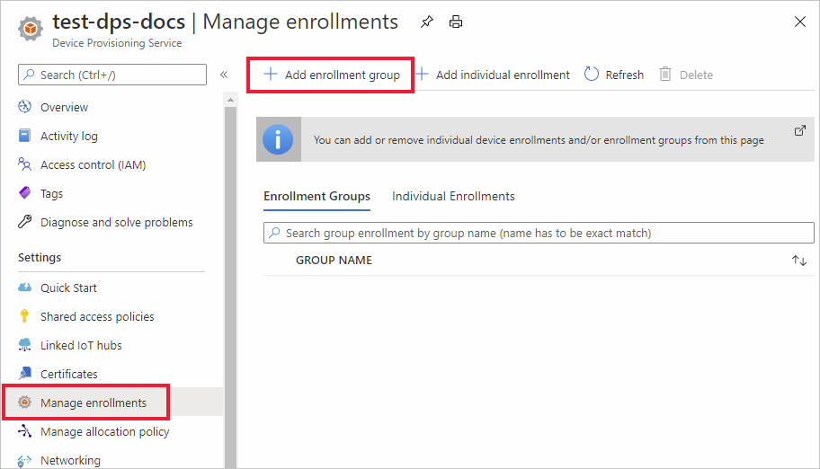
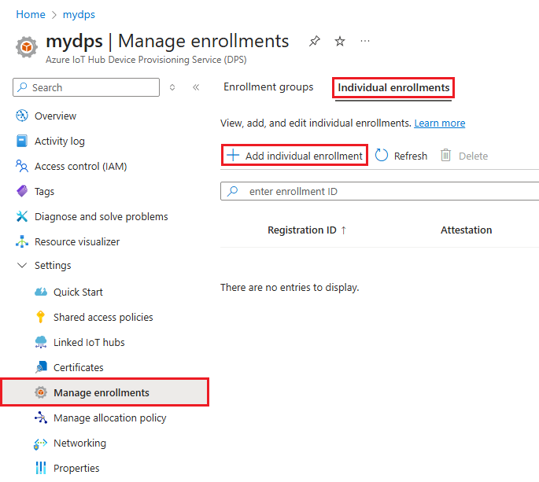

# How to manage device enrollments with Azure portal

A *device enrollment* creates a record of a single device or a group of devices that may at some point register with the Azure IoT Hub Device Provisioning Service. The enrollment record contains the initial configuration for the device(s) as part of that enrollment. Included in the configuration is the IoT hub a device will be assigned to or an allocation policy that configures the hub from a set of hubs. This article shows you how to manage device enrollments for your provisioning service.

## Create a device enrollment

There are two ways you can enroll your devices with the provisioning service:

* An **Enrollment group** is an entry for a group of devices that share a common attestation mechanism. We recommend using an enrollment group for a large number of devices that share an initial configuration, or for devices all going to the same tenant. Devices using [symmetric key](concepts-symmetric-key-attestation.md) or [X.509 certificates](concepts-x509-attestation.md) are supported. 

    For step-by-step instructions on creating and using enrollment groups with symmetric keys, see the [Provision devices with symmetric keys](how-to-legacy-device-symm-key.md) tutorial.

    You create an enrollment group in the portal for a group of devices using the following steps:

    1. Log in to the Azure portal and click **All resources** from the left-hand menu.  
    1. Click the Device Provisioning Service you want to enroll your device to from the list of resources.  
    1. In your provisioning service, click **Manage enrollments**, then Click the **Add enrollment group** button at the top.  
     
        
        
    1. When the "Add Enrollment Group" panel appears, enter the information for your enrollment and click **Save**.  
     
        
        
        | Field | Description |
        | :--- | :--- |
        | **Group name** | Required name for your group of devices. |
        | **Attestation Type** | Click **Certificate** or **Symmetric Key** for the attestation type depending on the attestation method your devices will use. |
        | **Certificate Type** | Available if you're using certificate attestation. select **CA Certificate** or **Intermediate** based on what certificate signed your device certificates. |
        | **Primary Certificate** | If you're signing your device certificates with a root CA certificate, that root CA certificate must have [proof of possession](how-to-verify-certificates.md) completed. Then you can select it as the **Primary certificate** for the group of devices.  If you're signing your device certificates with an intermediate certificate, an upload button will be available to allow you to upload your intermediate certificate. The certificate that signed the intermediate must also have [proof of possession](how-to-verify-certificates.md) completed for it. |

        
    

* An **Individual enrollment** is an entry for a single device that may be assigned to an IoT hub. Devices using [symmetric key](concepts-symmetric-key-attestation.md), [X.509 certificates](concepts-x509-attestation.md), and [TPM attestation](concepts-tpm-attestation.md) are supported. 

    You can create an individual enrollment in the portal using the following steps:

    1. Log in to the Azure portal and click **All resources** from the left-hand menu.
    1. Click the Device Provisioning Service you want to enroll your device to from the list of resources.
    1. In your provisioning service, click **Manage enrollments**, then click the **Add individual enrollment** button at the top.   

       

    1. When the "Add Enrollment" panel appears, enter the information for the individual device enrollment and click **Save**. 
     
        
    
        | Field | Description |
        | :--- | :--- |
        | **Mechanism** | Select **X.509**, **TPM**, or **Symmetric Key** for the attestation mechanism to use depending on the attestation method your devices will use. |
        | Attestation settings | For step-by-step instructions on creating and using individual enrollments with symmetric keys or X.509 certificates, see [Quickstart:Provision a simulated symmetric key device](quick-create-simulated-device-symm-key.md#create-a-device-enrollment) or [Quickstart:Provision a X.509 certificate device](quick-create-simulated-device-x509.md#create-a-device-enrollment) quickstart.  For step-by-step instructions on creating and using individual enrollments using TPM attestation, see one of the [Provision a simulated TPM device](quick-create-simulated-device-tpm-java.md#create-a-device-enrollment-entry) samples.|
        | **IoT Hub Device ID** |  This ID will represent your device. It must follow the rules for a device ID. For more information, see [Device identity properties](../iot-hub/iot-hub-devguide-identity-registry.md#device-identity-properties).  When using X.509 certificates, this text must be the subject name on the device certificate you upload for the enrollment. That subject name must conform to the rules for a device ID.|
            

## Update an enrollment entry
You can update an existing enrollment entry in the portal using the following steps:

1. Open your Device Provisioning Service in the Azure portal and click **Manage Enrollments**. 
1. Navigate to the enrollment entry you want to modify. Click the entry, which opens a summary information about your device enrollment. 
1. On this page, you can modify items other than the security type and credentials, such as the IoT hub the device should be linked to, and the device ID. You may also modify the initial device twin state. 
1. Once completed, click **Save** to update your device enrollment. 

    

## Remove a device enrollment
In cases where your device(s) do not need to be provisioned to any IoT hub, you can remove the related enrollment entry in the portal using the following steps:

1. Open your Device Provisioning Service in the Azure portal and click **Manage Enrollments**. 
1. Navigate to and select the enrollment entry you want to remove. 
1. Click the **Delete** button at the top and then select **Yes** when prompted to confirm. 
1. Once the action is completed, you'll see your entry removed from the list of device enrollments. 
 
    