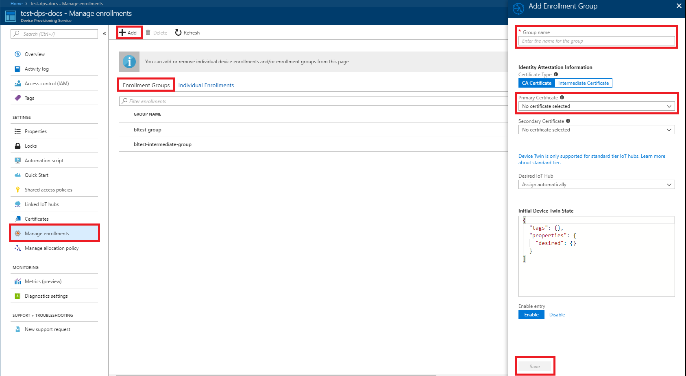
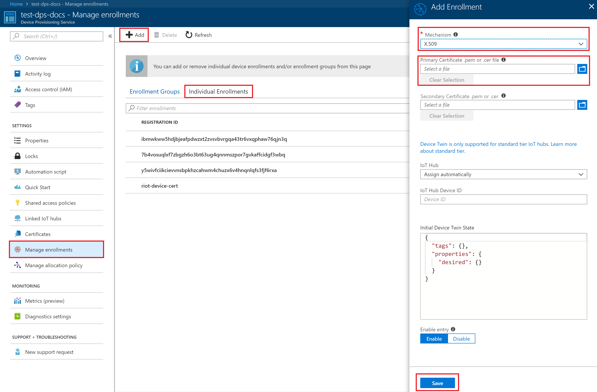
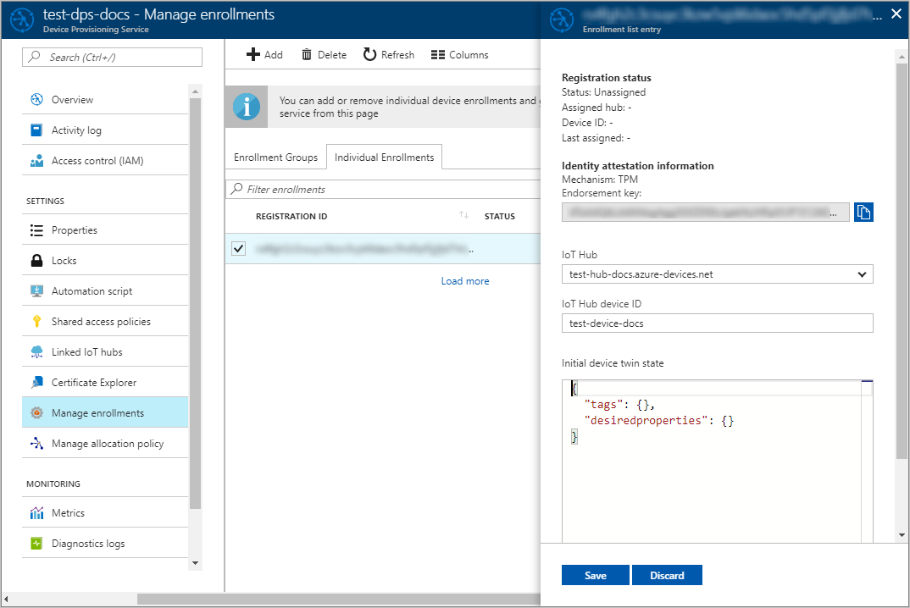
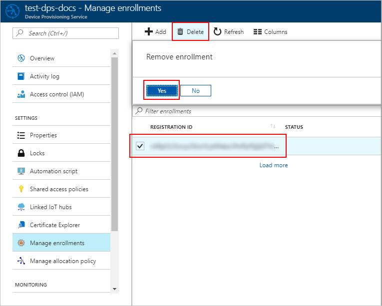

# How to manage device enrollments with Azure Portal

A *device enrollment* creates a record of a single device or a group of devices that may at some point register with the Azure IoT Hub Device Provisioning Service. The enrollment record contains the initial desired configuration for the device(s) as part of that enrollment, including the desired IoT hub. This article shows you how to manage device enrollments for your provisioning service.

## Create a device enrollment

There are two ways you can enroll your devices with the provisioning service:

* An **Enrollment group** is an entry for a group of devices that share a common attestation mechanism of X.509 certificates, signed by the same signing certificate, which can be the [root certificate](https://docs.microsoft.com/azure/iot-dps/concepts-security#root-certificate) or the [intermediate certificate](https://docs.microsoft.com/azure/iot-dps/concepts-security#intermediate-certificate), used to produce device certificate on physical device. We recommend using an enrollment group for a large number of devices which share a desired initial configuration, or for devices all going to the same tenant. Note that you can only enroll devices that use the X.509 attestation mechanism as *enrollment groups*. 

    You can create an enrollment group in the portal for a group of devices using the following steps:

  1. Log in to the Azure portal and click **All resources** from the left-hand menu.  
  1. Click the Device Provisioning service you want to enroll your device to from the list of resources.  
  1. In your provisioning service:  
     a. Click **Manage enrollments**, then select the **Enrollment Groups** tab.  
     b. Click the **Add** button at the top.  
     c. When the "Add Enrollment Group" panel appears, enter the information for the enrollment list entry.  **Group name** is required. Also select "CA or Intermediate" for **Certificate type**, and upload the root **Primary certificate** for the group of devices.  
     d. Click **Save**. On successful creation of your enrollment group, you should see the group name appear under the **Enrollment Groups** tab.  

     
    

* An **Individual enrollment** is an entry for a single device that may register. Individual enrollments may use either x509 certificates or SAS tokens (from a physical or virtual TPM) as attestation mechanisms. We recommend using individual enrollments for devices which require unique initial configurations, or for devices which can only use SAS tokens via TPM or virtual TPM as the attestation mechanism. Individual enrollments may have the desired IoT hub device ID specified.

    You can create an individual enrollment in the portal using the following steps:

    1. Log in to the Azure portal and click **All resources** from the left-hand menu.
    1. Click the Device Provisioning service you want to enroll your device to from the list of resources.
    1. In your provisioning service:  
       a. Click **Manage enrollments**, then select the **Individual Enrollments** tab.  
       b. Click the **Add** button at the top.   
       c. When the "Add Enrollment" panel appears, enter the information for the enrollment list entry. First select the attestation **Mechanism** for the device (X.509 or TPM). X.509 attestation requires you to upload the leaf **Primary certificate** for the device. TPM requires you to enter the **Attestation Key** and **Registration ID** for the device.  
       d. Click **Save**. On successful creation of your enrollment group, you should see your device appear under the **Individual Enrollments** tab.  

       

## Update an enrollment entry
You can update an existing enrollment entry in the portal using the following steps:

1. Open your Device Provisioning service in the Azure portal and click **Manage Enrollments**. 
1. Navigate to the enrollment entry you want to modify. Click the entry, which opens a summary information about your device enrollment. 
1. On this page, you can modify items other than the security type and credentials, such as the IoT hub the device should be linked to, as well as the device ID. You may also modify the initial device twin state. 
1. Once completed, click **Save** to update your device enrollment. 

    

## Remove a device enrollment
In cases where your device(s) do not need to be provisioned to any IoT hub, you can remove the related enrollment entry in the portal using the following steps:

1. Open your Device Provisioning service in the Azure portal and click **Manage Enrollments**. 
1. Navigate to and select the enrollment entry you want to remove. 
1. Click the **Delete** button at the top and then select **Yes** when prompted to confirm. 
1. Once the action is completed, you will see your entry removed from the list of device enrollments. 
 
    

