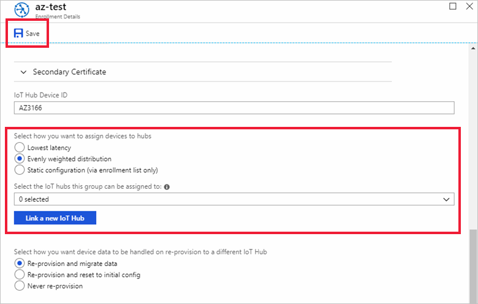
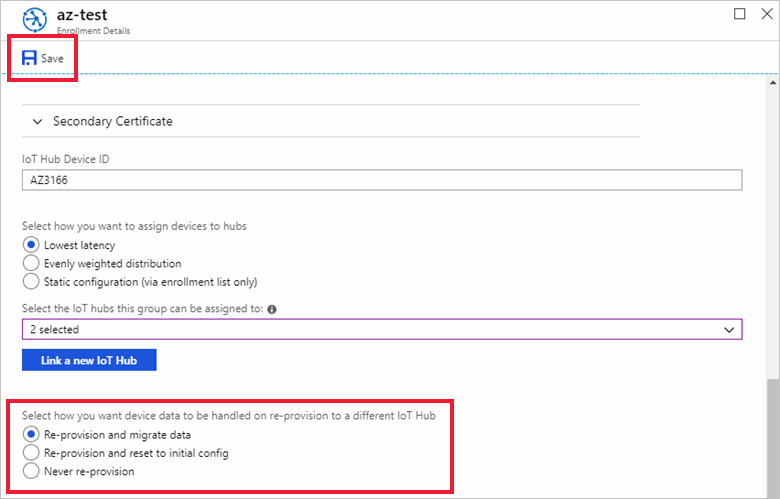

# How to reprovision devices

During the lifecycle of an IoT solution, it is common to move devices between IoT hubs. The reasons for this move may include the following scenarios:

* **Geolocation**: As a device moves between locations, network latency is improved by having the device migrated to an IoT hub closer to each location.

* **Multi-tenancy**: A device could be used within the same IoT solution but, reassigned or leased to a new customer, or customer site. This new customer may be serviced using a different IoT hub.

* **Solution change**: A device could be moved into a new or updated IoT solution. This reassignment may require that the device communicate with a new IoT hub that is connected to other backend components. 

* **Quarantine**: Similar to a solution change. A device that is malfunctioning, compromised, or out-of-date may be reassigned to an IoT hub where all it can do is update and get back in compliance. Once the device is functioning properly, it is then migrated back to its main hub.

For more a more detailed overview of reprovisioning, see [IoT Hub Device reprovisioning concepts](concepts-device-reprovision.md).

## Configure the enrollment allocation policy

The allocation policy determines how the devices associated with the enrollment will be allocated, or assigned, to an IoT hub once reprovisioned.

The following steps configure the allocation policy for a device's enrollment:

1. Sign in to the [Azure portal](https://portal.azure.com) and navigate to your Device Provisioning Service instance.

2. Click **Manage enrollments**, and click the enrollment group or individual enrollment that you want to configure for reprovisioning. 

3. Under **Select how you want to assign devices to hubs**, select one of the following allocation policies:

    * **Lowest latency**: This policy assigns devices to the linked IoT Hub that will result in the lowest latency communications between device and IoT Hub. This option enables the device to communicate with the closest IoT hub based on location. 
    
    * **Evenly weighted distribution**: This policy distributes devices across the linked IoT Hubs based on the allocation weight assigned to each linked IoT hub. This policy allows you to load balance devices across a group of linked hubs based on the allocation weights set on those hubs. If you are provisioning devices to only one IoT Hub, we recommend this setting. This setting is the default. 
    
    * **Static configuration**: This policy requires a desired IoT Hub be listed in the enrollment entry for a device to be provisioned. This policy allows you to designate a single specific IoT hub that you want to assign devices to.

4. Under **Select the IoT hubs this group can be assigned to**, select the linked IoT hubs that you want included with your allocation policy. Optionally, add a new linked Iot hub using the **Link a new IoT Hub** button.

    With the **Lowest latency** allocation policy, the hubs you select will be included in the latency evaluation to determine the closest hub for device assignment.

    With the **Evenly weighted distribution** allocation policy, devices will be load balanced across the hubs you select based on their configured allocation weights and their current device load.

    With the **Static configuration** allocation policy, select the IoT hub you want devices assigned to.

4. Click **Save**, or proceed to the next section to set the reprovisioning policy.

    

## Set the reprovisioning policy

1. Sign in to the [Azure portal](https://portal.azure.com) and navigate to your Device Provisioning Service instance.

2. Click **Manage enrollments**, and click the enrollment group or individual enrollment that you want to configure for reprovisioning.

3. Under **Select how you want device data to be handled on re-provision to a different IoT hub**, choose one of the following reprovisioning policies:

    * **Re-provision and migrate data**: This policy takes action when devices associated with the enrollment entry submit a new provisioning request. Depending on the enrollment entry configuration, the device may be reassigned to another IoT hub. If the device is changing IoT hubs, the device registration with the initial IoT hub will be removed. All device state information from that initial IoT hub will be migrated over to the new IoT hub. During migration, the device's status will be reported as **Assigning**

    * **Re-provision and reset to initial config**: This policy takes action when devices associated with the enrollment entry submit a new provisioning request. Depending on the enrollment entry configuration, the device may be reassigned to another IoT hub. If the device is changing IoT hubs, the device registration with the initial IoT hub will be removed. The initial configuration data that the provisioning service instance received when the device was provisioned is provided to the new IoT hub. During migration, the device's status will be reported as **Assigning**.

4. Click **Save** to enable the reprovisioning of the device based on your changes.

    

## Send a provisioning request from the device

In order for devices to be reprovisioned based on the configuration changes made in the preceding sections, these devices must request reprovisioning. 

How often a device submits a provisioning request depends on the scenario. However, it is advised to program your devices to send a provisioning request to a provisioning service instance on reboot, and support a [method](../iot-hub/iot-hub-devguide-direct-methods.md) to manually trigger provisioning on demand. Provisioning could also be triggered by setting a [desired property](../iot-hub/iot-hub-devguide-device-twins.md#desired-property-example). 

The reprovisioning policy on an enrollment entry determines how the device provisioning service instance handles these provisioning requests, and if device state data should be migrated during reprovisioning. The same policies are available for individual enrollments and enrollment groups:

For example code of sending provisioning requests from a device during a boot sequence, see [Auto-provisioning a simulated device](quick-create-simulated-device.md).

## Next steps

- To learn more Reprovisioning, see [IoT Hub Device reprovisioning concepts](concepts-device-reprovision.md) 
- To learn more Deprovisioning, see [How to deprovision devices that were previously auto-provisioned](how-to-unprovision-devices.md) 

