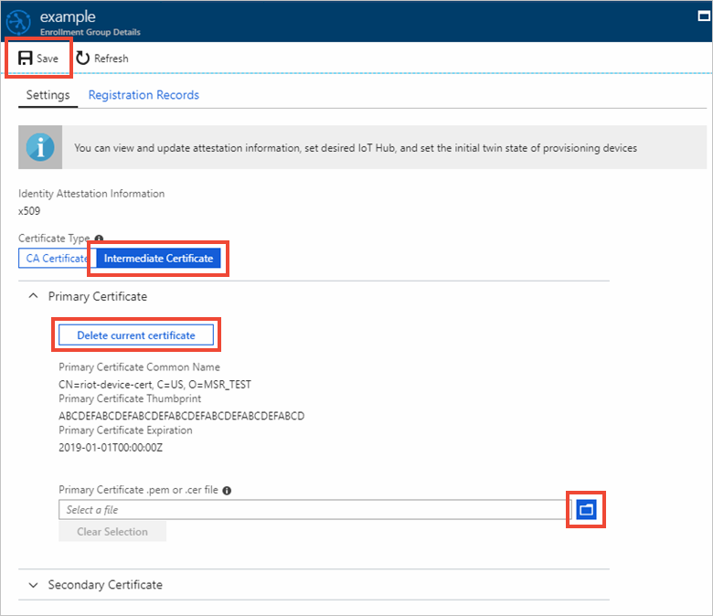

# How to roll X.509 device certificates

During the lifecycle of your IoT solution, you will need to roll certificates. Two of the main reasons for rolling certificates would be to address a security breach, and to address certificate expirations. 

Rolling certificates is a security best practice to help secure your system in case of a breach. As part of [Assume Breach Methodology](http://download.microsoft.com/download/C/1/9/C1990DBA-502F-4C2A-848D-392B93D9B9C3/Microsoft_Enterprise_Cloud_Red_Teaming.pdf), Microsoft advocates the need for having reactive security processes in place in addition to preventative measures. Rolling your device certificates should be included as part of these reactive security processes. The frequency in which you roll your certificates will depend on the security needs of your solution. Customers with solutions involving highly sensitive data may roll certificate daily, while others roll their certificates every couple years.

Rolling device certificates will involve updating the certificate stored on the device and the IoT hub. Afterwards, the device can reprovision itself with the IoT hub using normal [auto-provisioning](concepts-auto-provisioning.md) with the Device Provisioning Service.

## Rolling the certificate on the device

Certificates on a device should always be stored in a safe place like a [hardware security module (HSM)](concepts-device.md#hardware-security-module). The way you roll device certificates will depend on how they were created and installed in the devices in the first place. If you got your certificates from a third party, you must look into how they roll their certificates. The process may be included in your arrangement with them, or it may be a separate service they offer. If you are managing your own device certificates, you will have to build your own pipeline for updating certificates. Make sure both old and new leaf certificates have the same common name (CN). By having the same CN, the device can reprovision itself without creating a duplicate registration record.

## Rolling the certificate in the IoT hub

The device certificate can be manually added to an IoT hub, or it can be automated using a Device Provisioning Service instance. In this article, we will assume a provisioning service instance is being used to support [auto-provisioning](concepts-auto-provisioning.md).

For auto-provisioning, the easiest way to roll device certificates in an IoT hub is to reprovisioning the device with a Device Provisioning Service instance. The provisioning service makes sure the device is registered to an IoT Hub using its current [leaf certificate](concepts-security.md#end-entity-leaf-certificate). This registration process will update the IoT Hub device registry information as needed. 

During the auto-provisioning process the device boot-up, and contacts the provisioning service. The provisioning service responds by performing an identity check before creating a device identity in an IoT hub using the device’s leaf certificate as the credential. The provisioning service then tells the device which IoT hub it is assigned to, and the device then uses its leaf certificate to authenticate and connect. 

Once a new leaf certificate has been rolled to the device, it will no longer be able to connect to the IoT hub because it’s attempting to use a new certificate to connect and the IoT hub only recognizes the device with the old certificate. You must update the enrollment entry for the device to account for the device's new leaf certificate.

One possible exception to this connection failure would be a scenario where you have created an [Enrollment Group](concepts-service.md#enrollment-group) for your device in the provisioning service. In this case, if you are not rolling the root or intermediate certificates in the device's certificate chain of trust, then the device will be recognized if the new certificate is part of the chain of trust defined in the enrollment group. If this scenario arises as a reaction to a security breach, you should at least blacklist the specific device certificates in the group that are considered to be breached. For more information, see [Blacklist specific devices in an enrollment group](https://docs.microsoft.com/en-us/azure/iot-dps/how-to-revoke-device-access-portal#blacklist-specific-devices-in-an-enrollment-group).

To update an enrollment entry to account for rolled certificates, first navigate to **Manage Enrollments**:

1. Sign in to the [Azure portal](https://portal.azure.com) and navigate to the IoT Hub Device Provisioning Service instance that contains the enrollment entry for your device.

2. Click **Manage enrollments**.

   

How you handle updating the enrollment entry will depend on whether you are rolling certificates because of a security breach, or to deal with certificate expirations.

#### Updating an individual enrollment

If you are rolling certificates in response to a security breach, you should use the following approach that deletes the current certificate immediately:

1. Click **Individual Enrollments**, and click the device entry in the list. 

2. Click the **Delete current certificate** button and then, click the folder icon to select the new certificate to be uploaded for the enrollment entry. Click **Save**.

   

If you are rolling certificates to handle certificate expirations, you should use the secondary certificate configuration as follows to ensure no downtime for devices attempting to provision:

1. Click **Individual Enrollments**, and click the device entry in the list. 

2. Click the **Delete current certificate** button and then, click the folder icon to select the new certificate to be uploaded for the enrollment entry. Click **Save**.

   

#### Updating an enrollment group

To update a group enrollment for the new certificate:

1. Sign in to the [Azure portal](https://portal.azure.com) and navigate to the IoT Hub Device Provisioning Service instance that contains the enrollment entry for your device.

2. Click **Manage enrollments**.

   

3. Click **Enrollment Groups**, and then click the enrollment group in the list. 

4. Click **Intermediate Certificate**, and **Delete current certificate**. Click the folder icon to navigate to the new intermediate certificate to be uploaded for the enrollment group. Click **Save**.

   

## Device reprovisioning

Once the certificate is rolled on both the device, and the Device Provisioning Service, the device can reprovision itself by contacting the Device Provisioning Service. 

One easy way of programming devices to reprovision is to program the device to contact the provisioning service to go through the provisioning flow if the device receives an “unauthorized” error from attempting to connect to the IoT hub.

Another way is for both the old and the new certificates to be valid for a short overlap, and use the IoT hub to send a command to devices to have them re-register via the provisioning service to update their IoT Hub connection information. Because each device can process commands differently, you will have to program your device to know what to do when the command is invoked. There are several ways you can command your device via IoT Hub, and we recommend using [direct methods](../iot-hub/iot-hub-devguide-direct-methods.md) or [jobs](../iot-hub/iot-hub-devguide-jobs.md) to initiate the process.

Once reprovisioning is complete, devices will be able to connect to IoT Hub using their new certificates.

## Blacklisting certificates

To blacklist a device certificate, simply disable the enrollment entry for the target device/certificate. For more information, see blacklisting devices in the [Manage disenrollment](how-to-revoke-device-access-portal.md) article.

Once an enrollment entry is disabled, any device(s) attempting to register with an IoT hub using the certificates configured with the entry will fail.
 

## Next steps

- To learn more about X.509 certificates in the Device Provisioning Service, see [Security](concepts-security.md) 
- To learn about how to do proof-of-possession for X.509 CA certificates with the Azure IoT Hub Device Provisioning Service, see [How to verify certificates](how-to-verify-certificates.md)
- To learn about how to use the portal to create an enrollment group, see [Managing device enrollments with Azure portal](how-to-manage-enrollments.md).

