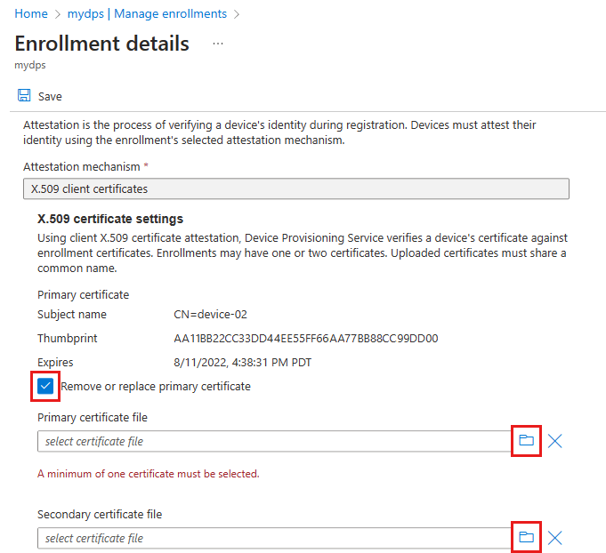

# How to roll X.509 device certificates

During the lifecycle of your IoT solution, you'll need to roll certificates. Two of the main reasons for rolling certificates would be a security breach, and certificate expirations. 

Rolling certificates is a security best practice to help secure your system in the event of a breach. As part of [Assume Breach Methodology](http://download.microsoft.com/download/C/1/9/C1990DBA-502F-4C2A-848D-392B93D9B9C3/Microsoft_Enterprise_Cloud_Red_Teaming.pdf), Microsoft advocates the need for having reactive security processes in place along with preventative measures. Rolling your device certificates should be included as part of these security processes. The frequency in which you roll your certificates will depend on the security needs of your solution. Customers with solutions involving highly sensitive data may roll certificate daily, while others roll their certificates every couple years.

Rolling device certificates will involve updating the certificate stored on the device and the IoT hub. Afterwards, the device can reprovision itself with the IoT hub using normal [auto-provisioning](concepts-auto-provisioning.md) with the Device Provisioning Service.

## Obtain new certificates

There are many ways to obtain new certificates for your IoT devices. These include obtaining certificates from the device factory, generating your own certificates, and having a third party manage certificate creation for you. 

Certificates are signed by each other to form a chain of trust from a root CA certificate to a [leaf certificate](concepts-security.md#end-entity-leaf-certificate). A signing certificate is the certificate used to sign the leaf certificate at the end of the chain of trust. A signing certificate can be a root CA certificate, or an intermediate certificate in chain of trust. For more information, see [X.509 certificates](concepts-security.md#x509-certificates).
 
There are two different ways to obtain a signing certificate. The first way, which is recommended for production systems, is to purchase a signing certificate from a root certificate authority (CA). This way chains security down to a trusted source. 

The second way is to create your own X.509 certificates using a tool like OpenSSL. This approach is great for testing X.509 certificates but provides few guarantees around security. We recommend you only use this approach for testing unless you prepared to act as your own CA provider.
 

## Roll the certificate on the device

Certificates on a device should always be stored in a safe place like a [hardware security module (HSM)](concepts-device.md#hardware-security-module). The way you roll device certificates will depend on how they were created and installed in the devices in the first place. 

If you got your certificates from a third party, you must look into how they roll their certificates. The process may be included in your arrangement with them, or it may be a separate service they offer. 

If you're managing your own device certificates, you'll have to build your own pipeline for updating certificates. Make sure both old and new leaf certificates have the same common name (CN). By having the same CN, the device can reprovision itself without creating a duplicate registration record. 

## Roll the certificate in the IoT hub

The device certificate can be manually added to an IoT hub. The certificate can also be automated using a Device Provisioning service instance. In this article, we'll assume a Device Provisioning service instance is being used to support auto-provisioning.

When a device is initially provisioned through auto-provisioning, it boots-up, and contacts the provisioning service. The provisioning service responds by performing an identity check before creating a device identity in an IoT hub using the device’s leaf certificate as the credential. The provisioning service then tells the device which IoT hub it's assigned to, and the device then uses its leaf certificate to authenticate and connect to the IoT hub. 

Once a new leaf certificate has been rolled to the device, it can no longer connect to the IoT hub because it’s using a new certificate to connect. The IoT hub only recognizes the device with the old certificate. The result of the device's connection attempt will be an "unauthorized" connection error. To resolve this error, you must update the enrollment entry for the device to account for the device's new leaf certificate. Then the provisioning service can update the IoT Hub device registry information as needed when the device is reprovisioned. 

One possible exception to this connection failure would be a scenario where you've created an [Enrollment Group](concepts-service.md#enrollment-group) for your device in the provisioning service. In this case, if you aren't rolling the root or intermediate certificates in the device's certificate chain of trust, then the device will be recognized if the new certificate is part of the chain of trust defined in the enrollment group. If this scenario arises as a reaction to a security breach, you should at least blacklist the specific device certificates in the group that are considered to be breached. For more information, see [Blacklist specific devices in an enrollment group](https://docs.microsoft.com/en-us/azure/iot-dps/how-to-revoke-device-access-portal#blacklist-specific-devices-in-an-enrollment-group).

Updating enrollment entries for rolled certificates is accomplished on the **Manage enrollments** page. To access that page, follow these steps:

1. Sign in to the [Azure portal](https://portal.azure.com) and navigate to the IoT Hub Device Provisioning Service instance that has the enrollment entry for your device.

2. Click **Manage enrollments**.

    

How you handle updating the enrollment entry will depend on whether you're using individual enrollments, or group enrollments. Also the recommended procedures differ depending on whether you're rolling certificates because of a security breach, or certificate expiration. The following sections describe how to handle these updates.

## Individual enrollments and security breaches

If you're rolling certificates in response to a security breach, you should use the following approach that deletes the current certificate immediately:

1. Click **Individual Enrollments**, and click the registration ID entry in the list. 

2. Click the **Delete current certificate** button and then, click the folder icon to select the new certificate to be uploaded for the enrollment entry. Click **Save** when finished.

    These steps should be completed for the primary and secondary certificate, if both are compromised.

    

3. Once the compromised certificate has been removed from the provisioning service, the certificate can still be used to make device connections to the IoT hub as long as a device registration for it exists there. You can address this two ways: 

    The first way would be to manually navigate to your IoT hub and immediately remove the device registration associated with the compromised certificate. Then when the device provisions again with an updated certificate, a new device registration will be created.     

    

    The second way would be to use reprovisioning support to reprovision the device to the same IoT hub. This approach can be used to replace the certificate for the device registration on the IoT hub. For more information, see [How to reprovision devices](how-to-reprovision.md).

## Individual enrollments and certificate expiration

If you're rolling certificates to handle certificate expirations, you should use the secondary certificate configuration as follows to reduce downtime for devices attempting to provision.

Later when the secondary certificate also nears expiration, and needs to be rolled, you can rotate to using the primary configuration. Rotating between the primary and secondary certificates in this way reduces downtime for devices attempting to provision.

1. Click **Individual Enrollments**, and click the registration ID entry in the list. 

2. Click **Secondary Certificate** and then, click the folder icon to select the new certificate to be uploaded for the enrollment entry. Click **Save**.

    

3. Later when the primary certificate has expired, come back and delete that primary certificate by clicking the **Delete current certificate** button.

## Enrollment groups and security breaches

To update a group enrollment in response to a security breach, you should use one of the following approaches that will delete the current root CA, or intermediate certificate immediately.

#### Update compromised root CA certificates

1. Click the **Certificates** tab for your Device Provisioning service instance.

2. Click the compromised certificate in the list, and then click the **Delete** button. Confirm the delete by entering the certificate name and click **OK**. Repeat this process for all compromised certificates.

    

3. Follow steps outlined in [Configure verified CA certificates](how-to-verify-certificates.md) to add and verify new root CA certificates.

4. Click the **Manage enrollments** tab for your Device Provisioning service instance, and click the **Enrollment Groups** list. Click your enrollment group name in the list.

5. Click **CA Certificate**, and select your new root CA certificate. Then click **Save**. 

    

6. Once the compromised certificate has been removed from the provisioning service, the certificate can still be used to make device connections to the IoT hub as long as device registrations for it exists there. You can address this two ways: 

    The first way would be to manually navigate to your IoT hub and immediately remove the device registration associated with the compromised certificate. Then when your devices provision again with updated certificates, a new device registration will be created for each one.     

    

    The second way would be to use reprovisioning support to reprovision your devices to the same IoT hub. This approach can be used to replace certificates for device registrations on the IoT hub. For more information, see [How to reprovision devices](how-to-reprovision.md).

#### Update compromised intermediate certificates

1. Click **Enrollment Groups**, and then click the group name in the list. 

2. Click **Intermediate Certificate**, and **Delete current certificate**. Click the folder icon to navigate to the new intermediate certificate to be uploaded for the enrollment group. Click **Save** when you're finished. These steps should be completed for both the primary and secondary certificate, if both are compromised.

    This new intermediate certificate should be signed by a verified root CA certificate that has already been added into provisioning service. For more information, see [X.509 certificates](concepts-security.md#x509-certificates).

    

3. Once the compromised certificate has been removed from the provisioning service, the certificate can still be used to make device connections to the IoT hub as long as device registrations for it exists there. You can address this two ways: 

    The first way would be to manually navigate to your IoT hub and immediately remove the device registration associated with the compromised certificate. Then when your devices provision again with updated certificates, a new device registration will be created for each one.     

    

    The second way would be to use reprovisioning support to reprovision your devices to the same IoT hub. This approach can be used to replace certificates for device registrations on the IoT hub. For more information, see [How to reprovision devices](how-to-reprovision.md).

## Enrollment groups and certificate expiration

If you are rolling certificates to handle certificate expirations, you should use the secondary certificate configuration as follows to ensure no downtime for devices attempting to provision.

Later when the secondary certificate also nears expiration, and needs to be rolled, you can rotate to using the primary configuration. Rotating between the primary and secondary certificates in this way ensures no downtime for devices attempting to provision. 

#### Update expiring root CA certificates

1. Follow steps outlined in [Configure verified CA certificates](how-to-verify-certificates.md) to add and verify new root CA certificates.

2. Click the **Manage enrollments** tab for your Device Provisioning service instance, and click the **Enrollment Groups** list. Click your enrollment group name in the list.

3. Click **CA Certificate**, and select your new root CA certificate under the **Secondary Certificate** configuration. Then click **Save**. 

    

4. Later when the primary certificate has expired, click the **Certificates** tab for your Device Provisioning service instance. Click the expired certificate in the list, and then click the **Delete** button. Confirm the delete by entering the certificate name, and click **OK**.

    

#### Update expiring intermediate certificates

1. Click **Enrollment Groups**, and click the group name in the list. 

2. Click **Secondary Certificate** and then, click the folder icon to select the new certificate to be uploaded for the enrollment entry. Click **Save**.

    This new intermediate certificate should be signed by a verified root CA certificate that has already been added into provisioning service. For more information, see [X.509 certificates](concepts-security.md#x509-certificates).

   

3. Later when the primary certificate has expired, come back and delete that primary certificate by clicking the **Delete current certificate** button.

## Reprovision the device

Once the certificate is rolled on both the device and the Device Provisioning Service, the device can reprovision itself by contacting the Device Provisioning service. 

One easy way of programming devices to reprovision is to program the device to contact the provisioning service to go through the provisioning flow if the device receives an “unauthorized” error from attempting to connect to the IoT hub.

Another way is for both the old and the new certificates to be valid for a short overlap, and use the IoT hub to send a command to devices to have them re-register via the provisioning service to update their IoT Hub connection information. Because each device can process commands differently, you will have to program your device to know what to do when the command is invoked. There are several ways you can command your device via IoT Hub, and we recommend using [direct methods](../iot-hub/iot-hub-devguide-direct-methods.md) or [jobs](../iot-hub/iot-hub-devguide-jobs.md) to initiate the process.

Once reprovisioning is complete, devices will be able to connect to IoT Hub using their new certificates.

## Blacklist certificates

In response to a security breach, you may need to blacklist a device certificate. To blacklist a device certificate, disable the enrollment entry for the target device/certificate. For more information, see blacklisting devices in the [Manage disenrollment](how-to-revoke-device-access-portal.md) article.

Once a certificate is included as part of a disabled enrollment entry, any attempts to register with an IoT hub using that certificates will fail even if it is enabled as part of another enrollment entry.
 

## Next steps

- To learn more about X.509 certificates in the Device Provisioning Service, see [Security](concepts-security.md) 
- To learn about how to do proof-of-possession for X.509 CA certificates with the Azure IoT Hub Device Provisioning Service, see [How to verify certificates](how-to-verify-certificates.md)
- To learn about how to use the portal to create an enrollment group, see [Managing device enrollments with Azure portal](how-to-manage-enrollments.md).

