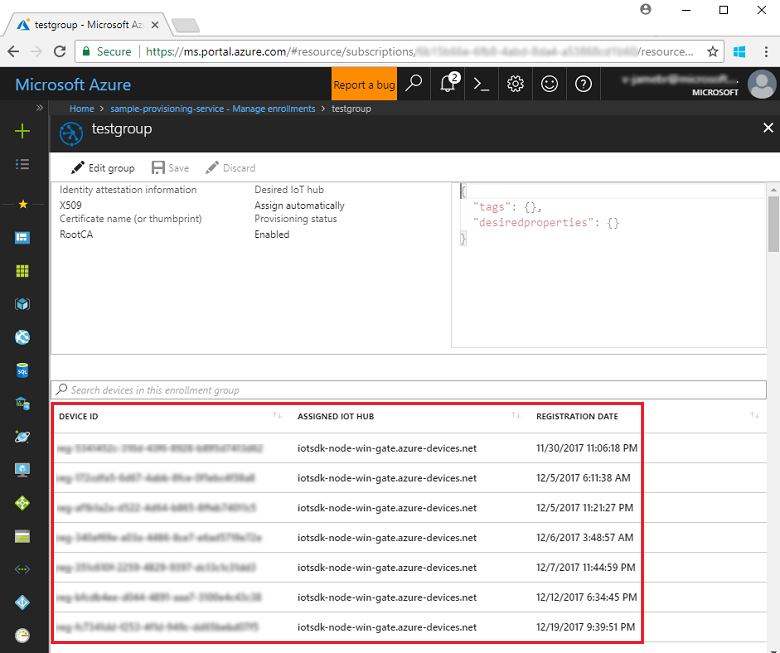

# How to deprovision devices that were previously auto-provisioned 

You may find it necessary to deprovision devices that were previously auto-provisioned through the Device Provisioning Service. For example, a device may be sold or moved to a different IoT hub, or it may be lost, stolen, or otherwise compromised. 

In general, deprovisioning a device involves two steps:

1. Disenroll the device from your provisioning service, to prevent future auto-provisioning. Depending on whether you want to revoke access temporarily or permanently, you may want to either disable or delete an enrollment entry. For devices that use X.509 attestation, you may want to disable/delete an entry in the hierarchy of your existing enrollment groups.  
 
   - To learn how to disenroll a device, see [How to disenroll a device from Azure IoT Hub Device Provisioning Service](how-to-revoke-device-access-portal.md).
   - To learn how to disenroll a device programmatically using one of the provisioning service SDKs, see [Manage device enrollments with service SDKs](how-to-manage-enrollments-sdks.md).

2. Deregister the device from your IoT Hub, to prevent future communications and data transfer. Again, you can temporarily disable or permanently delete the device's entry in the identity registry for the IoT Hub where it was provisioned. See [Disable devices](/azure/iot-hub/iot-hub-devguide-identity-registry#disable-devices) to learn more about disablement. See "Device Management / IoT Devices" for your IoT Hub resource, in the [Azure portal](https://portal.azure.com).

The exact steps you take to deprovision a device depend on its attestation mechanism and its applicable enrollment entry with your provisioning service. The following sections provide an overview of the process, based on the enrollment and attestation type.

## Individual enrollments
Devices that use TPM attestation or X.509 attestation with a leaf certificate are provisioned through an individual enrollment entry. 

To deprovision a device that has an individual enrollment: 

1. Disenroll the device from your provisioning service:

   - For devices that use TPM attestation, delete the individual enrollment entry to permanently revoke the device's access to the provisioning service, or disable the entry to temporarily revoke its access. 
   - For devices that use X.509 attestation, you can either delete or disable the entry. Be aware, though, if you delete an individual enrollment for a device that uses X.509 and an enabled enrollment group exists for a signing certificate in that device's certificate chain, the device can re-enroll. For such devices, it may be safer to disable the enrollment entry. Doing so prevents the device from re-enrolling, regardless of whether an enabled enrollment group exists for one of its signing certificates.

2. Disable or delete the device in the identity registry of the IoT hub that it was provisioned to. 

## Enrollment groups
With X.509 attestation, devices can also be provisioned through an enrollment group. Enrollment groups are configured with a signing certificate, either an intermediate or root CA certificate, and control access to the provisioning service for devices with that certificate in their certificate chain. To learn more about enrollment groups and X.509 certificates with the provisioning service, see [X.509 certificates](concepts-security.md#x509-certificates). 

To see a list of devices that have been provisioned through an enrollment group, you can view the enrollment group's details. This is an easy way to understand which IoT hub each device has been provisioned to. To view the device list: 

1. Log in to the Azure portal and click **All resources** on the left-hand menu.
2. Click your provisioning service in the list of resources.
3. In your provisioning service, click **Manage enrollments**, then select **Enrollment Groups** tab.
4. Click the enrollment group to open it.

   

With enrollment groups, there are two scenarios to consider:

- To deprovision all of the devices that have been provisioned through an enrollment group:
  1. Disable the enrollment group to blacklist its signing certificate. 
  2. Use the list of provisioned devices for that enrollment group to disable or delete each device from the identity registry of its respective IoT hub. 
  3. After disabling or deleting all devices from their respective IoT hubs, you can optionally delete the enrollment group. Be aware, though, that, if you delete the enrollment group and there is an enabled enrollment group for a signing certificate higher up in the certificate chain of one or more of the devices, those devices can re-enroll. 

- To deprovision a single device from an enrollment group:
  1. Create a disabled individual enrollment for its leaf (device) certificate. This revokes access to the provisioning service for that device while still permitting access for other devices that have the enrollment group's signing certificate in their chain. Do not delete the disabled individual enrollment for the device. Doing so will allow the device to re-enroll through the enrollment group. 
  2. Use the list of provisioned devices for that enrollment group to find the IoT hub that the device was provisioned to and disable or delete it from that hub's identity registry. 
  
  

