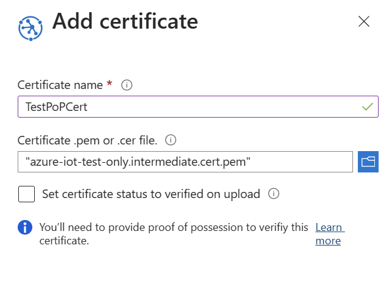
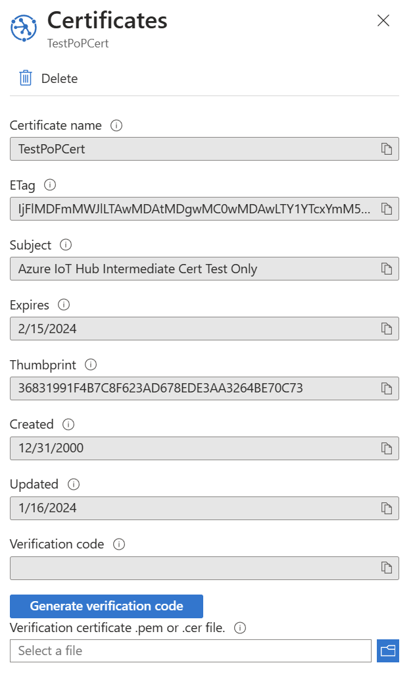
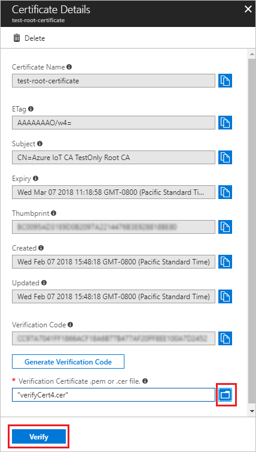

# How to do proof-of-possession for X.509 CA certificates with your Device Provisioning Service

A verified X.509 Certificate Authority (CA) certificate is a CA certificate that has been uploaded and registered to your provisioning service and has gone through proof-of-possession with the service. 

Proof-of-possession involves the following steps:
1. Get a unique verification code generated by the provisioning service for your X.509 CA certificate. You can do this from the Azure portal.
2. Create an X.509 verification certificate with the verification code as its subject and sign the certificate with the private key associated with your X.509 CA certificate.
3. Upload the signed verification certificate to the service. The service validates the verification certificate using the public portion of the CA certificate to be verified, thus proving that you are in possession of the CA certificate's private key.

Verified certificates play an important role when using enrollment groups. Verifying certificate ownership provides an additional security layer by ensuring that the uploader of the certificate is in possession of the certificate's private key. Verification prevents a malicious actor sniffing your traffic from extracting an intermediate certificate and using that certificate to create an enrollment group in their own provisioning service, effectively hijacking your devices. By proving ownership of the root or an intermediate certificate in a certificate chain, you're proving that you have permission to generate leaf certificates for the devices that will be registering as a part of that enrollment group. For this reason, the root or intermediate certificate configured in an enrollment group must either be a verified certificate or must roll up to a verified certificate in the certificate chain a device presents when it authenticates with the service. To learn more about enrollment groups, see [X.509 certificates](concepts-security.md#x509-certificates) and [Controlling device access to the provisioning service with X.509 certificates](concepts-security.md#controlling-device-access-to-the-provisioning-service-with-x509-certificates).

## Register the public part of an X.509 certificate and get a verification code

To register a CA certificate with your provisioning service and get a verification code that you can use during proof-of-possession, follow these steps. 

1. In the Azure portal, navigate to your provisioning service and open **Certificates** from the left-hand menu. 
2. Click **Add** to add a new certificate.
3. Enter a friendly display name for your certificate. Browse to the .cer or .pem file that represents the public part of your X.509 certificate. Click **Upload**.
4. Once you get a notification that your certificate is successfully uploaded, click **Save**.

      

   Your certificate will show in the **Certificate Explorer** list. Note that the **STATUS** of this certificate is *Unverified*.

5. Click on the certificate that you added in the previous step.

6. In **Certificate Details**, click **Generate Verification Code**.

7. The provisioning service creates a **Verification Code** that you can use to validate the certificate ownership. Copy the code to your clipboard. 

     

## Digitally sign the verification code to create a verification certificate

Now, you need to sign the *Verification Code* with the private key associated with your X.509 CA certificate, which generates a signature. This is known as [Proof of possession](https://tools.ietf.org/html/rfc5280#section-3.1) and results in a signed verification certificate.

Microsoft provides tools and samples that can help you create a signed verification certificate: 

- The **Azure IoT Hub C SDK** provides PowerShell (Windows) and Bash (Linux) scripts to help you create CA and leaf certificates for development and to perform proof-of-possession using a verification code. You can download the [files](https://github.com/Azure/azure-iot-sdk-c/tree/master/tools/CACertificates) relevant to your system to a working folder and follow the instructions in the [Managing CA certificates readme](https://github.com/Azure/azure-iot-sdk-c/blob/master/tools/CACertificates/CACertificateOverview.md) to perform proof-of-possession on a CA certificate. 
- The **Azure IoT Hub C# SDK** contains the [Group Certificate Verification Sample](https://github.com/Azure-Samples/azure-iot-samples-csharp/tree/master/provisioning/Samples/service/GroupCertificateVerificationSample), which you can use to do proof-of-possession.
 
> [!IMPORTANT]
> In addition to performing proof-of-possession, the PowerShell and Bash scripts cited previously also allow you to create root certificates, intermediate certificates, and leaf certificates that can be used to authenticate and provision devices. These certificates should be used for development only. They should never be used in a production environment. 

The PowerShell and Bash scripts provided in the documentation and SDKs rely on [OpenSSL](https://www.openssl.org/). You may also use OpenSSL or other third-party tools to help you do proof-of-possession. For more information about tooling provided with the SDKs, see [How to use tools provided in the SDKs](how-to-use-sdk-tools.md). 

## Upload the signed verification certificate

1. Upload the resulting signature as a verification certificate to your provisioning service in the portal. In **Certificate Details** on the Azure portal, use the  _File Explorer_ icon next to the **Verification Certificate .pem or .cer file** field to upload the signed verification certificate from your system.

2. Once the certificate is successfully uploaded, click **Verify**. The **STATUS** of your certificate changes to **_Verified_** in the **Certificate Explorer** list. Click **Refresh** if it does not update automatically.

     

## Next steps

- To learn about how to use the portal to create an enrollment group, see [Managing device enrollments with Azure portal](how-to-manage-enrollments.md).
- To learn about how to use the service SDKs to create an enrollment group, see [Managing device enrollments with service SDKs](how-to-manage-enrollments-sdks.md).

