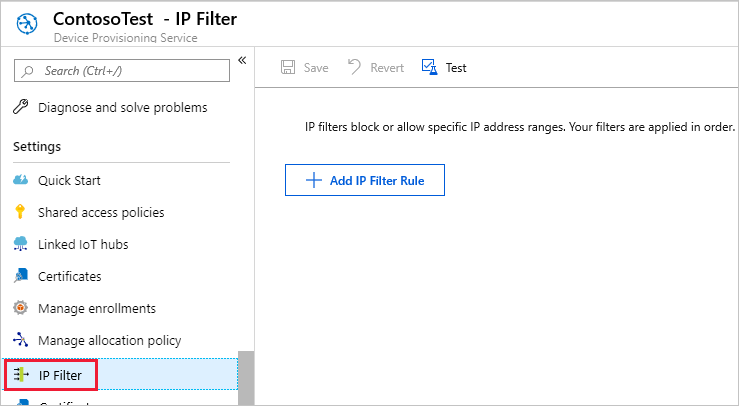
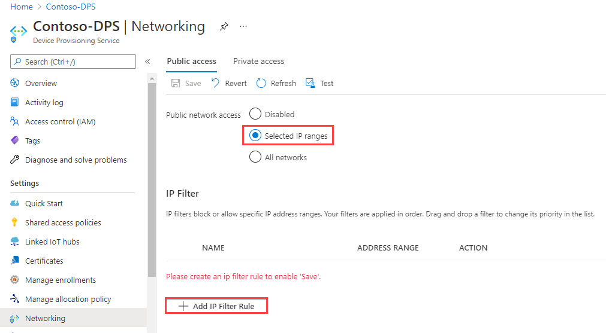
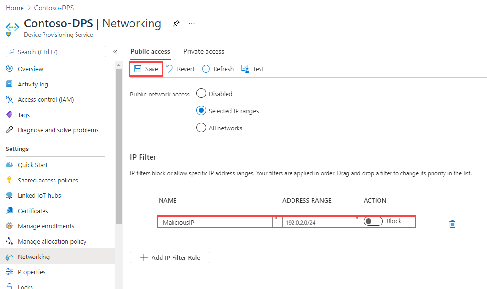
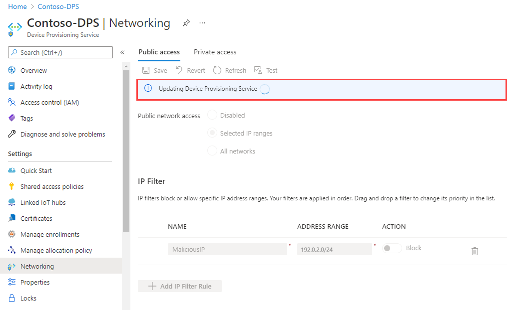
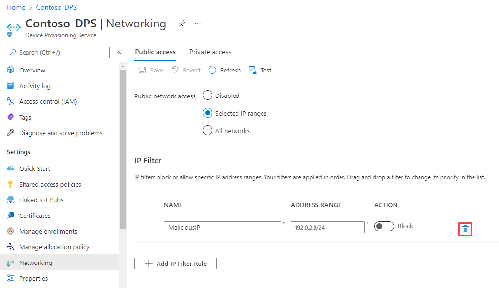
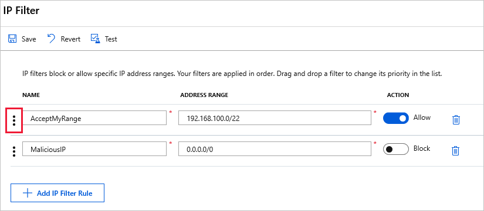

---
title: Azure IoT DPS IP connection filters | Microsoft Docs
description: How to use IP filtering to block connections from specific IP addresses to your Azure IoT DPS instance. You can block connections from individual or ranges of IP addresses.
author: wesmc7777
ms.author: wesmc
ms.service: iot-dps
services: iot-dps
ms.topic: conceptual
ms.date: 03/12/2020
---

# Use IP filters

Security is an important aspect of any IoT solution. Sometimes you need to explicitly specify the IP addresses from which devices can connect as part of your security configuration. The *IP filter* feature for an Azure IoT Hub Device Provisioning Service (DPS) enables you to configure rules for rejecting or accepting traffic from specific IPv4 addresses.

## When to use

There are two specific use-cases where it is useful to block connections to a DPS endpoint from certain IP addresses:

* Your DPS should receive traffic only from a specified range of IP addresses and reject everything else. For example, you are using your DPS with [Azure Express Route](https://azure.microsoft.com/documentation/articles/expressroute-faqs/#supported-services) to create private connections between a DPS and your devices.

* You need to reject traffic from IP addresses that have been identified as suspicious by the DPS administrator.

## How filter rules are applied

The IP filter rules are applied at the DPS instance level. Therefore the IP filter rules apply to all connections from devices and back-end apps using any supported protocol.

Any connection attempt from an IP address that matches a rejecting IP rule in your DPS instance receives an unauthorized 401 status code and description. The response message does not mention the IP rule.

## Default setting

By default, the **IP Filter** grid in the portal for DPS is empty. This default setting means that your DPS accepts connections from any IP address. This default setting is equivalent to a rule that accepts the 0.0.0.0/0 IP address range.



## Add or edit an IP filter rule

To add an IP filter rule, select **+ Add IP Filter Rule**.



After selecting **Add IP Filter Rule**, fill in the fields.



* Provide a **name** for the IP Filter rule. This must be a unique, case-insensitive, alphanumeric string up to 128 characters long. Only the ASCII 7-bit alphanumeric characters plus `{'-', ':', '/', '\', '.', '+', '%', '_', '#', '*', '?', '!', '(', ')', ',', '=', '@', ';', '''}` are accepted.

* Provide a single IPv4 address or a block of IP addresses in CIDR notation. For example, in CIDR notation 192.168.100.0/22 represents the 1024 IPv4 addresses from 192.168.100.0 to 192.168.103.255.

* Select **Allow** or **Block** as the **action** for the IP filter rule.

After filling in the fields, select **Save** to save the rule. You see an alert notifying you that the update is in progress.



The **Add** option is disabled when you reach the maximum of 10 IP filter rules.

To edit an existing rule, select the data you want to change, make the change, then select **Save** to save your edit.

> [!NOTE]
> Rejecting IP addresses can prevent other Azure Services from interacting with the DPS instance.

## Delete an IP filter rule

To delete an IP filter rule, select the trash can icon on that row and then select **Save**. The rule is removed and the change is saved.




## Update IP filter rules in code

You may retrieve and modify your DPS IP filter using Azure resource Provider's REST endpoint. See `properties.ipFilterRules` in [createorupdate method](https://docs.microsoft.com/rest/api/iot-dps/iotdpsresource/createorupdate).

Updating DPS IP filter rules is not currently supported with Azure CLI or Azure PowerShell but, can be accomplished with Azure Resource Manager templates. See, [Azure Resource Manager templates](../azure-resource-manager/templates/overview.md) for guidance on using Resource Manager templates. The template examples that follow show how to create, edit, and delete DPS IP filter rules.

### Add an IP filter rule

The following template example creates a new IP filter rule named "AllowAll" that accepts all traffic.

```json
{
    "$schema": "https://schema.management.azure.com/schemas/2015-01-01/deploymentTemplate.json#", 
    "contentVersion": "1.0.0.0", 
    "parameters": {
        "iotDpsName": {
            "type": "string",
            "defaultValue": "[resourceGroup().name]",
            "minLength": 3,
            "metadata": {
                "description": "Specifies the name of the IoT DPS service."
            }
        }, 
        "location": {
            "type": "string",
            "defaultValue": "[resourceGroup().location]",
            "metadata": {
                "description": "Location for Iot DPS resource."
            }
        }        
    }, 
    "variables": {
        "iotDpsApiVersion": "2020-01-01"
    }, 
    "resources": [
        {
            "type": "Microsoft.Devices/provisioningServices",
            "apiVersion": "[variables('iotDpsApiVersion')]",
            "name": "[parameters('iotDpsName')]",
            "location": "[parameters('location')]",
            "sku": {
                "name": "S1",
                "tier": "Standard",
                "capacity": 1
            },
            "properties": {
                "IpFilterRules": [
                    {
                        "FilterName": "AllowAll",
                        "Action": "Accept",
                        "ipMask": "0.0.0.0/0"
                    }
                ]
            }            
        }
    ]
}
```

Update the IP filter rule attributes of the template based on your requirements.

| Attribute                | Description |
| ------------------------ | ----------- |
| **FilterName**           | Provide a name for the IP Filter rule. This must be a unique, case-insensitive, alphanumeric string up to 128 characters long. Only the ASCII 7-bit alphanumeric characters plus {'-', ':', '/', '\', '.', '+', '%', '_', '#', '*', '?', '!', '(', ')', ',', '=', '@', ';', '''} are accepted. |
| **Action**               | Accepted values are **Accept** or **Reject** as the action for the IP filter rule. |
| **ipMask**               | Provide a single IPv4 address or a block of IP addresses in CIDR notation. For example, in CIDR notation 192.168.100.0/22 represents the 1024 IPv4 addresses from 192.168.100.0 to 192.168.103.255. |


### Update an IP filter rule

The following template example updates the IP filter rule named "AllowAll", shown previously, to reject all traffic.

```json
{ 
    "$schema": "https://schema.management.azure.com/schemas/2015-01-01/deploymentTemplate.json#",  
    "contentVersion": "1.0.0.0",  
    "parameters": { 
        "iotDpsName": { 
            "type": "string", 
            "defaultValue": "[resourceGroup().name]", 
            "minLength": 3, 
            "metadata": { 
                "description": "Specifies the name of the IoT DPS service." 
            } 
        },  
        "location": { 
            "type": "string", 
            "defaultValue": "[resourceGroup().location]", 
            "metadata": { 
                "description": "Location for Iot DPS resource." 
            } 
        }        
    },  
    "variables": { 
        "iotDpsApiVersion": "2020-01-01" 
    },  
    "resources": [ 
        { 
            "type": "Microsoft.Devices/provisioningServices", 
            "apiVersion": "[variables('iotDpsApiVersion')]", 
            "name": "[parameters('iotDpsName')]", 
            "location": "[parameters('location')]", 
            "sku": { 
                "name": "S1", 
                "tier": "Standard", 
                "capacity": 1 
            }, 
            "properties": { 
                "IpFilterRules": [ 
                    { 
                        "FilterName": "AllowAll", 
                        "Action": "Reject", 
                        "ipMask": "0.0.0.0/0" 
                    } 
                ] 
            }             
        } 
    ] 
}
```

### Delete an IP filter rule

The following template example deletes all IP filter rules for the DPS instance.

```json
{ 
    "$schema": "https://schema.management.azure.com/schemas/2015-01-01/deploymentTemplate.json#",  
    "contentVersion": "1.0.0.0",  
    "parameters": { 
        "iotDpsName": { 
            "type": "string", 
            "defaultValue": "[resourceGroup().name]", 
            "minLength": 3, 
            "metadata": { 
                "description": "Specifies the name of the IoT DPS service." 
            } 
        },  
        "location": { 
            "type": "string", 
            "defaultValue": "[resourceGroup().location]", 
            "metadata": { 
                "description": "Location for Iot DPS resource." 
            } 
        }        
    },  
    "variables": { 
        "iotDpsApiVersion": "2020-01-01" 
    },  
    "resources": [ 
        { 
            "type": "Microsoft.Devices/provisioningServices", 
            "apiVersion": "[variables('iotDpsApiVersion')]", 
            "name": "[parameters('iotDpsName')]", 
            "location": "[parameters('location')]", 
            "sku": { 
                "name": "S1", 
                "tier": "Standard", 
                "capacity": 1 
            }, 
            "properties": { 
            }             
        } 
    ] 
}
```


## IP filter rule evaluation

IP filter rules are applied in order and the first rule that matches the IP address determines the accept or reject action.

For example, if you want to accept addresses in the range 192.168.100.0/22 and reject everything else, the first rule in the grid should accept the address range 192.168.100.0/22. The next rule should reject all addresses by using the range 0.0.0.0/0.

You can change the order of your IP filter rules in the grid by clicking the three vertical dots at the start of a row and using drag and drop.

To save your new IP filter rule order, click **Save**.



## Next steps

To further explore the managing DPS, see:

* [Understanding IoT DPS IP addresses](iot-dps-understand-ip-address.md)
* [Configure DPS using the Azure CLI](how-to-manage-dps-with-cli.md)
* [Control access to DPS](how-to-control-access.md)
