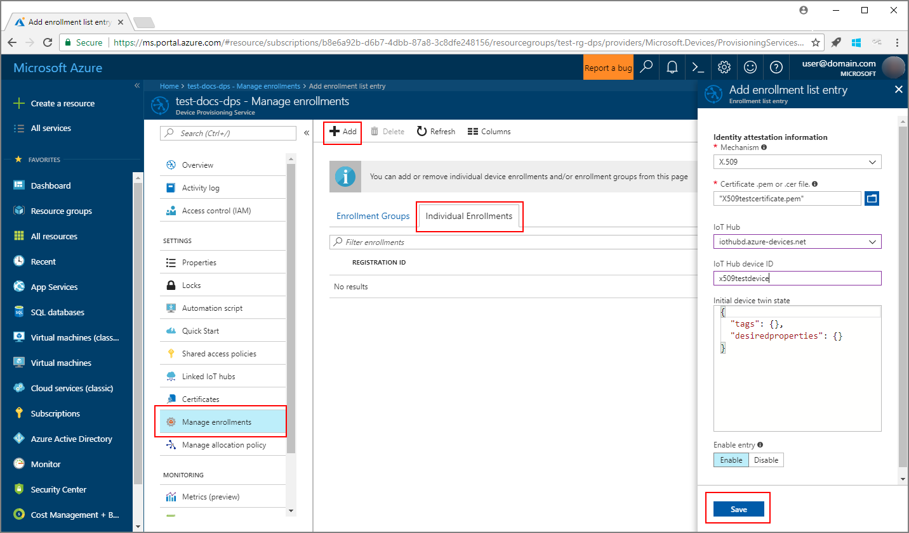
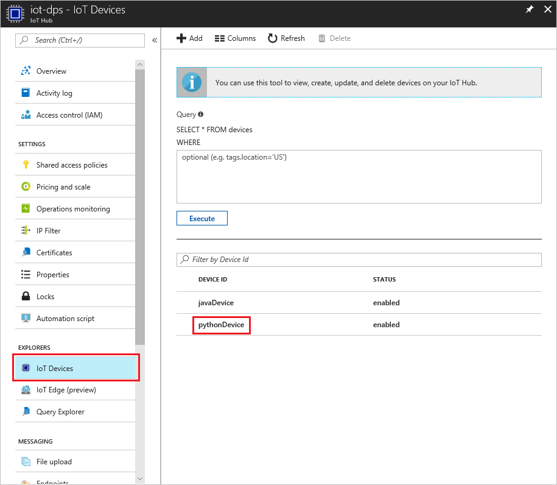

# Create and provision an X.509 simulated device using IoT Hub Device Provisioning Service (Python)
> [!div class="op_single_selector"]
> * [TPM](quick-create-simulated-device.md)
> * [X.509](python-quick-create-simulated-device-x509.md)

These steps show how to simulate an X.509 device on your development machine running Windows OS, and use a Python code sample to connect this simulated device with the Device Provisioning Service and your IoT hub. 

Make sure to complete the steps in the [Set up IoT Hub Device Provisioning Service with the Azure portal](./quick-setup-auto-provision.md) before you proceed.

> [!NOTE]
    > Be sure to note your _Id Scope_ and _Provisioning Service Global Endpoint_ for use later in this Quickstart.
    >
    > 


## Prepare the development environment 

1. Make sure you have either [Visual Studio 2015](https://www.visualstudio.com/vs/older-downloads/) or [Visual Studio 2017](https://www.visualstudio.com/vs/) installed on your machine. You must have 'Desktop development with C++' workload enabled for your Visual Studio installation.

1. Download and install the [CMake build system](https://cmake.org/download/).

1. Make sure `git` is installed on your machine and is added to the environment variables accessible to the command window. See [Software Freedom Conservancy's Git client tools](https://git-scm.com/download/) for the latest version of `git` tools to install, which includes the **Git Bash**, the command-line app that you can use to interact with your local Git repository. 

1. Open a command prompt or Git Bash. Clone the GitHub repo for device simulation code sample.
    
    ```cmd/sh
    git clone https://github.com/Azure/azure-iot-sdk-python.git --recursive
    ```

1. Create a folder in your local copy of this GitHub repo for CMake build process. 

    ```cmd/sh
    cd azure-iot-sdk-python/c
    mkdir cmake
    cd cmake
    ```

1. Run the following command to create the Visual Studio solution for the provisioning client.

    ```cmd/sh
    cmake -Duse_prov_client:BOOL=ON ..
    ```


## Create a device enrollment entry in the Device Provisioning Service

1. Open the solution generated in the *cmake* folder named `azure_iot_sdks.sln`, and build it in Visual Studio.

1. Right-click the **dice\_device\_enrollment** project under the **Provision\_Tools** folder, and select **Set as Startup Project**. Run the solution. In the output window, enter `i` for individual enrollment when prompted. The output window displays a locally generated X.509 certificate for your simulated device. Copy to clipboard the output starting from *-----BEGIN CERTIFICATE-----* and ending at *-----END CERTIFICATE-----*, making sure to include both of these lines as well. 

    
 
1. Create a file named **_X509testcertificate.pem_** on your Windows machine, open it in an editor of your choice, and copy the clipboard contents to this file. Save the file. 

1. Log in to the Azure portal, click on the **All resources** button on the left-hand menu and open your provisioning service.

1. On the Device Provisioning Service summary blade, select **Manage enrollments**. Select **Individual Enrollments** tab and click the **Add** button at the top. 

1. Under the **Add enrollment list entry**, enter the following information:
    - Select **X.509** as the identity attestation *Mechanism*.
    - Under the *Certificate .pem or .cer file*, select the certificate file **_X509testcertificate.pem_** created in the previous steps using the *File Explorer* widget.
    - Optionally, you may provide the following information:
        - Select an IoT hub linked with your provisioning service.
        - Enter a unique device ID. Make sure to avoid sensitive data while naming your device. 
        - Update the **Initial device twin state** with the desired initial configuration for the device.
    - Once complete, click the **Save** button. 

      

   On successful enrollment, your X.509 device appears as **riot-device-cert** under the *Registration ID* column in the *Individual Enrollments* tab. 


## Simulate first boot sequence for the device

1. Download and install [Python 2.x or 3.x](https://www.python.org/downloads/). Make sure to use the 32-bit or 64-bit installation as required by your setup. When prompted during the installation, make sure to add Python to your platform-specific environment variables. If you are using Python 2.x, you may need to [install or upgrade *pip*, the Python package management system][lnk-install-pip].
    - If you are using Windows OS, then [Visual C++ redistributable package][lnk-visual-c-redist] to allow the use of native DLLs from Python.

1. Follow [these instructions](https://github.com/Azure/azure-iot-sdk-python/blob/master/doc/python-devbox-setup.md) to build the Python packages.

1. Navigate to the samples folder.

    ```cmd/sh
    cd azure-iot-sdk-python/provisioning_device_client/samples
    ```

1. Using your Python IDE, edit the python script named **provisioning\_device\_client\_sample.py**. Modify the _GLOBAL\_PROV\_URI_ and _ID\_SCOPE_ variables to the values noted previously.

    ```python
    GLOBAL_PROV_URI = "{globalServiceEndpoint}"
    ID_SCOPE = "{idScope}"
    SECURITY_DEVICE_TYPE = ProvisioningSecurityDeviceType.X509
    PROTOCOL = ProvisioningTransportProvider.HTTP
    ```

    > [!NOTE]
        > You can choose one of available protocols [HTTPS, AMQP, MQTT, AMQP_WS, MQTT_WS] for registration.

1. Run the sample. 

    ```cmd/sh
    python provisioning_device_client_sample.py
    ```


1. In the portal, navigate to the IoT hub linked to your provisioning service and open the **Device Explorer** blade. On successful provisioning of the simulated X.509 device to the hub, its device ID appears on the **Device Explorer** blade, with *STATUS* as **enabled**. You might need to click the **Refresh** button at the top if you already opened the blade prior to running the sample device application. 

     

> [!NOTE]
> If you changed the *initial device twin state* from the default value in the enrollment entry for your device, it can pull the desired twin state from the hub and act accordingly. For more information, see [Understand and use device twins in IoT Hub](../iot-hub/iot-hub-devguide-device-twins.md).
>


## Clean up resources

If you plan to continue working on and exploring the device client sample, do not clean up the resources created in this Quickstart. If you do not plan to continue, use the following steps to delete all resources created by this Quickstart.

1. Close the device client sample output window on your machine.
1. From the left-hand menu in the Azure portal, click **All resources** and then select your Device Provisioning service. At the top of the **All resources** blade, click **Delete**.  
1. From the left-hand menu in the Azure portal, click **All resources** and then select your IoT hub. At the top of the **All resources** blade, click **Delete**.  

## Next steps

In this Quickstart, you’ve created a simulated X.509 device on your Windows machine and provisioned it to your IoT hub using the Azure IoT Hub Device Provisioning Service. To learn about device provisioning in depth, continue to the tutorial for the Device Provisioning Service setup in the Azure portal. 

> [!div class="nextstepaction"]
> [Azure IoT Hub Device Provisioning Service tutorials](./tutorial-set-up-cloud.md)
