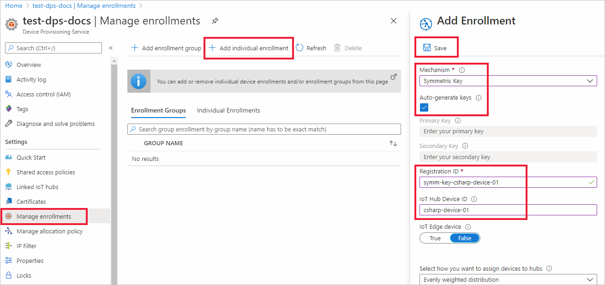

# Quickstart: Provision a symmetric key device using C#

In this quickstart, you will learn how to provision a Windows development machine as a device to an IoT hub using C#. This device will use a symmetric key and an individual enrollment to authenticate with a Device Provisioning Service (DPS) instance in order to be assigned to an IoT hub. Sample code from the [Azure IoT Samples for C#](https://github.com/Azure-Samples/azure-iot-samples-csharp) will be used to provision the device. 

Although this article demonstrates provisioning with an individual enrollment, you can also use enrollment groups. There are some differences when using enrollment groups. For example, you must use a derived device key with a unique registration ID for the device. [Provision devices with symmetric keys](how-to-legacy-device-symm-key.md) provides an enrollment group example. For more information on enrollment groups, see [Group Enrollments for Symmetric Key Attestation](concepts-symmetric-key-attestation.md#group-enrollments).

If you're unfamiliar with the process of autoprovisioning, review the [provisioning](about-iot-dps.md#provisioning-process) overview. 

Also, make sure you've completed the steps in [Set up IoT Hub Device Provisioning Service with the Azure portal](./quick-setup-auto-provision.md) before continuing with this quickstart. This quickstart requires you to have already created your Device Provisioning Service instance.

This article is oriented toward a Windows-based workstation. However, you can perform the procedures on Linux. For a Linux example, see [Provision for multitenancy](how-to-provision-multitenant.md).


[!INCLUDE [quickstarts-free-trial-note](../../includes/quickstarts-free-trial-note.md)]


## Prerequisites

* Make sure you have [.NET Core 2.1 SDK](https://dotnet.microsoft.com/download) or later installed on your Windows-based machine.

* Latest version of [Git](https://git-scm.com/download/) installed.

<a id="setupdevbox"></a>


## Create a device enrollment

1. Sign in to the [Azure portal](https://portal.azure.com), select the **All resources** button on the left-hand menu and open your Device Provisioning service (DPS) instance.

2. Select the **Manage enrollments** tab, and then select the **Add individual enrollment** button at the top. 

3. In the **Add Enrollment** panel, enter the following information, and press the **Save** button.

   - **Mechanism**: Select **Symmetric Key** as the identity attestation *Mechanism*.

   - **Auto-generate keys**: Check this box.

   - **Registration ID**: Enter a registration ID to identify the enrollment. Use only lowercase alphanumeric and dash ('-') characters. For example, **symm-key-csharp-device-01**.

   - **IoT Hub Device ID:** Enter a device identifier. For example, **csharp-device-01**.

     

4. Once you have saved your enrollment, the **Primary Key** and **Secondary Key** will be generated and added to the enrollment entry. Your symmetric key device enrollment appears as **symm-key-csharp-device-01** under the *Registration ID* column in the *Individual Enrollments* tab. 

5. Open the enrollment and copy the value of your generated **Primary Key**. You will use this key value and the **Registration ID** later when you run the device provisioning sample code.


## Prepare the C# environment 

1. Open a Git CMD or Git Bash command line environment. Clone the [Azure IoT Samples for C#](https://github.com/Azure-Samples/azure-iot-samples-csharp) GitHub repository using the following command:

    ```cmd
    git clone https://github.com/Azure-Samples/azure-iot-samples-csharp.git
    ```


<a id="firstbootsequence"></a>

## Run the device provisioning code

In this section, you will run the device provisioning sample using three parameters that will authenticate the device provisioning sample code as the symmetric key device for the enrollment in your DPS resource. These three parameters are:

* ID Scope
* Registration ID for an individual enrollment.
* Primary symmetric key for an individual enrollment.

The provisioning code will contact the DPS resource using these parameters in order to authenticate your device. The device will then be assigned to an IoT hub already linked to the DPS instance based on the individual enrollment configuration. Once provisioned, the sample code will send a test telemetry message to the IoT hub.

1. In the [Azure portal](https://portal.azure.com), on your Device Provisioning Service menu, select **Overview** and copy your **ID Scope** value. You will use this value for the `IdScope` parameter when running the sample code.

2. Open a command prompt and navigate to the *SymmetricKeySample* in the cloned samples repository:

    ```cmd
    cd azure-iot-samples-csharp\provisioning\Samples\device\SymmetricKeySample
    ```

3. In the *SymmetricKeySample* folder, open *Parameters.cs* in a text editor. This file shows the parameters supported by the sample. Only the first three required parameters will be used in this article when running the sample. Review the code in this file. No changes are needed.
 
    | Parameter                         | Required | Description     |
    | :-------------------------------- | :------- | :-------------- |
    | `--s` or `--IdScope`              | True     | The ID Scope of the DPS instance |
    | `--i` or `--Id`                   | True     | The registration ID when using individual enrollment, or the desired device ID when using group enrollment. |
    | `--p` or `--PrimaryKey`           | True     | The primary key of the individual or group enrollment. |
    | `--e` or `--EnrollmentType`       | False    | The type of enrollment: `Individual` or `Group`. Defaults to `Individual` |
    | `--g` or `--GlobalDeviceEndpoint` | False    | The global endpoint for devices to connect to. Defaults to `global.azure-devices-provisioning.net` |
    | `--t` or `--TransportType`        | False    | The transport to use to communicate with the device provisioning instance. Defaults to `Mqtt`. Possible values include `Mqtt`, `Mqtt_WebSocket_Only`, `Mqtt_Tcp_Only`, `Amqp`, `Amqp_WebSocket_Only`, `Amqp_Tcp_only`, and `Http1`.|
     
4. In the *SymmetricKeySample* folder, open *ProvisioningDeviceClientSample.cs* in a text editor. This file shows how the [SecurityProviderSymmetricKey](/dotnet/api/microsoft.azure.devices.shared.securityprovidersymmetrickey?view=azure-dotnet&preserve-view=true) class is used along with the [ProvisioningDeviceClient](/dotnet/api/microsoft.azure.devices.provisioning.client.provisioningdeviceclient?view=azure-dotnet&preserve-view=true) class to provision your symmetric key device. Review the code in this file.  No changes are needed.
 
5. Build and run the sample code using the following command after replacing the three example parameters. Use your correct values for ID Scope, enrollment registration ID, and enrollment primary key.
    
    ```console
    dotnet run --s 0ne00000A0A --i symm-key-csharp-device-01 --p sbDDeEzRuEuGKag+kQKV+T1QGakRtHpsERLP0yPjwR93TrpEgEh/Y07CXstfha6dhIPWvdD1nRxK5T0KGKA+nQ==
    ```    


6. The expected output should look similar to the following output that shows the linked IoT hub that the device was assigned to based on the individual enrollment settings. An example "TestMessage" string is sent to the hub as a test:

    ```output
    D:\azure-iot-samples-csharp\provisioning\Samples\device\SymmetricKeySample>dotnet run --s 0ne00000A0A --i symm-key-csharp-device-01 --p sbDDeEzRuEuGKag+kQKV+T1QGakRtHpsERLP0yPjwR93TrpEgEh/Y07CXstfha6dhIPWvdD1nRxK5T0KGKA+nQ==

    Initializing the device provisioning client...
    Initialized for registration Id symm-key-csharp-device-01.
    Registering with the device provisioning service...
    Registration status: Assigned.
    Device csharp-device-01 registered to ExampleIoTHub.azure-devices.net.
    Creating symmetric key authentication for IoT Hub...
    Testing the provisioned device with IoT Hub...
    Sending a telemetry message...
    Finished.
    Enter any key to exit.
    ```
    
7. In the Azure portal, navigate to the IoT hub linked to your provisioning service and open the **IoT devices** blade. After successfully provisioning the symmetric key device to the hub, the device ID is shown with *STATUS* as **enabled**. You might need to press the **Refresh** button at the top if you already opened the blade prior to running the device sample code. 

     

> [!NOTE]
> If you changed the *initial device twin state* from the default value in the enrollment entry for your device, it can pull the desired twin state from the hub and act accordingly. For more information, see [Understand and use device twins in IoT Hub](../iot-hub/iot-hub-devguide-device-twins.md).
>


## Clean up resources

If you plan to continue working on and exploring the device client sample, do not clean up the resources created in this quickstart. If you do not plan to continue, use the following steps to delete all resources created by this quickstart.

1. From the left-hand menu in the Azure portal, select **All resources** and then select your Device Provisioning service. Open **Manage Enrollments** for your service, and then select the **Individual Enrollments** tab. Select the check box next to the *REGISTRATION ID* of the device you enrolled in this quickstart, and press the **Delete** button at the top of the pane. 
1. From the left-hand menu in the Azure portal, select **All resources** and then select your IoT hub. Open **IoT devices** for your hub, select the check box next to the *DEVICE ID* of the device you registered in this quickstart, and then press the **Delete** button at the top of the pane.

## Next steps

In this quickstart, you provisioned a Windows-based symmetric key device to your IoT hub using the IoT Hub Device Provisioning Service. To learn how to provision X.509 certificate devices using C#, continue with the quickstart below for X.509 devices. 

> [!div class="nextstepaction"]
> [Azure quickstart - Provision X.509 devices using DPS and C#](quick-create-simulated-device-x509-csharp.md)
