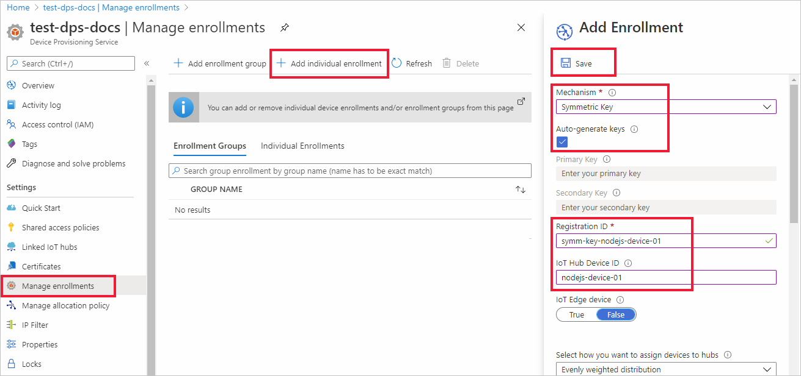

# Quickstart: Provision a symmetric key device using Node.js

In this quickstart, you will learn how to provision a Windows development machine as a device to an IoT hub using Node.js. This device will use a symmetric key and an individual enrollment to authenticate with a Device Provisioning Service (DPS) instance in order to be assigned to an IoT hub. Sample code from the [Azure IoT SDK for Node.js](https://github.com/Azure/azure-iot-sdk-node.git) will be used to provision the device. 

Although this article demonstrates provisioning with an individual enrollment, you can also use enrollment groups. There are some differences when using enrollment groups. For example, you must use a derived device key with a unique registration ID for the device. [Provision devices with symmetric keys](how-to-legacy-device-symm-key.md) provides an enrollment group example. For more information on enrollment groups, see [Group Enrollments for Symmetric Key Attestation](concepts-symmetric-key-attestation.md#group-enrollments).

If you're unfamiliar with the process of auto-provisioning, review the [provisioning](about-iot-dps.md#provisioning-process) overview. 

Also, make sure you've completed the steps in [Set up IoT Hub Device Provisioning Service with the Azure portal](./quick-setup-auto-provision.md) before continuing with this quickstart. This quickstart requires you to have already created your Device Provisioning Service instance.

This article is oriented toward a Windows-based workstation. However, you can perform the procedures on Linux. For a Linux example, see [Provision for multitenancy](how-to-provision-multitenant.md).


[!INCLUDE [quickstarts-free-trial-note](../../includes/quickstarts-free-trial-note.md)]


## Prerequisites

- Familiar with [provisioning](about-iot-dps.md#provisioning-process) concepts.
- Completion of [Set up IoT Hub Device Provisioning Service with the Azure portal](./quick-setup-auto-provision.md).
- An Azure account with an active subscription. [Create one for free](https://azure.microsoft.com/free/?ref=microsoft.com&utm_source=microsoft.com&utm_medium=docs&utm_campaign=visualstudio).
- [Node.js v4.0+](https://nodejs.org).
- [Git](https://git-scm.com/download/).


## Create a device enrollment

1. Sign in to the [Azure portal](https://portal.azure.com), select the **All resources** button on the left-hand menu and open your Device Provisioning service (DPS) instance.

2. Select the **Manage enrollments** tab, and then select the **Add individual enrollment** button at the top. 

3. In the **Add Enrollment** panel, enter the following information, and press the **Save** button.

   - **Mechanism**: Select **Symmetric Key** as the identity attestation *Mechanism*.

   - **Auto-generate keys**: Check this box.

   - **Registration ID**: Enter a registration ID to identify the enrollment. Use only lowercase alphanumeric and dash ('-') characters. For example, **symm-key-nodejs-device-01**.

   - **IoT Hub Device ID:** Enter a device identifier. For example, **nodejs-device-01**.

     

4. Once you have saved your enrollment, the **Primary Key** and **Secondary Key** will be generated and added to the enrollment entry. Your symmetric key device enrollment appears as **symm-key-nodejs-device-01** under the *Registration ID* column in the *Individual Enrollments* tab. 

5. Open the enrollment and copy the value of your generated **Primary Key**. You will use this key value and the **Registration ID** later when you add environment variables for use with the device provisioning sample code.


## Prepare the Node.js environment 

1. Open a Git CMD or Git Bash command-line environment. Clone the [Azure IoT SDK for Node.js](https://github.com/Azure/azure-iot-sdk-node.git) GitHub repository using the following command:

    ```cmd
    git clone https://github.com/Azure/azure-iot-sdk-node.git --recursive
    ```


<a id="firstbootsequence"></a>

## Prepare the device provisioning code

In this section, you will add the following four environment variables that will be used as parameters for the device provisioning sample code to provision your symmetric key device. 

* `PROVISIONING_HOST`
* `PROVISIONING_IDSCOPE`
* `PROVISIONING_REGISTRATION_ID`
* `PROVISIONING_SYMMETRIC_KEY`

The provisioning code will contact the DPS instance based on these variables in order to authenticate your device. The device will then be assigned to an IoT hub already linked to the DPS instance based on the individual enrollment configuration. Once provisioned, the sample code will send some test telemetry to the IoT hub.

1. In the [Azure portal](https://portal.azure.com), on your Device Provisioning Service menu, select **Overview** and copy your _Service Endpoint_ and _ID Scope_. You will use these values for the `PROVISIONING_HOST` and `PROVISIONING_IDSCOPE` environment variables.

    

2. Open a command prompt for executing Node.js commands, and navigate to the following *provisioning/device/samples* directory.

    ```cmd
    cd azure-iot-sdk-node/provisioning/device/samples
    ```

3. In the *provisioning/device/samples* folder, open *register_symkey.js* and review the code. 

    Notice the sample code sets a custom payload...

    ```nodejs
    provisioningClient.setProvisioningPayload({a: 'b'});
    ```

    This code is not needed with this quick start. This code is an example of setting a custom payload if you wanted to use a custom allocation function to assign your device to an IoT Hub. For more information, see [Tutorial: Use custom allocation policies](tutorial-custom-allocation-policies.md).

    The `provisioningClient.register()` method attempts the registration of your device.

    No changes will be necessary to the sample code to register your device.

4. In your command prompt, add the environment variables for the provisioning host, ID Scope, registration ID, and primary symmetric key you copied from the individual enrollment in the previous section.  

    The following commands are examples to show command syntax. Make sure to use your correct values.

    ```console
    set PROVISIONING_HOST=test-dps-docs.azure-devices-provisioning.net
    ```

    ```console
    set PROVISIONING_IDSCOPE=0ne00000A0A
    ```

    ```console
    set PROVISIONING_REGISTRATION_ID=symm-key-nodejs-device-01
    ```

    ```console
    set PROVISIONING_SYMMETRIC_KEY=sbDDeEzRuEuGKag+kQKV+T1QGakRtHpsERLP0yPjwR93TrpEgEh/Y07CXstfha6dhIPWvdD1nRxK5T0KGKA+nQ==
    ```


4. Build and run the sample code using the following commands.

    ```console
    npm install
    ```

    ```console
    node register_symkey.js
    ```

5. The expected output should look similar to the following that shows the linked IoT hub that the device was assigned to based on the individual enrollment settings. A "Hello World" string is sent to the hub as a test message:

    ```output
    D:\Docs\test\azure-iot-sdk-node\provisioning\device\samples>node register_symkey.js
    registration succeeded
    assigned hub=docs-test-iot-hub.azure-devices.net
    deviceId=nodejs-device-01
    payload=undefined
    Client connected
    send status: MessageEnqueued    
    ```
    
6. In the Azure portal, navigate to the IoT hub linked to your provisioning service and open the **IoT devices** blade. After successfully provisioning the symmetric key device to the hub, the device ID is shown with *STATUS* as **enabled**. You might need to press the **Refresh** button at the top if you already opened the blade prior to running the device sample code. 

     

> [!NOTE]
> If you changed the *initial device twin state* from the default value in the enrollment entry for your device, it can pull the desired twin state from the hub and act accordingly. For more information, see [Understand and use device twins in IoT Hub](../iot-hub/iot-hub-devguide-device-twins.md).
>


## Clean up resources

If you plan to continue working on and exploring the device client sample, do not clean up the resources created in this quickstart. If you do not plan to continue, use the following steps to delete all resources created by this quickstart.

1. From the left-hand menu in the Azure portal, select **All resources** and then select your Device Provisioning service. Open **Manage Enrollments** for your service, and then select the **Individual Enrollments** tab. Select the check box next to the *REGISTRATION ID* of the device you enrolled in this quickstart, and press the **Delete** button at the top of the pane. 
1. From the left-hand menu in the Azure portal, select **All resources** and then select your IoT hub. Open **IoT devices** for your hub, select the check box next to the *DEVICE ID* of the device you registered in this quickstart, and then press the **Delete** button at the top of the pane.

## Next steps

In this quickstart, you provisioned a Windows-based symmetric key device to your IoT hub using the IoT Hub Device Provisioning Service. To learn how to provision X.509 certificate devices using Node.js, continue with the quickstart below for X.509 devices. 

> [!div class="nextstepaction"]
> [Azure quickstart - Provision X.509 devices using DPS and Node.js](quick-create-simulated-device-x509-node.md)
