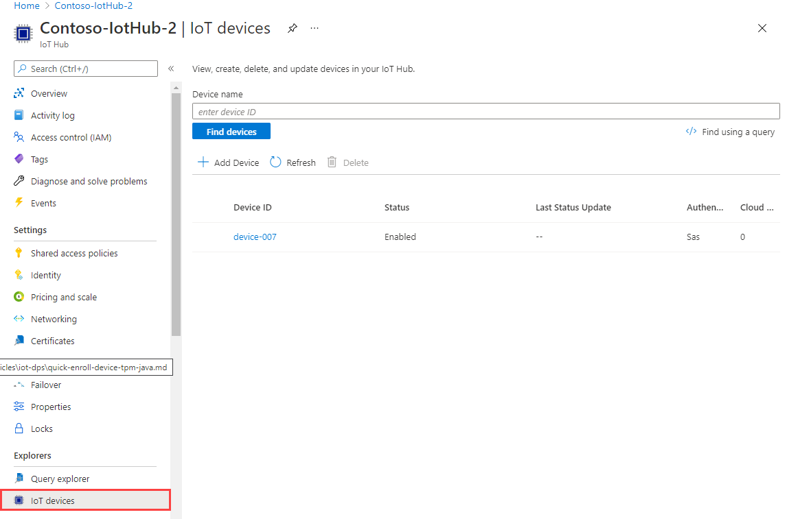

# Quickstart: Provision a device with symmetric keys using C device SDK for Azure IoT Hub Device Provisioning Service


In this quickstart, you'll learn how to provision a Windows development machine as a device to an IoT hub. The device will use a symmetric key and an individual enrollment to authenticate with a Device Provisioning Service (DPS) instance. Once authenticated, it will then be assigned to an IoT hub.

>[!IMPORTANT]
>This quickstart demonstrates a solution for a Windows-based workstation. However, you can also perform the procedures on Linux. For a Linux example, see [How to provision for multitenancy](how-to-provision-multitenant.md).

Sample code from the [Azure IoT C SDK](https://github.com/Azure/azure-iot-sdk-c) will be used to provision the device. The device will be recognized based on an individual enrollment with a provisioning service instance and assigned to an IoT hub.

If you're unfamiliar with the process of provisioning, review the [provisioning](about-iot-dps.md#provisioning-process) overview.

>[!TIP]
>Although this article demonstrates provisioning with an individual enrollment, you can also choose to use enrollment groups. There are a few differences when using enrollment groups. For example, you must use a derived device key with a unique registration ID for the device. Although symmetric key enrollment groups are not limited to legacy devices, [How to provision legacy devices using Symmetric key attestation](how-to-legacy-device-symm-key.md) provides an enrollment group example. For more information, see [Group Enrollments for Symmetric Key Attestation](concepts-symmetric-key-attestation.md#group-enrollments).

## Prerequisites

[!INCLUDE [quickstarts-free-trial-note](../../includes/quickstarts-free-trial-note.md)]

* Complete the steps in [Set up IoT Hub Device Provisioning Service with the Azure portal](./quick-setup-auto-provision.md).

* If you are using a Windows development environment, install [Visual Studio](https://visualstudio.microsoft.com/vs/) 2019 with the ['Desktop development with C++'](/cpp/ide/using-the-visual-studio-ide-for-cpp-desktop-development) workload enabled. Visual Studio 2015 and Visual Studio 2017 are also supported. For Linux or macOS, see the appropriate section in [Prepare your development environment](https://github.com/Azure/azure-iot-sdk-c/blob/master/doc/devbox_setup.md) in the SDK documentation.

* Install the latest version of [Git](https://git-scm.com/download/).

<a id="setupdevbox"></a>

## Prepare an Azure IoT C SDK development environment

In this section, you'll prepare a development environment that's used to build the [Azure IoT C SDK](https://github.com/Azure/azure-iot-sdk-c).

The SDK includes the provisioning sample code for devices. This code attempt provisioning during the device's boot sequence.

1. Download the latest [CMake build system](https://cmake.org/download/).

    >[!IMPORTANT]
    >Confirm that the Visual Studio prerequisites (Visual Studio and the 'Desktop development with C++' workload) are installed on your machine, **before** starting the `CMake` installation. Once the prerequisites are in place, and the download is verified, install the CMake build system. Also, be aware that older versions of the CMake build system fail to generate the solution file used in this article. Make sure to use the latest version of CMake.

2. Open a web browser, and go to the [Release page of the Azure IoT C SDK](https://github.com/Azure/azure-iot-sdk-c/releases/latest).

3. Select the **Tags** tab at the top of the page.

4. Copy the tag name for the latest release of the Azure IoT C SDK.

5. Open a command prompt or Git Bash shell. Run the following commands to clone the latest release of the [Azure IoT C SDK](https://github.com/Azure/azure-iot-sdk-c) GitHub repository(replace `<release-tag>` with the tag you copied in the previous step).

    ```cmd/sh
    git clone -b <release-tag> https://github.com/Azure/azure-iot-sdk-c.git
    cd azure-iot-sdk-c
    git submodule update --init
    ```

    This operation could take several minutes to complete.

6. When the operation is complete, run the following commands from the `azure-iot-sdk-c` directory:

    ```cmd/sh
    mkdir cmake
    cd cmake
    ```

7. Next, to build a version of the SDK specific to your development client platform, run the following command:

    ```cmd
    cmake -Dhsm_type_symm_key:BOOL=ON -Duse_prov_client:BOOL=ON  ..
    ```
    
    >[!TIP]
    >If `cmake` does not find your C++ compiler, you may get build errors while running the above command. If that happens, try running the command in the [Visual Studio command prompt](/dotnet/framework/tools/developer-command-prompt-for-vs).

8.  When the build completes successfully, the last few output lines will look similar to the following output:

    ```cmd/sh
    $ cmake -Dhsm_type_symm_key:BOOL=ON -Duse_prov_client:BOOL=ON  ..
    -- Building for: Visual Studio 16 2019
    -- Selecting Windows SDK version 10.0.19041.0 to target Windows 10.0.19042.
    -- The C compiler identification is MSVC 19.29.30040.0
    -- The CXX compiler identification is MSVC 19.29.30040.0


    ...

    -- Configuring done
    -- Generating done
    -- Build files have been written to: E:/IoT Testing/azure-iot-sdk-c/cmake
    ```

## Create a device enrollment entry in the portal

1. Sign in to the [Azure portal](https://portal.azure.com).

2. On the left-hand menu or on the portal page, select **All resources**.

3. Select your Device Provisioning service.

4. In the **Settings** menu, select **Manage enrollments**.

5. At the top of the page, select **+ Add individual enrollment**.

6. In the **Add Enrollment** page, enter the following information.

   * **Mechanism**: Select *Symmetric Key* as the identity attestation Mechanism.

   * **Auto-generate keys**: Check this box.

   * **Registration ID**: Enter a registration ID to identify the enrollment. Use only lowercase alphanumeric and dash ('-') characters. For example, *symm-key-device-007*.

   * **IoT Hub Device ID:** Enter a device identifier. For example, *device-007*.

    :::image type="content" source="./media/quick-create-simulated-device-symm-key/create-individual-enrollment.png" alt-text="Add individual enrollment for symmetric key attestation in the portal":::

7. Select **Save**. A **Primary Key** and **Secondary Key** are generated and added to the enrollment entry, and you are taken back to the **Manage enrollments** page.

8. To view your symmetric key device enrollment, select the **Individual Enrollments** tab.

9. Select your device (*symm-key-device-007*).

10. Copy the value of the generated **Primary Key**.

    :::image type="content" source="./media/quick-create-simulated-device-symm-key/copy-device-enrollment-primary-key.png" alt-text="Copy the primary key of the device enrollment":::

<a id="firstbootsequence"></a>

## Run the provisioning code for the device

In this section, update the sample code to send the device's boot sequence to your Device Provisioning Service instance. This boot sequence will cause the device to be recognized and assigned to an IoT hub linked to the Device Provisioning Service instance.

1. In the main menu of your Device Provisioning service, select **Overview**.

2. Copy the **ID Scope** value.

    :::image type="content" source="./media/quick-create-simulated-device-symm-key/extract-dps-endpoints.png" alt-text="Extract Device Provisioning Service endpoint information":::

3. In Visual Studio, open the *azure_iot_sdks.sln* solution file that was generated by running CMake. The solution file should be in the following location:

    ```output
    \azure-iot-sdk-c\cmake\azure_iot_sdks.sln
    ```

    >[!TIP]If the file was not generated in your cmake  directory, make sure you used a recent version of the CMake build system.

4. In Visual Studio's *Solution Explorer* window, navigate to the **Provision\_Samples** folder. Expand the sample project named **prov\_dev\_client\_sample**. Expand **Source Files**, and open **prov\_dev\_client\_sample.c**.

5. Find the `id_scope` constant, and replace the value with your **ID Scope** value that you copied earlier.

    ```c
    static const char* id_scope = "0ne00002193";
    ```

6. Find the definition for the `main()` function in the same file. Make sure the `hsm_type` variable is set to `SECURE_DEVICE_TYPE_SYMMETRIC_KEY` as shown below:

    ```c
    SECURE_DEVICE_TYPE hsm_type;
    //hsm_type = SECURE_DEVICE_TYPE_TPM;
    //hsm_type = SECURE_DEVICE_TYPE_X509;
    hsm_type = SECURE_DEVICE_TYPE_SYMMETRIC_KEY;
    ```

7. Find the call to `prov_dev_set_symmetric_key_info()` in **prov\_dev\_client\_sample.c** that is commented out.

    ```c
    // Set the symmetric key if using they auth type
    //prov_dev_set_symmetric_key_info("<symm_registration_id>", "<symmetric_Key>");
    ```

    Uncomment the function call, and replace the placeholder values (including the angle brackets) with your registration ID and the primary key value you copied earlier.

    ```c
    // Set the symmetric key if using they auth type
    prov_dev_set_symmetric_key_info("symm-key-device-007", "your primary key here");
    ```

8. Save the file.

9. Right-click the **prov\_dev\_client\_sample** project and select **Set as Startup Project**.

10. On the Visual Studio menu, select **Debug** > **Start without debugging** to run the solution. In the rebuild the project prompt, select **Yes** to rebuild the project before running.

    The following output is an example of the device successfully connecting to the provisioning Service instance to be assigned to an IoT hub:

    ```cmd
    Provisioning API Version: 1.2.8

    Registering Device

    Provisioning Status: PROV_DEVICE_REG_STATUS_CONNECTED
    Provisioning Status: PROV_DEVICE_REG_STATUS_ASSIGNING
    Provisioning Status: PROV_DEVICE_REG_STATUS_ASSIGNING

    Registration Information received from service: 
    test-docs-hub.azure-devices.net, deviceId: device-007    
    Press enter key to exit:
    ```

11. Go to the [Azure portal](https://portal.azure.com).

12. On the left-hand menu or on the portal page, select **All resources**.

13. Select the IoT hub to which your device was assigned.

14. In the **Explorers** menu, select **IoT Devices**.

15. If your device was provisioned successfully, the device ID should appear in the list, with **Status** set as *enabled*. If you don't see your device, select **Refresh** at the top of the page.

     


## Clean up resources

If you plan to continue working on and exploring the device client sample, don't clean up the resources created in this quickstart. If you don't plan to continue, use the following steps to delete all resources created by this quickstart.

### Delete your device enrollment

1. Close the device client sample output window on your machine.

2. From the left-hand menu in the Azure portal, select **All resources**.

3. Select your Device Provisioning service.

4. In the **Settings** menu, select **Manage enrollments**.

5. Select the **Individual Enrollments** tab.

6. Select the check box next to the *REGISTRATION ID* of the device you enrolled in this quickstart.

7. At the top of the page, select  **Delete**.

### Delete your device registration from IoT Hub

1. From the left-hand menu in the Azure portal, select **All resources**.

2. Select your IoT hub.

3. In the **Explorers** menu, select **IoT devices**.

4. Select the check box next to the *DEVICE ID* of the device you registered in this quickstart.

5. At the top of the page, select  **Delete**.

## Next steps

In this quickstart, you ran device provisioning code on your Windows machine.  The device was authenticated and provisioned to your IoT hub using a symmetric key. 


Provision an X.509 certificate device, continue to the quickstart for X.509 devices:

> [!div class="nextstepaction"]
> [Azure quickstart - Provision an X.509 device using the Azure IoT C SDK](quick-create-simulated-device-x509.md)