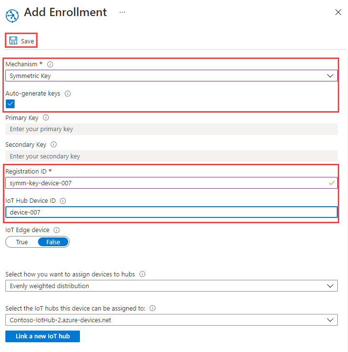

# Quickstart: Provision a simulated device with symmetric keys

In this quickstart, you will learn how to create and run a device simulator on a Windows development machine. You will configure this simulated device to use a symmetric key to authenticate with a Device Provisioning Service instance and be assigned to an IoT hub. Sample code from the [Azure IoT C SDK](https://github.com/Azure/azure-iot-sdk-c) will be used to simulate a boot sequence for the device that initiates provisioning. The device will be recognized based on an individual enrollment with a provisioning service instance and assigned to an IoT hub.

Although this article demonstrates provisioning with an individual enrollment, you can use the same procedures with enrollment groups. The only difference is, you must use a derived device key with a unique registration ID for the device. With enrollment groups, the symmetric key on the enrollment is not used directly. Although symmetric key enrollment groups are not limited to legacy devices, [How to provision legacy devices using Symmetric key attestation](how-to-legacy-device-symm-key.md) provides an enrollment group example. For more information, see [Group Enrollments for Symmetric Key Attestation](concepts-symmetric-key-attestation.md#group-enrollments).

If you're unfamiliar with the process of auto-provisioning, review [Auto-provisioning concepts](concepts-auto-provisioning.md). 

Also, make sure you've completed the steps in [Set up IoT Hub Device Provisioning Service with the Azure portal](./quick-setup-auto-provision.md) before continuing with this quickstart. This quickstart requires you to have already created your Device Provisioning Service instance.

This article is oriented toward a Windows-based workstation. However, you can perform the procedures on Linux. For a Linux example, see [How to provision for multitenancy](how-to-provision-multitenant.md).


[!INCLUDE [quickstarts-free-trial-note](../../includes/quickstarts-free-trial-note.md)]


## Prerequisites

* [Visual Studio](https://visualstudio.microsoft.com/vs/) 2015 or later with the ['Desktop development with C++'](https://www.visualstudio.com/vs/support/selecting-workloads-visual-studio-2017/) workload enabled.
* Latest version of [Git](https://git-scm.com/download/) installed.


<a id="setupdevbox"></a>

## Prepare an Azure IoT C SDK development environment

In this section, you will prepare a development environment used to build the [Azure IoT C SDK](https://github.com/Azure/azure-iot-sdk-c). 

The SDK includes the sample code for a simulated device. This simulated device will attempt provisioning during the device's boot sequence.

1. Download the [CMake build system](https://cmake.org/download/).

    It is important that the Visual Studio prerequisites (Visual Studio and the 'Desktop development with C++' workload) are installed on your machine, **before** starting the `CMake` installation. Once the prerequisites are in place, and the download is verified, install the CMake build system.

2. Open a command prompt or Git Bash shell. Execute the following command to clone the Azure IoT C SDK GitHub repository:
    
    ```cmd/sh
    git clone https://github.com/Azure/azure-iot-sdk-c.git --recursive
    ```
    You should expect this operation to take several minutes to complete.


3. Create a `cmake` subdirectory in the root directory of the git repository, and navigate to that folder. 

    ```cmd/sh
    cd azure-iot-sdk-c
    mkdir cmake
    cd cmake
    ```

4. Run the following command, which builds a version of the SDK specific to your development client platform. A Visual Studio solution for the simulated device will be generated in the `cmake` directory. 

    ```cmd
    cmake -Dhsm_type_symm_key:BOOL=ON -Duse_prov_client:BOOL=ON  ..
    ```
    
    If `cmake` does not find your C++ compiler, you might get build errors while running the above command. If that happens, try running this command in the [Visual Studio command prompt](https://docs.microsoft.com/dotnet/framework/tools/developer-command-prompt-for-vs). 

    Once the build succeeds, the last few output lines will look similar to the following output:

    ```cmd/sh
    $ cmake -Dhsm_type_symm_key:BOOL=ON -Duse_prov_client:BOOL=ON  ..
    -- Building for: Visual Studio 15 2017
    -- Selecting Windows SDK version 10.0.16299.0 to target Windows 10.0.17134.
    -- The C compiler identification is MSVC 19.12.25835.0
    -- The CXX compiler identification is MSVC 19.12.25835.0

    ...

    -- Configuring done
    -- Generating done
    -- Build files have been written to: E:/IoT Testing/azure-iot-sdk-c/cmake
    ```


## Create a device enrollment entry in the portal

1. Sign in to the Azure portal, click on the **All resources** button on the left-hand menu and open your Device Provisioning service.

2. Select the **Manage enrollments** tab, and then click the **Add individual enrollment** button at the top. 

3. On **Add enrollment**, enter the following information, and click the **Save** button.

   - **Mechanism**: Select **Symmetric Key** as the identity attestation *Mechanism*.

   - **Auto Generate Keys**: Check this box.

   - **Registration ID**: Enter a registration ID to identify the enrollment. Use only lowercase alphanumeric and dash ('-') characters. For example, `symm-key-device-007`.

   - **IoT Hub Device ID:** Enter a device identifier. For example, **device-007**.

     

4. Once you saved your enrollment, the **Primary Key** and **Secondary Key** will be generated and added to the enrollment entry. Your symmetric key device enrollment appears as **symm-key-device-007** under the *Registration ID* column in the *Individual Enrollments* tab. 

    Open the enrollment and copy the value of your generated **Primary Key**.


<a id="firstbootsequence"></a>

## Simulate first boot sequence for the device

In this section, update the sample code to send the device's boot sequence to your Device Provisioning Service instance. This boot sequence will cause the device to be recognized and assigned to an IoT hub linked to the Device Provisioning Service instance.


1. In the Azure portal, select the **Overview** tab for your Device Provisioning service and note down the **_ID Scope_** value.

     

2. In Visual Studio, open the **azure_iot_sdks.sln** solution file that was generated by running CMake. The solution file should be in the following location:

    ```
    \azure-iot-sdk-c\cmake\azure_iot_sdks.sln
    ```

3. In Visual Studio's *Solution Explorer* window, navigate to the **Provision\_Samples** folder. Expand the sample project named **prov\_dev\_client\_sample**. Expand **Source Files**, and open **prov\_dev\_client\_sample.c**.

4. Find the `id_scope` constant, and replace the value with your **ID Scope** value that you copied earlier. 

    ```c
    static const char* id_scope = "0ne00002193";
    ```

5. Find the definition for the `main()` function in the same file. Make sure the `hsm_type` variable is set to `SECURE_DEVICE_TYPE_SYMMETRIC_KEY` as shown below:

    ```c
    SECURE_DEVICE_TYPE hsm_type;
    //hsm_type = SECURE_DEVICE_TYPE_TPM;
    //hsm_type = SECURE_DEVICE_TYPE_X509;
    hsm_type = SECURE_DEVICE_TYPE_SYMMETRIC_KEY;
    ```

6. Find the call to `prov_dev_set_symmetric_key_info()` in **prov\_dev\_client\_sample.c** which is commented out.

    ```c
    // Set the symmetric key if using they auth type
    //prov_dev_set_symmetric_key_info("<symm_registration_id>", "<symmetric_Key>");
    ```

    Uncomment the function call, and replace the placeholder values (including the angle brackets) with your registration ID and primary key values.

    ```c
    // Set the symmetric key if using they auth type
    prov_dev_set_symmetric_key_info("symm-key-device-007", "your primary key here");
    ```
   
    Save the file.

7. Right-click the **prov\_dev\_client\_sample** project and select **Set as Startup Project**. 

8. On the Visual Studio menu, select **Debug** > **Start without debugging** to run the solution. In the prompt to rebuild the project, click **Yes**, to rebuild the project before running.

    The following output is an example of the simulated device successfully booting up, and connecting to the provisioning Service instance to be assigned to an IoT hub:

    ```cmd
    Provisioning API Version: 1.2.8

    Registering Device

    Provisioning Status: PROV_DEVICE_REG_STATUS_CONNECTED
    Provisioning Status: PROV_DEVICE_REG_STATUS_ASSIGNING
    Provisioning Status: PROV_DEVICE_REG_STATUS_ASSIGNING

    Registration Information received from service: 
    test-docs-hub.azure-devices.net, deviceId: device-007    
    Press enter key to exit:
    ```

9. In the portal, navigate to the IoT hub your simulated device was assigned to and click the **IoT Devices** tab. On successful provisioning of the simulated to the hub, its device ID appears on the **IoT Devices** blade, with *STATUS* as **enabled**. You might need to click the **Refresh** button at the top. 

     


## Clean up resources

If you plan to continue working on and exploring the device client sample, do not clean up the resources created in this Quickstart. If you do not plan to continue, use the following steps to delete all resources created by this Quickstart.

1. Close the device client sample output window on your machine.
1. From the left-hand menu in the Azure portal, click **All resources** and then select your Device Provisioning service. Open **Manage Enrollments** for your service, and then click the **Individual Enrollments** tab. Select the *REGISTRATION ID* of the device you enrolled in this Quickstart, and click the **Delete** button at the top. 
1. From the left-hand menu in the Azure portal, click **All resources** and then select your IoT hub. Open **IoT Devices** for your hub, select the *DEVICE ID* of the device you registered in this Quickstart, and then click **Delete** button at the top.

## Next steps

In this Quickstart, you’ve created a simulated device on your Windows machine and provisioned it to your IoT hub using Symmetric key with the Azure IoT Hub Device Provisioning Service on the portal. To learn how to enroll your device programmatically, continue to the Quickstart for programmatic enrollment of X.509 devices. 

> [!div class="nextstepaction"]
> [Azure Quickstart - Enroll X.509 devices to Azure IoT Hub Device Provisioning Service](quick-enroll-device-x509-java.md)
