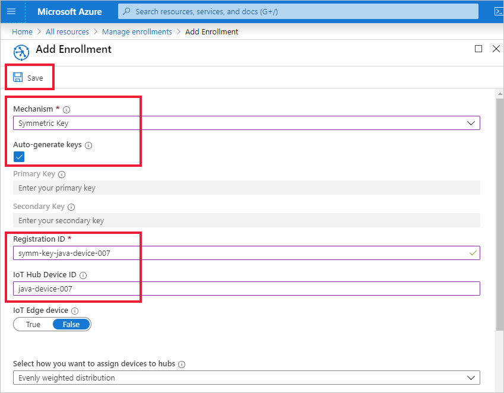

# Quickstart: Provision a simulated device with symmetric keys

In this quickstart, you will learn how to create and run a device simulator on a Windows development machine. You will configure this simulated device to use a symmetric key to authenticate with a Device Provisioning Service (DPS) instance and be assigned to an IoT hub. Sample code from the [Microsoft Azure IoT SDKs for Java](https://github.com/Azure/azure-iot-sdk-java) will be used to simulate a boot sequence for the device that initiates provisioning. The device will be recognized based on an individual enrollment with a DPS service instance and assigned to an IoT hub.

Although this article demonstrates provisioning with an individual enrollment, you can use enrollment groups. There are some differences when using enrollment groups. For example, you must use a derived device key with a unique registration ID for the device. Although symmetric key enrollment groups are not limited to legacy devices, [How to provision legacy devices using Symmetric key attestation](how-to-legacy-device-symm-key.md) provides an enrollment group example. For more information, see [Group Enrollments for Symmetric Key Attestation](concepts-symmetric-key-attestation.md#group-enrollments).

If you're unfamiliar with the process of auto-provisioning, review [Auto-provisioning concepts](concepts-auto-provisioning.md). 

Also, make sure you've completed the steps in [Set up IoT Hub Device Provisioning Service with the Azure portal](./quick-setup-auto-provision.md) before continuing with this quickstart. This quickstart requires you to have already created your Device Provisioning Service instance.

This article is oriented toward a Windows-based workstation. However, you can perform the procedures on Linux. For a Linux example, see [How to provision for multitenancy](how-to-provision-multitenant.md).


[!INCLUDE [quickstarts-free-trial-note](../../includes/quickstarts-free-trial-note.md)]


## Prerequisites

* Make sure you have [Java SE Development Kit 8](https://aka.ms/azure-jdks) or later installed on your machine.

* Download and install [Maven](https://maven.apache.org/install.html).

* Latest version of [Git](https://git-scm.com/download/) installed.

<a id="setupdevbox"></a>

## Prepare the Java SDK environment 

1. Make sure Git is installed on your machine and is added to the environment variables accessible to the command window. See [Software Freedom Conservancy's Git client tools](https://git-scm.com/download/) for the latest version of `git` tools to install, which includes the **Git Bash**, the command-line app that you can use to interact with your local Git repository. 

2. Open a command prompt. Clone the GitHub repo for device simulation code sample:
    
    ```cmd/sh
    git clone https://github.com/Azure/azure-iot-sdk-java.git --recursive
    ```
3. Navigate to the root `azure-iot-sdk-java` directory and build the project to download all needed packages.
   
   ```cmd/sh
   cd azure-iot-sdk-java
   mvn install -DskipTests=true
   ```

## Create a device enrollment

1. Sign in to the [Azure portal](https://portal.azure.com), select the **All resources** button on the left-hand menu and open your Device Provisioning service (DPS) instance.

2. Select the **Manage enrollments** tab, and then select the **Add individual enrollment** button at the top. 

3. In the **Add Enrollment** panel, enter the following information, and press the **Save** button.

   - **Mechanism**: Select **Symmetric Key** as the identity attestation *Mechanism*.

   - **Auto-generate keys**: Check this box.

   - **Registration ID**: Enter a registration ID to identify the enrollment. Use only lowercase alphanumeric and dash ('-') characters. For example, **symm-key-java-device-007**.

   - **IoT Hub Device ID:** Enter a device identifier. For example, **java-device-007**.

     

4. Once you have saved your enrollment, the **Primary Key** and **Secondary Key** will be generated and added to the enrollment entry. Your symmetric key device enrollment appears as **symm-key-java-device-007** under the *Registration ID* column in the *Individual Enrollments* tab. 

    Open the enrollment and copy the value of your generated **Primary Key**. You will use this key value and the **Registration ID** later when you update the Java code for the device.


<a id="firstbootsequence"></a>

## Simulate device boot sequence

In this section, you will update the device sample code to send the device's boot sequence to your DPS instance. This boot sequence will cause the device to be recognized, authenticated, and assigned to an IoT hub linked to the DPS instance.

1. From the Device Provisioning Service menu, select **Overview** and note your _ID Scope_ and _Provisioning Service Global Endpoint_.

    

2. Open the Java device sample code for editing. The full path to the device sample code is:

    `azure-iot-sdk-java/provisioning/provisioning-samples/provisioning-symmetrickey-sample/src/main/java/samples/com/microsoft/azure/sdk/iot/ProvisioningSymmetricKeySampleSample.java`

   - Add the _ID Scope_ and _Provisioning Service Global Endpoint_ of your DPS instance. Also include the primary symmetric key and the registration ID you chose for your individual enrollment. Save your changes. 

      ```java
        private static final String SCOPE_ID = "[Your scope ID here]";
        private static final String GLOBAL_ENDPOINT = "[Your Provisioning Service Global Endpoint here]";
        private static final String SYMMETRIC_KEY = "[Enter your Symmetric Key here]";
        private static final String REGISTRATION_ID = "[Enter your Registration ID here]";
      ```

3. Open a command prompt for building. Navigate to the provisioning sample project folder of the Java SDK repository.

    ```cmd/sh
    cd azure-iot-sdk-java/provisioning/provisioning-samples/provisioning-symmetrickey-sample
    ```

4. Build the sample then navigate to the `target` folder to execute the created .jar file.

    ```cmd/sh
    mvn clean install
    cd target
    java -jar ./provisioning-symmetrickey-sample-{version}-with-deps.jar
    ```

5. The expected output should look similar to the following:

    ```cmd/sh
      Starting...
      Beginning setup.
      Waiting for Provisioning Service to register
      IotHUb Uri : <Your DPS Service Name>.azure-devices.net
      Device ID : java-device-007
      Sending message from device to IoT Hub...
      Press any key to exit...
      Message received! Response status: OK_EMPTY
    ```

6. In the Azure portal, navigate to the IoT hub linked to your provisioning service and open the **Device Explorer** blade. After successful provisioning the simulated symmetric key device to the hub, its device ID appears on the **Device Explorer** blade, with *STATUS* as **enabled**.  You might need to press the **Refresh** button at the top if you already opened the blade prior to running the sample device application. 

     

> [!NOTE]
> If you changed the *initial device twin state* from the default value in the enrollment entry for your device, it can pull the desired twin state from the hub and act accordingly. For more information, see [Understand and use device twins in IoT Hub](../iot-hub/iot-hub-devguide-device-twins.md).
>


## Clean up resources

If you plan to continue working on and exploring the device client sample, do not clean up the resources created in this quickstart. If you do not plan to continue, use the following steps to delete all resources created by this quickstart.

1. Close the device client sample output window on your machine.
1. From the left-hand menu in the Azure portal, select **All resources** and then select your Device Provisioning service. Open **Manage Enrollments** for your service, and then select the **Individual Enrollments** tab. Select the check box next to the *REGISTRATION ID* of the device you enrolled in this quickstart, and press the **Delete** button at the top of the pane. 
1. From the left-hand menu in the Azure portal, select **All resources** and then select your IoT hub. Open **IoT devices** for your hub, select the check box next to the *DEVICE ID* of the device you registered in this quickstart, and then press the **Delete** button at the top of the pane.

## Next steps

In this quickstart, you’ve created a simulated device on your Windows machine and provisioned it to your IoT hub using Symmetric key with the Azure IoT Hub Device Provisioning Service on the portal. To learn how to enroll your device programmatically, continue to the quickstart for programmatic enrollment of X.509 devices. 

> [!div class="nextstepaction"]
> [Azure quickstart - Enroll X.509 devices to Azure IoT Hub Device Provisioning Service](quick-enroll-device-x509-java.md)
