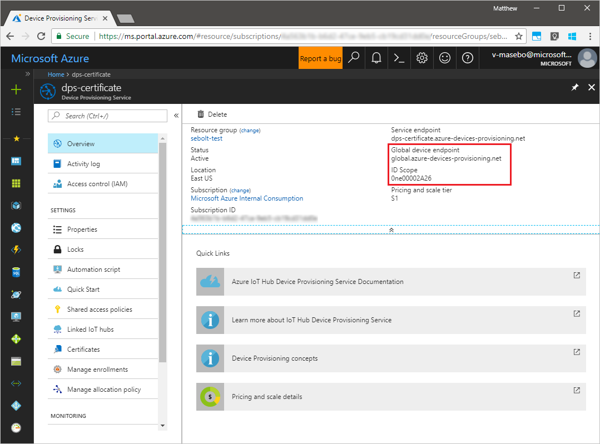
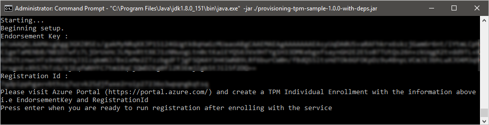
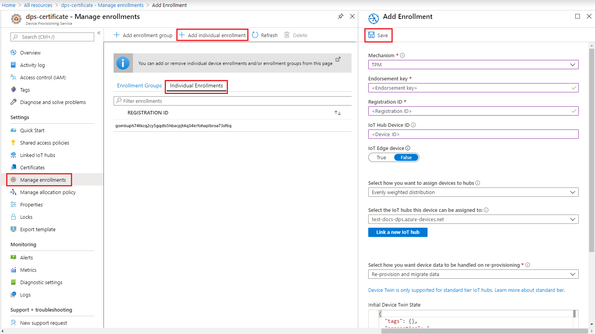
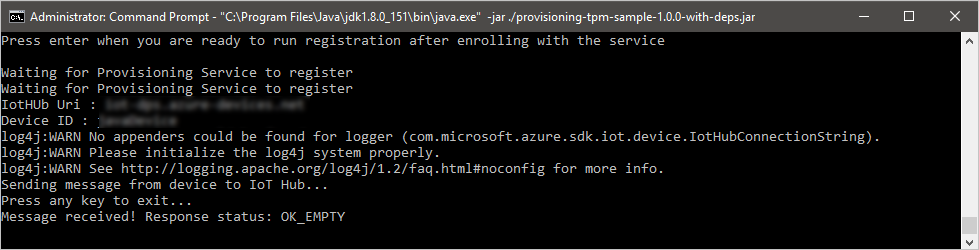
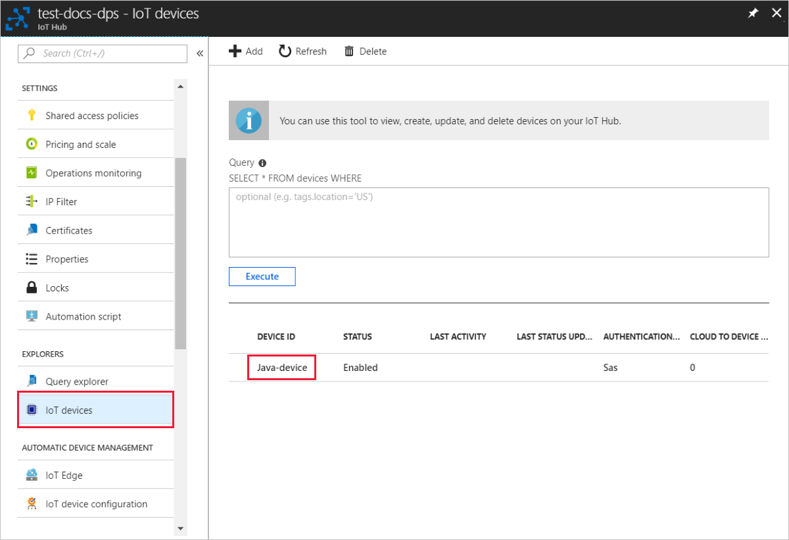

# Create and provision a simulated TPM device using Java device SDK for Azure IoT Hub Device Provisioning Service

[!INCLUDE [iot-dps-selector-quick-create-simulated-device-tpm](../../includes/iot-dps-selector-quick-create-simulated-device-tpm.md)]

These steps show how to create a simulated device on your development machine running Windows OS, run the Windows TPM simulator as the [Hardware Security Module (HSM)](https://azure.microsoft.com/blog/azure-iot-supports-new-security-hardware-to-strengthen-iot-security/) of the device, and use the code sample to connect this simulated device with the Device Provisioning Service and your IoT hub. 

If you're unfamiliar with the process of auto-provisioning, be sure to also review [Auto-provisioning concepts](concepts-auto-provisioning.md). Also make sure you've completed the steps in [Set up IoT Hub Device Provisioning Service with the Azure portal](./quick-setup-auto-provision.md) before continuing. 

[!INCLUDE [IoT Device Provisioning Service basic](../../includes/iot-dps-basic.md)]

## Prepare the environment 

1. Make sure you have [Java SE Development Kit 8](http://www.oracle.com/technetwork/java/javase/downloads/jdk8-downloads-2133151.html) installed on your machine.

1. Download and install [Maven](https://maven.apache.org/install.html).

1. Make sure `git` is installed on your machine and is added to the environment variables accessible to the command window. See [Software Freedom Conservancy's Git client tools](https://git-scm.com/download/) for the latest version of `git` tools to install, which includes the **Git Bash**, the command-line app that you can use to interact with your local Git repository. 

1. Open a command prompt. Clone the GitHub repo for device simulation code sample.
    
    ```cmd/sh
    git clone https://github.com/Azure/azure-iot-sdk-java.git --recursive
    ```

1. Run the [TPM](https://docs.microsoft.com/windows/device-security/tpm/trusted-platform-module-overview) simulator. Click **Allow access** to allow changes to _Windows Firewall_ settings. It listens over a socket on ports 2321 and 2322. Do not close this window; you need to keep this simulator running until the end of this Quickstart guide. 

    ```cmd/sh
    .\azure-iot-sdk-java\provisioning\provisioning-tools\tpm-simulator\Simulator.exe
    ```

    

1. In a separate command prompt, navigate to the root folder and build the sample dependencies.

    ```cmd/sh
    cd azure-iot-sdk-java
    mvn install -DskipTests=true
    ```

1. Navigate to the sample folder.

    ```cmd/sh
    cd provisioning/provisioning-samples/provisioning-tpm-sample
    ```

1. Log in to the Azure portal, click on the **All resources** button on the left-hand menu and open your Device Provisioning service. Note your _Id Scope_ and _Provisioning Service Global Endpoint_.

    

1. Edit `src/main/java/samples/com/microsoft/azure/sdk/iot/ProvisioningTpmSample.java` to include your _Id Scope_ and _Provisioning Service Global Endpoint_ as noted before.  

    ```java
    private static final String idScope = "[Your ID scope here]";
    private static final String globalEndpoint = "[Your Provisioning Service Global Endpoint here]";
    private static final ProvisioningDeviceClientTransportProtocol PROVISIONING_DEVICE_CLIENT_TRANSPORT_PROTOCOL = ProvisioningDeviceClientTransportProtocol.HTTPS;
    ```

1. Build the project. Navigate to the target folder and execute the created jar file.

    ```cmd/sh
    mvn clean install
    cd target
    java -jar ./provisioning-tpm-sample-{version}-with-deps.jar
    ```

1. The program begins running. Note the _Endorsement Key_ and _Registration Id_ for the next section and leave the program running.

    
    

## Create a device enrollment entry

1. Log in to the Azure portal, click on the **All resources** button on the left-hand menu and open your Device Provisioning service.

1. On the Device Provisioning Service summary blade, select **Manage enrollments**. Select **Individual Enrollments** tab and click the **Add individual enrollment** button at the top. 

1. Under the **Add Enrollment**, enter the following information:
    - Select **TPM** as the identity attestation *Mechanism*.
    - Enter the *Registration ID* and *Endorsement key* for your TPM device as noted previously. 
    - Select an IoT hub linked with your provisioning service.
    - Enter a unique device ID. Make sure to avoid sensitive data while naming your device.
    - Update the **Initial device twin state** with the desired initial configuration for the device.
    - Once complete, click the **Save** button. 

      

   On successful enrollment, the *Registration ID* of your device appears in the list under the *Individual Enrollments* tab. 


## Simulate the device

1. On the command window running the Java sample code on your machine, click enter to continue running the application. Notice the messages that simulate the device booting and connecting to the Device Provisioning Service to get your IoT hub information.  

    

1. On successful provisioning of your simulated device to the IoT hub linked with your provisioning service, the device ID appears on the hub's **Device Explorer** blade.

     

    If you changed the *initial device twin state* from the default value in the enrollment entry for your device, it can pull the desired twin state from the hub and act accordingly. For more information, see [Understand and use device twins in IoT Hub](../iot-hub/iot-hub-devguide-device-twins.md)


## Clean up resources

If you plan to continue working on and exploring the device client sample, do not clean up the resources created in this Quickstart. If you do not plan to continue, use the following steps to delete all resources created by this Quickstart.

1. Close the device client sample output window on your machine.
1. Close the TPM simulator window on your machine.
1. From the left-hand menu in the Azure portal, click **All resources** and then select your Device Provisioning service. Open the **Manage Enrollments** blade for your service, and then click the **Individual Enrollments** tab. Select the *REGISTRATION ID* of the device you enrolled in this Quickstart, and click the **Delete** button at the top. 
1. From the left-hand menu in the Azure portal, click **All resources** and then select your IoT hub. Open the **IoT Devices** blade for your hub, select the *DEVICE ID* of the device you registered in this Quickstart, and then click **Delete** button at the top.

## Next steps

In this Quickstart, you’ve created a TPM simulated device on your machine and provisioned it to your IoT hub using the IoT Hub Device Provisioning Service. To learn how to enroll your TPM device programmatically, continue to the Quickstart for programmatic enrollment of a TPM device. 

> [!div class="nextstepaction"]
> [Azure Quickstart - Enroll TPM device to Azure IoT Hub Device Provisioning Service](quick-enroll-device-tpm-java.md)
