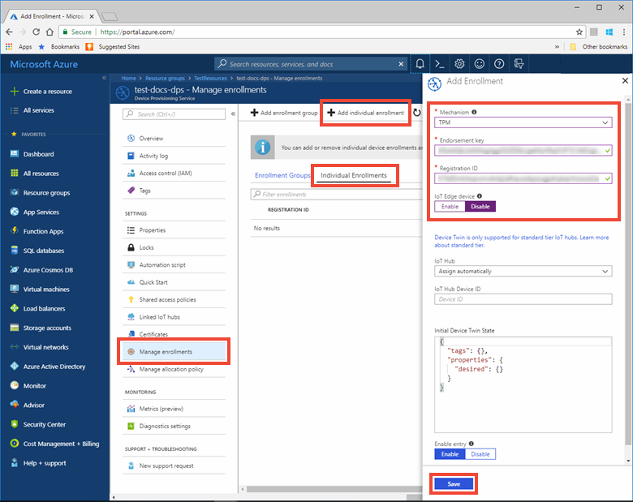
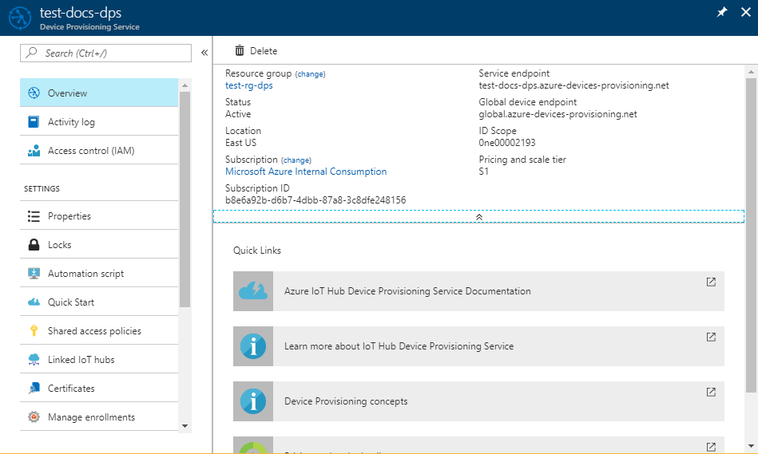

# Quickstart: Create and provision a simulated TPM device using Node.js device SDK for IoT Hub Device Provisioning Service

[!INCLUDE [iot-dps-selector-quick-create-simulated-device-tpm](../../includes/iot-dps-selector-quick-create-simulated-device-tpm.md)]

In this quickstart, you create a simulated IoT device on a Windows computer. The simulated device includes a TPM simulator as a Hardware Security Module (HSM). You use device sample Node.js code to connect this simulated device with your IoT hub using an individual enrollment with the Device Provisioning Service (DPS).

## Prerequisites

- Review of [Auto-provisioning concepts](concepts-auto-provisioning.md).
- Completion of [Set up IoT Hub Device Provisioning Service with the Azure portal](./quick-setup-auto-provision.md).
- An Azure account with an active subscription. [Create one for free](https://azure.microsoft.com/free/?ref=microsoft.com&utm_source=microsoft.com&utm_medium=docs&utm_campaign=visualstudio).
- [Node.js v4.0+](https://nodejs.org).
- [Git](https://git-scm.com/download/).

[!INCLUDE [IoT Device Provisioning Service basic](../../includes/iot-dps-basic.md)]

## Prepare the environment 

1. Make sure you have [Node.js v4.0 or above](https://nodejs.org) installed on your machine.

1. Make sure `git` is installed on your machine and is added to the environment variables accessible to the command window. See [Software Freedom Conservancy's Git client tools](https://git-scm.com/download/) for the latest version of `git` tools to install, which includes the **Git Bash**, the command-line app that you can use to interact with your local Git repository. 


## Simulate a TPM device

1. Open a command prompt or Git Bash. Clone the `azure-utpm-c` GitHub repo:
    
    ```cmd/sh
    git clone https://github.com/Azure/azure-utpm-c.git --recursive
    ```

1. Navigate to the GitHub root folder and run the [TPM](https://docs.microsoft.com/windows/device-security/tpm/trusted-platform-module-overview) simulator to be the [HSM](https://azure.microsoft.com/blog/azure-iot-supports-new-security-hardware-to-strengthen-iot-security/) for the simulated device. It listens over a socket on ports 2321 and 2322. Do not close this command window; you need to keep this simulator running until the end of this quickstart guide: 

    ```cmd/sh
    .\azure-utpm-c\tools\tpm_simulator\Simulator.exe
    ```

1. Create a new empty folder called **registerdevice**. In the **registerdevice** folder, create a package.json file using the following command at your command prompt. Make sure to answer all questions asked by `npm` or accept the defaults if they suit you:
   
    ```cmd/sh
    npm init
    ```

1. Install the following precursor packages:

    ```cmd/sh
    npm install node-gyp -g
    npm install ffi -g
    ```

    > [!NOTE]
    > There are some known issues to installing the above packages. To resolve these issues, run `npm install --global --production windows-build-tools` using a command prompt in **Run as administrator** mode, run `SET VCTargetsPath=C:\Program Files (x86)\MSBuild\Microsoft.Cpp\v4.0\V140` after replacing the path with your installed version, and then rerun the above installation commands.
    >

1. Install the following packages containing the components used during registration:

   - a security client that works with TPM: `azure-iot-security-tpm`
   - a transport for the device to connect to the Device Provisioning Service: either `azure-iot-provisioning-device-http` or `azure-iot-provisioning-device-amqp`
   - a client to use the transport and security client: `azure-iot-provisioning-device`

     Once the device is registered, you can use the usual IoT Hub Device Client packages to connect the device using the credentials provided during registration. You will need:

   - the device client: `azure-iot-device`
   - a transport: any of `azure-iot-device-amqp`, `azure-iot-device-mqtt`, or `azure-iot-device-http`
   - the security client that you already installed: `azure-iot-security-tpm`

     > [!NOTE]
     > The samples below use the `azure-iot-provisioning-device-http` and `azure-iot-device-mqtt` transports.
     > 

     You can install all of these packages at once by running the following command at your command prompt in the **registerdevice** folder:

       ```cmd/sh
       npm install --save azure-iot-device azure-iot-device-mqtt azure-iot-security-tpm azure-iot-provisioning-device-http azure-iot-provisioning-device
       ```

1. Using a text editor, create a new **ExtractDevice.js** file in the **registerdevice** folder.

1. Add the following `require` statements at the start of the **ExtractDevice.js** file:
   
    ```
    'use strict';

    var tpmSecurity = require('azure-iot-security-tpm');
    var tssJs = require("tss.js");

    var myTpm = new tpmSecurity.TpmSecurityClient(undefined, new tssJs.Tpm(true));
    ```

1. Add the following function to implement the method:
   
    ```
    myTpm.getEndorsementKey(function(err, endorsementKey) {
      if (err) {
        console.log('The error returned from get key is: ' + err);
      } else {
        console.log('the endorsement key is: ' + endorsementKey.toString('base64'));
        myTpm.getRegistrationId((getRegistrationIdError, registrationId) => {
          if (getRegistrationIdError) {
            console.log('The error returned from get registration id is: ' + getRegistrationIdError);
          } else {
            console.log('The Registration Id is: ' + registrationId);
            process.exit();
          }
        });
      }
    });
    ```

1. Save and close the **ExtractDevice.js** file. Run the sample:

    ```cmd/sh
    node ExtractDevice.js
    ```

1. The output window displays the **_Endorsement key_** and the **_Registration ID_** needed for device enrollment. Note down these values. 


## Create a device entry

The Azure IoT Device Provisioning Service supports two types of enrollments:

- [Enrollment groups](concepts-service.md#enrollment-group): Used to enroll multiple related devices.
- [Individual enrollments](concepts-service.md#individual-enrollment): Used to enroll a single device.

This article demonstrates individual enrollments.

1. Sign in to the Azure portal, select the **All resources** button on the left-hand menu and open your Device Provisioning service.

1. From the Device Provisioning Service menu, select **Manage enrollments**. Select **Individual Enrollments** tab and select the **Add individual enrollment** button at the top. 

1. In the **Add Enrollment** panel, enter the following information:
   - Select **TPM** as the identity attestation *Mechanism*.
   - Enter the *Registration ID* and *Endorsement key* for your TPM device from the values you noted previously.
   - Select an IoT hub linked with your provisioning service.
   - Optionally, you may provide the following information:
       - Enter a unique *Device ID*. Make sure to avoid sensitive data while naming your device. If you choose not to provide one, the registration ID will be used to identify the device instead.
       - Update the **Initial device twin state** with the desired initial configuration for the device.
   - Once complete, press the **Save** button. 

       

   On successful enrollment, the *Registration ID* of your device appears in the list under the *Individual Enrollments* tab. 


## Register the device

1. In the Azure portal, select the **Overview** blade for your Device Provisioning service and note the **_Global Device Endpoint_** and **_ID Scope_** values.

     

1. Using a text editor, create a new **RegisterDevice.js** file in the **registerdevice** folder.

1. Add the following `require` statements at the start of the **RegisterDevice.js** file:
   
    ```
    'use strict';

    var ProvisioningTransport = require('azure-iot-provisioning-device-http').Http;
    var iotHubTransport = require('azure-iot-device-mqtt').Mqtt;
    var Client = require('azure-iot-device').Client;
    var Message = require('azure-iot-device').Message;
    var tpmSecurity = require('azure-iot-security-tpm');
    var ProvisioningDeviceClient = require('azure-iot-provisioning-device').ProvisioningDeviceClient;
    ```

    > [!NOTE]
    > The **Azure IoT SDK for Node.js** supports additional protocols like _AMQP_, _AMQP WS_, and _MQTT WS_.  For more examples, see [Device Provisioning Service SDK for Node.js samples](https://github.com/Azure/azure-iot-sdk-node/tree/master/provisioning/device/samples).
    > 

1. Add **globalDeviceEndpoint** and **idScope** variables and use them to create a **ProvisioningDeviceClient** instance. Replace **{globalDeviceEndpoint}** and **{idScope}** with the **_Global Device Endpoint_** and **_ID Scope_** values from **Step 1**:
   
    ```
    var provisioningHost = '{globalDeviceEndpoint}';
    var idScope = '{idScope}';

    var tssJs = require("tss.js");
    var securityClient = new tpmSecurity.TpmSecurityClient('', new tssJs.Tpm(true));
    // if using non-simulated device, replace the above line with following:
    //var securityClient = new tpmSecurity.TpmSecurityClient();

    var provisioningClient = ProvisioningDeviceClient.create(provisioningHost, idScope, new ProvisioningTransport(), securityClient);
    ```

1. Add the following function to implement the method on the device:
   
    ```
    provisioningClient.register(function(err, result) {
      if (err) {
        console.log("error registering device: " + err);
      } else {
        console.log('registration succeeded');
        console.log('assigned hub=' + result.registrationState.assignedHub);
        console.log('deviceId=' + result.registrationState.deviceId);
        var tpmAuthenticationProvider = tpmSecurity.TpmAuthenticationProvider.fromTpmSecurityClient(result.registrationState.deviceId, result.registrationState.assignedHub, securityClient);
        var hubClient = Client.fromAuthenticationProvider(tpmAuthenticationProvider, iotHubTransport);

        var connectCallback = function (err) {
          if (err) {
            console.error('Could not connect: ' + err.message);
          } else {
            console.log('Client connected');
            var message = new Message('Hello world');
            hubClient.sendEvent(message, printResultFor('send'));
          }
        };

        hubClient.open(connectCallback);

        function printResultFor(op) {
          return function printResult(err, res) {
            if (err) console.log(op + ' error: ' + err.toString());
            if (res) console.log(op + ' status: ' + res.constructor.name);
            process.exit(1);
          };
        }
      }
    });
    ```

1. Save and close the **RegisterDevice.js** file. Run the sample:

    ```cmd/sh
    node RegisterDevice.js
    ```

1. Notice the messages that simulate the device booting and connecting to the Device Provisioning Service to get your IoT hub information. On successful provisioning of your simulated device to the IoT hub linked with your provisioning service, the device ID appears on the hub's **IoT devices** blade. 

     

    If you changed the *initial device twin state* from the default value in the enrollment entry for your device, it can pull the desired twin state from the hub and act accordingly. For more information, see [Understand and use device twins in IoT Hub](../iot-hub/iot-hub-devguide-device-twins.md)


## Clean up resources

If you plan to continue working on and exploring the device client sample, do not clean up the resources created in this quickstart. If you do not plan to continue, use the following steps to delete all resources created by this quickstart.

1. Close the device client sample output window on your machine.
1. Close the TPM simulator window on your machine.
1. From the left-hand menu in the Azure portal, select **All resources** and then select your Device Provisioning service. Open the **Manage Enrollments** blade for your service, and then select the **Individual Enrollments** tab. Select the check box next to the *REGISTRATION ID* of the device you enrolled in this quickstart, and press the **Delete** button at the top of the pane. 
1. From the left-hand menu in the Azure portal, select **All resources** and then select your IoT hub. Open the **IoT devices** blade for your hub, select the check box next to the *DEVICE ID* of the device you registered in this quickstart, and then press the **Delete** button at the top of the pane.


## Next steps

In this quickstart, you've created a TPM simulated device on your machine and provisioned it to your IoT hub using the IoT Hub Device Provisioning Service. To learn how to enroll your TPM device programmatically, continue to the quickstart for programmatic enrollment of a TPM device. 

> [!div class="nextstepaction"]
> [Azure quickstart - Enroll TPM device to Azure IoT Hub Device Provisioning Service](quick-enroll-device-tpm-node.md)
